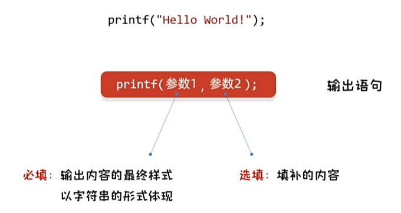

# 1 基础

## 1.1 基本设置

使用软件：Visual Studio Community 2022

下载选项：

- 工作负荷：==使用C++的桌面开发==。需要检查安装内容是否包括Windows 11 SDK
- 安装路径自选


- 创建文件
  - 创建项目选择：控制台应用 C++
  - 创建项目名称和选择库路径
  - 右键源文件新建，选择c++，但是将文件后缀改成`.c`来实现c语言的代码
  - 开始代码


- 编写HelloWorld样本代码
  ```c
  #include<stdio.h>
  
  int main()
  {
  	printf("hello world");
  	return 0;
  }
  ```
  
  - 如果在`#include<stdio.h>`报错无法打开头文件，需要检查是否完整下载对应Windows版本的SDK
  - 字体选择：Consolas 大小：10

## 1.2 注释与关键字

快捷键：ctrl+/

```c
//单行注释

/*
多行
注释
*/
```

`.c`文件编译成二进制的`.obj`文件的时候不会执行注释，也就是在obj文件中没有注释内容（注释擦除）

注释最好不要嵌套

---

c语言中一共有32个关键字，全部小写，会有高亮

## 1.3 常量与输出

### 常量

在编译过程中不可更改的数据，分为四类：

1. 整型常量：18，2890
2. 实型常量：1.93，18.2
3. 字符常量(单引号里面只能写一个)：'A'，'C'
4. 字符串常量："你好你好abc"

一些小测验：

|   值 | 常量类型 |
| ---: | -------- |
|    0 | 整型常量 |
|  0.0 | 实型常量 |
|  -25 | 整型常量 |
|  123 | 整型常量 |
| 17.0 | 实型常量 |

|   值 | 类型     |
| ---: | -------- |
|   '' | 语法错误 |
|  ',' | 字符常量 |
|  'a' | 字符常量 |
|  '!' | 字符常量 |
|  '#' | 字符常量 |

|     值 | 类型       |
| -----: | ---------- |
|   'ab' | 语法错误   |
|   '题' | 语法错误   |
|    '¥' | 语法错误   |
|     "" | 字符串常量 |
| "你好" | 字符串常量 |


---

### ==输出==

`printf(参数1, 参数2)`



- 如果想要一次性输出多个常量
  需要用到占位符，即每个数据在string中写入对应的占位符

  - `printf("my name is %s, and %d years old", "Haojian Wang", 23)`

- | 格式控制符 | 说明   | 单词           |
  | ---------- | ------ | -------------- |
  | `%d`       | 整型   | decimal        |
  | `%f`       | 实型   | floating-point |
  | `%c`       | 字符   | character      |
  | `%s`       | 字符串 | string         |

- 输出换行
  对于不同的操作系统，有不同的换行符：

  - | 操作系统 | 换行符                               |
    | -------- | ------------------------------------ |
    | windows  | `\r\n`(意思是先回到行首，然后下一行) |
    | mac      | `\r`                                 |
    | Linux    | `\n`                                 |

    一般在printf语句中写了一个`\n`那么他会自动替换成`\r\n`，来方便操作。同时可以在不同的操作系统可以实现相同的效果

## 1.4 变量

```c
//定义格式：数据类型 变量名；
int a;

//赋值和修改：变量名 = 数据值
a = 10;

//合并
int a = 10;

//修改变量值
a = 20; // 会覆盖之前的的a = 10;
```

变量只能存一个值，并且变量民更不允许重复定义。一条语句可以定义多个bian'liang

变量在使用之前必须要赋值。


### 整数类型

| 类型              | 取值范围 (32位 / 64位)                                       | 内存 (字节) |
| ----------------- | ------------------------------------------------------------ | ----------- |
| `short`           | -32768 ～ 32767                                              | 2           |
| `int`             | -2147483648 ～ 2147483647 (10位数)                           | 4           |
| `long`            | 32位：-2147483648 ～ 2147483647 (10位数)<br />64位：-9223372036854775808 ～ 9223372036854775807 (19位数) | 4<br />8    |
| `long long` (C99) | -9223372036854775808 ～ 9223372036854775807 (19位数)         | 8           |

### 浮点类型

| 类型     | 取值范围                        | 内存 (字节) |
| -------- | ------------------------------- | ----------- |
| `float`  | 1.175 × 10⁻³⁸ ～ 3.402 × 10³⁸   | 4           |
| `double` | 2.225 × 10⁻³⁰⁸ ～ 1.797 × 10³⁰⁸ | 8           |

### 要点

- 掌握如何定义四种整数类型的变量  
- 整数的数据类型分为：`short`、`int`、`long`、`long long`  
- 不同的数据类型所表示的范围和内存大小都不一样，由编译器决定，可用 `sizeof` 来确定；遵循原则：  `short <= int <= long <= long long`
- C 语言中整数默认是 `int` 类型  
- 可与 `unsigned` 组合定义无符号整数，打印占位符使用 `%u`

小数不可以和unsigned组合，因为unsigned只能和整数类型组合。
