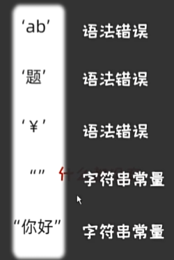
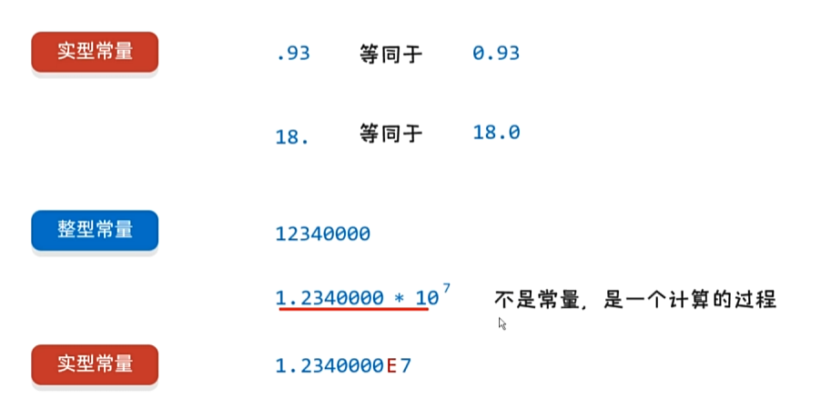

# 1 基础

## 1.1 基本设置

使用软件：Visual Studio Community 2022

下载选项：

- 工作负荷：==使用C++的桌面开发==。需要检查安装内容是否包括Windows 11 SDK
- 安装路径自选


- 创建文件
  - 创建项目选择：控制台应用 C++
  - 创建项目名称和选择库路径
  - 右键源文件新建，选择c++，但是将文件后缀改成`.c`来实现c语言的代码
  - 开始代码


- 编写HelloWorld样本代码
  ```c
  #include<stdio.h>
  
  int main()
  {
  	printf("hello world");
  	return 0;
  }
  ```
  
  - 如果在`#include<stdio.h>`报错无法打开头文件，需要检查是否完整下载对应Windows版本的SDK
  - 字体选择：Consolas 大小：10

## 1.2 注释与关键字

快捷键：ctrl+/

```c
//单行注释

/*
多行
注释
*/
```

`.c`文件编译成二进制的`.obj`文件的时候不会执行注释，也就是在obj文件中没有注释内容（注释擦除）

注释最好不要嵌套

---

c语言中一共有32个关键字，全部小写，会有高亮

## 1.3 常量与输出

在编译过程中不可更改的数据，分为四类：

1. 整型常量：18，2890
2. 实型常量：1.93，18.2
3. 字符常量(单引号里面只能写一个)：'A'，'C'
4. 字符串常量："你好你好abc"







---

==输出==

`printf(参数1, 参数2)`


