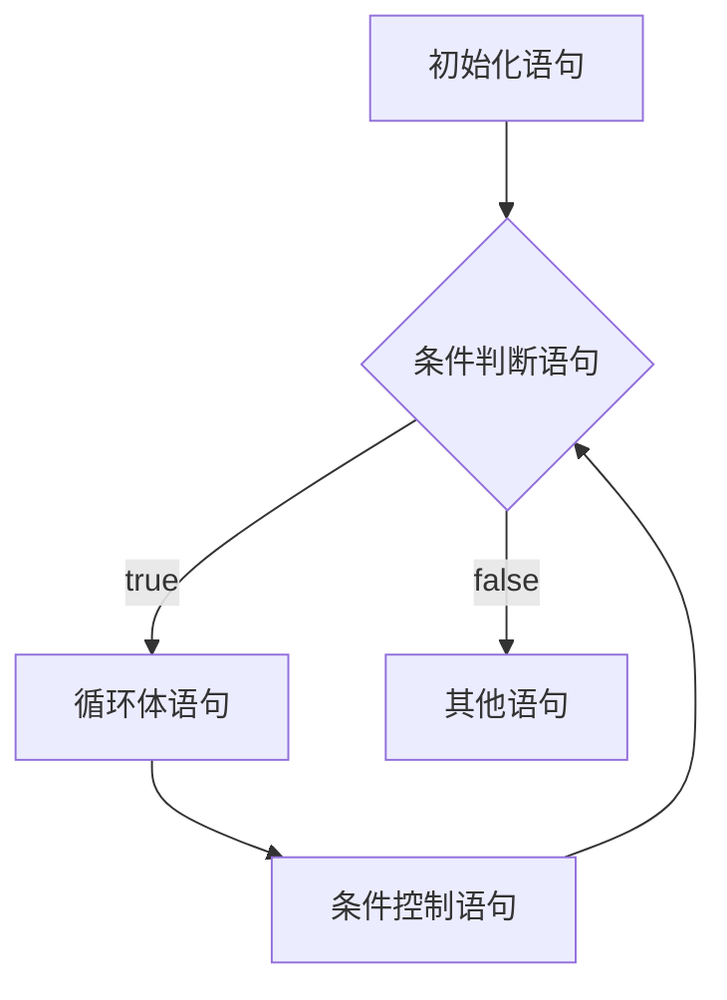
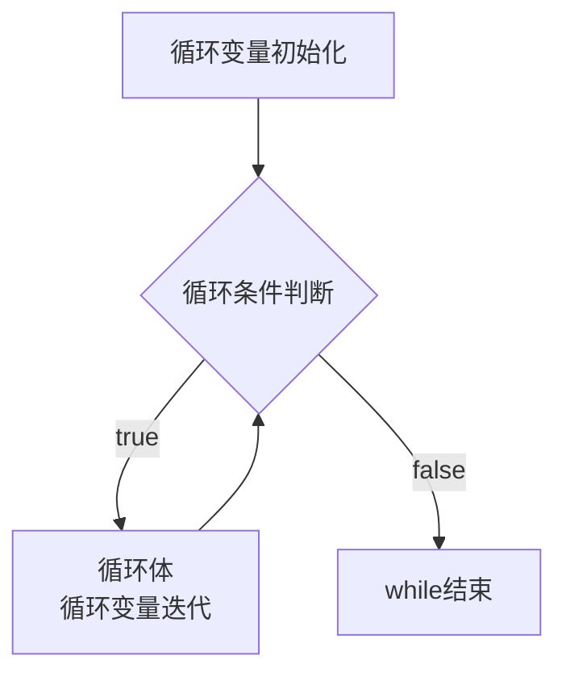
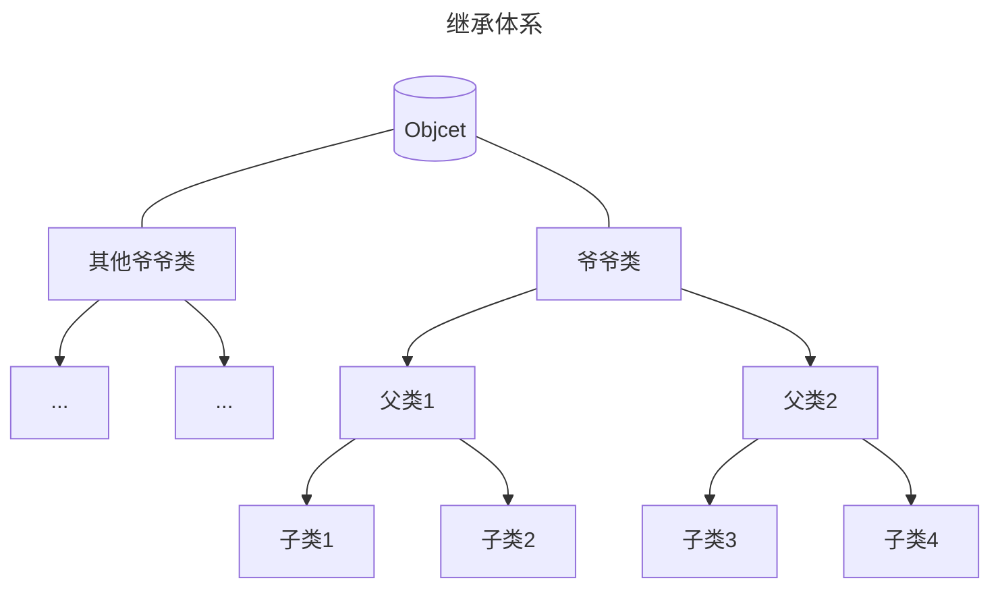

# 一、JAVA基础

## 1、认识和安装JDK

Java在世界和国内都是数一数二的存在。

JDK的安装：


这里需要用到JDK的两个工具：javac和java

javac是将我们的代码编译成机器语言，然后通过java去运行。

先写一个HelloWorld的小Demo：

```js
public class HelloWorld{
    public static void main(String[] args){
        System.out.println("HelloWorld");
    }
}
```

写完后带上.java后缀，然后用CMD中用Javac运行这个Demo（带后缀），然后会生成一个.class文件，然后用java运行这个Demo（不带后缀）文件


在cmd中运行之后会生成.class文件


然后用java来运行文件即可。


JAVA是需要注意大小写。

JavaSE：桌面开发

JavaME：嵌入式开发

JavaSE：企业开发

## 2、注释

单行注释：

```java
//注释内容
```

多行注释：

```java
/*
注释信息
注释信息
*/
```

文档注释

```java
格式：	
/**
注释信息
*/
```

## 3、关键字

- 关键字的字母全部小写
- 常用的代码编辑器，针对关键字有特殊的颜色标记，非常直观
- Java的关键字有五十个左右

> abstract ：表明类或者成员方法具有抽象属性
> assert： 断言，用来进行程序调试
> boolean： 基本数据类型之一，布尔类型
> break ：提前跳出一个块
> byte ：基本数据类型之一，字节类型
> case ：用在switch语句之中，表示其中的一个分支
> catch ：用在异常处理中，用来捕捉异常
> char ：基本数据类型之一，字符类型
> class ：声明一个类
> const ：保留关键字，没有具体含义
> continue ：回到一个块的开始处
> default ：默认，例如，用在switch语句中，表明一个默认的分支
> do ：用在do-while循环结构中
> double ：基本数据类型之一，双精度浮点数类型
> else：用在条件语句中，表明当条件不成立时的分支
> enum ：枚举
> extends ：表明一个类型是另一个类型的子类型，这里常见的类型有类和接口
> final ：用来说明最终属性，表明一个类不能派生出子类，或者成员方法不能被覆盖，或者成员域的值不能被改变，用来定义常量
> finally ：用于处理异常情况，用来声明一个基本肯定会被执行到的语句块
> float ：基本数据类型之一，单精度浮点数类型
> for ：一种循环结构的引导词
> goto ：保留关键字，没有具体含义
> if ：条件语句的引导词
> implements： 表明一个类实现了给定的接口
> import ：表明要访问指定的类或包
> instanceof ：用来测试一个对象是否是指定类型的实例对象
> int ：基本数据类型之一，整数类型
> interface： 接口
> long ：基本数据类型之一，长整数类型
> native ：用来声明一个方法是由与计算机相关的语言（如C/C++/FORTRAN语言）实现的
> new ：用来创建新实例对象
> package： 包
> private：一种访问控制方式：私用模式
> protected： 一种访问控制方式：保护模式
> public ：一种访问控制方式：共用模式
> return ：从成员方法中返回数据
> short ：基本数据类型之一,短整数类型
> static ：表明具有静态属性
> strictfp ：用来声明FP_strict（单精度或双精度浮点数）表达式遵循IEEE 754算术规范 [1]
> super ：表明当前对象的父类型的引用或者父类型的构造方法
> switch ：分支语句结构的引导词
> synchronized： 表明一段代码需要同步执行
> this ：指向当前实例对象的引用
> throw ：抛出一个异常
> throws ：声明在当前定义的成员方法中所有需要抛出的异常
> transient ：声明不用序列化的成员域
> try ：尝试一个可能抛出异常的程序块
> void ：声明当前成员方法没有返回值
> volatile ：表明两个或者多个变量必须同步地发生变化
> while ：用在循环结构中

大概就这么多。

## 4、常量

|  常量类型  |         说明         |     举例     |
| :--------: | :------------------: | :----------: |
| 字符串常量 |  双引号括起来的内容  | "HelloWorld" |
|  整数常量  |    不带小数的数字    |     111      |
|  小数常量  |     带小数的数字     |    11.11     |
|  字符常量  | 用单引号括起来的内容 |     'A'      |
|  布尔常量  |   布尔值，表示真假   | true和false  |
|   空常量   |       一个空值       |     null     |

```java
public class ConstantDemo {
	public static void main(String[] args) {
		//字符串常量
		System.out.println("Hello,World");
		System.out.println("黑马程序员");
		System.out.println("-------");

		//整数常量
		System.out.println(666);
		System.out.println(-88);
		System.out.println("-------");

		//小数常量
		System.out.println(13.14);
		System.out.println(-5.21);
		System.out.println("--------");

		//字符常量
		System.out.println('A');
		System.out.println('0');
		System.out.println('我');
		System.out.println("-------");

		//布尔常量
		System.out.println(true);
		System.out.println(false);
		System.out.println("-------");

		//空常量
		//空常量不能直接输出
		//System.out.println(null);
	}
}
```

## 5、变量

指他的指会随时改变的值

变量的应用场景：当某个数据经常发生变化的时候，我们也可以用变量春初。当数据变化时，只需要修改变量里面记录的值即可。

变量的定义格式：

> ​	数据类型 变量名 = 数据值;

```java
public class VariableDemo1{
	//主入口
	public static void main(String[] args){
		//定义变量
		//数据类型 变量名 = 数值 ;
		//数据类型;限定变量能存储数据的类型
		//int（整数）double（小数）
		//变量名：就是存储空间的名字
		//作用：方便以后使用
		//数据值：真正存在变量中的数据
		//等号：赋值。把右边的数据赋值给左边的变量
        
        int a = 10;
        System.out.printIn(a);//10
	}
}
```

变量也可以参与计算（注意变量的名字不能重复）

```java
int a = 10;
int b = 20;
System.out.printIn(a+b);//30
```

也可以修改变量的值：

```java
int a = a;
System.out.printIn(a);//10
a = 20;
System.out.printIn(a);//20。后赋的值会覆盖以前的赋值
```

**注意事项**：

> 1、只能存一个值
>
> 2、变量名不能重复定义
>
> 3、一条语句可以定义多个变量
>
> 4、变量在使用之前一定要进行赋值


3的演示：

```java
int d = 100, e = 200 , f = 300;
System.out.printIn(d);
System.out.printIn(e);
System.out.printIn(f);
```

4的演示：

```java
int g;
g = 500;//正确
System.out.printIn(g);
g = 500://错误
```

### 5.1、变量小练习

练习1：计算公交车的人数

```java
public class VariableTest{
	//主入口
    int count = 0;
    //第一站：上去一位乘客
    count = count + 1;
    System.out.printIn(count);
    //第二站：上去两位乘客，下去一位
    count = count + 2 - 1;
    //第三站：上去两位乘客，下去一位
    count = count + 2 - 1;
    //第四站：下去一位乘客
    count = count - 1;
    //第五站：上来一位
    count = count + 1;
    //最终车上有多少人
    System.out.printIn(count);
}
```


练习2：输出个人信息

```java
public class VariableTest{
    //姓名 字符串
    String name = "xxx";
    //年龄 整数
    int age = 22;
    //性别 字符串
    char gender = 'Man';
    //升高 浮点数
    double height = 175;
    //是否单身 布尔值
    boolean flag = true;
    System.out.printIn(name);
    System.out.printIn(age);
    System.out.printIn(gender);
    System.out.printIn(height);
    System.out.printIn(flag);
}
```

## 6、标识符

就是我们自己给类、方法、变量等起的名字；

硬性要求：

- 必须由数字、字母、下划线和美元符号中的一个或者多个组合而成
- 不能以数字开头
- 不能是关键字（见A-3）
- 区分大小写。如A和a是两个变量名

软性建议：

- 小驼峰命名法：**方法、变量**
  - 标识符是一个单词是全部小写
  - 如果由多个单词组成，那么第一个单词小写，第二个单词开始就要首字母大写
- 大驼峰命名法：**类名**
  - 标识符是一个单词的时候，首字母大写
  - 标识符由多个单词组成的时候，每个单词的首字母大

## 7、键盘录入（Scanner）

我们需要歇息一个叫做：`Scanner`的类

这个类可以接受键盘录入的数字。

**使用方法**：

步骤一：导包：Scanner这个类在哪

```java
import java.util.Scanner;  //导包必须写在类定义的上面
```

步骤二：创建对象——表示我要开始使用Scanner这个类

```java
Scanner sc = new Scanner(System.in);  //这个里面只有sc是变量名；可以变，其他的都不允许改变。
```

步骤三：接收数据——开始干活

```java
int i = sc.nextInt();  //左面这个个实例，只有i是变量名，其他的都不允许变化
```

综合：

```java
//导包
import java.util.Scanner;

public class Demo1{
	public static void main(String[] args){
	//创建对象
	Scanner sc = new Scanner(System.in);
	
	System.out.println("请输入第一个数字");
	//接收数据
	int number1 = sc.nextInt();
	System.out.println("请输入第二个字");
	//再次接受第二个数据
	int number2 = sc.nextInt();
	//相加并打印
	System.out.println(number1+number2);
	}
}
```

自动导包过后就不用再自己导包了

### 7-1 next() 、nextLine()

可以接受任意数据，但是都会返回一个字符串。

比如：键盘录入abc，那么会把abc看做字符串返回。

​	   键盘录入123，那么会把123看做字符串返回。

示例：

```java
Scanner sc = new Scanner(System.in);
String s = sc.next();//录入的所有数据都会看做是字符串
System.out.println(s);
```

### 7-2 nextInt()

​	只能接受整数。

比如：键盘录入123，那么会把123当做int类型的整数返回。

​	  键盘录入小数或者其他字母，就会报错。

示例：

```java
Scanner sc = new Scanner(System.in);
int s = sc.nextInt();//只能录入整数
System.out.println(s);
```

### 7-3 nextDouble()

能接收整数和小数，但是都会看做小数返回。

​	录入字母会报错。

示例：

```java
Scanner sc = new Scanner(System.in);
double d = sc.nextDouble();//录入的整数，小数都会看做小数。
						//录入字母会报错
System.out.println(d);
```

### 7-4 底层细节

**1、next（），nextInt（），nextDouble（）在接收数据的时候，会遇到空格，回车，制表符其中一个就会停止接收数据。**

示例：

```java
Scanner sc = new Scanner(System.in);
double d = sc.nextDouble();
System.out.println(d);
//键盘录入：1.1 2.2//注意录入的时候1.1和2.2之间加空格隔开。
//此时控制台打印1.1
//表示nextDouble方法在接收数据的时候，遇到空格就停止了，后面的本次不接收。
```

```java
Scanner sc = new Scanner(System.in);
int i = sc.nextInt();
System.out.println(i);
//键盘录入：1 2//注意录入的时候1和2之间加空格隔开。
//此时控制台打印1
//表示nextInt方法在接收数据的时候，遇到空格就停止了，后面的本次不接收。
```

```java
Scanner sc = new Scanner(System.in);
String s = sc.next();
System.out.println(s);
//键盘录入：a b//注意录入的时候a和b之间加空格隔开。
//此时控制台打印a
//表示next方法在接收数据的时候，遇到空格就停止了，后面的本次不接收。
```

**2、next（），nextInt（），nextDouble（）在接收数据的时候，会遇到空格，回车，制表符其中一个就会停止接收数据。但是这些符号 + 后面的数据还在内存中并没有接收。如果后面还有其他键盘录入的方法，会自动将这些数据接收。**

示例：

```java
Scanner sc = new Scanner(System.in);
String s1 = sc.next();
String s2 = sc.next();
System.out.println(s1);
System.out.println(s2);
//此时值键盘录入一次a b(注意a和b之间用空格隔开)
//那么第一个next();会接收a，a后面是空格，那么就停止，所以打印s1是a
//但是空格+b还在内存中。
//第二个next会去掉前面的空格，只接收b
//所以第二个s2打印出来是b
```

**3、nextLine（）方法是把一整行全部接收完毕。**

```java
Scanner sc = new Scanner(System.in);
String s = sc.nextLine();
System.out.println(s);
//键盘录入a b(注意a和b之间用空格隔开)
//那么nextLine不会过滤前面和后面的空格，会把这一整行数据全部接收完毕。
```

### 7-5 混用的后果

上面说两套键盘录入不能混用，否则会有比较严重的后果

示例：

```java
Scanner sc = new Scanner(System.in);//①
int i = sc.nextInt();//②
String s = sc.nextLine();//③
System.out.println(i);//④
System.out.println(s);//⑤
```

当代码运行到第二行，会让我们键盘录入，此时录入123。

但是实际上我们录的是123+回车。

而nextInt是遇到空格，回车，制表符都会停止。

所以nextInt只能接受123，回车还在内存中**没有被接收。**

此时就被nextLine接收了。

所以，如果混用就会**导致nextLine接收不到数据。**

### 7-6 结论（使用方法）

键盘录入分为两套：

- next（）、nextInt（）、nextDouble（）这三个配套使用。

如果用了这三个其中一个，就不要用nextLine（）。

- nextLine（）单独使用。

如果想要整数，那么先接收，再使用Integer.parseInt进行类型转换。

示例：

```java
Scanner sc = new Scanner(System.in);
String s = sc.next();//键盘录入123
System.out.println("此时为字符串" + s);//此时123是字符串
int i = sc.nextInt();//键盘录入123
System.out.println("此时为整数：" + i);
```

```java
Scanner sc = new Scanner(System.in);
String s = sc.nextLine();//键盘录入123
System.out.println("此时为字符串" + s);//此时123是字符串
int i = Integer.parseInt(s);//想要整数再进行转换
System.out.println("此时为整数：" + i);
```


## 8、IDEA

相比较于Notepad++，IDEA有着更好的提示性能，更加规范。

下载地址：[下载 IntelliJ IDEA： The Capable & Ergonomic Java IDE by JetBrains](https://www.jetbrains.com/idea/download/#section=windows)

idea项目结构介绍

> ​	project（项目）
>
> ​			module（模块）
>
> ​					package（包）
>
> ​							class（类）

四级结构

创建多级包：com.itheimademo  >>  创建出来的就是


****


快捷键：PSVM+回车

SOUT+回车


# 二、运算符
## 1、数据类型
Java语言是**强类型**语言，对于每一种数据都给出了明确的数据类型，不同的数据类型也会被分配到不同的内存空间，所以他们表示的数据太小也是不一样

| 数据类型 | 关键字  | 内存 |                             范围                             |
| :------: | :-----: | :--: | :----------------------------------------------------------: |
|   整数   |  byte   |  1b  |                           -128~127                           |
|   整数   |  short  |  2b  |                         -32768~32767                         |
|   整数   |   int   |  4b  |                          -231~231-1                          |
|   整数   |  long   |  8b  |                          -263~263-1                          |
|  浮点数  |  float  |  4b  | 负数：`-3.402823E+38`~`-1.401298E-45`正数：`1.401298E-45`~`3.402823E+38` |
|  浮点数  | double  |  8b  | 负数：`-1.797693E+308`到`-4.9000000E-324`正数：`4.9000000E-324`到`1.797693E+308` |
|   字符   |  char   |  2b  |                           0-65535                            |
|   布尔   | boolean |  1b  |                         true，false                          |

- [] 包含等于，() 不包含等于

- 类型后缀

  不区分大小写，但建议用大写，因为小写的 L 与 1 容易混淆
  尾符号 D 可以省略
  float 和 double 精度不同，即小数点后的位数

- float 的精度二进制是 23，换算成十进制是 6~7
  double 的精度二进制是 52，换算成十进制是 15~16

## 2、类型转换

- 自动类型转换(隐式转换)
  把一个表示数据范围小的数值或者变量赋值给另一个表示数据范围大的变量
- 强制类型转换
  把一个表示数据范围大的数值或者变量赋值给另一个表示数据的范围小的变量
  格式：`目标数据类型 变量名 = (目标数据类型)值或者变量;`
  例子：`int k = (int)88.88;`

### 2-1、自动转换


```java
public class Demo {
	public static void main(String[] args) {
		//自动类型转换
		double d = 10;
		System.out.println(d);

		//定义byte类型的变量
		byte b = 10;
		short s = b;
		int i = b;
		System.out.println(s);
		System.out.println(i);

		//这是不可以的，类型不兼容
		//char c = b;

		//强制类型转换
		int k = (int)88.88;
		System.out.println(k);
	}
}
```

```java
D:\Java\mycode>javac Demo.java

D:\Java\mycode>java Demo
10.0
10
10
88
```

问题1：

```java
int i = 10;
long n = 100L;
double b = 20.0;
resulet = i + n + d;
```

问：result是什么类型？

答：double，因为运算符从左往右计算，i为int类型，n为long类型，所以会将i转换成long类型在相加，随后b为double类型，但是double比long大，所以最后会转变成double类型。

问题2：

```java
byte b = 10;
short s = 20;
long n = 100L;
result = b + s + n;
```

问：result是什么类型？

答：long，但是需要注意的是这里的byte和short都需要先转换成int类型在相加，然后和long类型相加再变成long类型。

### 2-2、强制转换

如果把一个取值范围大的数值，赋值给取值范围小的变量。是不允许直接复制的。如果一定需要则要加入强制转换。

格式：

```apl
目标数据类型 变量名 = （目标数据类型）被强转的数据；
```

例如：

```java
//正例
double a = 12.3
int b = (int) a;
//反例
int a = 300;
byte b = (byte) a;
```
## 3、运算符

运算符：对常量或者变量进行操作的符号

表达式：用运算符把常量或者变量连接起来符合Java语法的式子就可以称为表达式。

不同的运算符连接的表达式体现的是不同类型的表达式

注意：\+ : 是运算符，并且是算术运算符

a + b : 是表达式，由于+是算术运算符，所以这个表达式叫算术表达式

例子：

```java
public class OperatorDemo01 {
	public static void main (String[] args) {
		//定义两个变量
		int a = 6;
		int b = 4;

		System.out.println(a + b);
		System.out.println(a - b);
		System.out.println(a * b);
		System.out.println(a / b);
		System.out.println(a % b);
		//除法得到的商，取余得到的是余数

		//整数相除只能得到整数，要想得到小数，必须有浮点数的参与
		System.out.println(6.0 / 4);
	}
}
```

```java
D:\Java\mycode>javac OperatorDemo01.java

D:\Java\mycode>java OperatorDemo01
10
2
24
1
2
1.5
```

### 3-1 字符“+”的方法

拿字符在计算机底层对应的数值来进行计算的，即ASCII码

**A -> 65：A-Z是连续的
a -> 97：a-z是连续的
0 -> 48：0-9是连续的**

算术表达式中包含多个基本数据类型的值的时候，整个算术表达式的类型会自动进行提升

提升规则：

byte类型，short类型和char类型将被提升到int类型

整个表达式的类型自动提升到表达式中最高等级操作数同样的类型

等级顺序：`byte->short->char->int->long->float->double`

```java
public class Demo02 {
	public static void main (String[] args) {
		//定义两个变量
		int i = 10;
		char c = 'A';//'A'的值是65
		c = 'a';//'a'的值是97
		c = '0';
		System.out.println(i + c);

		//char ch = i + c;
		//char类型会被自动提升为int类型
		int j = i + c;
		System.out.println(j);

		//int k = 10 + 13.14;
		double d = 10 + 13.14;
		System.out.println(d);
	}
}
```

```java
D:\Java\mycode>javac OperatorDemo02.java

D:\Java\mycode>java OperatorDemo02
58
58
23.14
```

### 3-2 字符串“+”的方法

- 当`+`操作中出现字符串时，这个`+`是字符串连接符，而不是算术运算。
- 在`+`操作中，如果出现了字符串，就是连接运算符，否则就是算术运算。当连续进行`+`操作时，从左到右逐个执行。

```java
  public class Demo03 {
  	public static void main(String[] args) {
  		System.out.println("it" + "heima");
  		System.out.println("itheima" + 666);
  		System.out.println(666 + "itheima");
  		System.out.println("黑马" + 6 + 66);
  		System.out.println(1 + 99 + "年黑马");
  	}
  }
```

```java
  D:\Java\mycode>javac Demo03.java
  
  D:\Java\mycode>java Demo03
  itheima
  itheima666
  666itheima
  黑马666
  100年黑马
```

### 3-3 赋值运算符

| 符号 |    含义    |
| :--: | :--------: |
|  =   |    赋值    |
|  +=  | 先加再赋值 |
|  -=  | 先减再赋值 |
|  *=  |  乘后赋值  |
|  /=  |  除后赋值  |
|  %=  | 取余再赋值 |

注意：扩展的赋值运算符隐含了强制类型转换

| 符号 | 作用 |
| :--: | :--: |
|  ++  | 自增 |
|  --  | 自减 |

注意事项：

1、++和--既可以放在变量后边，也可以放在变量的前边

2、单独使用的时候，++和--无论是放在变量前边还是后边，结果都是一样的。

3、参与操作的时候，如果放在变量的后边，先拿变量参与操作，后拿变量做自增或自减。

4、参与操作的时候，如果放在变量的前边，先拿变量做自增或自减，后拿变量参与操作。

### 3-4 关系运算符

| 符号 |                        含义                         |
| :--: | :-------------------------------------------------: |
|  ==  |  a==b，判断a和b是否相等，成立为true，不成立为false  |
|  !=  | a!=b，判断a和b是否不相等，成立为true，不成立为false |
|  >   |   a>b，判断a是否大于b，成立为true，不成立为false    |
|  >=  | a>=b，判断a是否大于等于b，成立为true，不成立为false |
|  <   |   a<b，判断a是否小于b，成立为true，不成立为false    |
|  <=  | a<=b，判断a是否小于等于b，成立为true，不成立为false |

**注意事项：关系运算符的结果都是`boolean`类型，要么是true，要么是false。**

### 3-5 逻辑运算符

| 符号 |  含义  |                   说明                   |
| :--: | :----: | :--------------------------------------: |
|  &   | 逻辑与 | a&b：a和b都是true则输出true，否则为false |
|  \|  | 逻辑或 |                  a\|b：                  |
|  ^   | 逻辑异 |                                          |
|  !   | 逻辑非 |                                          |

### 3-6 三元运算符

```java
格式：关系表达式?表达式1:表达式2;
范例：a > b ? a : b;

计算规则：
    首先计算关系表达式的值
    如果值为true，表达式1的值就是运算结果
    如果值为false，表达式2的值就是运算结果
```

```java
public class OperatorDemo {
	public static void main(String[] args) {
		//定义两个变量
		int a = 10;
		int b = 20;

		//获取两个数值当中的较大值
		int max = a > b ? a : b;
		System.out.println("max: " + max);
	}
}

```

```java
D:\Java\mycode>javac OperatorDemo.java

D:\Java\mycode>java OperatorDemo
max: 20
```

### 3-7 其他运算符

| 运算符 |    含义    |       运算规则       |
| :----: | :--------: | :------------------: |
|   &    |   逻辑与   |  0为false，1为true   |
|   \|   |   逻辑或   |  0为false，1为true   |
|   <<   |    左移    |  向左移动，低位补0   |
|   >>   |    右移    | 向右移动，高位补0或1 |
|  >>>   | 无符号右移 |  向右移动，高位补0   |

左移一次，原值就x2

# 三、判断和循环

## 1、流程控制语句

### 1-1 `if`

格式：

```
if(判断语句){
	语句1;
}
语句2;
```

判断语句为true则执行语句1，为false执行语句2

例子：

```java
public class IfDemo {
	public static void main(String[] args) {
		System.out.println("开始");
		int a = 10;
		int b = 20;
		if(a == b) {
			System.out.println("a等于b");
		}
		int c = 10;
		if(a == c) {
			System.out.println("a等于c");
		}
		System.out.println("结束");
	}
}
```

输出：

```java
D:\Java\mycode>javac IfDemo.java

D:\Java\mycode>java IfDemo
开始
a等于c
结束
```

### 2-2 `if...else`

```java
if(关系表达式){
	语句1;
} else {
	语句2;
}
```

**首先计算表达式的值，如果关系式的值为true则执行语句1，为flase则执行语句2，最后继续执行后面的其他语句**

例如：

```java
public class IfDemo {
	public static void main(String[] args) {
		System.out.println("开始");
		int a = 10;
		int b = 20;
		if(a > b) {
			System.out.println("a的值大于b");
		}else {
			System.out.println("a的值不大于b");
		}
		System.out.println("结束");
	}
}
```

输出：

```java
D:\Java\mycode>javac IfDemo.java

D:\Java\mycode>java IfDemo
开始
a的值不大于b
结束
```

**案例：**判断奇偶数

```java
import java.util.Scanner;

public class IfTest {
	public static void main(String[] args) {
		Scanner sc = new Scanner(System.in);
		System.out.println("请输入一个数判断奇偶：");
		int number = sc.nextInt();
		if(number % 2 == 0) {
			System.out.println(number + "是偶数");
		}else {
			System.out.println(number + "是奇数");
		}

	}
}
```

输出：

```java
D:\Java\mycode>javac IfTest.java

D:\Java\mycode>java IfTest
请输入一个数判断奇偶：
9
9是奇数

D:\Java\mycode>java IfTest
请输入一个数判断奇偶：
6
6是偶数
```

*****

#### **练习：影院选座**

需求：

​	在实际开发中，电影院选座也会使用到if判断。

​	假设某影院售卖了100张票，票的序号为1~100。

​	其中奇数票号坐左侧，偶数票号坐右侧。

​	键盘录入一个整数表示电影票的票号。

​	根据不同情况，给出不同的提示：

​		如果票号为奇数，那么打印坐左边。

​		如果票号为偶数，那么打印坐右边。

```java
//分析：
//1.键盘录入票号
Scanner sc = new Scanner(System.in);
System.out.println("请输入票号");
int ticket = sc.nextInt();
if(ticket >= 1 && ticket <= 100){
    //合法
    //2.对票号进行判断
    if (ticket % 2 == 0) {
        //偶数
        System.out.println("坐右边");
    } else {
        //奇数
        System.out.println("坐左边");
    }
	}else{
    //票号不合法
    System.out.println("票号不合法");
}
```


### 2-3 `if...else if`

**语法**

```java
if (condition) {
    // do something
}else if (condition1) {
    // do something1
}else if (condition2) {
    // do something2
}
```

|    参数     |      |
| :---------: | ---- |
|     if      |      |
|  confition  |      |
|   else if   |      |
| Condition 1 |      |

**案例一**：星期几

```java
import java.util.Scanner;

public class IfDemo {
	public static void main(String[] args) {
		Scanner sc = new Scanner(System.in);
		System.out.println("请输入一个星期数(1-7)：");
		int week = sc.nextInt();

		if(week == 1) {
			System.out.println("星期一");
		}else if(week == 2) {
			System.out.println("星期二");
		}else if(week == 3) {
			System.out.println("星期三");
		}else if(week == 4) {
			System.out.println("星期四");
		}else if(week == 5) {
			System.out.println("星期五");
		}else if(week == 6) {
			System.out.println("星期六");
		}else {
			System.out.println("星期天");
		}
	} 
}
```

```java
D:\Java\mycode>javac IfDemo.java

D:\Java\mycode>java IfDemo
请输入一个星期数(1-7)：
7
星期天

D:\Java\mycode>java IfDemo
请输入一个星期数(1-7)：
2
星期二

D:\Java\mycode>java IfDemo
请输入一个星期数(1-7)：
5
星期五
```

**案例二**：考试奖励

```java
import java.util.Scanner;

public class IfTest {
	public static void main(String[] args) {
		Scanner sc = new Scanner(System.in);
		System.out.println("请输入一个分数：");
		int score = sc.nextInt();
		if(score > 100 || score < 0) {
			System.out.println("你输入的分数有误");
		}else if(score >= 95 && score <= 100) {
			System.out.println("山地自行车一辆");
		}else if(score >= 90 && score <= 94) {
			System.out.println("游乐场玩一次");
		}else if(score >= 80 && score <= 89) {
			System.out.println("变形金刚玩具一个");
		}else {
			System.out.println("胖揍一顿");
		}
 	}
}
```


```java
D:\Java\mycode>javac IfTest.java

D:\Java\mycode>java IfTest
请输入一个分数：
102
你输入的分数有误

D:\Java\mycode>java IfTest
请输入一个分数：
100
山地自行车一辆

D:\Java\mycode>java IfTest
请输入一个分数：
92
游乐场玩一次

D:\Java\mycode>java IfTest
请输入一个分数：
85
变形金刚玩具一个

D:\Java\mycode>java IfTest
请输入一个分数：
67
胖揍一顿
```

### 2-4 `Switch`

格式说明：

表达式：取值为byte、short、int、char，JDK5以后可以是枚举，JDK7以后可以是String。
case：后面跟的是要和表达式进行比较的值
break：表示中断，结束的意思，用来结束switch语句
default：表示所有情况都不匹配的时候，就执行该处的内容，和if语句的else相似。

- default的位置和省略情况

  default可以放在任意位置，也可以省略

- case穿透

  不写break会引发case穿透现象

- switch在JDK12的新特性

表达式：

```java
switch(表达式) {
    case 值1:
        语句体1;
        break;
    case 值2:
        语句体2;
        break;
    ...
    default:
        语句体n+1;
        [break;]
}
/*
执行流程：1、先计算表达式的值
2、一次和case后面的值进行比较，如果有对应的值，就执行相对应的值，再执行过程中，遇到break结束
3、如果所有的case后面的值和表达式都不匹配，就会执行default里面的语句，然后结束程序。
*/
```

switch 语句中的变量类型可以是： byte、short、int 或者 char。从 Java SE 7 开 始，switch 支持字符串 String 类型了，同时 case 标签必须为字符串常量或字面量。

**switch 匹配的表达式可以是：**

- byte、short、char、int类型及 这4种类型的包装类型；

- 枚举类型；
- String 类型；

**case 匹配的表达式可以是：**

- 常量表达式；
- 枚举常量；

**注意一点：** case提供了switch表达式的入口地址，一旦switch表达式与某个case分支匹配，则从该分支的语句开始执行，一直执行下去，即其后的所有case分支的语句也会被执行，直到遇到break

**案例一：**

**注意：**在没有break的时候， case提供了switch表达式的入口地址，一旦switch表达式与某个case分支匹配，则从该分支的语句开始执行，一直执行下去，即其后的所有case分支的语句也会被执行，直到遇到break。

```java
public static void main(String[] args) {
        String  s = "a";
        
        switch (s) {
        case "a": //a分支
             System.out.println("匹配成功1");
                
        case "b": //b分支
                System.out.println("匹配成功2");
                
        case "c": //c分支
                 System.out.println("匹配成功3");
                 break;
        case "d": //d分支
                 System.out.println("匹配成功4");
                 break;
        default:
            break;
        }
    }
```

输出：匹配成功1，匹配成功2，匹配成功3

```java
package test;
 
public class SwitchTest {
 
	public static void main(String[] args) {
		// TODO Auto-generated method stub
		String a = "c";
		switch (a) {
		case "a":
			System.out.println("匹配成功a");
			//break;
		case "b":
			System.out.println("匹配成功b");
			//break;
		case "c":
			System.out.println("匹配成功c");
			break;
		default:
			System.out.println("hhhh");
			break;
		}
 
	}
 
}
```

他在最后一个case菜判断正确，则前面的case不会被输出

**案例二**：星期判断

```java
import java.util.Scanner;

public class SwitchDemo {
	public static void main(String[] args) {
		System.out.println("开始");
		Scanner sc = new Scanner(System.in);
		System.out.println("请输入一个星期数(1-7)：");
		int week = sc.nextInt();

		switch(week) {
		case 1:
			System.out.println("星期一");
			break;
		case 2:
			System.out.println("星期二");
			break;
		case 3:
			System.out.println("星期三");
			break;
		case 4:
			System.out.println("星期四");
			break;
		case 5:
			System.out.println("星期五");
			break;
		case 6:
			System.out.println("星期六");
			break;
		case 7:
			System.out.println("星期天");
			break;
		default:
			System.out.println("你输入的星期数有误");
			break;
		}
		System.out.println("结束");
	}
}
```

### 小结

**Java中switch和if语句的区别**

switch和if语句都是Java的选择语句，这两种语句都是允许在程序运行时控制程序的执行过程。

switch和if-else相比，由于使用了Binary Tree算法，绝大部分情况下switch会快一点，除非是if-else的第一个条件就为true。　

编译器编译switch与编译if…else…不同。不管有多少case，都直接跳转，不需逐个比较查询。　
　
相比于if-else结构，switch的效率绝对是要高很多的，但是switch使用查找表的方式决定了case的条件必须是一个连续的常量。而if-else则可以灵活的多。
　　
switch效率高,从汇编代码可以看出来。switch只计算一次值，然后都是test。
　　
switch的效率与分支数无关。当只有分支比较少的时候，if效率比switch高(因为switch有跳转表)。分支比较多，那当然是使用switch。

## 2、循环结构




### 2-1 for循环

```java
for(初始化语句;条件判断语句;条件控制语句;) {
    循环体语句;
}
```

#### for案例

需求：统计满足条件的数字，键盘录入两个数字，表示一个范围。统计这个范围中。既能被3整除，又能被5整除的数字由多少个？

```java
public class test16{
	public static void main(String[] args){
        Scanner sc = new Scanner(System.in);
        System.out.println("请输入第一个字表示范围开始");
        sc.nextInt();
    }
}
```

**例一**：

利用for循环输出5次HelloWorld

```java
public class ForDemo {
	public static void main(String[] args) {
		for(int i=1;i<=5;i++) {
			System.out.println("Hello,World");
		}
	}
}
```

输出：

> Hello,World
> Hello,World
> Hello,World
> Hello,World
> Hello,World

**例二：**

```java
public class ForTest {
	public static void main(String[] args) {
		for(int i=1; i<=5; i++) {
			System.out.println(i);
		}
		System.out.println("--------");
		for(int j=5; j>=1; j--) {
			System.out.println(j);
		}
	}
}
```

```java
D:\Java\mycode>javac ForTest.java

D:\Java\mycode>java ForTest
1
2
3
4
5
--------
5
4
3
2
1
```

**例三：求和**

求：
$$
\sum 5
$$


```java
public class ForTest {
	public static void main(String[] args) {
		int sum = 0;
		for(int i=1; i<=5; i++) {
			sum += i;
		}
		System.out.println("和是：" + sum);
	}
}
```

```java
和是：15
```

求：100以内正偶数的和

```java
public class ForTest {
	public static void main(String[] args) {
		int sum = 0;
		for(int i=1; i<=100; i++) {
			if(i%2 == 0) {
				sum += i;
			}
		}
		System.out.println("和：" + sum);
	}
}
```

```java
D:\Java\mycode>javac ForTest.java

D:\Java\mycode>java ForTest
和：2550
```

**案例三**：水仙花数

水仙花数的个位、十位和百位的立方和等于原数，求1000以内所有的水仙花数

```java
public class ForTest {
	public static void main(String[] args) {
		for(int i=100; i<1000; i++) {
			//在计算之前获取三位数中每个位上的值
			int ge = i % 10;
			int shi = i / 10 % 10;
			int bai = i / 10 / 10 % 10;
			//判定条件是将三位中数的每个数值取出来，计算立方和后与原始数字比较是否相等
			if(ge*ge*ge + shi*shi*shi + bai*bai*bai == i) {
				//输出满足条件的数字就是水仙花数
				System.out.println(i);
			}
		}
	}
}
```


**案例四**：统计水仙花个数

```java
public class ForTest {
	public static void main(String[] args) {
		int count = 0;
		for(int i=100; i<1000; i++) {
			int ge = i % 10;
			int shi = i / 10 % 10;
			int bai = i / 10 / 10 % 10;
			if(ge*ge*ge + shi*shi*shi + bai*bai*bai == i) {
				count++;
			}
		}
		System.out.println("水仙花数共有" + count + "个");
	}
}
```

```java
D:\Java\mycode>javac ForTest.java

D:\Java\mycode>java ForTest
水仙花数共有4个
```

### 2-2 while循环



例1：输出10句 你好

```java
public class WhileDemo {
	public static void main(String[] args) {
	int i = 1; //循环变量初始化
	while( i <= 10 ) {//循环条件
		System.out.println("你好" + i);//执行语句
		i++;//循环变量迭代
	}
	
	System.out.println("退出while " + i); // 退出while
    }
}
```

例2：循环输出1~5

```java
public class WhileDemo {
	public static void main(String[] args) {
		int i = 1;
		while(i <= 5) {
			System.out.println(i);
			i++;
		}
	}
}
```

**案例**：折叠珠穆朗玛峰

```java
public class WhileTest {
	public static void main(String[] args) {
		int count = 0;
		double paper = 0.1;
		int zf = 8844430;
		while(paper <= zf) {
			paper *= 2;
			count++;
		}
		System.out.println("需要折叠： " + count + "次");
	}
}
```

```java
D:\Java\mycode>javac WhileTest.java

D:\Java\mycode>java WhileTest
需要折叠： 27次
```

### 2-3 do...while循环

语句格式：

```java
初始化语句;
do {
    循环体语句;
    条件控制语句;
}while(条件判断语句);
```

**例1**：输出5次HelloWorld

```java
public class DoWhileDemo {
	public static void main(String[] args) {
		int i = 1;
		do {
			System.out.println("Hello,World");
			i++;
		}while(i<=5);
	}
}
```

** 三种格式的区别**

- for和while循环，是先判断，再执行。
- do...while是先执行，再判断。
- 当知道循环次数或者循环范围的时候，用for循环。
- 当不知道循环次数，也不知道循环范围，但是知道循环的结束条件时，用while循环。

### 2-4 无限循环（死循环）

**for格式**

```java
for(;;){
	System.out.println("无限循环")
}
```

==注：初始化语句可以空着不写，表示循环之前不定义任何的控制变量。==

==条件判断语句可以空着不写，如果不写，默认表示true，循环一直进行。==

==条件控制语句可以空着不写，表示每次循环体执行完毕后，控制变量不做任何变化。==

**while格式**

```java
while(true){
	System.out.println("无限循环")
}
```

==注：小括号里面就不能省略了，true一定要写出来，否则代码会报错。==

无限循环常用的格式：while

无限循环下面不用再写代码了，因为无法执行到

### 2-5 条件控制语句

1、**break**

不能单独存在。可以在switch和循环中，表示结束、跳出的意思

示例：

```java
//1、吃1~5个包子
for (int i = 1; i <= 5;i++){
    System.out.println("在吃第" + i + "个包子");
    //2、吃完第三个包子就不吃了
    if(i == 3){
        break;//结束循环
    }
}
```

2、**continue**

不能单独存在。只能存在于循环当中。

表示：跳过本次循环，继续执行下次循环。

示例：

```java
//1、吃1~5号包子
for (int i - 1;i <= 5;i++){
    //2、在吃第3个包子时坏了，就继续吃下面的包子
    if(i == 3){
        //本区域的代码块不会执行，直接跳过，继续下次循环
        continue;
    }
    System.out.println("在吃第"+i+"个包子")
}
```


3、**Random**

随机数

Random和Scanner一样，时Java提前写好的类，我们不需关系是如何实现的，直接用就完了

步骤：

1、导包

```java
import java.util.Random

//导包的动作必须出现在类定义的上面
```

2、创建对象

```java
Random r = new Random ();
//上面的格式中，只有r是变量名可变，其他都不可变
```

3、生成随机数

```java
int number = r.nextInt(随机数范围);
//上面的格式中，只有number是变量名可变，其他都不可改变
//随机数范围的特点：从0开始，不包含指定值。比如参数为10，生成的范围[0,10)
```

代码示例：

```java
//1、导包
import java.util.Random;

public class RandomDemo1 {
    public static void main(String[] args) {
        //2.创建对象
        Random r = new Random();
        //3.生成随机数
        int number = r.nextInt(100);//包左不包右，包头不包尾
        //0 ~ 99
        System.out.println(number);

    }
}
```

### 2-6 循环案例练习

**回文数**

需求：给你一个整数x，如果x是一个回文数，则打印true，反之则打印false

解释：回文数是指正序和倒序读都是一样，例如121 是回文，123不是

分析：先定义数字，利用循环开是从有往左去获取每一位数字（要用while，因为你不知道循环次数，所以不能用for）

```java
package com.itheima.test;
public class test {
    public static void main(String[] args){
        //定义数字
		int x = 1234;
        //定义一个临时变量用于记录x原来的值，用于最后进行比较
		int temp = x;
        //记录倒过来之后的结果
		int num = 0;
        //从左往右获取每一位数字
		while(x != 0){
            int ge = x % 10;
            //修改x记录的值
            x = x / 10;
            //把当前获取到的数字拼接到最右边
            num = num * 10 + ge ;
		}
        //打印
        System.out.println(num);
        //比较
        System.out.println(num == temp);
	}
}

//4321
//false
```

**逢七过**

游戏规则：从任意一个数字开始报数，当你要报的数字是包含7或者是7的倍数时都要说过：过

要求：使用程序在控制台打印出1-100之间的满足逢七必过规则的数据 

举例：1 2 3 4 5 6 过 8 9 10 11 12 13 过 15 16 过 18 ...

```java
        /*需求：使用程序在控制台打印出1-100之间的满足逢七必过规则的数据*/
//分析：个位7  十位7   7倍数
//1 2 3 4 5 6 过 8 9 10 11 12 13 过 15 16 过 18 19 20 过....
//69 过 过 过 过 过 过... 80
//1.得到1~100之间的每一个数字
//开始：1
//结束：100
package com.itheima.test;
public class test {
    public static void main(String[] args){
		for (int i = 1; i <= 100; i++) {
    //2.判断每一个数字，如果符合规则，就打印过，如果不符合规则就打印真实的数字
    	if(i % 10 == 7 || i / 10 % 10 == 7  ||  i % 7 == 0){
        	System.out.println("过");
        	continue;
    		}
    	System.out.println(i);
		}
	}
}
```

**平方根**

需求：键盘录入一个大于等于2 的整数x，计算并返回x的平方根，只保留整数部分，小数部分舍去。

```java
//在代码当中
//从1开始循环，拿着数字的平方跟原来的数字进行比较
//如果小于的，那么继续往后判断
//如果相等，那么当前数字就是平方根
//如果大于的，那么前一个数字就是平方跟的整数部分
//1、键盘录入一个整数
Scanner sc = new Scanner(System.in);
System.out.println("请输入一个整数");
int number = sc.nextInt();
//2、从1开始循环判断
//开始：1 结束: number
for (int i = 1; i <= number; i++) {
    //用i * i 再跟number进行比较
    if(i * i == number){
        System.out.println(i + "就是" + number + "的平方根");
        //一旦找到了，循环就可以停止了，后面的数字就不需要再找了，提高代码的运行效率。
        break;
    }else if(i * i > number){
        System.out.println((i - 1) + "就是" + number + "平方根的整数部分");
        break;
    }
}
```

**判断是否为质数**

需求：从键盘录入一个数字，判断是否为质数

```java
package com.itheima.demo1;

import java.util.Scanner;

public class test2 {
    public static void main(String[] args) {
        //分析：
        //1. 键盘录入一个正整数
        //number
        Scanner sc = new Scanner(System.in);
        System.out.println("please enter a positive integer");
        int number = sc.nextInt();
        //定义一个变量，表示标记
        //标记着number是否为一个质数
        //true：是
        //false：不是

        //表示最初就认为number就是一个指数
        boolean flag = true;

        //2. 判断
        //写一个循环，从2开始判断，一直判断到number-1为止
        //看这个范围之内，有没有数字可以被number整除
        for (int i = 2;i < number ; i++ ){
            //i 依次表示这个范围内的每一个数字
            //看number是否能被i整除就可以了
            if (number % i == 0){
                flag = false;
                //System.out.println(number + " is not a prime number");
                break;
            }/*else{
                System.out.println(number + " is a prime number");
                }*/
        }
        //只有当这个循环结束了，表示这个范围内所有的数字都判断完了
        //此时才能断定number是一个质数
        if (flag){
            System.out.println(number + " is a prime number");
        }else{
            System.out.println(number + " is not a prime number");
        }
    }
}
```

无注释版：

```java
package com.itheima.demo1;

import java.util.Scanner;

public class test2 {
    public static void main(String[] args) {
        Scanner sc = new Scanner(System.in);
        System.out.println("please enter a positive integer");
        int number = sc.nextInt();
        boolean flag = true;
        for (int i = 2;i < number ; i++ ){
            if (number % i == 0){
                flag = false;
                break;
            }
        }
        if (flag){
            System.out.println(number + " is a prime number");
        }else{
            System.out.println(number + " is not a prime number");
        }
    }
}
```

**求商数和余数**

需求：给定两个整数，分别作为被除数和除数（都是正数，且不超过int的范围）将两数相除，要求不用乘法、除法和取余，得到商和余数

```java
package com.itheima.demo1;

import java.util.Scanner;

public class test2 {
    public static void main(String[] args) {
        /*
        分析：被除数 / 除数 = 商 ... 余数
        int a = 100;
        int b = 10;
        那我们怎么搞？减法
        100-10=90
        90-10=80
        ...
        10-10=0
        到0之后比较和除数比较，小于10就是余数
        */
        int a = 100;
        int b = 37;
        //定义一个变量来统计减了多少次4
        int count = 0;
        //3、循环while
        //在循环中不断用被除数减去除数
        //只要被除数a大于等于除数b就一直循环
        while(a >= b){
            a = a - b;
            count ++ ;
        }
        System.out.println(a);
        System.out.println(count);
    }
}
```

# 四、数组

**概念：**

​	指的是一种容器，可以同来存储同种数据类型的多个值。

​	但是数组容器在存储数据的时候，需要结合隐式转换考虑。

**比如：**

​	定义了一个int类型的数组。那么boolean。double类型的数据是不能存到这个数组中的，

​	但是byte类型，short类型，int类型的数据是可以存到这个数组里面的。

**建议：**

​	容器的类，和存储的数据类型保持一致。

**举例：**

​	整数1 2 3 4 56 就可以使用int类型的数组来存储。

​	小数1.1 1.2 1.3 1.4 就可以使用double类型的数组来存储。

​	字符串"aaa"  "bbb"  "ccc" 就可以使用String类型的数组来存储。

## 1、数组的定义

格式一：

```apl
数组类型 [] 数组名 {};
例如：int [] array {};
```

格式二：

```apl
数据类型 数组名 [] {};
例如：int array [] {};
```

注：

- 数据类型限定类数组以后能存储什么类型的数据。
- 方括号表示现在定义了一个数组
- 数组名就是一个名字而已，方便日后调用
- 方括号和数组名谁前谁后都一样。

## 2、数组的静态初始化

**完美格式**

```java
数据类型 [] 数组名 = new 数据类型[]{元素1，元素2，元素3...};
```

例如：

```java
int [] arr = new int []{11,22,33};
double [] arr = new double []{1.1,2.2,3.3};
```

注意：

1. 数组名只是名字，遵循小驼峰命名法
2. new：就是给数组分配内存空间
3. 数据类型：限定了数组以后能存储什么类型的数据。前后要保持一直。错例：`int[] arr = new double[]{11,22,33}`
4. `[]`表示现在定义的是一个数组，`{}`表示数组的元素，多个元素之间需要用逗号隔开
5. 数组一旦创建之后，长度不能法生变化

**简化格式**

```apl
数据类型[] 数组名 = {元素1，元素2，元素3,...};
```

例如：

```java
int[] arr1 = {1,2,3};
double[] arr2 = {1,2,3,4};
```

### 练习

**练习1：**定义数组存储5个学生的年龄

```java
//第一种
int[] agesArr = new int[]{18,19,29,21,22};
//第二种
int[] agesArr = {18,19,29,21,22};
```

**练习2：**定义数组存储三名学生的姓名

```java
//第一种
String[] namesArr = new String[]{"ZS","LS","WW"};
//第二种
String[] namesArr = {"ZS","LS","WW"};
```

**练习3**：定义数组存储4个学生的身高

```java
//第一种
double[] heightsArr = new double[]{1.95,1.85,1.75};
//第二种
double[] heightsArr = {1.95,1.85,1.75};
```

## 2、地址值

当我们打印数组的时候，实际出现的就是数组的地址值

```java
int [] arr = {1,2,3,4,5}
System.out.println(arr);

//[I@6f496d9f
```

数组的地址值表示数组再内存中的位置。

[I@6f496d9f 的格式含义：`[`  表示当前是个数组

`I`  表示数组之中都是int类型

`@  `表示一种间隔符号

`6f496d9f`  才是数组真正的地址（十六进制）

## 3、数组元素访问

**索引**：也叫下表、角标。从0开始，逐个+1增长，连续不间断


现在定义一个数组：

```java
int [] arr = {1,2,3,4,5};
		  //  0 1 2 3 4
```

**1、获取数组中的元素**

```java
//获取第0位置上的值并赋给number，再打印number
int number = arr[0];
System.ouy.println(number);//1

//获取数组第1位置上的值并直接打印
System.out.println(arr[1]);//2
```

**2、把数据存储到数组中**

格式：数组名[索引] = 具体数据/变量；

```java
int [] arr = {1,2,3,4,5};

arr[0] = 100;
System.out.println(arr[0]);//100
```

注意：覆盖之后原来的数值就不存在了

## 4、数组遍历

就是将数组中所有的内容取出来，取出来之后就可以打印、求和、判断...

==注意：遍历值得是取出数据的过程，不要局限认为遍历就是打印==

```java
int[] arr = {1,2,3,4,5};
//利用循环来遍历取出数据
for( int i = 0 ; i <= 5;i ++);{
    System.out.println(arr[i]);
}
```

这个方法也有一定的缺陷，比如再数组较长的时候还需要我们去清点数组内容的个数，很麻烦

这里就需要我们引入数组长度这个属性：length

调用方式：`数组名.length`

案例代码：

```java
package com.itheima.demo1;

public class test2 {
    public static void main(String[] args) {
        int[] arr = {1,2,3,4,5};
        for (int i = 0;i < arr.length; i++){
            System.out.println(arr[i]);
        }
    }
}
```

扩展：自动的快速生成数组的遍历方式，是idea提供的，代码为：`.fori`

**案例一**：遍历并求和

定义一个数组，存储1，2，3，4，5

遍历数组的每一个元素，求数组里所有元素的数据和

代码块：

```java
package com.itheima.demo1;

public class test2 {
    public static void main(String[] args) {
        //分析：
        //1、定义一个数组，添加数据1，2，3，4，5
        int[] arr = {1,2,3,4,5};
        //求和变量
        int sum = 0;
        //2、遍历数组得到每一个数据，累加求和
        for (int i = 0; i < arr.length; i++){
            //i 表示数组里每一个缩影
            //arr[i]一次表示数组里每一个元素
            sum = sum + arr[i];
        }
        //当循环结束后，sum的值就是累加之后的结果
        System.out.println(sum);
    }
}
```

**案例二**：统计个数

定义一个数组，存储1，2，3，4，5，6，7，8，9，10

遍历数组得到每一个元素，统计数组中一共有多少个能被3整除的数

```java
package com.itheima.demo1;

public class test2 {
    public static void main(String[] args) {
        //分析：1、定义一个数组，存入1，2，3，4，5，6，7，8，9，10
        int [] arr = {1,2,3,4,5,6,7,8,9,10};
        int count = 0;
        //2、遍历数组得到每一个索引
        for (int i = 0;i < arr.length; i ++){
            //i表述数组里的每一个索引
            //arr[i] 表示数组里的每一个元素
            //3、判断当前元素是否为3的背书，如果是那么统计变量需要自增一次。
            if(arr[i] % 3 == 0) {
//                System.out.println(arr[i]);
                count ++;
            }
        }
        System.out.println(count);
    }
}
```

**案例三**：变化数据

定义一个数组，存储1，2，3，4，5，6，7，8，9，10

遍历数组的每一个元素，要求如果是奇数，则将当前数字扩大两倍，如果是偶数，则将当前数字变成二分之一。

```java
package com.itheima.demo1;

public class test2 {
    public static void main(String[] args) {
        //1、分析：定义一个数组，存储数据
        int[] arr = {1,2,3,4,5,6,7,8,9,10};
        
        //2、遍历数组的每一个元素
        for (int i = 0; i < arr.length; i++) {
            //i 依次表示数组里面的每一个缩影
            //arr[i]一次表示数组里面的每一个元素

            //3、对每一个元素进行判断
            if (arr[i] % 2 ==0){
                //偶数变成二分之一
                arr[i] = arr[i] / 2;
            }else{
                //奇数扩大两倍
                arr[i] = arr[i] * 2;
            }
        }
        for (int i = 0; i < arr.length; i++) {
            System.out.println(arr[i]);
        }
    }
}
```

## 5、数组的动态初始化

动态初始化：初始化时至指定数组的长度，由系统为数组分配初始值

格式：`数据类型[] 数组名 = new 数据类型[数组长度] `

规范：`int[] arr = new int[3]`

在创建的时候，有我们给出数组的长度，由虚拟机给出默认的初始化值

如果我们没有赋值，那么打印出来的就是默认初始化值null，但也不一定是null，默认初始化值是有规律的：

- 整数类型：默认初始化值为0
- 小数类型：默认初始化值为0.0
- 字符类型：默认初始化值为'\u0000'  也就是一个空格
- 布尔类型：默认初始化值为false
- 应用数据类型：默认初始化值：null


**动态和静态初始化有什么区别**

动态初始化：手动给定数组的长度，由系统给出默认初始化值

- 之明确元素个数，不明确具体个数，推荐用动态初始化

静态初始化：手动给定数组元素，系统会根据元素个数计算出数组的长度

- 需求中以及明确需要操作的具体数据，直接静态初始化即可

**常见问题**

当访问了数组中不存在索引，就会引发索引越界异常

## 6、二维数组

- 格式：

## 7、数组练习

**求最值**

一直数组元素为 

找出最大值{22，52，22，44，55}

```java
package com.itheima.demo1;

public class test2 {
    public static void main(String[] args) {
        //求最大值{22，52，22，44，55}

        //1、定义数组来存储这5个数
        int[] arr = {22,52,22,44,55};
        //2、定义一个变量max来存储最大值,临时认为0索引是最大的
        int max = arr[0];
        for(int i = 0;i < arr.length; i ++){
            //i缩影  arr[i] 元素
            if (arr[i] > max){
                max = arr[i];
            }
        }
        System.out.println(max);
    }
}
```

注意：line10的max不能将初始化值定为0，一定要是数组中的值。如果我们定义成0，万一数组中的数值都是负数，那么最后输出的结果就为0，然而0却不在数组中。这样我们就可以把line11的循环初始改成1。

**遍历数组并求和**

生成10个1~100之间的随机数存入数组。

1、求出所有数据的和

2、求出所有数据的平均数

3、统计有多少个数据比平均值小

```java
package com.itheima.demo1;

import java.util.Random;

public class test2 {
    public static void main(String[] args) {
        //分析：1、定义数组
        //动态
        int[] arr = new int[10];
        //2、把随机数存入数组中
        Random r = new Random();
        for (int i = 0; i < arr.length; i++) {
            //每循环一次就会生成一个随机数
            int number = r.nextInt(100) + 1;
            //数组名 = 数据
            arr[i] = number;
        }

        //求所有数据的和
        int sum = 0;
        for (int i = 0; i < arr.length; i++) {
            sum = sum + arr[i];
        }
        System.out.println("数组的和为"+sum);

        //求平均数
        int avg = sum / arr.length;
        System.out.println("平均数为" + avg);

        //统计由多少个数据比平均值小
        int count = 0;
        for (int i = 0; i < arr.length; i++) {
            if(arr[i] < avg){
                count++;
            }
        }
        System.out.println("数组中一共由"+count+"个数据比平均值小");

        //遍历数组，验证答案
        for (int i = 0; i < arr.length; i++) {
            System.out.println(arr[i] + " ");
        }
    }
}
```

## 8、数组的内存图


**java内存分配**

- 栈：方法运行时使用的内存，比如main方法运行时，进入方法栈中去执行
- 堆：存储对象或者数组，用new来创建，都存储在堆内存
- 方法去：存储可以运行的class文件
- 本地方法栈：JVM在使用操作系统功能能的时候使用，和我们无关
- 寄存器：给CPU使用，和我们无关

我们现在只需要掌握前面两个就可以了


栈和堆是有区别的：如下图。

堆中的时new出来的东西会在这块内存中开辟空间并产生地址（A-14-3 地址值）


现在有如下代码：

```java
public static void main(String[] args){
    int a = 10;
    int b = 10;
    int c = a + b;
    sout(c)
}
```


如果我们定义数组，那么分配如下：

- 一个数组


- 两个数组


**两个数组指向同一个空间的内存**


如果我们将arr2中的第0位改成33：


# 五、方法

方法（method）是程序里最小的执行单元

- 注意：
  - 方法必须先创建才可以使用，该过程叫方法定义
  - 方法创建后并不是直接可以运行的，需要手动使用后，才可以执行，该过程成为方法调用。
  - 最简单的示例嵌套调用（可以嵌套调用，但是不能嵌套定义）：


## 1、无参数方法的定义和调用

**1、无参数方法定义和调用**

- 定义格式

  ```java
  pubolic static void 方法名 (){
  	//方法体;
  }
  ```

- 调用格式

  ```java
  方法名();
  ```

- 注意：方法必须先定义，后调用，否则程序将会报错。

**2、无参数方方法的练习**

练习1：

- 需求：设计一个方法用于打印两个数中较大的一个

- 思路：

  - 定义一个方法，用于打印两个数中较大的数，例如getMax()
  - 方法中定义两个变量，用于保存两个数字
  - 使用分支语句分两种情况对两个数字的大小关系进行处理
  - 在main()方法中调用定义好的方法

- 代码：

  ```java
  public class MethodTest {
      public static void main(String[] args) {
          //在main()方法中调用定义好的方法
          getMax();
      }
  //-----------------------------------------
      //定义一个方法，用于打印两个数字中的较大数，例如getMax()
      public static void getMax() {
          //方法中定义两个变量，用于保存两个数字
          int a = 10;
          int b = 20;
  
          //使用分支语句分两种情况对两个数字的大小关系进行处理
          if(a > b) {
              System.out.println(a);
          } else {
              System.out.println(b);
          }
      }
  }
  ```

## 2、含参数的方法定义和调用

**1、带参数的方法定义和调用**

- 定义格式：

  参数：由数据类型和变量名 - 数据类型 变量名

  参数示例：int a

  ```java
  public static void 方法名1 (参数1) {
  	方法体;
  }
  //-----------------------------------------------
  public static void 方法名2 (参数1, 参数2, 参数3...) {
  	方法体;
  }
  ```

- 注意：方法定义时，参数中的数据类型与变量名都不能缺少，缺少任意一个程序将报错

  方法定义时，多个参数之间使用逗号`,`分隔

- 调用格式

  ```java
  方法名(参数)；
  //------------------------------------------
  方法名(参数1,参数2);
  ```

- 示例

  ```java
  isEvenNumber(10);
  
  getMax(10,20);
  ```

  - 方法调用时，参数的数量与类型必须与方法定义中的设置相匹配，否则程序将报错 
  
- 实例：

  ```java
  package com.test;
  
  public class test{
  	public static void main(String[] args){
          getSum(10,20);//注意需要和方法中定义的数字一样，例如:不能是小数
      }
      public static void getSum(int num1 , int num2){
          int result = num1 + num2;
          System.out.println(result);
      }
  }
  ```

  

**2、形参和实参**

1. 形参：方法==定义==中的参数

​          等同于变量定义格式，例如：int number

2. 实参：方法==调用==中的参数

​          等同于使用变量或常量，例如： 10  number


**3、带参数的方法练习**

需求：设计一个方法，用于打印两个数中较大的数，数据来自于方法参数

- 思路：

  * ①定义一个方法，用于打印两个数字中的较大数，例如getMax() 

  * ②为方法定义两个参数，用于接收两个数字 

  * ③使用分支语句分两种情况对两个数字的大小关系进行处理 

  * ④在main()方法中调用定义好的方法（使用常量）

  * ⑤在main()方法中调用定义好的方法（使用变量） 

代码：

```java
public class MethodTest {
    public static void main(String[] args) {
        //在main()方法中调用定义好的方法（使用常量）
        getMax(10,20);
        //调用方法的时候，人家要几个，你就给几个，人家要什么类型的，你就给什么类型的
        //getMax(30);
        //getMax(10.0,20.0);

        //在main()方法中调用定义好的方法（使用变量）
        int a = 10;
        int b = 20;
        getMax(a, b);
    }
//-----------------------------------------------
    //定义一个方法，用于打印两个数字中的较大数，例如getMax()
    //为方法定义两个参数，用于接收两个数字
    public static void getMax(int a, int b) {
        //使用分支语句分两种情况对两个数字的大小关系进行处理
        if(a > b) {
            System.out.println(a);
        } else {
            System.out.println(b);
        }
    }
}
```

## 3、带返回值方法的定义和调用

- 定义格式

  ```java
  public static 数据类型 getSum(数据类型 num1，数据类型 num2，数据类型 num3){
      int result = num1 + num2 + num3;
      return result
  }
  ```

- 调用方式：

  ```java
  public class test {
      public static void main(String[] args){
  //调用方式1：直接调用
  getSum(10,20,30);
          
  //调用方式2：赋值调用。这个方法比较实用
  int sum = getSum(10,20,30);
  sout(sum);
          
  //调用方式3：输出调用
  sout(getSum(10,20,30));
      }
      
      public static int getSum(int num1,int num2,int num3){
          int result = num1 + num2 + num3;
          return result;//返回给方法的调用
      }
  }
  ```

**带返回值的方法练习1**

判断两个长方形面积的大小

```java
public class test{
	public static void main(String[] args){
        double area1 = getArea(len:5.3,width:1.7);
        double area2 = getArea(len:4.4,width:3.5);
        if(area1 > area2){
            sout("第一个更大")
        }else{
            sout("第二个更大")
        }
    }
    
    public static double getArea(double len,double width){
        double area = len*width;
        return area
    }
}
```

**带返回值的方法练习2**

* 需求：设计一个方法可以获取两个数的较大值，数据来自于参数

* 思路：

  * ①定义一个方法，用于获取两个数字中的较大数 
  * ②使用分支语句分两种情况对两个数字的大小关系进行处理 
  * ③根据题设分别设置两种情况下对应的返回结果 
  * ④在main()方法中调用定义好的方法并使用变量保存 
  * ⑤在main()方法中调用定义好的方法并直接打印结果 

* 代码：

  ```java
  public class MethodTest {
      public static void main(String[] args) {
          //在main()方法中调用定义好的方法并使用变量保存
          int result = getMax(10,20);
          System.out.println(result);
  
          //在main()方法中调用定义好的方法并直接打印结果
          System.out.println(getMax(10,20));
      }
  
      //定义一个方法，用于获取两个数字中的较大数
      public static int getMax(int a, int b) {
          //使用分支语句分两种情况对两个数字的大小关系进行处理
          //根据题设分别设置两种情况下对应的返回结果
          if(a > b) {
              return a;
          } else {
              return b;
          }
      }
  }
  ```

  

**带返回值方法练习3**

需求：

​	定义一个方法，求一家商场每个季度的营业额。根据方法结果再计算出全年营业额。

代码示例：

```java
package com.itheima.demo;

public class MethodDemo9 {
    public static void main(String[] args) {
        /*需求：定义一个方法，求一家商场每个季度的营业额。
        根据方法结果再计算出全年营业额。*/
        int sum1 = getSum(10, 20, 30);
        int sum2 = getSum(10, 20, 30);
        int sum3 = getSum(10, 20, 30);
        int sum4 = getSum(10, 20, 30);

        int sum = sum1 + sum2 + sum3 + sum4;
        System.out.println(sum);

    }

    //心得：
    //1.我要干嘛？  决定了方法体   每个季度的营业额
    //2.我干这件事情，需要什么才能完成？ 决定了形参 需要三个月的营业额 a b c
    //3.我干完这件事情，看调用处是否需要使用方法的结果。   决定了返回值
    //如果需要使用，那么必须返回
    //如果不需要使用，可以返回也可以不返回
    public static int getSum(int month1,int month2,int month3){
        int sum = month1 + month2 + month3;
        //因为方法的调用处，需要继续使用这个结果
        //所以我们必须要把sum返回
        return sum;
    }
}
```

**带返回值方法练习4**

需求：

​	键盘录入两个圆的半径（整数），比较两个圆的面积。

代码示例：

```java
import java.util.Scanner;

public class MethodDemo10 {
    public static void main(String[] args) {
        //需求：键盘录入两个圆的半径（整数），比较两个圆的面积。
        //键盘录入圆的半径
        Scanner sc = new Scanner(System.in);
        System.out.println("请输入圆的半径");
        int radii1 = sc.nextInt();

        System.out.println("请输入第二个圆的半径");
        int radii2 = sc.nextInt();
        double area1 = getArea(radii1);
        double area2 = getArea(radii2);
        if(area1 > area2){
            System.out.println("第一个圆更大");
        }else{
            System.out.println("第二个圆更大");
        }
    }

    //心得：
    //1.我要干嘛？   求圆的面积
    //2.我干这件事情，需要什么才能完成？        半径
    //3.方法的调用处，是否需要继续使用方法的结果    要比较
    public static double getArea(int radii) {
        double area = 3.14 * radii * radii;
        return area;
    }
}
```

## 4、方法的注意事项

**1、方法不能嵌套定义**

示例：

```java
public class MethodDemo {
    public static void main(String[] args) {

    }

    public static void methodOne() {
		public static void methodTwo() {
       		// 这里会引发编译错误!!!
    	}
    }
}
```

**2、void表示无返回值，可以省略return，也可以单独的书写return，后面不加数据**

示例：

```java
public class MethodDemo {
    public static void main(String[] args) {

    }
    public static void methodTwo() {
        //return 100; 编译错误，因为没有具体返回值类型
        return;	
        //System.out.println(100); return语句后面不能跟数据或代码
    }
}
```

**3、通用格式**

```java
public static 返回值类型 方法名(参数) {
   方法体; 
   return 数据 ;
}
```

* 解释：

  * public static ：修饰符，目前先记住这个格式

    返回值类型：方法操作完毕之后返回的数据的数据类型

    ​			如果方法操作完毕，没有数据返回，这里写void，而且方法体中**一般不写return**

     `方法名`：调用方法时候使用的标识

     `参数`：由数据类型和变量名组成，多个参数之间用逗号隔开

     `方法体`：完成功能的代码块

     `return`：如果方法操作完毕，有数据返回，用于把数据返回给调用者

* 定义方法时，**要做到两个明确**

  * 明确返回值类型：主要是明确方法操作完毕之后是否有数据返回，如果没有，写void；如果有，写对应的数据类型
  * 明确参数：主要是明确参数的类型和数量

* 调用方法时的注意：

  * void类型的方法，直接调用即可
  * 非void类型的方法，推荐用变量接收调用

## 5、方法重载

* 方法重载概念

  方法重载指同一个类中定义的多个方法之间的关系，满足下列条件的多个方法相互构成重载

  * 多个方法在同一个类中
  * 多个方法具有==相同的方法名==
  * 多个方法的==参数不相同，类型不同或者个数不同==。与返回值无关

* 注意：

  * 重载仅对应方法的定义，与方法的调用无关，调用方式参照标准格式
  * 重载仅针对同一个类中方法的名称与参数进行识别，与返回值无关，换句话说不能通过返回值来判定两个方法是否相互构成重载

示范：

```java
public class MethodDemo {
	public static void fn(int a) {
    	//方法体
    }
    public static int fn(double a) {
    	//方法体
    }
}

public class MethodDemo {
	public static float fn(int a) {
    	//方法体
    }
    public static int fn(int a , int b) {
    	//方法体
    }
}
```

错例：

```java
public class MethodDemo {
	public static void fn(int a) {
    	//方法体
    }
    public static int fn(int a) { 	/*错误原因：重载与返回值无关*/
    	//方法体
    }
}

public class MethodDemo01 {
    public static void fn(int a) {
        //方法体
    }
} 
public class MethodDemo02 {
    public static int fn(double a) { /*错误原因：这是两个类的两个fn方法*/
        //方法体
    }
}
```

**练习**

* 需求：使用方法重载的思想，设计比较两个整数是否相同的方法，兼容全整数类型（byte,short,int,long） 

* 思路：

  * ①定义比较两个数字的是否相同的方法compare()方法，参数选择两个int型参数
  * ②定义对应的重载方法，变更对应的参数类型，参数变更为两个long型参数
  * ③定义所有的重载方法，两个byte类型与两个short类型参数 
  * ④完成方法的调用，测试运行结果 

* 代码：

  ```java
  public class MethodTest {
      public static void main(String[] args) {
          //调用方法
          System.out.println(compare(10, 20));
          System.out.println(compare((byte) 10, (byte) 20));
          System.out.println(compare((short) 10, (short) 20));
          System.out.println(compare(10L, 20L));
      }
  
      //int
      public static boolean compare(int a, int b) {
          System.out.println("int");
          return a == b;
      }
  
      //byte
      public static boolean compare(byte a, byte b) {
          System.out.println("byte");
          return a == b;
      }
  
      //short
      public static boolean compare(short a, short b) {
          System.out.println("short");
          return a == b;
      }
  
      //long
      public static boolean compare(long a, long b) {
          System.out.println("long");
          return a == b;
      }
  
  }
  ```

  

## 6、方法和数组遍历

* 需求：设计一个方法用于数组遍历，要求遍历的结果是在一行上的。例如：[11, 22, 33, 44, 55] 

* 思路：

  * ①因为要求结果在一行上输出，所以这里需要在学习一个新的输出语句`System.out.print(“内容”);`

    `System.out.println(“内容”); `输出内容并换行

    `System.out.print(“内容”);` 输出内容不换行

    `System.out.println(); `起到换行的作用

  * ②定义一个数组，用静态初始化完成数组元素初始化

  * ③定义一个方法，用数组遍历通用格式对数组进行遍历

  * ④用新的输出语句修改遍历操作

  * ⑤调用遍历方法

* 代码：

  ```java
  public class Test1 {
      public static void main(String[] args) {
        /*  //先打印数据，再进行换行
          System.out.println("aaa");
          //只打印不换行
          System.out.print("bbb");
          System.out.print("ddd");
          //不打印任何内容，只换行
          System.out.println();
          System.out.print("cc");*/
          //设计一个方法用于数组遍历，要求遍历的结果是在一行上的。例如：[11, 22, 33, 44, 55]
          int[] arr = {1,2,3,4,5};
          printArr(arr);
      }
      //1.我要遍历数组
      //2.需要什么？  数组
      //3.调用处是否需要使用方法的结果。
      public static void printArr(int[] arr){
          System.out.print("[");
          for (int i = 0; i < arr.length; i++) {
              if(i == arr.length - 1){
                  System.out.println(arr[i] + "]");
              }else{
                  System.out.print(arr[i] + ", ");
              }
          }
      }
  }
  ```

  

## 7、方法和数组最大值

* 需求：设计一个方法用于获取数组中元素的最大值 

* 思路：

  * ①定义一个数组，用静态初始化完成数组元素初始化
  * ②定义一个方法，用来获取数组中的最大值，最值的认知和讲解我们在数组中已经讲解过了
  * ③调用获取最大值方法，用变量接收返回结果
  * ④把结果输出在控制台

* 代码：

  ```java
  public class MethodTest02 {
      public static void main(String[] args) {
          //定义一个数组，用静态初始化完成数组元素初始化
          int[] arr = {12, 45, 98, 73, 60};
  
          //调用获取最大值方法，用变量接收返回结果
          int number = getMax(arr);
  
          //把结果输出在控制台
          System.out.println("number:" + number);
      }
  
      //定义一个方法，用来获取数组中的最大值
      /*
          两个明确：
              返回值类型：int
              参数：int[] arr
       */
      public static int getMax(int[] arr) {
          int max = arr[0];
  
          for(int x=1; x<arr.length; x++) {
              if(arr[x] > max) {
                  max = arr[x];
              }
          }
          return max;
      }
  }
  ```

  

## 8、方法和获取索引

需求：定义一个方法获取数字，在数组中的索引位置，将结果返回给调用处，如果有重复的，只要获取第一个即可。

代码示例：查找3的索引

```java
package com.itheima.demo;

public class Test4 {
    public static void main(String[] args) {
        //定义一个方法获取数字，在数组中的索引位置，将结果返回给调用处
        //如果有重复的，只要获取第一个即可

        int[] arr = {1,2,3,4,5};
        //           0 1 2 3 4
        int index = contains(arr, 3);
        System.out.println(index);
    }

    //1. 我要干嘛？判断数组中的某一个数是否存在
    //2. 需要什么？数组 数字
    //3. 调用处是否需要继续使用？返回
    //获取number在arr中的位置
    public static int contains(int[] arr, int number) {
        //遍历arr得到每一个元素
        for (int i = 0; i < arr.length; i++) {
            //拿着每一个元素跟number比较
            if(arr[i] == number){
                //如果相等，表示找到了
                return i;
            }
        }
        //当循环结束之后，如果还不能返回索引，表示数组中不存在该数据
        //可以返回-1
        return -1;
    }
}

```


# T1 阶段练习1

## 练习一：飞机票

需求:

​	机票价格按照淡季旺季、头等舱和经济舱收费、输入机票原价、月份和头等舱或经济舱。

​	按照如下规则计算机票价格：旺季（5-10月）头等舱9折，经济舱8.5折，淡季（11月到来年4月）头等舱7折，经济舱6.5折。

代码示例：

```java
package com.itheima.test;

import java.util.Scanner;

public class Test1 {
    public static void main(String[] args) {
        /* 机票价格按照淡季旺季、头等舱和经济舱收费、输入机票原价、月份和头等舱或经济舱。
        按照如下规则计算机票价格：旺季（5-10月）头等舱9折，经济舱8.5折，淡季（11月到来年4月）头等舱7折，经济舱6.5折。*/

        //分析：
        //1.键盘录入机票原价、月份、头等舱或经济舱
        Scanner sc = new Scanner(System.in);
        System.out.println("请输入机票的原价");
        int ticket = sc.nextInt();
        System.out.println("请输入当前的月份");
        int month = sc.nextInt();
        System.out.println("请输入当前购买的舱位 0 头等舱 1 经济舱");
        int seat = sc.nextInt();
        //2.先判断月份是旺季还是淡季
        //ctrl + alt + M 自动抽取方法
        if (month >= 5 && month <= 10) {
            //旺季 //3.继续判断当前机票是经济舱还是头等舱
            //ticket = getPrice(ticket, seat, 0.9, 0.85);
            ticket = getTicket(ticket, seat, 0.9, 0.85);
        } else if ((month >= 1 && month <= 4) || (month >= 11 && month <= 12)) {
            //淡季
            //ticket = getPrice(ticket, seat, 0.7, 0.65);
            ticket = getTicket(ticket, seat, 0.7, 0.65);
        } else {
            //表示键盘录入的月份是一个非法数据
            System.out.println("键盘录入的月份不合法");
        }

        System.out.println(ticket);
    }

    public static int getTicket(int ticket, int seat, double v, double v2) {
        if (seat == 0) {
            //头等舱
            ticket = (int) (ticket * v);
        } else if (seat == 1) {
            //经济舱
            ticket = (int) (ticket * v2);
        } else {
            System.out.println("没有这个舱位");
        }
        return ticket;
    }

    //1.我要干嘛？根据舱位和折扣来计算最终的票价
    //2.我干这件事，需要什么才能完成？原价 舱位 头等舱的折扣 经济舱的折扣
    //3.方法的调用处是否需要继续使用这个结果  需要
    /*  public static int getPrice(int ticket, int seat, double v0, double v1) {
        if (seat == 0) {
            //头等舱
            ticket = (int) (ticket * v0);
        } else if (seat == 1) {
            //经济舱
            ticket = (int) (ticket * v1);
        } else {
            System.out.println("没有这个舱位");
        }
        return ticket;
    }*/
}
```


## 练习二：打印素数

​	判断101~200之间有多少个素数，并输出所有素数。

备注：素数就是质数

代码示例：

```java
package com.itheima.test;

public class Test2 {
    public static void main(String[] args) {
        //判断 101 ~ 200 之间有多少个素数，并打印所有素数

        //思路一： 2 ~ 99
        //定义变量i ，赋值100
        //判断i是否为质数

        //定义一个变量用来统计有多少个质数
        int count = 0;
        //外循环：遍历101~200这个范围，依次得到这个范围之内的每一个数字
        for (int i = 101; i <= 200; i++) {
            //i 依次表示循环中的每一个数字
            //继续判断i是否为一个质数
            boolean flag = true;
            //内循环:判断当前数字是否为一个质数。
            for (int j = 2; j < i; j++) {
                //j 表示2~99之间的每一个数字
                if(i % j == 0){
                    flag = false;
                    //跳出单层循环，内循环
                    break;
                }
            }
            if(flag){
                System.out.println("当前数字"+i+"是质数");
                count++;
            }
        }

        System.out.println("一共有" + count + "个质数");

        /* int i = 7;
        boolean flag = true;
        for (int j = 2; j < i; j++) {
            //j 表示2~99之间的每一个数字
            if(i % j == 0){
                flag = false;
                break;
            }
        }
        if(flag){
            System.out.println("当前数字是质数");
        }else{
            System.out.println("当前数字不是一个质数");
        }*/
    }
}

```

## 练习三：验证码

需求：

​	定义方法实现随机产生一个5位的验证码

验证码格式：

​	长度为5

​	前四位是大写字母或者小写字母

​	最后一位是数字

代码示例：

```java
package com.itheima.test;

import java.util.Random;

public class Test3 {
    public static void main(String[] args) {
        /*   需求：
            定义方法实现随机产生一个5位的验证码
            验证码格式：
            长度为5
            前四位是大写字母或者小写字母
            最后一位是数字
     */

        //方法：
        //在以后如果我们要在一堆没有什么规律的数据中随机抽取
        //可以先把这些数据放到数组当中
        //再随机抽取一个索引

        //分析：
        //1.大写字母和小写字母都放到数组当中
        char[] chs = new char[52];
        for (int i = 0; i < chs.length; i++) {
            //ASCII码表
            if(i <= 25){
                //添加小写字母
                chs[i] = (char)(97 + i);
            }else{//27
                //添加大写字母
                // A --- 65
                chs[i] = (char)(65 + i - 26);
            }
        }

        //定义一个字符串类型的变量，用来记录最终的结果
        String result = "";

        //2.随机抽取4次
        //随机抽取数组中的索引
        Random r = new Random();
        for (int i = 0; i < 4; i++) {
            int randomIndex = r.nextInt(chs.length);
            //利用随机索引，获取对应的元素
            //System.out.println(chs[randomIndex]);
            result = result + chs[randomIndex];
        }
        //System.out.println(result);
        //3.随机抽取一个数字0~9
        int number = r.nextInt(10);
        //生成最终的结果
        result = result + number;

        //打印最终结果
        System.out.println(result);

    }
}

```

## 练习四：复制数组

需求：

​	把一个数组中的元素复制到另一个新数组中去。

代码示例：

```java
package com.itheima.test;

public class Test4 {
    public static void main(String[] args) {
        /* 需求：
        把一个数组中的元素复制到另一个新数组中去。*/

        //分析：
        //1.定义一个老数组并存储一些元素
        int[] arr = {1,2,3,4,5};
        //2.定义一个新数组的长度跟老数组一致
        int[] newArr = new int[arr.length];
        //3.遍历老数组，得到老数组中的每一个元素，依次存入到新数组当中
        for (int i = 0; i < arr.length; i++) {
            //i 表示老数组中的索引。新数组中的每一个索引
            //arr[i]  表示老数组中的元素
            newArr[i] = arr[i];
        }

        //4.新数组中已经存满元素了
        for (int i = 0; i < newArr.length; i++) {
            System.out.println(newArr[i]);
        }

    }
}

```

## 练习五：评委打分

需求 :  

​	在唱歌比赛中，有6名评委给选手打分，分数范围是[0 - 100]之间的整数。选手的最后得分为：去掉最高分、最低分后的4个评委的平均分，请完成上述过程并计算出选手的得分。

代码示例：

```java
package com.itheima.test;

import java.util.Scanner;

public class Test5 {
    public static void main(String[] args) {
        //在唱歌比赛中，有6名评委给选手打分，分数范围是[0 - 100]之间的整数。
        // 选手的最后得分为：去掉最高分、最低分后的4个评委的平均分，请完成上述过程并计算出选手的得分。


        //分析：
        //1.定义一个数组，用来存储6名评委的打分（0~100）
        int[] scoreArr = getScores();
        for (int i = 0; i < scoreArr.length; i++) {
            System.out.println(scoreArr[i]);
        }
        //2.求出数组中的最大值
        int max = getMax(scoreArr);
        //3.求出数组中的最小值
        int min = getMin(scoreArr);
        //4.求出数组中6个分数的总和
        int sum = getSum(scoreArr);
        //5.（总和 - 最大值 - 最小值 ）/4
        int avg =  (sum - max - min)/(scoreArr.length - 2);
        //6.打印结果
        System.out.println("选手的最终得分为：" + avg);
    }


    public static int getSum(int[] scoreArr){
        int sum = 0;
        for (int i = 0; i < scoreArr.length; i++) {
            sum = sum + scoreArr[i];
        }
        return  sum;

    }


    //求数组的最大值
    public static int getMax(int[] scoreArr){
        int max = scoreArr[0];
        for (int i = 1; i < scoreArr.length; i++) {
            if(scoreArr[i] > max){
                max = scoreArr[i];
            }
        }
        return max;
    }

    //求数组的最小值
    public static int getMin(int[] scoreArr){
        int min = scoreArr[0];
        for (int i = 1; i < scoreArr.length; i++) {
            if(scoreArr[i] < min){
                min = scoreArr[i];
            }
        }
        return min;
    }


    //1.我要干嘛？定义一个数组，用来存储6名评委的打分（0~100）
    //2.我需要什么？都不需要
    //3.干完了这件事情，是否需要返回？必须返回
    public static int[] getScores(){
        //定义数组
        int[] scores = new int[6];
        //使用键盘录入的形式，输入分数：0~100
        Scanner sc = new Scanner(System.in);
        for (int i = 0; i < scores.length; ) {
            System.out.println("请输入评委的打分");
            int score = sc.nextInt();//100
            if(score >=0 && score<= 100){
                scores[i] = score;
                i++;
            }else{
                System.out.println("成绩超出了范围,继续录入，当前的i为：" + i);
            }
        }
        return  scores;
    }
}
```

## 练习六：数字加密

需求：

​	某系统的数字密码（大于0），比如1983，采用加密方式进行传输。

规则如下：

​	先得到每位数，然后每位数都加上5 , 再对10求余，最后将所有数字反转，得到一串新数。

举例：

```java
		1	9	8	3
+5		6   14  13  8
%10		6   4   3   8
反转	   8   3   4   6
加密后的结果就是：8346
```

代码示例：

```java
package com.itheima.test;

public class Test6 {
    public static void main(String[] args) {
        /*
        某系统的数字密码（大于0）。比如1983，采用加密方式进行传输，
        规则如下：
            每位数加上5
            再对10求余，
            最后将所有数字反转，
            得到一串新数。
*/


        //分析：
        //1.把整数里面的每一位放到数组当中
        int[] arr = {1, 9, 8, 3};
        //2.加密
        //每位数加上5
        for (int i = 0; i < arr.length; i++) {
            arr[i] = arr[i] + 5;
        }
        //再对10求余，
        for (int i = 0; i < arr.length; i++) {
            arr[i] = arr[i] % 10;
        }
        //将所有数字反转
        for (int i = 0, j = arr.length - 1; i < j; i++, j--) {
            int temp = arr[i];
            arr[i] = arr[j];
            arr[j] = temp;
        }
        //8 3 4 6 --> 8346
        //3.把数组里面的每一个数字进行拼接，变成加密之后的结果
        int number = 0;
        for (int i = 0; i < arr.length; i++) {
            number = number * 10 + arr[i];
        }
        System.out.println(number);
    }
}
```

**练习六扩展：**

```java
package com.itheima.test;

public class Test7 {
    public static void main(String[] args) {
        //需求：
        //把整数上的每一位都添加到数组当中
        //反向推导


        //1.计算出数组的长度
        int number = 12345;
        //定义一个变量临时记录number的值，就是为了第三步的时候再次使用
        int temp = number;
        //定义一个变量进行统计
        int count = 0;
        while(number != 0){
            //每一次循环就去掉右边的一个数字
            number = number / 10;
            //去掉一位计数器就自增一次。
            count++;
        }
        //2.定义数组
        //动态初始化
        int[] arr = new int[count];
        //3.把整数上的每一位都添加到数组当中
        int index = arr.length -1;
        while(temp != 0){//12345
            //获取temp里面的每一位数组
            int ge = temp % 10;
            //再去掉右边的那位数字
            temp = temp / 10;
            //把当前获取到的个位添加到数组当中
            arr[index] = ge;
            index--;
        }
        //验证结果  1  2  3  4 5
        for (int i = 0; i < arr.length; i++) {
            System.out.print(arr[i] + " ");
        }
    }
}
```

## 练习七：数字解密

把上一题加密之后的数据进行解密

代码示例：

```java
package com.itheima.test;

public class Test8 {
    public static void main(String[] args) {
        /*某系统的数字密码（大于0）。比如1983，采用加密方式进行传输，
        规则如下：
            每位数加上5
            再对10求余，
            最后将所有数字反转，
            得到一串新数。
            按照以上规则进行解密：
            比如1983加密之后变成8346，解密之后变成1983
        */


        //1.定义数组记录解密之后的结果
        int[] arr = {8, 3, 4, 6};
        //2.反转
        for (int i = 0, j = arr.length - 1; i < j; i++, j--) {
            int temp = arr[i];
            arr[i] = arr[j];
            arr[j] = temp;
        }
        //3.由于加密是通过对10取余的方式进行获取的
        //所以在解密的时候就需要判断，0~4之间+10  5~9数字不变
        for (int i = 0; i < arr.length; i++) {
            if (arr[i] >= 0 && arr[i] <= 4) {
                arr[i] = arr[i] + 10;
            }
        }
        //4.每一位减5
        for (int i = 0; i < arr.length; i++) {
            arr[i] = arr[i] - 5;
        }
        //5.获取数组里面的每一位数字拼接成最终的结果
        int number = 0;
        for (int i = 0; i < arr.length; i++) {
            number = number * 10 + arr[i];
        }
        System.out.println(number);


    }
}

```

## 练习八：抽奖

需求：

​	一个大V直播抽奖，奖品是现金红包，分别有{2, 588 , 888, 1000, 10000}五个奖金。请使用代码模拟抽奖，打印出每个奖项，奖项的出现顺序要随机且不重复。打印效果如下：（随机顺序，不一定是下面的顺序）

```java
888元的奖金被抽出
588元的奖金被抽出
10000元的奖金被抽出
1000元的奖金被抽出
2元的奖金被抽出
```

**解法一：**

```java
package com.itheima.test;

import java.util.Random;

public class Test9 {
    public static void main(String[] args) {
        /* 需求：
        一个大V直播抽奖，奖品是现金红包，分别有{2, 588 , 888, 1000, 10000}五个奖金。
        请使用代码模拟抽奖，打印出每个奖项，奖项的出现顺序要随机且不重复。
        打印效果如下：（随机顺序，不一定是下面的顺序）
            888元的奖金被抽出
            588元的奖金被抽出
            10000元的奖金被抽出
            1000元的奖金被抽出
            2元的奖金被抽出
        */


        //分析：
        //1.定义数组表示奖池
        int[] arr = {2, 588, 888, 1000, 10000};
        //2.定义新数组用于存储抽奖的结果
        int[] newArr = new int[arr.length];
        //3.抽奖
        Random r = new Random();
        //因为有5个奖项，所以这里要循环5次
        for (int i = 0; i < 5; ) {
            //获取随机索引
            int randomIndex = r.nextInt(arr.length);
            //获取奖项
            int prize = arr[randomIndex];
            //判断当前的奖项是否存在，如果存在则重新抽取，如果不存在，就表示是有效奖项
            boolean flag = contains(newArr, prize);
            if(!flag){
                //把当前抽取到的奖项添加到newArr当中
                newArr[i] = prize;
                //添加完毕之后，移动索引
                i++;
            }
        }
        //4.遍历newArr
        for (int i = 0; i < newArr.length; i++) {
            System.out.println(newArr[i]);
        }


    }

    //判断prize在数组当中是否存在
    //存在：true
    //不存在：false
    public static boolean contains(int[] arr,int prize){
        for (int i = 0; i < arr.length; i++) {
            if(arr[i] == prize){
                return true;
            }
        }
        return false;
    }


}

```

**解法二：**

```java
package com.itheima.test;

import java.util.Random;

public class Test10 {
    public static void main(String[] args) {
       /* 需求：
        一个大V直播抽奖，奖品是现金红包，分别有{2, 588 , 888, 1000, 10000}五个奖金。
        请使用代码模拟抽奖，打印出每个奖项，奖项的出现顺序要随机且不重复。
        打印效果如下：（随机顺序，不一定是下面的顺序）
            888元的奖金被抽出
            588元的奖金被抽出
            10000元的奖金被抽出
            1000元的奖金被抽出
            2元的奖金被抽出
        */

        //1.把奖池里面的所有奖项打乱顺序
        int[] arr = {2, 588, 888, 1000, 10000};
        Random r = new Random();
        for (int i = 0; i < arr.length; i++) {
            //获取随机索引
            int randomIndex = r.nextInt(arr.length);
            //拿着i跟随机索引randomIndex上的值进行交换
            int temp = arr[i];
            arr[i] = arr[randomIndex];
            arr[randomIndex] = temp;
        }
        //2.遍历奖池,从0索引开始获取每一个奖项
        for (int i = 0; i < arr.length; i++) {
            System.out.println(arr[i]);
        }


    }
}
```

## 练习九：双色球（拓展）

代码示例:

```java
package com.itheima.test;

import java.util.Random;
import java.util.Scanner;

public class Test11 {
    public static void main(String[] args) {
        //1.生成中奖号码
        int[] arr = createNumber(); // 123456  7

        System.out.println("=======================");
        for (int i = 0; i < arr.length; i++) {
            System.out.print(arr[i] + " ");
        }

        System.out.println("=======================");


        //2.用户输入彩票号码（红球 + 蓝球）//654321
        int[] userInputArr = userInputNumber();

        //3.判断用户的中奖情况
        //红球 蓝球
        int redCount = 0;
        int blueCount = 0;

        //判断红球
        for (int i = 0; i < userInputArr.length - 1; i++) {
            int redNumber = userInputArr[i];
            for (int j = 0; j < arr.length - 1; j++) {
                if(redNumber == arr[j]){
                    redCount++;
                    //如果找到了，那么后面的数字就没有必要继续比较了
                    //跳出内循环，继续判断下一个红球号码是否中奖
                    break;
                }
            }
        }

        //判断蓝球
        int blueNumber = userInputArr[userInputArr.length-1];
        if(blueNumber == arr[arr.length - 1]){
            blueCount++;
        }

        //根据红球的个数以及蓝球的个数来判断中奖情况
        if(redCount == 6 && blueCount == 1){
            System.out.println("恭喜你，中奖1000万");
        }else if(redCount == 6 && blueCount == 0){
            System.out.println("恭喜你，中奖500万");
        }else if(redCount == 5 && blueCount == 1){
            System.out.println("恭喜你，中奖3000");
        }else if((redCount == 5 && blueCount == 0) ||  (redCount == 4 && blueCount == 1)){
            System.out.println("恭喜你，中奖200");
        }else if((redCount == 4 && blueCount == 0) ||  (redCount == 3 && blueCount == 1)){
            System.out.println("恭喜你，中奖10");
        }else if((redCount == 2 && blueCount == 1) ||  (redCount == 1 && blueCount == 1)|| (redCount == 0 && blueCount == 1)){
            System.out.println("恭喜你，中奖5");
        }else{
            System.out.println("谢谢参与，谢谢惠顾");
        }

    }

    public static int[] userInputNumber() {
        //1.创建数组用于添加用户购买的彩票号码
        //6个红球 1个蓝球 数组长度：7
        int[] arr = new int[7];

        //2.利用键盘录入让用输入
        Scanner sc = new Scanner(System.in);
        //让用户输入红球号码
        for (int i = 0; i < 6; ) {
            System.out.println("请输入第" + (i + 1) + "个红球号码");
            int redNumber = sc.nextInt();
            //redNumber  在1~33  唯一不重复
            if (redNumber >= 1 && redNumber <= 33) {
                boolean flag = contains(arr, redNumber);
                if (!flag) {
                    //不存在
                    //有效的，可以添加到数组当中
                    arr[i] = redNumber;
                    i++;
                } else {
                    //存在
                    System.out.println("当前红球号码已经存在，请重新输入");
                }
            } else {
                System.out.println("当前红球号码超出范围");
            }
        }

        //让用户输入篮球号码
        System.out.println("请输入篮球号码");
        //1~16
        while (true) {
            int blueNumber = sc.nextInt();
            if (blueNumber >= 1 && blueNumber <= 16) {
                arr[arr.length - 1] = blueNumber;
                break;
            } else {
                System.out.println("当前篮球号码超出范围");
            }
        }
        return arr;

    }


    public static int[] createNumber() {
        //1.创建数组用于添加中奖号码
        //6个红球 1个蓝球 数组长度：7
        int[] arr = new int[7];

        //2.随机生成号码并添加到数组当中
        //红球：不能重复的  1 2 3 4 5 6
        //蓝球：可以跟红球号码重复 5

        //生成红球号码并添加到数组当中
        Random r = new Random();
        for (int i = 0; i < 6; ) {
            //获取红球号码
            int redNumber = r.nextInt(33) + 1;
            boolean flag = contains(arr, redNumber);
            if (!flag) {
                //把红球号码添加到数组当中
                arr[i] = redNumber;
                i++;
            }
        }

        //生成蓝球号码并添加到数组当中
        int blueNumber = r.nextInt(16) + 1;
        arr[arr.length - 1] = blueNumber;
        return arr;
    }

    //用于判断数组在数组中是否存在
    public static boolean contains(int[] arr, int number) {
        for (int i = 0; i < arr.length; i++) {
            if (arr[i] == number) {
                return true;
            }
        }
        return false;
    }
}

```

# 六、面向对象

## 1、类和对象

### 1-1 类和对象的理解

客观存在事物皆称为对象

- 类
  - 类的理解
    - 类是对现实生活中的一类具有共同属性的行为和事物的抽象
    - 类是对象的数据类型，类是具有共同属性和行为的一组对象的集合
    - 简单理解：类就是对现实事物的一种藐视
  - 类的组成
    - 属性：指事物的特征，例如：手机事物（品牌，价格，尺寸）
    - 行为：指事物能执行的操作，例如用手机打电话，发短信
- 类和对象的关系
  - 类：类是对现实生活中的一类具有共同属性的行为和事物的抽象
  - 对象：是能够看得到摸得着的真实存在的试题
  - 简单理解：类是对事物的一种描述，对象为具体存在的事物

### 1-2 类的定义

类的组成由属性和行为两部分组成

- 属性：在类中通过成员变量来体现（类中方法外的变量）
- 行为：在类中通过成员方法来体现（和前面的方法相比**去掉static关键字**）

**步骤**

①定义类

②编写类的成员变量

③编写类的成员方法

```java
public class 类名 {
	// 成员变量
	变量1的数据类型 变量1；
	变量2的数据类型 变量2;
	…
	// 成员方法
	方法1;
	方法2;	
}
```

示例：

```java
/*
    手机类：
        类名：
        手机(Phone)

        成员变量：
        品牌(brand)
        价格(price)

        成员方法：
        打电话(call)
        发短信(sendMessage)
 */
public class Phone {
    //成员变量
    String brand;
    int price;

    //成员方法
    public void call() {
        System.out.println("打电话");
    }

    public void sendMessage() {
        System.out.println("发短信");
    }
}
```

### 1-3 对象的使用

* 创建对象的格式：
  * `类名 对象名 = new 类名();`
* 调用成员的格式：
  * `对象名.成员变量`
  * `对象名.成员方法();`
* 示例代码

```java
/*
    创建对象
        格式：类名 对象名 = new 类名();
        范例：Phone p = new Phone();

    使用对象
        1：使用成员变量
            格式：对象名.变量名
            范例：p.brand
        2：使用成员方法
            格式：对象名.方法名()
            范例：p.call()
 */
public class PhoneDemo {
    public static void main(String[] args) {
        //创建对象
        Phone p = new Phone();

        //使用成员变量
        System.out.println(p.brand);
        System.out.println(p.price);

        p.brand = "小米";
        p.price = 2999;

        System.out.println(p.brand);
        System.out.println(p.price);

        //使用成员方法
        p.call();
        p.sendMessage();
    }
}
```

**对象练习**

* 需求：首先定义一个学生类，然后定义一个学生测试类，在学生测试类中通过对象完成成员变量和成员方法的使用
* 分析：
  * 成员变量：姓名，年龄…
  * 成员方法：学习，做作业…
* 示例代码：

```java
//学生类

public class Student {
    //成员变量
    String name;
    int age;

    //成员方法
    public void study() {
        System.out.println("好好学习，天天向上");
    }

    public void doHomework() {
        System.out.println("键盘敲烂，月薪过万");
    }
}
/*
    学生测试类
 */
public class StudentDemo {
    public static void main(String[] args) {
        //创建对象
        Student s = new Student();

        //使用对象
        System.out.println(s.name + "," + s.age);

        s.name = "林青霞";
        s.age = 30;

        System.out.println(s.name + "," + s.age);

        s.study();
        s.doHomework();
    }
}
```

### 1-4 对象内存图

java对对象的内存分配参考【四、数组-->8、数组的内存图】

**单个对象内存图**


**多个对象内存图**


**两个引用指向同一个对象**


* 总结：

  多个对象在堆内存中，都有不同的内存划分，成员变量存储在各自的内存区域中，成员方法多个对象共用的一份。==栈式先进后出，堆式先进先出==

## 2、成员变量和局部变量

**成员变量和局部变量的区别**

* 类中位置不同：成员变量（**类中方法外**）局部变量（**方法内部或方法声明上**）
* 内存中位置不同：成员变量（堆内存）局部变量（栈内存）
* 生命周期不同：成员变量（随着对象的存在而存在，随着对象的消失而消失）局部变量（随着方法的调用而存在，醉着方法的调用完毕而消失）
* 初始化值不同：成员变量（有默认初始化值）局部变量（没有默认初始化值，必须先定义，赋值才能使用）

## 3、封装

**封装思想**

1. 封装概述
   是面向对象三大特征之一（封装，继承，多态）

   **对象代表什么，就得封装对应的数据，并提供数据对应的行为** 

2. 封装代码实现
   将类的某些信息隐藏在类内部，不允许外部程序直接访问，而是通过该类提供的方法来实现对隐藏信息的操作和访问
   **对于成员变量private，提供对应的getXxx()/setXxx()方法**

### 3-1 `private`关键字

==private是一个修饰符，可以用来修饰成员（成员变量，成员方法）==

* 被private修饰的成员，只能在**本类**进行访问，针对private修饰的成员变量，如果需要被其他类使用，提供相应的操作
  * 提供“get变量名()”方法，用于获取成员变量的值，方法用public修饰
  * 提供“set变量名(参数)”方法，用于设置成员变量的值，方法用public修饰

* 示例代码：

  ```java
  /*
      学生类
   */
  class Student {
      //成员变量
      String name;
      private int age;
  
      //提供get/set方法
      public void setAge(int a) {
          if(a<0 || a>120) {
              System.out.println("你给的年龄有误");
          } else {
              age = a;
          }
      }
  
      public int getAge() {
          return age;
      }
  
      //成员方法
      public void show() {
          System.out.println(name + "," + age);
      }
  }
  /*
      学生测试类
   */
  public class StudentDemo {
      public static void main(String[] args) {
          //创建对象
          Student s = new Student();
          //给成员变量赋值
          s.name = "林青霞";
          s.setAge(30);
          //调用show方法
          s.show();
      }
  }
  ```


**`private`的使用**

* 需求：定义标准的学生类，要求name和age使用private修饰，并提供set和get方法以及便于显示数据的show方法，测试类中创建对象并使用，最终控制台输出  林青霞，30 

* 示例代码：

  ```java
  /*
      学生类
   */
  class Student {
      //成员变量
      private String name;
      private int age;
  
      //get/set方法
      public void setName(String n) {
          name = n;
      }
  
      public String getName() {
          return name;
      }
  
      public void setAge(int a) {
          age = a;
      }
  
      public int getAge() {
          return age;
      }
  
      public void show() {
          System.out.println(name + "," + age);
      }
  }
  /*
      学生测试类
   */
  public class StudentDemo {
      public static void main(String[] args) {
          //创建对象
          Student s = new Student();
  
          //使用set方法给成员变量赋值
          s.setName("林青霞");
          s.setAge(30);
  
          s.show();
  
          //使用get方法获取成员变量的值
          System.out.println(s.getName() + "---" + s.getAge());
          System.out.println(s.getName() + "," + s.getAge());
  
      }
  }
  ```

### 3-2 `this`关键字

* this修饰的变量用于指代成员变量，其主要作用是（区分局部变量和成员变量的重名问题）
  * 方法的形参如果与成员变量同名，不带this修饰的变量指的是形参，而不是成员变量
  * 方法的形参没有与成员变量同名，不带this修饰的变量指的是成员变量

```java
public class Student {
    private String name;
    private int age;

    public void setName(String name) {
        this.name = name;
    }

    public String getName() {
        return name;
    }

    public void setAge(int age) {
        this.age = age;
    }

    public int getAge() {
        return age;
    }

    public void show() {
        System.out.println(name + "," + age);
    }
}
```

## 4、构造方法(Cunstructor)

**构造方法（构造器）概述**

构造方法是一种特殊的方法

* 作用：创建对象   Student stu = **new Student();**

* 格式：

  public class 类名{

          修饰符 类名( 参数 ) {
        
          }

  }

* 功能：主要是完成对象数据的初始化

* 示例代码：

```java
class Student {
    private String name;
    private int age;

    //构造方法
    public Student() {
        System.out.println("无参构造方法");
    }

    public void show() {
        System.out.println(name + "," + age);
    }
}
/*
    测试类
 */
public class StudentDemo {
    public static void main(String[] args) {
        //创建对象
        Student s = new Student();
        s.show();
    }
}
```

### 4-1 注意事项

* 构造方法的创建

  如果没有定义构造方法，系统将给出一个默认的无参数构造方法
  如果定义了构造方法，系统将不再提供默认的构造方法

* 构造方法的重载

  如果自定义了带参构造方法，还要使用无参数构造方法，就必须再写一个无参数构造方法

* 推荐的使用方式

  无论是否使用，都手工书写无参数构造方法

* 重要功能！

  可以使用带参构造，为成员变量进行初始化

* 示例代码

```java
/*
    学生类
 */
class Student {
    private String name;
    private int age;

    public Student() {}

    public Student(String name) {
        this.name = name;
    }

    public Student(int age) {
        this.age = age;
    }

    public Student(String name,int age) {
        this.name = name;
        this.age = age;
    }

    public void show() {
        System.out.println(name + "," + age);
    }
}
/*
    测试类
 */
public class StudentDemo {
    public static void main(String[] args) {
        //创建对象
        Student s1 = new Student();
        s1.show();

        //public Student(String name)
        Student s2 = new Student("林青霞");
        s2.show();

        //public Student(int age)
        Student s3 = new Student(30);
        s3.show();

        //public Student(String name,int age)
        Student s4 = new Student("林青霞",30);
        s4.show();
    }
}
```

### 4-2 标准类制作（标准的JavaBean类）

① 类名需要见名知意

② 成员变量使用private修饰

③ 提供至少两个构造方法 

* 无参构造方法
* 带全部参数的构造方法

④ get和set方法 

	提供每一个成员变量对应的setXxx()/getXxx()

⑤ 如果还有其他行为，也需要写上

## T1 练习1

需求：

	定义标准学生类，要求分别使用空参和有参构造方法创建对象，空参创建的对象通过setXxx赋值，有参创建的对象直接赋值，并通过show方法展示数据。 

* 示例代码：

```java
class Student {
    //成员变量
    private String name;
    private int age;

    //构造方法
    public Student() {
    }

    public Student(String name, int age) {
        this.name = name;
        this.age = age;
    }

    //成员方法
    public void setName(String name) {
        this.name = name;
    }

    public String getName() {
        return name;
    }

    public void setAge(int age) {
        this.age = age;
    }

    public int getAge() {
        return age;
    }

    public void show() {
        System.out.println(name + "," + age);
    }
}
/*
    创建对象并为其成员变量赋值的两种方式
        1:无参构造方法创建对象后使用setXxx()赋值
        2:使用带参构造方法直接创建带有属性值的对象
*/
public class StudentDemo {
    public static void main(String[] args) {
        //无参构造方法创建对象后使用setXxx()赋值
        Student s1 = new Student();
        s1.setName("林青霞");
        s1.setAge(30);
        s1.show();

        //使用带参构造方法直接创建带有属性值的对象
        Student s2 = new Student("林青霞",30);
        s2.show();
    }
}
```


## T2 练习2（对标4-2）

需求：


```java
package com.itheima.demo1;

import java.util.Random;
import java.util.Scanner;

public class User {
        private String username;
        private String password;
        private String email;
        private String gender;
        private int age;

    //快捷键：Alt + Insert 
    //选择Constructor
    //在选择需要的参数选择Select None
        //空参
        public User() {
        }
	//全部参数就是全选，然后点ok
        //全参
        public User(String username, String password, String email, String gender, int age) {
                this.username = username;
                this.password = password;
                this.email = email;
                this.gender = gender;
                this.age = age;
        }
        
        //get 和 set 方法
    	//geter and setter

        public String getUsername() {
                return username;
        }

        public void setUsername(String username) {
                this.username = username;
        }

        public String getPassword() {
                return password;
        }

        public void setPassword(String password) {
                this.password = password;
        }

        public String getEmail() {
                return email;
        }

        public void setEmail(String email) {
                this.email = email;
        }

        public String getGender() {
                return gender;
        }

        public void setGender(String gender) {
                this.gender = gender;
        }

        public int getAge() {
                return age;
        }

        public void setAge(int age) {
                this.age = age;
        }
}

```

*PTB插件*

## T3 面向对象的基础练习

### 1 文字版格斗游戏

需求：


```java
//Role类
package com.itheima.demo1;

import java.util.Random;

public class Role {
    private String name;
    private int blood;

    public Role(){
    }

    public Role(String name, int blood) {
        this.name = name;
        this.blood = blood;
    }

    public String getName() {
        return name;
    }

    public void setName(String name) {
        this.name = name;
    }

    public int getBlood() {
        return blood;
    }

    public void setBlood(int blood) {
        this.blood = blood;
    }

    //定义一个方法用于攻击别人
    //Role r1 = new Role();
    //Role r2 = new Role();
    public void attack(Role role){
        //计算造成的伤害1~20
        Random r = new Random();
        int hurt = r.nextInt(20) + 1;

        //修改剩余血量
        int remainBlood = role.getBlood() - hurt;
        //对剩余血量进行验证,如果式负数那就改为0
        remainBlood = remainBlood < 0 ? 0 : remainBlood;
        //修改被打人的血量
        role.setBlood(remainBlood);

        System.out.println(this.getName() + "举起拳头打了" + role.getName() + "一下，造成了" +
                hurt + "点伤害" + role.getName() + "还剩下" + remainBlood + "点血");
    }
}

//GameTest类
package com.itheima.demo1;

public class GameTest {
    public static void main(String[] args) {
        Role r1 = new Role(name:"A",blood:100);
        Role r2 = new Role(name:"B",blood:100);

        while (true){
            //r1 打 r2
            r1.attack(r2);
            //判断r2 的剩余血量
            if (r2.getBlood() == 0 ){
                System.out.println(r1.getName() + "击败了" + r2.getName());
                break;
            }

            //r2打r1
            r2.attack(r1);
            if(r1.getBlood() == 0){
                System.out.println(r2.getName() + "击败了" + r1.getName());
                break;
            }
        }
    }
}
```

# 七、字符串

## 1、API（API帮助文档）和String概述

（在桌面）


API(Application Programming Interface)：应用程序编程接口

简单来说：API就是别人已经写好的东西，直接可以使用

```java
public static void main(String[] args){
	Random r = new Random();
	int number = r.nextInt(100);
}
```

JAVA API : 指的就是JDK中提供各种功能的java类

这鳄类将底层的实现封装了起来，我们不需要关心这些类式如何实现的，只需要学习如何使用就可以了

**String就是字符串**

> "abc" + true = "abctrue"
>
> "123" + "菠萝吹雪" = "123菠萝吹雪"
>
> "whj呀" + "666" = "whj呀666"

对String的操作有许多，如：比较、替换、截取、查找、切割、检索、加密、打乱内容、大小写转换...

字符串学习的内容：

- String、StringBuilder、StringJonier、StringBuffer、Pattern、Match
- 实际开发中的一些常见案例
- 字符串的底层原理
- 字符串的练习题

**String**

java.lang.String类代表字符串，java程序中的所有字符串文字（例如："Abc"）都为此类的对象

**注意：字符串的内容式不会发生改变的，他的对象在创建后不能被更改**

**总结**：

1. String式java定义好的一个类，定义在java.lang包中，所以在使用的时候不需要导包。

2. ajva程序中的所有字符串文字（例如”可口可乐“）都被视为此类的对象
3. 字符串不可改变，其值在创建后不能被修改

## 2、创建String对象的两种方式

**1、直接赋值**

```java
String name = "Ea Wang";
```

**2、new**


示例：

```java
public class StringDemo01 {
    public static void main(String[] args) {
        //public String()：创建一个空白字符串对象，不含有任何内容
        String s1 = new String();
        System.out.println("s1:" + s1);

        //public String(char[] chs)：根据字符数组的内容，来创建字符串对象
        char[] chs = {'a', 'b', 'c'};
        String s2 = new String(chs);
        System.out.println("s2:" + s2);

        //public String(byte[] bys)：根据字节数组的内容，来创建字符串对象
        byte[] bys = {97, 98, 99};
        String s3 = new String(bys);
        System.out.println("s3:" + s3);

        //String s = “abc”;	直接赋值的方式创建字符串对象，内容就是abc
        String s4 = "abc";
        System.out.println("s4:" + s4);
    }
}
```

这些方法的却区别：

```java
        //String s = “abc”;	直接赋值的方式创建字符串对象，内容就是abc
        String s4 = "abc";
        System.out.println("s4:" + s4);
```

这个式最常用的。

这里我们需要回顾以下**java 的内存模型**

栈和方法运行有关，方法运行的时候进栈，执行完毕出栈；new出来的的对象都放在堆里；方法区里会临时存储字节码文件。
这里需要引入一个新的区域：**String Table(串池/字符串常量池)**，其存在于堆内存中。


当使用双引号直接赋值的时候，系统会检查该字符串在串池中是否存在，**存在即复用，不存在即创建**

- 通过构造方法创建

  ​	通过 new 创建的字符串对象，每一次 new 都会申请一个内存空间，虽然内容相同，但是地址值不同

- 直接赋值方式创建

  ​	以“”方式给出的字符串，只要字符序列相同(顺序和大小写)，无论在程序代码中出现几次，JVM 都只会建立一个 String 对象，并在字符串池中维护

## 3、字符串比较

**==号的作用**

- 比较基本数据类型：比较的是具体的值
- 比较引用数据类型：比较的是对象地址值

**字符串不同定义下的比较**


当然，我们也有内容的比较方式：

- `boolean equals (需要比较的字符串)`  --> 完全一样才是true，否则为false

- `boolean eaualslgnoreCase(需要比较的字符串)` --> 忽略大小写的比较

- 示例

  ```java
  public class StringDemo02 {
      public static void main(String[] args) {
          //构造方法的方式得到对象
          char[] chs = {'a', 'b', 'c'};
          String s1 = new String(chs);
          String s2 = new String(chs);
  
          //直接赋值的方式得到对象
          String s3 = "abc";
          String s4 = "abc";
  
          //比较字符串对象地址是否相同
          System.out.println(s1 == s2);
          System.out.println(s1 == s3);
          System.out.println(s3 == s4);
          System.out.println("--------");
  
          //比较字符串内容是否相同
          System.out.println(s1.equals(s2));
          System.out.println(s1.equals(s3));
          System.out.println(s3.equals(s4));
      }
  }
  ```

在日后的使用中，如果要比较字符串就一定要用equal来比较，因为键盘录入（Scanner）的字符串也是new出来的

## 4、用户登录练习

需求：已知用户名和密码，请用程序实现模拟用户登录。总共给三次机会，登录之后，给出相应的提示

代码：

```java
public class Test1登录案例 {
    public static void main(String[] args) {
        //1.定义两个变量用来记录正确的用户名和密码
        String rightUsername = "Ea744031100";
        String rightPassword = "12134";

        //2.键盘录入用户名和密码
        //ctrl + alt + T 选择包裹方式

        for (int i = 0; i < 3; i++) {//0 1 2
            Scanner sc = new Scanner(System.in);
            System.out.println("请输入用户名");
            String username = sc.next();
            System.out.println("请输入密码");
            String password = sc.next();

            //3.判断比较
            if (username.equals(rightUsername) && password.equals(rightPassword)) {
                System.out.println("登录成功");
                //如果正确，循环结束
                break;
            } else {
                //最后一次机会
                if(i == 2){
                    System.out.println("账户" + username + "被锁定，请联系客服：XXX-XXXX");
                }else{
                    //不是最后一次机会
                    System.out.println("用户名或密码错误，登录失败,还剩下" + (2 - i) + "次机会");//2 1 0
                }
            }
        }

    }
}

```

## 5、遍历字符串

- `public char charAt(int index) `：根据索引返回字符。**`串名.charAt(索引值)`**
- `public int length()`：返回次字符串的长度。**`串名.length()`**
- 区别于之前学的数组长度：`数组名.length`，字符串长度是：`字符串对象.length()`。因为数组中的length是它的属性，所以不加小括号，而字符串中的length是方法，所以要加小括号

示例：

```java
public class Test2字符串直接遍历 {
    public static void main(String[] args) {
        //两个方法：
        //charAt()：会根据索引获取对应的字符
        //length(): 会返回字符串的长度


        //1.键盘录入一个字符串
        Scanner sc = new Scanner(System.in);
        System.out.println("请输入字符串");
        String str = sc.next();
        System.out.println(str);

        //2.遍历
        for (int i = 0; i < str.length(); i++) {
            //i 依次表示字符串的每一个索引
            //索引的范围：0 ~  长度-1

            //根据索引获取字符串里面的每一个字符
            //ctrl + alt + V 自动生成左边的接受变量
            char c = str.charAt(i);
            System.out.println(c);
        }
    }
}
    
    //控制台输入abc
	//返回：
	//a
	//b
    //c
```

## 6、案例

### 6-1 统计字符次数

需求：键盘录入一个字符串，统计该字符串中大写字母字符，小写字母字符，数字字符出现的次数(不考虑其他字符)

代码：

```java
package com.itheima.demo1;

import java.util.Scanner;

public class StringDemo {
    public static void main(String[] args) {
        //键盘录入一个字符串
        Scanner sc = new Scanner(System.in);
        System.out.println("请输入一个字符串");
        String str = sc.next();

        //统计，计数器思想
        int bigCount = 0;
        int smallCount = 0;
        int numberCount = 0;
        for (int i = 0;i < str.length();i++){
            //i一次表示字符串中的每一个索引
            char c = str.charAt(i);
//          将字符串逐字打印：System.out.println(c);
            
            if (c >= 'a' && c <= 'z'){
                smallCount++;
            }else if (c >= 'A' && c <= 'Z'){
                bigCount++;
            }else if (c >= '0' && c <= '9'){
                numberCount++;
            }
        }
        System.out.println("大写字母有" + smallCount + "个");
        System.out.println("大写字母有" + bigCount + "个");
        System.out.println("大写字母有" + numberCount + "个");
    }
}

```

### 6-2 拼接字符串

需求：定义一个方法，把 int 数组中的数据按照指定的格式拼接成一个字符串返回，调用该方法，

​	并在控制台输出结果。例如，数组为 int[] arr = {1,2,3}; ，执行方法后的输出结果为：[1, 2, 3]

```java
public class Test5数组拼接成字符串 {
    public static void main(String[] args) {
        //定义一个方法，把 int 数组中的数据按照指定的格式拼接成一个字符串返回，调用该方法，
        //并在控制台输出结果。例如，数组为 int[] arr = {1,2,3};
        //执行方法后的输出结果为：[1, 2, 3]


        int[] arr = {1, 2, 3, 4, 5};

        String str = arrToString(arr);
        System.out.println(str);

    }


    //作用：把一个数组变成字符串
    public static String arrToString(int[] arr) {
        String s = "";
        //拼接左括号
        s = s + "["; //此时是拿着长度为0的字符串，跟[进行拼接，产生一个新的字符串。
        //把新的字符串再赋值给s，此时变量s记录的就是新的字符串"["的地址值

        //下面我想得到数组里面的每一个元素并进行拼接
        //那么就需要遍历数组，得到每一个元素才行
        for (int i = 0; i < arr.length; i++) {
            //假设第一次循环:i = 0 获取的就是0索引上的元素
            //在拼接的时候："[" + 1 + ", " 拼接完毕之后产生一个新的字符串 "[1, "
            //第二次循环：i = 1 获取的就是1索引上的元素
            //在拼接的时候： 此时s就是第一次循环结束后拼接完毕的结果："[1, "
            //在拼接的时候："[1, " + 2 + ", " 拼接完毕之后产生一个新的字符串 "[1, 2, "
            //...
           if(i == arr.length - 1){
               //如果是最后一个元素，那么不需要拼接逗号空格
               s = s + arr[i];
           }else{
               //如果不是最后一个元素，需要拼接元素和逗号空格
               s = s + arr[i] + ", ";
           }
        }

        //等循环结束之后，再拼接最后一个右括号
        s = s + "]";

        return s;

    }


    //用来遍历数组
    public static void printArr(int[] arr) {
        System.out.print("[");
        for (int i = 0; i < arr.length; i++) {
            if (i == arr.length - 1) {
                System.out.print(arr[i]);
            } else {
                System.out.print(arr[i] + ", ");
            }
        }
        System.out.println("]");

        //[1, 2, 3, 4, 5]
        //我们现在要知道，这个最终结果是怎么来的？
        //从到右依次打印得来的。
    }
}

```

### 6-3 金额转换

将给定的数字转换成汉字大写


```java
//自己打
package com.itheima.demo1;

import java.util.Scanner;

public class StringDemo {
    public static void main(String[] args) {
        //首先让用户键入一个金额
        Scanner sc = new Scanner(System.in);
        int money;
        while(true){
            System.out.println("请输入金额");
            money = sc.nextInt();
            if (money >= 0 && money <= 9999999){//不能是负数且不能大于7位
                break;
            }else{
                System.out.println("无效金额");
            }
        }

        String moneyStr = ""; //用来表示钱的大小

        //2、得到money中的每一个数字
        while(true){
            int ge = money % 10;//获取个位
//          System.out.println(ge);
            String capitalNumber = getCapitalNumber(ge);//定义一个capitalNumber来接收方法里传回来的大写
            moneyStr = capitalNumber + moneyStr;//注意这里的顺序，不要倒过来了
            money = money / 10; //整数和整数相除只会得到整数21
            if (money == 0){   //如果数字的每一位都被获取过了那么就跳出循环
                break;
            }
        }

        //3、在前面补零，补齐七位
        int count = 7 - moneyStr.length();
        for (int i = 0;i < count ; i++) {
            moneyStr = "零" + moneyStr;
        }

        System.out.println(moneyStr);

        //4、插入单位
        //定义一个数组表示单位
        String[] arr = {"佰","拾","万","仟","佰","拾","元",};

        String result = "";
        //遍历moneyStr，把arr单位插入
        for (int i = 0 ;i < moneyStr.length();i++){
            char c = moneyStr.charAt(i);
            result = result + c + arr[i];
        }

        //5、打印最终结果
        System.out.println(result);
    }

    
    //3、定义一个方法把数字变成大写
    public static String getCapitalNumber(int number){
        //定义数组，让数字和大写的中文产生对应关系
        String[] arr = {"零","壹","贰","叁","肆","伍","陆","柒","捌","玖",};
        return arr[number];//返回索引对应的字符
    }
}
```

### 6-4 手机号屏蔽（字符串截取）

需求：现在有手机号12345678901 要求变换为：`123****8901`


代码：

```java
package com.itheima.demo1;

public class StringDemo2 {
    public static void main(String[] args) {

    //1、获取一个手机号
    String phoneNumber = "12345678901";

    //2、截取手机号的前三位
    String start = phoneNumber.substring(0,3);

    //3、截取手机号的后四位
    String end = phoneNumber.substring(7);

    //4、拼接
    String result = start + "****" + end;

        System.out.println(result);
    }
}
```

### 6-5 身份证信息查看


代码：

```java
package com.itheima.demo1;

public class StringDemo3 {
    public static void main(String[] args) {
        //1、定义一个字符串记录身份证
        String id = "321281202001011234";
        //获取出生年月
        String year = id.substring(6,10);
        String month = id.substring(10,12);
        String dat = id.substring(12,14);

        System.out.println("人物信息为：");
        System.out.println("出生那年月为：" + year + "年" + month + "月" + dat + "日" );

        //获取性别
        char gender = id.charAt(16);

        int num = gender - 48;
        if (num % 2 == 0){
            System.out.println("女");
        }else{
            System.out.println("男");
        }
    }
}
```

### 6-6 敏感词替换（字符串替换）


```java
package com.itheima.demo1;

public class StringDemo3 {
    public static void main(String[] args) {
        String talk = "你玩的真好，别玩了TMD";
        String[] arr = {"TMD","NMD","CNM","SB"};

        for (int i = 0 ; i < arr.length; i ++){
        talk = talk.replace(arr[i],"***"); //注意这里要附上原值覆盖
        }
        System.out.println(talk);
    }
}
```

## 7、StringBuilder

可以把他看成一个容器，创建之后里面的内容是==可以变化的==

传统的拼接方式：每次拼接都会产生一个新的字符串，然后再用新的字符串继续拼接，会产生许多没用的字符串。这样很吃内存，运行速度会变慢许多

作用：提高字符串的操作效率

我们在IDEA中输入一个空的StringBuilder，然后打印，会发现**它什么都不会返回**，但是参考我们之前学习的**面向对象**时我们会发现，它打印一个空对象的时候会返回一个地址值，但是StringBuilder不会返回，这是因为：StringBuilder时java已经写好的类，Java在底层对他做了一些特殊处理：**打印对象不是地址值而是属性值（也就是内容）**

### 7-1 构造方法

|              方法名              |                    说明                    |
| :------------------------------: | :----------------------------------------: |
|      public StringBuilder()      | 创建一个空白可变字符串对象，不含有任何内容 |
| public StringBuilder(String str) |   根据字符串的内容，来创建可变字符串对象   |


1. 空参构造

   `StringBuilder sb = new StringBuilder()`

   

2. 含参构造

   `StringBuilder sb = new StringBuilder("abc")`

   

   如果后期还要添加，就会被添加到abc后面

### 7-2 StringBuilder常用方法

|                方法名                 |                        说明                         |
| :-----------------------------------: | :-------------------------------------------------: |
| public StringBuilder append(任意类型) |      添加数据，并返回对象本身。依次添加在后面       |
|    public StringBuilder reverse()     |           反转容器中的内容（直接倒过来）            |
|          public int length()          |             返回长度（字符出现的个数）              |
|       public String toString()        | 通过toString()就可以是先把StringBuilder转换为String |

详则：

- `public StringBuilder append(任意类型)`

  在后面依次添加内容

  ```java
  StringBuilder sb = new StringBuilder("abc");
  sb.append(1);
  sb.append(2.3);
  sb.append(true);
  
  sout(sb);
  //abc12.3true
  ```

- `public StringBuilder reverse()`

  ```java
  StringBuilder sb = new StringBuilder("abc");
  sb.reverse();
  
  //cba
  ```

- `public int length()`

  ```java
  StringBuilder sb = new StringBuilder("abc");
  int len = sb.length();
  sout(len);
  
  //3
  ```

- `public String toString()`

  ```java
  StringBuilder sb = new StringBuilder();
  sb.append("aaa");
  sb.append("bbb");
  sb.append("ccc");
  
  sout(sb);
  //aaabbbccc
  ```

  这里的sb不能把他当成字符串，而是StringBuilder，这时候就需要我们把StringBuilder改变成toString。

### 7-3 链式编程

当我们在调用一个方法的时候，此时不需要变量接受他的结果，可以继续使用其他方法

示例：

```java
getString().subString(1).replace(target:"A",replacement:"Q").length();
//getString得到的是字符串，subString得到的也是字符串,replac得到的也是字符串

public static String getString(){
	Scanner sc = new Scanner(System.in);
    System str = sc.next();
    return str;
}

//键入abc
//得到：2
```

当然，append也可以用链式编程。

因为append返回的也是StringBuilder，所以他就可以使用链式编程。


所以我们可以这样写

```java
StringBuilder sb = new StringBuilder();
sb.append("aaa").append("bbb").append("ccc");

sout(sb);
//aaabbbccc
```

### 7-4 练习

**反转字符串**

需求：键盘接收一个字符串，程序判断该字符串是否是对称字符串，斌在控制台打印是或不是

例子：对称字符串：123321、111

非对称字符串：123123

输入和反转部分的代码

```java
public static void main(String[] args) {
        Scanner sc = new Scanner(System.in);
        System.out.println("请输入一个字符串");
        String str = sc.next();

        //反转
        StringBuilder sb = new StringBuilder();
        sb.append(str);
        sb.reverse();
        System.out.println(sb);
    }
```

改进：

```java
package com.itheima.demo1;

import java.util.Scanner;

public class StringDemo3 {
    public static void main(String[] args) {
        Scanner sc = new Scanner(System.in);
        System.out.println("请输入一个字符串");
        String str = sc.next();

        //反转
        String result = new StringBuilder().append(str).reverse().toString();

        //比较
        if (str.equals(result)){
            System.out.println("是对称");
        }else{
            System.out.println("不是对称");
        }
    }
}
```

**拼接字符串**

需求：定义一个方法，把int数组中的数据按照指定的格式拼接成一个字符串返回。

调用该方法，并在控制台输出结果。

例如：数组为int[] arr = {1,2,3};

执行方法后输出：[1,2,3]

```java
package com.itheima.demo1;

import java.util.Scanner;

public class StringDemo3 {
    public static void main(String[] args) {
        int[] arr = {1, 2, 3};
        //调用方法↓
        String str = arrToString(arr);
        System.out.println(str);
    }
//方法构造↓
    public static String arrToString(int[] arr) {
        StringBuilder sb = new StringBuilder();
        sb.append("[");
        for (int i = 0; i < arr.length; i++) {
            if (i == arr.length - 1) {
                sb.append(arr[i]);
            } else {
                sb.append(arr[i]).append(",");
            }
        }
        sb.append("]");
        return sb.toString();
    }
}
```

## 8、StringJoiner

概述：

- StringJoiner根StringBuilder一样，也可以看成一个容易，创建之后里面的内容是可变。
- 作用：提高字符串的操作效率，而且代码编写特变简介，但是目前市场上鲜有人用，因为它是从JDK8才出现的

### 8-1 构造方法

|                      方法名                       |                             说明                             |
| :-----------------------------------------------: | :----------------------------------------------------------: |
|           public StringJoiner(间隔符号)           |        创建一个StringJoiner对象，指定拼接式的间隔符号        |
| public StringJoiner(间隔符号，开始符号，结束符号) | 创建一个StringJoiner对象，指定拼接式的间隔符号，开始符号和结束符号 |

实际写法如下：


### 8-2 成员方法
|               方法名                |                    说明                    |
| :---------------------------------: | :----------------------------------------: |
| public StringJoiner add(添加的内容) |          添加数据，并返回对象本身          |
|         public int length()         |         返回长度（字符出现的个数）         |
|      public String toString()       | 返回一个字符串（该字符串就是拼接后的结果） |

### 8-3 示例：

1、

```java
StringJoiner sj = new StringJoiner(delimiter:"---")
sj.add("aaa").add("bbb").add("ccc")
sout(sj)
```

2、

```java
package com.itheima.demo1;

import java.util.Scanner;
import java.util.StringJoiner;

public class StringDemo3 {
    public static void main(String[] args) {
        StringJoiner sj = new StringJoiner(",","[","]");
		//拼接方法
        sj.add("aaa").add("bbb").add("ccc");
        System.out.println(sj);
		//[aaa,bbb,ccc]
        
        //返回长度
        int len = sj.length();
        System.out.println(len);
		//13
        
        //转换为字符串
        String str = sj.toString();
        System.out.println(str);
        //[aaa,bbb,ccc]
    }
}
```

## 9、字符串原理

### 扩展底层原理1

**字符串存储的内存原理**

详则：七-2

- 直接赋值会服用字符串常量池中的 
- new出来的不会服用，而是开辟一个新的空间

### 扩展底层原理2

**==号比较的到底是什么**

详则：七-3

- 基本数据类型比较数值
- 引用数据类型比较地址值

但是在实际操作的过程中都不会使用`==`，而是使用equal方法来比较

### 扩展底层原理3

**字符串拼接的底层原理**

字符串拼接并不是直接加这么简单，而是分为两种情况：

- Section 1 : 等号右侧没有变量

  

  解释：代码最终的结果肯定是"abc"，在书写代码的时候肯定式先写.java文件，然后我们可以利用javac命令把他编程class文件（字节码文件)这是Java会检查是否有变量参与。他和直接写成`String s = abc`一样

- Section 2 : 等号右侧有变量

  

  解释：

这里的s2和s3都涉及到了变量的加法。s2和s3都会在堆内生成一个`new StringBuilder()`然后通过toString 转换成String格式输出，也就是说，s2会生成一个StringBuilder，s3也会。


通过底层源码我们可以看出来：


StringBuilder的拼接是new出来的。

所以说：**一个加号，堆内会产生两个对象，无疑会怎加运行内存，从而使得效率下降**

与之前学的StringBuilder方法是不同情况：七-7中的情况是同一个StringBuilder中的字符串拼接，不会产生新的StringBuilder，而这个情况有所不同。

**JDK8字符串拼接的底层原理**：


JDK8会先预估字符串的长度，并创建一个数组，将字符串填入数组，这样个过程会十分影响新能是时间。如上图，他会创建4个字符数组

结论：如果很多字符串变量拼接 ，不要直接+。因为在底层会创建多个对象，浪费时间，浪费性能。

所以我们就需要用StringBuilder和StringJoiner。

### 扩展底层原理4

**StringBuilder提高效率的原理图**

引例：

问：下列代码的运行结果是什么？

```java
pubilc class Test3{
	public static void main(String[] args){
		String s1 = "abc";
		String s2 = "ab";
		String s3 = s2 + "c";
		System.out.println(s1 == s3);
	}
}
```

答案：false

字符串拼接的时候，如果有变量：

- **JDK8以前**：系统底层会自动创建一个StringBuilder对象，然后再调用其append方法完成拼接。拼接后，再调用其toString方法转为String类型，而toString方法的底层是直接new一个字符串对象。
- **JDK8版本**：系统会预估字符串拼接后的总大小，然后把拼接的内容放在数组中，此时也是产生了一个新的字符串。

所以会得到false

**常见面试题**

```java
public class Test4{
	public static void main(String[] args){
		String s1 = "abc";
		String s2 = "a" + "b" + "c";
		sout(s1 == s2);
	}
}
```

上述代码的运行结果是什么？

==在编译的时候，就会将 "a" + "b" + "c" 拼接喂"abc"，所以记录的地址值是一样的==

### *底层扩展原理5

**StringBuilder源码分析**

StringBuilder默认容量：16

如果容量不够，比如存了26个字母进去，内容不够他就会扩容，扩容大小为：默认容量**（16）* 2 + 2 = 34**

总结：

- 默认创建一个长度为16的字节数组
- 添加的内容长度小于16，直接存
- 添加的内容大于16会扩容（原来容量*2+2）
- 如果扩容之后还不够，以**实际长度为准**

代码示例1：

```java
package com.itheima.demo1;

public class Test1 {
    public static void main(String[] args) {
        StringBuilder sb = new StringBuilder();
        //容量：最多装多少
        //长度：已经装了多少
        System.out.println(sb.capacity());//16
        System.out.println(sb.length());//0

        sb.append("abc");

        System.out.println(sb.capacity());//16
        System.out.println(sb.length());//3
    }
}
```

代码示例2：

```java
package com.itheima.demo1;

public class Test1 {
    public static void main(String[] args) {
        StringBuilder sb = new StringBuilder();
        //容量：最多装多少
        //长度：已经装了多少
        System.out.println(sb.capacity());//16
        System.out.println(sb.length());//0

        sb.append("abcdefghijklmnopqrstuvwxyz0123456789111");//超过了34个,39个

        System.out.println(sb.capacity());//39
        System.out.println(sb.length());//39
    }
}
```


### 小结

- **扩展底层原理1：字符串的内存原理**
  - 直接复制会复用字符串常量池中的
  - new出来的不会复用，而是开辟一个新的空间
- **扩展底层原理2：==比较的是什么？**
  - 基本数据类型比较数据值
  - 引用数据类型比较地址值
- **扩展底层原理3：字符串拼接的磁层原理**
  - 如果没有变量参见，都是字符串直接相加，编译之后就是拼接之后的结果，会复用串池中的字符串
  - 如果有变量参加，会创建新的字符串，浪费内存
- **扩展底层原理4：StringBilder提高效率的原因**
  - 所有要拼接的内容都会往StringBuilder中放，不会创建很多无用的空间，节约内存
- **扩展底层原理5：StringBuilder源码分析**
  - 默认创建一个长度为16 的字节数组
    - 长度<16 → 直接存
    - 16＜长度 ≤ 34 → 扩容到34
    - 长度>34 →以实际长度为准

## 10、综合练习

### 1. 转换罗马数字

需求：键盘录入一个字符串

- 要求1：长度小于等于9

- 要求2：只能是数字

- 将内容转换成罗马数字，下面是转换关系：

  Ⅰ-1，Ⅱ-2，Ⅲ-3，Ⅳ-4，Ⅴ-5，Ⅵ-6，Ⅶ-7，Ⅷ-8，Ⅸ-9

  注意：罗马数字没有0，如果键盘录入的数字包含0，课变成" " （长度为0的字符串）

答案-方法一**（用数组方法来存储罗马数字：Line37~42）**：

```java
package com.itheima.demo1;

import java.util.Scanner;

public class Test1 {
    public static void main(String[] args) {
        //键盘录入
        Scanner sc = new Scanner(System.in);
            String str;
        //判断键盘录入内容是否合法
        while (true) {
            System.out.println("请输入一个字符串");
            str = sc.next();
            //检验字符串是否满足规则
            boolean flag = checkStr(str);
            if(flag){
                break;
            }else{
                System.out.println("当前字符串不符合规则");
                continue;
            }
        }

        //用StringBuilder来存储转换过来的罗马数字
        StringBuilder sb = new StringBuilder();
        for (int i = 0 ; i < str.length() ; i ++){
            char c = str.charAt(i);
            //System.out.println(c);  这里我们需要注意的 是 ：这里打印出来的是字符'1','2','3'，因为这时我们用charAt方法读取出来的。所以下面我们还需要把他转换成数字
            int number = c - 48 ;//这样就对应了数字
            String s = changeLuoMa(number);
            //System.out.println(s);
            sb.append(s);//用append方法来往里面添加
        }
        System.out.println(sb);
    }

    //用数组方法来存储罗马字符
    public static String changeLuoMa(int number){
        //定义一个数组，使之让罗马数字和阿拉伯数字形成对应关系
        String[] arr = {"","Ⅰ","Ⅱ","Ⅲ","Ⅳ","Ⅴ","Ⅵ","Ⅶ","Ⅷ","Ⅸ"};
        return arr[number];
    }

    //判断键入字符是否合法的循环方法
    public static boolean checkStr(String str){
        if (str.length() > 9){
            return false;
        }
        for (int i = 0 ; i < str.length();i++){
            char c = str.charAt(i);
            if(c<'0'|| c > '9'){
                return false;
            }
        }
        //只有当字符串例所有的字符全部判断完毕了，我们才能认为当前的字符串是复合规则
        //所以要在循环外return一个true
        return true;
    }
}
```


答案-方法二**（用switch方法来存储罗马数字Line34~50）**：

```java
package com.itheima.demo1;

import java.util.Scanner;

public class Test1 {
    public static void main(String[] args) {
        //键盘录入
        Scanner sc = new Scanner(System.in);
            String str;
        //判断键盘录入内容是否合法
        while (true) {
            System.out.println("请输入一个字符串");
            str = sc.next();
            //检验字符串是否满足规则
            boolean flag = checkStr(str);
            if(flag){
                break;//满足跳出循环
            }else{
                System.out.println("当前字符串不符合规则");
                continue;//不满足继续循环
            }
        }

        //用StringBuilder来存储转换过来的罗马数字
        StringBuilder sb = new StringBuilder();
        for (int i = 0 ; i < str.length() ; i ++){
            char c = str.charAt(i);
            String s = changeLuoMa2(c);
            sb.append(s);
        }
        System.out.println(sb);
    }

    //用switch方法来存储罗马数字
    public static String changeLuoMa2(char number){
        String str = switch(number){
            case '0' -> "";
            case '1' -> "Ⅰ";
            case '2' -> "Ⅱ";
            case '3' -> "Ⅲ";
            case '4' -> "Ⅳ";
            case '5' -> "Ⅴ";
            case '6' -> "Ⅵ";
            case '7' -> "Ⅶ";
            case '8' -> "Ⅷ";
            case '9' -> "Ⅸ";
            default -> str = "";//注意不要忘了这个default
        };
        return str;
    }

    //判断键入字符是否合法的循环方法
    public static boolean checkStr(String str){
        if (str.length() > 9){
            return false;
        }
        for (int i = 0 ; i < str.length();i++){
            char c = str.charAt(i);
            if(c<'0'|| c > '9'){
                return false;
            }
        }
        //只有当字符串例所有的字符全部判断完毕了，我们才能认为当前的字符串是复合规则
        //所以要在循环外return一个true
        return true;
    }
}
```

两个方法需要注意的是：

- 方法一：==Line26==  for 循环中利用 charAt 方法遍历出来的 c 是 String 类型的，所以就需要 ==Line29== 行减去48（0对应的ASCII码）转换成对应的数字，并用int number来存储，用存储的number去抽取changeLuoMa方法中的罗马数字，**利用String类型s来存储**，再利用StringBuilder的append方法将s逐个添加
- 方法二：区别于方法一，==Line27==行不需要转换成数字类型，在下面的changeLuoMa2（==Line35==）方法中用==char==来定义number即可。需要注意的是别忘了最后的default。

### 2. 调整字符串

需求：给定两个字符串：A和B

A的旋转操作就是将A最左边的字符移动到最右边

例如：A='abcde'，在移动依次之后的结果就是：'bcdea'

若果在若干次操作之后A能变成B，则返回true，否则返回false

**基础思路**：

首先：我们如何将字符串旋转过来？这里有两个方法：==Line17和Line18==

```java
package com.itheima.demo1;

public class Test2 {
    public static void main(String[] args) {
        //定义两个字符串
        String strA = "abcde";
        String strB = "cdaeb";

        String rotate = rotate(strA);
        System.out.println(rotate);

        //2. 旋转
    }
    //旋转字符串,把左边的字符移动到右边去
    public static String rotate(String str) {
        //方法：如果我们看到要修改字符串的内容，那么就有两个方法：
        //1. 用subString进行截取，把左边的字符截取出来拼接到右边去
        //2. 将字符串转变成一个字符数组，然后调整字符数组例的数据，最后再把字符数组变成字符串

        //获取最左边哪个字符
        char first = str.charAt(0);
        //获取剩余的字符
        String end = str.substring(1);
        return end + first;
    }
}
```

然后我们对strA多次调整：第一次：bcdea，第二次：cdeab，第三次：deabc，第四次：eabcd，第五次：abcde，第六次和第一次一模一样，所以我们调整的次数和字符串的长度是一致的。

那么上面思路中的==Line9==就不能赋值给其他变量了，需要写成：`strA = rotate(strA);`，所以这个strA中记录的内容就会在不停的变化

答案-方法一**（用subString进行截取，把左边的字符截取出来拼接到右边去）**：

```java
package com.itheima.demo1;

public class Test2 {
    public static void main(String[] args) {
        //定义两个字符串
        String strA = "abcde";
        String strB = "cdeab";

        strA = rotate(strA);
        strB = rotate(strB);

        //调用方法
        boolean result = check(strA,strB);
        System.out.println(result);
    }

    //循环判断strA和strB是否相等（equals方法）
    public  static boolean check(String strA,String strB){
        for (int i = 0 ; i < strA.length(); i ++){
            strA = rotate(strA);
            if (strA.equals(strB)){
                return true;
            }
        }
        return false;
    }

    //旋转字符串,把左边的字符移动到右边去
    public static String rotate(String str) {
        //方法：如果我们看到要修改字符串的内容，那么就有两个方法：
        //1. 用subString进行截取，吧左边的字符截取出来拼接到右边去
        //2. 可以吧字符串西安办成一个字符数组，然后调整字符数组例的数据，最后再把字符数组变成字符串

        //获取最左边哪个字符
        char first = str.charAt(0);
        //获取剩余的字符
        String end = str.substring(1);
        return end + first;
    }
}
```

答案-方法二**（ 将字符串转变成一个字符数组，然后调整字符数组例的数据，最后再把字符数组变成字符串）**：

```java
package com.itheima.demo1;

public class Test3 {
    public static void main(String[] args) {
        //定义两个字符串
        String strA = "abcde";
        String strB = "cdeab";

        strA = rotate(strA);
        strB = rotate(strB);

        //调用方法
        boolean result = check(strA,strB);
        System.out.println(result);
    }

    //判断strA和strB是否相等
    public  static boolean check(String strA,String strB){
        for (int i = 0 ; i < strA.length(); i ++){
            strA = rotate(strA);
            if (strA.equals(strB)){
                return true;
            }
        }
        return false;
    }

    public static String rotate(String str){
        //toCharArray方法：将字符串拆开，分别放入一个数组中，例如"ABC" 就会得到["A","B","C"]
        char[] arr = str.toCharArray();
        //拿到0索引上的字符
        char first = arr[0];
        //将剩余的字符依次往前挪一个位置
        for (int i = 1; i < arr.length; i ++){ // 因为是从1号位开始往前挪
            arr[i-1] = arr[i]; //将i上的位置放置到i-1的位置上
        }
        //将原来0索引上的字符放置到最后一个
        arr[arr.length-1] = first;

        //利用字符数组创建一个字符串String对象
        String result = new String(arr);
        return result;
    }
}
```

# 八、集合

在我们之前学的数组有一个特性：就是一旦定义之后长度就无法随意改变，那么集合就是能够后期改变长度的一种容器。

一开始在没有添加内容时，默认长度为0，随着内容的添加他会**自动扩容**到指定大小，添加一个元素自动+1，删除一个元素自动-1。

集合和数组的对比：

- 数组可以存基本数据类型，也可以存引用数据类型
- 集合可以存应用数据类型，但是基本数据类型需要将他变成包装类后再存储

## 1、ArrayList


定义在java.util包内（需要导包）。这里ArrayList后面有一个尖括号和E，尖括号表示泛型，E表示泛型的类型，如：String等

****

### 泛型

指的就是：类` ArrayList<E>`中尖括号里的内容指的就是泛型，表示集合里存储数据的类型

代码示例：

```java
//JDK7 以前的写法
ArrayList<String> list = new ArrayList<String>();

//JDK7 后的写法
ArrayList<String> list = new ArrayList<>();//注意：后面的这个尖括号是一定要有的
```

****

ArrayList的代码演示：键入如下代码

```java
package com.itheima.demo1;
import java.util.ArrayList;

public class Test1 {
    public static void main(String[] args) {
        ArrayList<String> list = new ArrayList<>();
        System.out.println(list);
    }
}
```

运行结果：


我们创建的是一个ArrayList对象，而ArrayList是Java已经创建好的一个类，所以他会在底层做一些处理：

- 打印的对象不是地址值，而是集合中存储的内容
- 在打印的时候会用`[]`来包裹，如果没有内容，那他就是空的（长度为0）

****

### ArrayList的成员方法

|        方法名        |                   解释                   |
| :------------------: | :--------------------------------------: |
|   boolean add(E e)   |     添加元素，返回值表示是否添加成功     |
| boolean remove(E e)  |   删除指定元素，返回值表示是否删除成功   |
| E remove(int index)  | 删除指定索引的元素，**返回被删除的元素** |
| E set(int index,E e) | 修改指定索引下的元素，**返回原来的元素** |
|   E get(int index)   |            获取指定索引的元素            |
|      int size()      |    集合的长度，也就是集合中元素的个数    |

上面的这些方法也可以总结为四个字：**增，删，改，查**

集合也是有自己的索引值，为：0 1 2 3 4 5 ...，第一个元素索引为0，然后依次加一

代码示例：

```java
//创建一个ArrayList
ArrayList<String> list = new ArrayList<>();
System.out.println(list);
```

**增**

```java
//1、向集合中添加元素
//boolean result = list.add("aaa");
//但是在一般的使用中是不管他的返回值的，因为它总是返回true
//添加元素（通常写成这样）
list .add("aaa");
list .add("aaa");
list .add("bbb");
list .add("ccc");
```

**删**

```java
//2、在集合中删除元素（方法1：内容） 只能返回boolean值
boolean result = list.remove("aaa");//返回为true，表示删除成功。 如果集合中没有那么他就会返回false

//删除元素（方法二：索引）返回被删除的元素
String str = list.remove(2);
```

**改**

```java
//修改元素 （修改第0位上的内容为"ddd"）
String s1 = list.set(1,"ddd");
System.out.println(s1);//返回修改前的的元素
```

**查**

```java
//查询元素（查询对应的索引值得元素）
String s2 = list.get(0);
System.out.println(s2);
```

**遍历**

```java
//获取长度,遍历
for (int i = 0; i < list.size(); i++) {
    //list.get(i) 元素逐个赋给str并输出。size就是集合中元素的个数
    String str = list.get(i);
    System.out.println(str);
```


**总体**

```java
package com.itheima.demo1;

import java.util.ArrayList;
import java.util.Scanner;

public class Test1 {
    public static void main(String[] args) {
        ArrayList<String> list = new ArrayList<>();
        System.out.println(list);
        
        list .add("aaa");
        list .add("aaa");
        list .add("bbb");
        list .add("ccc");

        boolean result = list.remove("aaa");
		System.out.println(result);

        String str1 = list.remove(2);
        System.out.println(str1);

        String s1 = list.set(1,"ddd");
        System.out.println(s1);

        String s2 = list.get(0);
        System.out.println(s2);

        for (int i = 0; i < list.size(); i++) {
            String str2 = list.get(i);
            System.out.println(str);
        }
    }
}
```

输出结果：


### 基础练习

##### **1、添加字符串和整数并遍历**

```java
package com.itheima.demo1;
import java.util.ArrayList;

public class Test1 {
    public static void main(String[] args) {
        //创建集合
        ArrayList<String> list = new ArrayList<>();
        //添加内容
        list.add("AAAA");
        list.add("BBBB");
        list.add("CCCC");
        list.add("DDDD");

        System.out.print("[");
        for (int i = 0; i < list.size(); i++) {
            if (i == list.size() - 1){
                System.out.print(list.get(i));
            }else{
                System.out.print(list.get(i) + "，");
            }
        }
        System.out.println("]");
    }
}
```

注意==Line14、Line17和Line19==的print是不换行的，最后一个输出是换行输出。

**添加数字并遍历**

基本数据类型对应的包装类：

| 数据类型 |    包装类     |
| :------: | :-----------: |
| ==char== | ==Character== |
| ==int==  |  ==Integer==  |
|   byte   |     Byte      |
|  short   |     Short     |
|   long   |     Long      |
|  float   |     Float     |
|  double  |    Double     |
| boolean  |    Boolean    |

重点记住第一和第二行

**示例1：添加整数：**

```java
package com.itheima.demo1;

import java.util.ArrayList;

public class Test2 {
    public static void main(String[] args) {
        ArrayList<Integer> list = new ArrayList<>();
        list.add(1);
        list.add(2);
        list.add(3);
        list.add(4);
        list.add(5);

        System.out.print("[");
        for (int i = 0; i < list.size(); i++) {
            if(i == list.size() - 1){
                System.out.print(list.get(i));
            }else{
                System.out.print(list.get(i) + "，");
            }
        }
        System.out.println("]");
    }
}
```

**示例2：添加字符串：**

```java
package com.itheima.demo1;

import java.util.ArrayList;

public class Test2 {
    public static void main(String[] args) {
        ArrayList<Character> list = new ArrayList<>();

        list.add('a');
        list.add('b');
        list.add('c');
        list.add('d');
        System.out.println(list);
    }
}
```

这样直接输出的结果：


##### 2、添加学生对象并遍历

需求：定义一个集合，添加一些学会说呢估对象，并进行遍历，学生类的属性为：姓名，年龄

主函数类：

```java
package com.itheima.demo1;

import java.util.ArrayList;

public class Test2 {
    public static void main(String[] args) {
        //创建集合
        ArrayList<Test1> list = new ArrayList<>();

        //创建学生对象
        Test1 s1 = new Test1("zhangsan",23);
        Test1 s2 = new Test1("lisi",21);
        Test1 s3 = new Test1("wangwu",22);

        //添加元素
        list.add(s1);
        list.add(s2);
        list.add(s3);

        for (int i = 0; i < list.size(); i++) {
            Test1 stu = list.get(i);
            System.out.println(stu.getName() + "," + stu.getAge());
        }
    }
}
```

Student库类

```java
package com.itheima.demo1;

public class Test1 {
    //1、私有化成员变量
    //2、空参构造方法
    //3、带全部参数的构造方法
    //4、get、set方法
    private String name;
    private int age;

    public Test1() {
    }

    public Test1(String name, int age) {
        this.name = name;
        this.age = age;
    }

    public String getName() {
        return name;
    }

    public void setName(String name) {
        this.name = name;
    }

    public int getAge() {
        return age;
    }

    public void setAge(int age) {
        this.age = age;
    }
}
```

##### 3、添加学生对象并遍历

需求：定义一个集合，添加一些学生对象，并进行遍历。学生累的属性为：姓名，年龄

要求：对象的数据来自键盘录入

main函数类

```java
package com.itheima.demo1;

import java.util.ArrayList;
import java.util.Scanner;

public class Test2 {
    public static void main(String[] args) {
        //创建集合
        ArrayList<Student> list = new ArrayList<>();

        //键盘录入，并添加到集合当中
        Scanner sc = new Scanner(System.in);
        for (int i = 0; i < 3; i++) {
            Student s = new Student();

            System.out.println("请输入学生姓名");
            String name = sc.next();
            System.out.println("请输入学生年龄");
            int age = sc.nextInt();

            //把name和age赋值给学生对象
            s.setName(name);
            s.setAge(age);

            //把学生对象添加到集合中
            list.add(s);
        }
        //遍历
        for (int i = 0; i < list.size(); i++) {
            Student stu = list.get(i);
            System.out.println(stu.getName() + "," + stu.getAge());
        }
    }
}
```

Student库类：

```java
package com.itheima.demo1;

public class Student {
    private String name;
    private int age;

    public Student() {
    }

    public Student(String name, int age) {
        this.name = name;
        this.age = age;
    }

    public String getName() {
        return name;
    }

    public void setName(String name) {
        this.name = name;
    }

    public int getAge() {
        return age;
    }

    public void setAge(int age) {
        this.age = age;
    }
}
```

效果：


注意：Main类中的==Line13==中的i上限就是需要输入的学生的个数，并且不要把==Line14==行写到循环外部去，不然会导致只会创建一个对象，多次输入只会不断覆盖

##### 5、添加用户对象并判断是否存在

需求：main方法中定义一个集合，存入三个用户对象。用户属性：id，usingname，password

要求：定义一个方法，根据id查找对应的用户信息，如果存在，返回true，不存在则返回flase

Test1类

```java
package com.itheima.demo1;

import java.util.ArrayList;

public class Test1 {
    public static void main(String[] args) {
        ArrayList<User> list = new ArrayList<>();

        User u1 = new User("001","zhangsan","123456");
        User u2 = new User("002","lisi","098765");
        User u3 = new User("003","wangwu","112233");

        list.add(u1);
        list.add(u2);
        list.add(u3);

        //查找id是否存在
        boolean flag = contains(list,"004"); //004返回false，如果是001则返回true
        System.out.println(flag);
    }

    //根据id查找用户是否存在，是则返回true，否则返回false
    public static boolean contains(ArrayList<User> list,String id){
        for (int i = 0; i < list.size(); i++) {
            //list.get(i).getId().equals(id);
            User u = list.get(i);
            String uid = u.getId();
            if(uid.equals(id)){
                //如果找到了直接返回true
                return true;
            }
        }
        //当循环结束集合例所有的元素都已经比较完毕，还没有一致的直接返回false
        return false;
    }
}
```

User库类：

```java
package com.itheima.demo1;

public class User {
    private String id;
    private String username;
    private String password;

    public User() {
    }

    public User(String id, String username, String password) {
        this.id = id;
        this.username = username;
        this.password = password;
    }

    public String getId() {
        return id;
    }

    public void setId(String id) {
        this.id = id;
    }

    public String getUsername() {
        return username;
    }

    public void setUsername(String username) {
        this.username = username;
    }

    public String getPassword() {
        return password;
    }

    public void setPassword(String password) {
        this.password = password;
    }
}
```

**变体**：需求：main方法中定义一个集合，存入三个用户对象。用户属性：id，usingname，password

要求：定义一个方法，根据id查找对应的用户信息，如果存在，**返回索引，不存在则返回-1**

main类
```java
package com.itheima.demo1;

import java.lang.reflect.Array;
import java.util.ArrayList;

public class Test1 {
    public static void main(String[] args) {
        ArrayList<User> list = new ArrayList<>();

        User u1 = new User("001","zhangsan","123456");
        User u2 = new User("002","lisi","098765");
        User u3 = new User("003","wangwu","112233");

        list.add(u1);
        list.add(u2);
        list.add(u3);

        //上半部分一模一样
        int index = getIndex(list,"002");

        System.out.println(index);
    }

    public static int getIndex(ArrayList<User> list,String id){
        for (int i = 0; i < list.size(); i++) {
            User u = list.get(i);
            String Uid = u.getId();
            if(Uid.equals(id)){
                return i;
            }
        }
        return -1;
    }
}
```

User库类和上题一致


总结：上面两题的代码可以整合到一起，将前者的**方法部分**直接添加到后者当中：

```java
package com.itheima.demo1;

import java.lang.reflect.Array;
import java.util.ArrayList;

public class Test1 {
    public static void main(String[] args) {
        ArrayList<User> list = new ArrayList<>();

        User u1 = new User("001", "zhangsan", "123456");
        User u2 = new User("002", "lisi", "098765");
        User u3 = new User("003", "wangwu", "112233");

        list.add(u1);
        list.add(u2);
        list.add(u3);

        int index = getIndex(list, "002");

        System.out.println(index);
    }

    public static int getIndex(ArrayList<User> list, String id) {
        for (int i = 0; i < list.size(); i++) {
            User u = list.get(i);
            String Uid = u.getId();
            if (Uid.equals(id)) {
                return i;
            }
        }
        return -1;
    }

    public static boolean contains(ArrayList<User> list, String id) {
//        for (int i = 0; i < list.size(); i++) {
//            list.get(i).getId().equals(id);
//            User u = list.get(i);
//            String uid = u.getId();
//            if (uid.equals(id)) {
//                //如果找到了直接返回true
//                return true;
//            }
//        }
//        当循环结束集合例所有的元素都已经比较完毕，还没有一致的直接返回false
//        return false;
        return getIndex(list,id) >= 0;
    }
}

```

这里将前一题的contains方法转移到后面并直接调用getIndex方法即可

#### 6、添加手机对象并返回要求的数据

需求：定义javabean类：Phone

Phone中属性：品牌、价格。

main方法中定义一个集合，存入三个手机对象。

分别为：小米1000，苹果8000，锤子2000

定义一个方法，将低于3000的手机信息返回

答案：

main类：

```java
package com.itheima.demo1;

import java.lang.reflect.Array;
import java.util.ArrayList;

public class Test1 {
    public static void main(String[] args) {
        ArrayList<Phone> list = new ArrayList<>();

        Phone p1 = new Phone("小米",1000);
        Phone p2 = new Phone("苹果",8000);
        Phone p3 = new Phone("锤子",2000);

        list.add(p1);
        list.add(p2);
        list.add(p3);

        //调用方法
        ArrayList<Phone> phoneInfoList = getPhoneInfo(list);

        //遍历集合
        for (int i = 0; i < phoneInfoList.size(); i++) {
            Phone phone = phoneInfoList.get(i);
            System.out.println(phone.getBrand() + "," + phone.getPrice());
        }
    }

    //查询低于2000的手机信息方法：
    //技巧：如果我们要返回多个数据，可以吧这些数据放到一个容器当中，再把容器返回：集合或者数组，但是这里首选集合
    public static ArrayList<Phone> getPhoneInfo(ArrayList<Phone> list){
        //定义一个集合用于存储信息
        ArrayList<Phone> resultList = new ArrayList<>();
        for (int i = 0; i < list.size(); i++) {
            Phone p = list.get(i);
            int price = p.getPrice();
            if (price < 3000){
                resultList.add(p);
            }
        }
        return resultList;
    }
}
```

Phone类：

```java
package com.itheima.demo1;

public class Phone {
    private String brand;
    private int price;

    public Phone() {
    }

    public Phone(String brand, int price) {
        this.brand = brand;
        this.price = price;
    }

    public String getBrand() {
        return brand;
    }

    public void setBrand(String brand) {
        this.brand = brand;
    }

    public int getPrice() {
        return price;
    }

    public void setPrice(int price) {
        this.price = price;
    }
}
```

# T2 阶段练习2

## 1、学生管理系统

**需求：**

采取控制台的方式去实现学生管理系统

**初始菜单**

```
"----------欢迎使用学生管理系统-----------"
1:添加学生
2:删除学生
3:修改学生
4:查询学生
5:退出
请输入您的选择：
```

**学生类**

属性：id、姓名、年龄、家庭住址

**添加功能**

键盘录入一个学生的信息并添加，需要满足以下条件：

- id唯一

**删除功能**

键盘录入要修改学生的id，需要满足以下要求

- id存在，继续录入其他信息
- id不存在，提示不存在，并返回菜单

**查询功能**

打印所有的学生信息，需要满足以下要求

- 如果没有学生信息，提示：当前无学生信息，请添加后在查询
- 如果有学生信息，需要以下格式输出（不用过于纠结对齐问题）

> id				姓名			年龄			住址
>
> 001			张三			23				南京
>
> 002			李四			22				北京
>
> 003			王五			21				广州
>
> 004			赵六			24				深圳

**分析：**

首先其要求在控制台中内有5个选项供用户选择，那么我们可以使用switch语句来存储这五个选项

```java
switch(choose){
	case1 : 添加学生
	case2 : 删除学生
	case3 : 修改学生
	case4 : 查询学生
}
```

然后针对这些case定义这些方法，再在case中调用这些方法即可(==Line17~28==），用户键入几就执行哪个方法，switch和方法的部分代码如下：

```java
package com.it.demo;

import java.util.Scanner;

public class StudentSystem {
    public static void main(String[] args) {
        loop: while (true) {  //给while循环取个名字，以便Switch中的5跳出次循环以实现退出的效果
            System.out.println("-----------欢迎来到学生管理系统----------------");
            System.out.println("1.添加学生");
            System.out.println("2.删除学生");
            System.out.println("3.修改学生");
            System.out.println("4.查询学生");
            System.out.println("5.退出");
            System.out.println("请输入：");
            Scanner sc = new Scanner(System.in);
            String choose = sc.next();
            switch (choose){
                case "1" -> addStudent();
                case "2" -> deleteStudent();
                case "3" -> updateStudent();
                case "4" -> queryStudent();
                case "5" -> {
                    System.out.println("退出");
                    break loop; //写法1
                    //System.exit(0);  写法2，指的是停止虚拟机运行
                }
                default -> System.out.println("没有这个选项");
            }
        }
    }

    //添加学生
    public static void addStudent(){
        System.out.println("添加学生");
    }

    //删除学生
    public static void deleteStudent(){
        System.out.println("删除学生");
    }

    //修改学生
    public static void updateStudent(){
        System.out.println("修改学生");
    }

    //查询学生
    public static void queryStudent(){
        System.out.println("查询学生");
    }
}
```

#### 代码

StudentSystem类

```java
package com.it.demo;

import java.util.ArrayList;
import java.util.Scanner;

public class StudentSystem {
    //主函数
    public static void main(String[] args) {
        ArrayList<Student> list = new ArrayList<>();
        loop: while (true) {  //给while循环取个名字，以便Switch中的5跳出次循环以实现退出的效果
            System.out.println("-----------欢迎来到学生管理系统----------------");
            System.out.println("1.添加学生");
            System.out.println("2.删除学生");
            System.out.println("3.修改学生");
            System.out.println("4.查询学生");
            System.out.println("5.退出");
            System.out.println("请输入：");
            Scanner sc = new Scanner(System.in);
            String choose = sc.next();
            switch (choose){
                case "1" -> addStudent(list);
                case "2" -> deleteStudent(list);
                case "3" -> updateStudent(list);
                case "4" -> queryStudent(list);
                case "5" -> {
                    System.out.println("退出");
                    break loop; //写法1
                    //System.exit(0);  写法2，指的是停止虚拟机运行
                }
                default -> System.out.println("没有这个选项");
            }
        }
    }

    //添加学生方法1：
    public static void addStudent(ArrayList<Student> list){
        Student s = new Student();

        Scanner sc = new Scanner(System.in);//键盘录入
        String id = null; //先设置id为空值

        while (true) {
            System.out.println("请输入学生的id");
            id = sc.next();  //将键盘录入的内容赋值给id
            boolean flag = contains(list,id); //将list中的id和录入的id用contains方法比较，true则返回if，false返回else
            if(flag){
                //表示id存在，需要从新录入
                System.out.println("id已存在，请从新录入");
            }else{
                //表示id不存在，可以使用
                s.setId(id);
                break;
            }
        }

        System.out.println("请输入学生的姓名");
        String name = sc.next();
        s.setName(name);

        System.out.println("请输入学生的年龄");
        int age = sc.nextInt();
        s.setAge(age);

        System.out.println("请输入学生的家庭住址");
        String address = sc.next();
        s.setAddress(address);

        //将学生对象添加到集合当中
        list.add(s);

        //提示以下用户是否添加成功
        System.out.println("添加成功！");
    }

    //删除学生
    public static void deleteStudent(ArrayList<Student> list){
        Scanner sc = new Scanner(System.in);
        System.out.println("请输入需要删除的学生的id");
        String id = sc.next();
        //查询id在集合中的索引
        int index = getIndex(list,id);
        //对index进行判断
        //如果大于等于0 ，则表示存在，直接删除
        //如果是-1 则表示不存在，结束方法，回到初始菜单
        if (index >= 0){
            list.remove(index);
            System.out.println("id为" + id + "删除成功");
        }else {
            System.out.println("id不存在，删除失败");
        }
    }

    //修改学生
    public static void updateStudent(ArrayList<Student> list){
        Scanner sc = new Scanner(System.in);
        System.out.println("请输入需要修改学生的id");
        String id = sc.next();

        //判断id是否存在，contains还是getIndex？肯定是getIndex，因为它还能拿到索引
        int index = getIndex(list,id);

        if (index == 1){
            System.out.println("要求改的id：" + id + "不存在，请从新输入");
            return;
        }

        //当代码执行到这，表示id存在
        //获取修改的学生对象
        Student stu = list.get(index);

        //输入其他信息并修改
        System.out.println("请输入要修改的学生姓名");
        String newName = sc.next();
        stu.setName(newName);

        System.out.println("请输入要修改的学生年龄");
        int newAge = sc.nextInt();
        stu.setAge(newAge);

        System.out.println("请输入要修改的学生家庭住址");
        String newAddress = sc.next();
        stu.setAddress(newAddress);

        System.out.println("修改成功");
    }

    //查询学生
    public static void queryStudent(ArrayList<Student> list){
        if (list.size() == 0){
            System.out.println("当前无学生信息，请添加后查询");
            return;
        }

        //打印表头信息
        System.out.println("id\t姓名\t年龄\t家庭住址");
        //当代码执行到这里，表示集合中是有数据的
        for (int i = 0; i < list.size(); i++) {
            Student stu = list.get(i);
            System.out.println(stu.getId() + "\t" + stu.getName() + "\t" + stu.getAge() + "\t" + stu.getAddress());
        }
    }

    //方法：判断id是否存在，直接复用getIndex的方法
    public static boolean contains(ArrayList<Student> list,String id){
//        //循环遍历集合里的每一个学生对象
//        for (int i = 0; i < list.size(); i++) {
//            Student stu = list.get(i);
//            String sid = stu.getId();
//            //拿到学生对象后，获取id进行判断
//            //存在返回true，不存在返回false
//            if(sid.equals(id)){
//                return true;
//            }
//        }
//        return false;
        return getIndex(list, id) >= 0;
    }

    //方法：通过id获取索引的方法，用于删除学生
    public static int getIndex(ArrayList<Student> list,String id){
        for (int i = 0; i < list.size(); i++) {
            //遍历得到每一个学生对象
            Student stu = list.get(i);
            //得到每一个学生对象的id
            String sid = stu.getId();
            //拿到集合中的id和输入的的id进行比较
            if(sid.equals(id)) {
                return i;
            }
        }
        //如果循环结束后还没找到，就表示不存在，返回-1
        return -1;
    }
}
```

Student类：

```java
package com.it.demo;

public class Student {
    //id name age address
    private String id;
    private String name;
    private int age;
    private String address;

    public Student() {
    }

    public Student(String id, String name, int age, String address) {
        this.id = id;
        this.name = name;
        this.age = age;
        this.address = address;
    }

    public String getId() {
        return id;
    }

    public void setId(String id) {
        this.id = id;
    }

    public String getName() {
        return name;
    }

    public void setName(String name) {
        this.name = name;
    }

    public int getAge() {
        return age;
    }

    public void setAge(int age) {
        this.age = age;
    }

    public String getAddress() {
        return address;
    }

    public void setAddress(String address) {
        this.address = address;
    }
}
```

## 2、进阶学生管理系统

#### 需求与分析

**需求**：为学生管理系统写一个登录、注册、忘记密码的功能

只有用户登录成功之后才能进入到学生管理系统中进行增删改查操作

**分析**：

1、登录界面：

```java
sout("欢迎来到学生管理系统");
sout("请选择：1. 登录，2. 注册，3.忘记密码");
```

首先是写一个能让用户选择的程序，可以利用switch来实现：

```java
switch(choose){
	case 1 登录
	case 2 注册
	case 3 忘记密码
	default 没有这个选项
}
```

但是这里看到是先要从注册开始写起，在写登录，最后写忘记密码

2、用户类

- 属性：用户名，密码，身份证号码，手机号码

3、注册功能

- 用户需要满足以下要求：

  - **用户名要求**：1. 用户名唯一；2.用户名长度必须在3-15之间；3.只能是字母加数字的组合，不能是纯数字。

    - 方案：

      1. Scanner 键盘录入用户名username

      2. 先到list集合中判断是否存在 contains/getIndex

      3. 长度必须在3~15之间，可以用字符串的length()

      4. 先循环获取username例的每一个字符如果有一个字符不在'a'~'z'、'A'~'Z'、'0'~'9'之间，那么用户名不符合要求

      5. 统计用户名中有多少个字符在a~z和A~Z之间

      6. 判断一个数，只有大于0才是满足要求的用户名
      
      7. 开发细节：先验证是否正确，在验证是否唯一
    
  - **密码验证**：密码键盘输入两次，两次一致才能注册。
  
    - 方案：
  
      1. 利用Scanner来进行两次密码的输入
  
      2. 只有两次一致，才能复合要求
  
  - **身份证号码验证**：1.长度为18位；2.不能以0开头；3.前十七位必须都是数字；4.最后一位可以是数字，也可以是大小写的x
  
    - 方案：
      1. 键盘录入身份证号码
      2. 调用字符串里的`length()`方法，只有为18位才能满足
      3. 可以调用`charAt(0)`来获取第一个字符，和'0'比较
      4. 遍历前17位，如果有一个不在'0'~'9'之间，就不符合规范
      5. 获取最后一个字符，如果这个字符在`'0'`~`'9'`之间或者是大小写的`'x'`这满足条件
  
  - **手机号验证**：1.长度为11位；2.不能以0开头；3.必须都是数字
    - 方案
      1. 调用字符串里的`length()`方法
      2. 调用`charAt(0)`方法跟'0'比较
      3. 遍历手机号，如果有一个字符不在'0'~'9'则不符合要求

整体的注册是写在一个叫Register的方法里，根据上面罗列的四种情况，我们肯定是按照他们来写这四种情况的代码。

验证部分都完成切符合规范之后就可以创建一个对象：

```java
User u = new User(username,password,personid,phoneNumber);
list.add(u)
```


4、登录功能

- 键盘录入用户名
- 键盘输入密码
- 获取符合要求的验证码
- 键盘录入验证码
  - 验证要求：
    - 如果用户名为注册，直接结束方法并提示：用户名未注册，请先注册
    - 判断验证码是否正确，在判断用户名和密码是否正确，如果不正确，需重新输入，并且有三次机会

5、忘记密码

- 键盘录入用户名，判断当前用户名是否存在，如果不存在，直接结束方法并提示：未注册
- 键盘录入身份证号码和手机号码
- 判断当前用户的身份证号码和手机号码是否一致
  - 一致则提示输入密码进行修改
  - 不一致则调试账号信息不匹配，修改失败。

6、验证码规则

- 长度为5
- 有4位大小写字母和1位数字组成，同一个字母可重复
- 例如：aQa1k
- 验证要求：
  - 如果用户未注册，直接结束方法，并提示：用户未注册，请先注册
  - 判断验证码是否正确
  - 在判断用户名和密码是否正确，有三次机会


#### 代码

App类：

```java
package com.itheima.code;

import java.util.ArrayList;
import java.util.Random;
import java.util.Scanner;

public class App {
    public static void main(String[] args) {
        ArrayList<User> list = new ArrayList<User>();
        Scanner sc = new Scanner(System.in);
        while(true){
            System.out.println("欢迎来到学生系统");
            System.out.println("请选择操作：1. 登录，2. 注册，3. 忘记密码，4. 退出");
            String choose = sc.next();
            switch (choose){
                case "1" -> login(list);
                case "2" -> register(list);
                case "3" -> forgetPassword(list);
                case "4" -> {
                    System.out.println("感谢使用，再您妈的见");
                    System.exit(0);
                }
                default -> System.out.println("没有这个选择");
            }
        }
    }

    //忘记密码的方法
    private static void forgetPassword(ArrayList<User> list) {
        Scanner sc = new Scanner(System.in);
        System.out.println("请输入用户名");
        String username = sc.next();
        boolean flag = contains(list,username);
        if (!flag){
            System.out.println("当前用户" + username + "不存在，请先注册");
            return;
        }
        //键盘录入身份证号码和手机号码才能修改
        System.out.println("请输入身份证号码和手机号码");
        String personID = sc.next();
        System.out.println("请输入手机号码");
        String phoneNumber = sc.next();

        //比较用户对象中的手机号码和身份证号码是否相同
        //需要把用户对象通过索引先获取出来
        int index = findIndex(list,username);
        User user = list.get(index);
        //比较身份证号码和手机号是否相同
        if (!(user.getPersonID().equalsIgnoreCase(personID) && user.getPhoneNumber().equals(phoneNumber))){
            System.out.println("身份证号码或手机号码输入有误，无法修改");
            return;
        }
        while (true) {
            System.out.println("请输入新的密码：");
            String password = sc.next();
            System.out.println("请在此输入新的密码");
            String againPassword = sc.next();
            if (password.equals(againPassword)){
                System.out.println("两次密码输入一致");
                break;
            }else{
                System.out.println("两次密码输入不一致");
                continue;
            }
        }
    }

    //忘记密码 - 获取用户索引的方法
    private static int findIndex(ArrayList<User> list, String username) {
        for (int i = 0; i < list.size(); i++) {
            User user = list.get(i);
            if (user.getUsername().equals(username)) {
                return i;
            }
        }
        return -1;
    }

    //注册的方法
    private static void register(ArrayList<User> list) {
        System.out.println("注册");
        //键盘录入
        Scanner sc = new Scanner(System.in);

        //用户名检验
        String username;
        while (true) {
            System.out.println("请输入用户名");
            username = sc.next();
            boolean flag1 = checkUsername(username);
            if (!flag1){
                System.out.println("格式不满足，请从新输入");
                continue;
            }
            //校验用户名是否唯一
            //username到集合中去判断是否有存在
            boolean flag2 = contains(list,username);
            if (flag2){
                //如果用户名存在，那么当前用户名无法注册，需要重新输入
                System.out.println("用户名" + username + "已存在");
            }else{
                //不存在，也就是当前用户名不存在
                System.out.println("用户名" + username + "可用");
                break;
            }
        }

        //密码校验
        String password;
        while (true) {
            System.out.println("请输入密码");
            password = sc.next();
            System.out.println("请再次输入密码");
            String againPassword = sc.next();
            if (!password.equals(againPassword)){
                System.out.println("两次密码不一致，请重新输入");
                continue;
            }else{
                System.out.println("成功！");
                break;
            }
        }

        //身份证号码校验
        String personID;
        while (true) {
            System.out.println("请输入身份证号码");
            personID = sc.next();
            boolean flag = checkPersonID(personID);
            if(flag){
                System.out.println("身份证号码满足要求");
                break;
            }else{
                System.out.println("身份证号码有误，请重新输入");
                continue;
            }
        }

        //手机号码校验
        String phoneNumber;
        while (true) {
            System.out.println("请输入手机号码");
            phoneNumber = sc.next();
            boolean flag = checkPhoneNumber(phoneNumber);
            if (flag) {
                System.out.println("手机号码格式正确");
                break;
            }else{
                System.out.println("手机号码格式有误，请重新输入");
                continue;
            }
        }

        //用户名、密码、身份证号码、手机号码存放到对象之中
        User u = new User(username,password,personID,phoneNumber);//如果这里要这么写那么上面的定义就要写在循环外面
        list.add(u);
        System.out.println("注册成功！");

        //校验是否注册成功
        printList(list);
    }

    //检验是否注册成功的方法
    private static void printList(ArrayList<User> list) {
        for (int i = 0; i < list.size(); i++) {
            User user = list.get(i);
            System.out.println(user.getUsername() + "," + user.getPassword() + "," + user.getPersonID() + "," + user.getPhoneNumber());
        }
    }

    //注册 - 手机号码校验方法
    private static boolean checkPhoneNumber(String phoneNumber) {
        //长度为11位
        if (phoneNumber.length() != 11){
            return false;
        }
        //不能以0开头
        if (phoneNumber.startsWith("0")){
            return false;
        }
        //必须都是数字
        for (int i = 0; i < phoneNumber.length(); i++) {
            char c = phoneNumber.charAt(i);
            if (!(c >= '0' && c <= '9')){
                return false;
            }
        }
        return true;
    }

    //注册 - 身份证号码校验方法
    private static boolean checkPersonID(String personID) {
        //长度为18 的判断
        if (personID.length() != 18){
            return false;
        }
        //不能以0开头的判断
        if(personID.startsWith("0")){
            return false;
        }
        //前十七位必须都是数字
        for (int i = 0; i < personID.length(); i++) {
            char c = personID.charAt(i);
            //如果有一个不在0~9 直接返回false
            if (!(c >= '0' && c <= '9')){
                return false;
            }
        }
        //最后一个可以是数字也可以是大小写的x
        char endChar = personID.charAt(personID.length() - 1);
        if ((endChar >= '0') && (endChar <= '9') || (endChar == 'x') || (endChar == 'X')) {
            return true;
        }else{
            return false;
        }
    }

    //注册 - 检验用户名是否唯一的方法
    private static boolean contains(ArrayList<User> list, String username) {
        for (int i = 0; i < list.size(); i++) {
            User user = list.get(i);
            String rightUsername = user.getUsername();
            if (rightUsername.equals(username)){
                return true;
            }
        }
        //当循环结束都没有发现一样的，那就返回false
        return false;
    }

    //注册 - 用户名校验方法
    private static boolean checkUsername(String username) {
        //长度校验
        //用户名长度必须在3~15之间·
        int len = username.length();
        if (len < 3 || len > 15){
            return false;
        }
        //内容校验
        //只能是字母和数字的组合
        //方法：循环得到username中的每一个字符，如果有一个字符不是字母或者数字，就返回false
        //i索引
        for (int i = 0;i < username.length();i++){
            char c = username.charAt(i);
            if (!((c >= 'a' && c <= 'z')||(c >= 'A' && c <= 'Z')||(c >= '0' && c <= '9'))){
                return false;
            }
        }
        //不能是纯数字
        //如果字母个数>0即可
        int count = 0;
        for (int i = 0;i < username.length();i++){
            char c = username.charAt(i);
            if ((c >= 'a' && c <= 'z') || (c >= 'A' && c <= 'Z')) {
                count++;
                break;//只要有一个字母就满足要求然后跳出循环
            }
        }
        return count > 0;//直接返回count和0比较的布尔值
    }

    //登录的方法
    private static void login(ArrayList<User> list) {
        Scanner sc = new Scanner(System.in);
        for (int i = 0; i < 3; i++) {
            System.out.println("请输入用户名");
            String username = sc.next();
            //检验用户名是否存在
            boolean flag = contains(list,username);
            if (!flag){
                System.out.println("用户名" + username + "未注册，请先注册再登录");
                return;
            }

            System.out.println("请输入密码：");
            String password = sc.next();

            while (true) {
                String rightCode = getCode();
                System.out.println("验证码提示：" + rightCode);
                System.out.println("请输入验证码：");
                String code = sc.next();
                if (code.equalsIgnoreCase(rightCode)){
                    System.out.println("验证码正确");
                    break;
                }else{
                    System.out.println("验证码错误");
                }
            }

            //验证用户名和密码是否正确
            //集合中是否包含用户名和密码
            //定义一个方法来验证用户名和密码是否正确
            //此外，在介绍一些封装思想：我们可以将零散的数据封装成一个对象
            User userInfo = new User(username,password,null,null);
            boolean result = checkUserInfo(list,userInfo);
            if (result){
                System.out.println("登录成功，可以开始使用学生管理系统");
                //创建对象调用方法，启动学生管理系统
                StudentSystem ss = new StudentSystem();
                ss.startStudentSystem();
                break;
            }else{
                System.out.println("登录失败，用户名或密码错误");
                if (i == 2){
                    System.out.println("当前账号" + username + "被锁定");
                    //被锁了直接结束方法
                    return;
                }else{
                    System.out.println("当前用户名还剩下" + (2-i) + "次机会");
                }
            }
        }
    }

    //登录 - 判断用户名是否存在的方法
    private static boolean checkUserInfo(ArrayList<User> list,User userInfo) {
        //遍历集合，判断用户名是否存在，如果存在就直接登录，如果不存在就登录失败
        for (int i = 0; i < list.size(); i++) {
            User user = list.get(i);
            if (user.getUsername().equals(userInfo.getUsername()) && user.getPassword().equals(userInfo.getPassword())){
                return true;
            }
        }
        return false;
    }

    //生成一个验证码的方法
    private static String getCode(){
        //1.创建一个集合添加所有的大写和小写的字母
        ArrayList<Character> list = new ArrayList<>();
        for (int i = 0; i < 26; i++) {
            list.add((char)('a' + i));
            list.add((char)('A' + i));
        }

        StringBuilder sb = new StringBuilder();
        //2.随机获取4个字符
        Random r = new Random();
        for (int i = 0; i < 4; i++) {
            //获取随机索引
            int index = r.nextInt(list.size());
            //利用随机索引获取随机字符
            char c = list.get(index);
            //将随机字符添加到sb之中
            sb.append(c);
        }

        //3.把一个随机数字添加到末尾。0~9
        int number = r.nextInt(10);
        sb.append(number);

        //4.如果我们要修改字符串中的内容，先把字符串变成字符数组，在数组张修改，然后黄建一个新的字符串
        char[] arr = sb.toString().toCharArray();
        //拿着最后一个缩影，跟随机索引进行交换
        int randomIndex = r.nextInt(arr.length);
        //最大索引指向的元素跟随机索引指向的元素交换
        char temp = arr[randomIndex];
        arr[randomIndex] = arr[arr.length - 1];
        arr[arr.length - 1 ] = temp;
        return new String(arr);
    }
}
```

StudentSystem类：

```java
package com.itheima.code;

import java.util.ArrayList;
import java.util.Scanner;

public class StudentSystem {
    //主函数
    public static void startStudentSystem() {
        ArrayList<Student> list = new ArrayList<>();
        loop:
        while (true) {  //给while循环取个名字，以便Switch中的5跳出次循环以实现退出的效果
            System.out.println("-----------欢迎来到学生管理系统----------------");
            System.out.println("1.添加学生");
            System.out.println("2.删除学生");
            System.out.println("3.修改学生");
            System.out.println("4.查询学生");
            System.out.println("5.退出");
            System.out.println("请输入：");
            Scanner sc = new Scanner(System.in);
            String choose = sc.next();
            switch (choose){
                case "1" -> addStudent(list);
                case "2" -> deleteStudent(list);
                case "3" -> updateStudent(list);
                case "4" -> queryStudent(list);
                case "5" -> {
                    System.out.println("退出");
                    break loop; //写法1
                    //System.exit(0);  写法2，指的是停止虚拟机运行
                }
                default -> System.out.println("没有这个选项");
            }
        }
    }

    //添加学生方法1：
    public static void addStudent(ArrayList<Student> list){
        Student s = new Student();

        Scanner sc = new Scanner(System.in);//键盘录入
        String id = null; //先设置id为空值

        while (true) {
            System.out.println("请输入学生的id");
            id = sc.next();  //将键盘录入的内容赋值给id
            boolean flag = contains(list,id); //将list中的id和录入的id用contains方法比较，true则返回if，false返回else
            if(flag){
                //表示id存在，需要从新录入
                System.out.println("id已存在，请从新录入");
            }else{
                //表示id不存在，可以使用
                s.setId(id);
                break;
            }
        }

        System.out.println("请输入学生的姓名");
        String name = sc.next();
        s.setName(name);

        System.out.println("请输入学生的年龄");
        int age = sc.nextInt();
        s.setAge(age);

        System.out.println("请输入学生的家庭住址");
        String address = sc.next();
        s.setAddress(address);

        //将学生对象添加到集合当中
        list.add(s);

        //提示以下用户是否添加成功
        System.out.println("添加成功！");
    }

    //删除学生
    public static void deleteStudent(ArrayList<Student> list){
        Scanner sc = new Scanner(System.in);
        System.out.println("请输入需要删除的学生的id");
        String id = sc.next();
        //查询id在集合中的索引
        int index = getIndex(list,id);
        //对index进行判断
        //如果大于等于0 ，则表示存在，直接删除
        //如果是-1 则表示不存在，结束方法，回到初始菜单
        if (index >= 0){
            list.remove(index);
            System.out.println("id为" + id + "删除成功");
        }else {
            System.out.println("id不存在，删除失败");
        }
    }

    //修改学生
    public static void updateStudent(ArrayList<Student> list){
        Scanner sc = new Scanner(System.in);
        System.out.println("请输入需要修改学生的id");
        String id = sc.next();

        //判断id是否存在，contains还是getIndex？肯定是getIndex，因为它还能拿到索引
        int index = getIndex(list,id);

        if (index == 1){
            System.out.println("要求改的id：" + id + "不存在，请从新输入");
            return;
        }

        //当代码执行到这，表示id存在
        //获取修改的学生对象
        Student stu = list.get(index);

        //输入其他信息并修改
        System.out.println("请输入要修改的学生姓名");
        String newName = sc.next();
        stu.setName(newName);

        System.out.println("请输入要修改的学生年龄");
        int newAge = sc.nextInt();
        stu.setAge(newAge);

        System.out.println("请输入要修改的学生家庭住址");
        String newAddress = sc.next();
        stu.setAddress(newAddress);

        System.out.println("修改成功");
    }

    //查询学生
    public static void queryStudent(ArrayList<Student> list){
        if (list.size() == 0){
            System.out.println("当前无学生信息，请添加后查询");
            return;
        }

        //打印表头信息
        System.out.println("id\t姓名\t年龄\t家庭住址");
        //当代码执行到这里，表示集合中是有数据的
        for (int i = 0; i < list.size(); i++) {
            Student stu = list.get(i);
            System.out.println(stu.getId() + "\t" + stu.getName() + "\t" + stu.getAge() + "\t" + stu.getAddress());
        }
    }

    //判断id是否存在
    public static boolean contains(ArrayList<Student> list,String id){
//        //循环遍历集合里的每一个学生对象
//        for (int i = 0; i < list.size(); i++) {
//            Student stu = list.get(i);
//            String sid = stu.getId();
//            //拿到学生对象后，获取id进行判断
//            //存在返回true，不存在返回false
//            if(sid.equals(id)){
//                return true;
//            }
//        }
//        return false;
        return getIndex(list, id) >= 0;
    }

    //通过id获取索引的方法，用于删除学生
    public static int getIndex(ArrayList<Student> list,String id){
        for (int i = 0; i < list.size(); i++) {
            //遍历得到每一个学生对象
            Student stu = list.get(i);
            //得到每一个学生对象的id
            String sid = stu.getId();
            //拿到集合中的id和输入的的id进行比较
            if(sid.equals(id)) {
                return i;
            }
        }
        //如果循环结束后还没找到，就表示不存在，返回-1
        return -1;
    }

}
```

Student类：

```java
package com.itheima.code;

public class Student {
    //id name age address
    private String id;
    private String name;
    private int age;
    private String address;

    public Student() {
    }

    public Student(String id, String name, int age, String address) {
        this.id = id;
        this.name = name;
        this.age = age;
        this.address = address;
    }

    public String getId() {
        return id;
    }

    public void setId(String id) {
        this.id = id;
    }

    public String getName() {
        return name;
    }

    public void setName(String name) {
        this.name = name;
    }

    public int getAge() {
        return age;
    }

    public void setAge(int age) {
        this.age = age;
    }

    public String getAddress() {
        return address;
    }

    public void setAddress(String address) {
        this.address = address;
    }
}
```

User类：

```java
package com.itheima.code;

public class User {
    private String username;
    private String password;
    private String personID;
    private String phoneNumber;

    public User() {
    }

    public User(String username, String password, String personID, String phoneNumber) {
        this.username = username;
        this.password = password;
        this.personID = personID;
        this.phoneNumber = phoneNumber;
    }

    public String getUsername() {
        return username;
    }

    public void setUsername(String username) {
        this.username = username;
    }

    public String getPassword() {
        return password;
    }

    public void setPassword(String password) {
        this.password = password;
    }

    public String getPersonID() {
        return personID;
    }

    public void setPersonID(String personID) {
        this.personID = personID;
    }

    public String getPhoneNumber() {
        return phoneNumber;
    }

    public void setPhoneNumber(String phoneNumber) {
        this.phoneNumber = phoneNumber;
    }
}
```

主要的是前两个类

# 九、面向对象进阶

## 1、static

static表示静态，是java中的一个修饰符，可以修饰成成员方法、成员变量

### 1-1 静态变量

**static内存图**：


随着main函数第一行的进栈，在堆中的null会被覆盖成"阿玮老师"。到第二行，我们会看到有一个new字符，说明他会在堆内存中开辟一个空间（也就是对象）：


第三行第四行会将0x0011中的null和0覆盖成张三和23

随后就是show方法进栈执行，执行完毕后出栈


这个过程我们可以看到静态区是不动的，而且可以被多个对象使用，也就是说：**共享**

==所以：被static修饰的成员变量叫做静态变量==

**特点： **

- 被该类所有对象共享
- 不属于对象，属于类
- 随着类的加载而加载，优先于对象存在

**调用方式**：

- 类名调用（推荐，因为静态的东西是不属于对象的，所以推荐用类名调用）
- 对象名调用

### 1-2 静态方法

特点：

- 多在测试类和==工具类==中
- javabean类中很少会用

调用方法：

- 类名调用（推荐）
- 对象名调用

**工具类**

帮助我做一些事情的，但是不描述任何事物的类

和其他类的区别：

- JavaBean类：来描述一类事物的类，如：Student，cat，dog，Teach
- 测试类：用来检查其他类是否书写正确，带有main方法的类，是程序的入口
- 工具类：不是用来描述一些事物的类，而是帮我们做一些事情的类

类名书写规范：

- 类名见名知意
- 私有化构造方法
- 方法定义为静态

**练习1**：

需求：在实际开发中，经常会遇到一些数组使用的工具类。请按照以下要求写一个数组的工具类：ArrayUtil

- 提供一个工具类方法printArr，用于返回整数数组的内容
  - 返回的字符串格式：`[10,20,50,34,100]`（只考虑整数数组，且只考虑一维数组）
- 提供这样的一个工具方法getAerage，用于返回平均分。（只考虑浮点型数组，且只考虑一维数组）
- 定义一个测试类TestDemo，调用该工具类的工具方法，并返回结果。

ArrayUtil类

```java
package com.TCNUPT.a01staticDemo2;

public class ArrayUtil {
    //私有化构造方法
    //为了不让外界创造他的对象
    private ArrayUtil(){}

    //需要定义为静态的方法，方便调用
    public static String printArr(int[] arr){ //这里的String是指拼接后的结果
        StringBuilder sb = new StringBuilder();
        sb.append("[");
        for (int i = 0; i < arr.length; i++) {
            if (i == arr.length - 1) {
                sb.append(arr[i]);
            }else{
                sb.append(arr[i]).append(",");
            }
        }
        sb.append("]");
        return sb.toString();
    }

    //第二个方法：返回平均值
    public static double getAverage(double[] arr){
        double sum = 0;
        for (int i = 0; i < arr.length; i++) {
            sum = sum + arr[i];
        }
        return sum/arr.length;
    }
}
```

test类

```java
package com.TCNUPT.a01staticDemo2;

public class testDemo {
    //测试工具类中的两个方法是否正确
    public static void main(String[] args) {
        int[] arr1 = {1,2,3,4,5};
        String str = ArrayUtil.printArr(arr1);
        System.out.println(str);

        double[] arr2 = {1.2,1.5,1.7,1.3,1.4};
        double avg = ArrayUtil.getAverage(arr2);
        System.out.println(avg);
    }
}
```

**练习2**：

定义学生工具类

需求：定义一个集合，用于存储3个学生对象，学生属性为：name，age，gender

定义一个工具类，用于获取集合中最大学生的年龄。

测试类（main）：

```java
package com.TCNUPT.a01staticDemo3;

import java.util.ArrayList;

public class test {
    public static void main(String[] args) {
        //创建一个集合用来存储学生对象
        ArrayList<Student> list = new ArrayList<>();

        //创建三个学生对象
        Student stu1 = new Student("zhangsan",27,"男");
        Student stu2 = new Student("lisi",21,"男");
        Student stu3 = new Student("wangwu",23,"女");

        //将三个学生对象添加到集合中
        list.add(stu1);
        list.add(stu2);
        list.add(stu3);

        int maxAgeStudent = StudentUtil.getMaxAgeStudent(list);
        System.out.println(maxAgeStudent);
    }
}
```

Student类：

```java
package com.TCNUPT.a01staticDemo3;

public class Student {
    private String name;
    private int age;
    private String gender;

    public String getName() {
        return name;
    }

    public void setName(String name) {
        this.name = name;
    }

    public int getAge() {
        return age;
    }

    public void setAge(int age) {
        this.age = age;
    }

    public String getGender() {
        return gender;
    }

    public void setGender(String gender) {
        this.gender = gender;
    }

    public Student(String name, int age, String gender) {
        this.name = name;
        this.age = age;
        this.gender = gender;
    }

    public Student() {
    }
}
```

方法类（StudentUtil）：

```java
package com.TCNUPT.a01staticDemo3;

import java.util.ArrayList;

public class StudentUtil {
    private StudentUtil(){}

    //静态方法
    public static int getMaxAgeStudent(ArrayList<Student> list){
        //选取一个参照物
        int max = list.get(0).getAge();

        //循环遍历集合
        for (int i = 1; i < list.size(); i++) {
            //i表示集合中的索引  list.get(i)元素/学生对象 我们还需要getAGe获取到年龄之后在进行比较
            int tempAge = list.get(i).getAge();
            if (tempAge > max){
                max = list.get(i).getAge();
            }
        }
        return max;
    }
}
```

### 1-3 static注意事项

- 静态方法只能访问静态变量和静态方法
- 非静态方法**可以**访问静态变量或者静态方法，也可以访问静态的成员变量和非静态的成员方法
- 静态方法中是没有this关键字的

**总结**

- **静态方法中只能访问静态。**
- **非静态方法可以访问所有。**
- **静态方法中没有this。**

对于上述的总结，我们可以从**代码的角度来解释**：

Student 类：

```java
package com.TCNUPT.demo2;

public class Student {
    String name;
    int age;
    static String teacherName;

    //this 表示当前方法调用者的地址值
    //this是由虚拟机赋值的
    public void show1(Student this){
        System.out.println("this" + this);
        System.out.println(name + "," + age + "," + teacherName);
    }
    public static void method(){
        System.out.println("静态方法");
    }
}
```

测试类:

```java
package com.TCNUPT.demo2;

public class StudentTest {
    public static void main(String[] args) {
        Student.teacherName = "xxx";

        Student s1 =  new Student();
        System.out.println("s1:" + s1);
        s1.name = "vvv";
        s1.age = 23;
        s1.show1();

        System.out.println("================");

        Student s2 = new Student();
        System.out.println("s2:" + s2);
        s2.name = "list";
        s2.age = 21;
        s2.show1();
    }
}
```


第一次的s1调用和this的地址是一致的，当s1去调用的时候this指向的就是s1

### 1-4 main方法

对于我们刚开始学习的main方法格式：

```java
public class HelloWorld {
	public static void main(String[] args){
		System.out.println("HelloWorld")
	}
}
```

- public：权限修饰符，被JVM调用，访问权限足够大
- static：被JVM调用。main方法是静态的，所以虚拟机不需要创建对象，就可以直接类名访问。一味方法是静态的，所以测试类中的其他方法也需要是静态的。
- void：被JVM调用，不需要给JVM返回值
- main：一个通用名称，虽然不是关键字，但是会被JVM识别
- (String[] args)：以前用于接受键盘录入数据，现在没用。（为了向下兼容，所以选择保留）
  - [] ：数组
  - String ：数据类型
  - args ：数组名
  - 默认情况下这个数组长度为0，

## 2、封装

==对象代表什么，就得封装对应的数据，并提供数据对应的行为==。


将这些数据和行为封装成一个**对象**

但是如果当对象多了之后，就会产生问题：


student和teach会又诸多重复的部分，那么该如何解决呢？

我们就将相同的部分写在同一个对象中：


不同的部分写在各自的地方。

我们可以把它们比做成爸爸和二字：


儿子需要的东西可以直接找爸爸要，那么就形成了类和类之间的继承关系。

在java中，提供了一个关键字：extends。利用这个关键字，我们可以让一个类和另一个类建立起继承关系。

```java
public class Student extends Person {}
```

Student称为子类（派生类），person被称为父类（基类或超类），其关系就是下面的继承。

## 3、继承

**使用继承的好处**

- 可以把多个子类中重复的代码抽取到父类之中，提高了代码的复用性。
- 子类可以和在父类的基础上，增加其他功能，使子类更加强大。

**什么时候用到继承**

类和类之间存在相同（共性）的内容，并满足子类是父类的一种，既可以考虑使用继承来优化代码


小结：

- 什么是继承？集成的好处？

  - 及城市面向对象的三大特征之一，可以让类和类之间产生父子的关系。
  - 可以把多个子类中重复的代码抽取到父类中，子类可以直接使用，优化代码

- 继承的格式

  ```java
  public class 子类 extends 父类 {}
  ```

- 继承后子类的特点？

  - 子类可以得到父类的属性和行为，子类可以使用
  - 子类可以在父类的基础上增加其他功能，使之更加强大

### 3-1 继承的特点

Java只支持单继承，不知己多继承，但是支持多层继承。

==单继承：一个子类只能继承一个父类==。（一个儿子只能有一个爹，但是C++可以）

==多层继承：子类A继承父类B，父类B可以继承父类C==。但是C类是A类的间接父类，B类是A类的直接父类。但是这样的继承关系是有限度的。其中最高级别的是Object类，也就是每一个类都直接或者间接继承于Object类，例如：如果我们一个类没有写继承于谁，那么java虚拟机会自动继承与Object类。继承多了之后就会出现**继承体系**



间接体系中的任意子类都可以使用直接父类和间接父类中的内容，但是注意==不可以使用叔叔类之中的内容==！！例如：子类1不可使用父类2中的内容。

### 3-2 继承的练习

现在又四种动物：布偶猫，狸花猫，哈士奇和太低

暂时不考虑属性，只考虑行为，按照继承思想来设计

四种动物的行为如下：

- 布偶猫：吃饭、喝水、抓老鼠
- 狸花猫：吃饭、喝水、抓老鼠
- 哈士奇：吃饭、喝水、看家、拆家
- 泰迪：吃饭、喝水、看家、蹭一蹭


可以利用画图法来设计，需要我们从下往上画，需要把子类中共性的内容抽取到父类之中。


设计好之后我们需要从上往下写代码

==注意事项：子类只能访问父类中非私有的成员==。

### 3-3 继承的内容

这一届主要看视频

| 继承内容 | 非私有 | 私有 |
| :------: | :----: | :--: |
| 构造方法 |  不能  | 不能 |
| 成员变量 |   能   |  能  |
| 成员方法 |   能   | 不能 |


子类继承一个带锁的内容，如果需要“解锁”就需要钥匙，而钥匙就是get和set方法

对象一旦变成垃圾就不能使用了


### 3-4 继承中：成员变量的访问特点

==就近原则==

现在局部位置找，本类成员位置找，父类成员位置找，逐级往上。


如果`String name = "ziShow"`没有写，那么就去找上面的`String name = "Zi"`，如果这个也没有，那么他就回去找父类中的。

此外：


```java
System.out.println(name);//打印的局部变量
System.out.println(this.name);//打印的成员变量
System.out.println(syper.name);//打印父类中的name。super是父类的意思
```

### 3-5 继承中：成员方法的访问特点

- 直接调用满足就近原则，谁离我近，就用谁

- super调用，直接访问父类

**代码示例**


**运行结果**


如果我们还需要再添加一个类：OverseaStudent 留学生，但是留学生也要吃饭，他们吃意大利面和咖啡

```java
package com.TCNUPT.opExtends03;

public class OverseaStudent extends Person{
    public void lunch(){
        eat();
        drink();

        super.eat();
        super.drink();
    }
    public void eat(){
        System.out.println("吃意大利面");
    }
    public void drink(){
        System.out.println("喝咖啡");
    }
}
```

我们可以看到在这个类之中我们又写了一遍eat()和drink()方法，这称为方法重写（Override）

```java
    @Override
    public void eat(){
        System.out.println("吃意大利面");
    }
    
    @Override
    public void drink(){
        System.out.println("喝咖啡");
    }
```

****

**方法重写**

当父类的方法不能满足子类的需求时，需要进行方法重写

**书写格式**

在继承体系中，子类出现了和父类中的一摸一样的方法声明，我就成子类的这个方法时重写的方法

**重写注解**

`@Override`是放在重写后的方法上，校验子类重写是是否正确

*注释是个我们看的，注解是给我们和虚拟机看的*

**方法重写的本质**


**方法重写注意事项和要求**

1. 重写方法的名称、形参列表必须和父类中的一致
2. 子类重写父类方法时，访问权限：子类 >= 父类（暂时理解：空着不写 < protected < public）
3. 子类重写父类方法时，返回值类型：子类 <= 父类
4. 建议：重写的方法尽量和父类保持一致
5. 只有被添加到虚方法表中的方法才能被重写

### 3-6 继承中：构造方法的访问特点

- 父类中的构造方法不会被子类继承
- 子类中所有的构造方法默认先访问父类中的无参构造，再执行自己。

**为什么**

- 子类再初始化的时候，有可能会使用到父类中的数据，如果父类没有完成初始化，子类将无法使用父类的数据。
- ==子类初始化之前，一定要调用父类构造方法先完成父类数据空间的初始化。==

**怎么调用父类构造方法？**

- 子类构造方法的第一行语句默认都是：`super()`，不写也ok，但必须再第一行。
- 如果向调用父类有参构造，必须手动写super进行调用

代码实现：

现在创建三个类：父类Person，子类Student，测试类test

Person类：

```java
package com.TCNUPT.opExtends02;

public class Person {
    String name;
    int age;

    public Person(){
        System.out.println("父类无参构造");
    }

    public Person(String name, int age) {
        this.name = name;
        this.age = age;
    }
}
```

Student类

```java
package com.TCNUPT.opExtends02;

public class Student extends Person{
    public Student(){
        super();
        System.out.println("子类无参构造");
    }
}
```

Test类

```java
package com.TCNUPT.opExtends02;

public class Test {
    public static void main(String[] args) {
        Student s = new Student();
    }
}
```

输出：


如果我们需要通过子类来将name和age来赋值，就必须要手动去调用父类的带参构造：


**总结：继承中构造方法的访问特点是什么？**

- 子类不能继承父类的构造方法，但是可以通过super调用
- 子类构造方法的第一行，有一个默认的super(); （默认访问父类的无参构造）
- 默认先访问父类中的构造方法，再执行自己
- 如果想要访问父类的有参构造，必须手动书写

### 3-7 this、super使用总结

- this：理解成一个变量，表示当前方法调用者的地址值；
  

①中的this可以看作一个局部变量，当show方法被调用的时候，虚拟机就会把调用者的地址值赋值给this，此时就表示右边的这个s对象，那么③打印的就是this的值

（对象中没有this）

- super：代表父类存储空间


### 3-8 带有继承结构的标准Javabean类的练习

需求：

1. 经理
   成员变量：工号、工资、管理奖金
   成员方法：工作（管理别人）、吃饭（吃米饭）
2. 初始
   成员变量：工号、姓名、工资
   成员方法：工作（炒菜）、吃饭（吃米饭）

Test类

```java
package com.TCNUPT.a01opExtendDemo01;

public class Test {
    public static void main(String[] args) {
        //创建对象并赋值调用

        //经理
        Manager m = new Manager("heima001","zhangsan",15000,8000);
        System.out.println(m.getId() + " , " + m.getName() + "," + m.getSalary() + "," + m.getBouns());
        m.work();
        m.eat();

        //厨师
        Cook c = new Cook();
        c.setId("heima002");
        c.setName("lisi");
        c.setSalary(8000);
        System.out.println(c.getId() + "," + c.getName() + "," + c.getSalary());
        c.work();
        c.eat();
    }
}
```

Manage类

```java
package com.TCNUPT.a01opExtendDemo01;

public class Manager extends Employee{

    private double bouns;

    //空参构造
    public Manager(double bouns) {
    }

    //全部参数构造，父类+子类
    public Manager(String id, String name, double salary, double bouns) {
        super(id, name, salary);
        this.bouns = bouns;
    }

    public double getBouns() {
        return bouns;
    }

    public void setBouns(double bouns) {
        this.bouns = bouns;
    }

    @Override
    public void work(){
        System.out.println("管理其他人");
    }
}
```

Cook类

```java
package com.TCNUPT.a01opExtendDemo01;

public class Cook extends Employee{
    public Cook() {
    }

    public Cook(String id, String name, double salary) {
        super(id, name, salary);
    }

    @Override
    public void work() {
        System.out.println("厨师正在炒菜");
    }
}
```

Employee类

```java
package com.TCNUPT.a01opExtendDemo01;

public class Employee {
    //1. 类名见名知意
    //2. 所有成员变量都要私有
    //3. 构造方法（空参、带全参的构造）
    //4. get/set方法

    //共性：工号、姓名、工资
    private String id;
    private String name;
    private double salary;

    public Employee() {
    }

    public Employee(String id, String name, double salary) {
        this.id = id;
        this.name = name;
        this.salary = salary;
    }

    public String getId() {
        return id;
    }

    public void setId(String id) {
        this.id = id;
    }

    public String getName() {
        return name;
    }

    public void setName(String name) {
        this.name = name;
    }

    public double getSalary() {
        return salary;
    }

    public void setSalary(double salary) {
        this.salary = salary;
    }

    //成员方法：工作。这里提前抽取这个方法到父类之中是为了避免有时候没有添加了一个没有设定指定工作方式的对象而添加的通用的工作方式
    //例如：如果我后续添加一个收银员，但是没有在收银员类中指定它的工作，那么这个父类中的work就会生效
    public void work(){
        System.out.println("员工在工作");
    }

    public void eat(){
        System.out.println("吃米饭");
    }
}
```

输出结果：


### 3-9  利用方法的重写来设计继承结构的练习

现在有三种动物：哈士奇、沙皮狗、田园犬

暂时不考虑属性，只考虑行为。

按照继承的思想进行继承体系的设计

行为如下：

- 哈士奇：吃饭（吃狗粮）、喝水、看家、拆家
- 沙皮狗：吃饭（吃狗粮，吃骨头）、喝水、看家
- 田园犬：吃饭（吃剩饭）、喝水、看家

还是用画图法：


从下往上，依次抽取共性


根据上图，我们就可以打代码了：


1. **继承中成员方法的访问提点**：

   this调用：就近原则

   super调用：直接找父类

2. **什么时方法重写**

   在继承体系中，子类出现了和父类中一摸一样的方法声明，我们九城子类的这个方法时重写的方法。

3. **方法重写建议加上@Override**

4. 重写方法有哪些基本要求？

   子类重写的方法尽量跟父类中的方法保持一致。

   只有需方发表里的方法可以被重写（也就是如果一些方法时私有的、静态的、使用finer修饰的，这些方法时不能被重写的）

5. 方法重写的本质
   覆盖需方发表中的方法

## 4、多态

### 4-1 何为多态

**多态就是同类型的对象，表现出不同形态**

多态的表现方式：
父类类型 对象名称 = 子类对象；

和之前的继承相关联


**多态的应用场景**

根据传递对象的不同，调用不同的show方法。

如果没有多态，在下图中register方法只能传递学生对象，其他的Teacher和administrator对象是无法传递给register方法方法的，在这种情况下，只能定义三个不同的register方法分别接收学生，老师和管理员。


有了多态之后，方法的形参就可以定义为共同的父类Person。

**要注意的是：**

* 当一个方法的形参是一个类，我们可以传递这个类所有的子类对象。
* 当一个方法的形参是一个接口，我们可以传递这个接口所有的实现类对象（后面会学）。
* 而且多态还可以根据传递的不同对象来调用不同类中的方法。


代码示例：

```java
父类：
public class Person {
    private String name;
    private int age;

    空参构造
    带全部参数的构造
    get和set方法

    public void show(){
        System.out.println(name + ", " + age);
    }
}

子类1：
public class Administrator extends Person {
    @Override
    public void show() {
        System.out.println("管理员的信息为：" + getName() + ", " + getAge());
    }
}

子类2：
public class Student extends Person{

    @Override
    public void show() {
        System.out.println("学生的信息为：" + getName() + ", " + getAge());
    }
}

子类3：
public class Teacher extends Person{

    @Override
    public void show() {
        System.out.println("老师的信息为：" + getName() + ", " + getAge());
    }
}

测试类：
public class Test {
    public static void main(String[] args) {
        //创建三个对象，并调用register方法

        Student s = new Student();
        s.setName("张三");
        s.setAge(18);


        Teacher t = new Teacher();
        t.setName("王建国");
        t.setAge(30);

        Administrator admin = new Administrator();
        admin.setName("管理员");
        admin.setAge(35);


        register(s);
        register(t);
        register(admin);


    }

    //这个方法既能接收老师，又能接收学生，还能接收管理员
    //只能把参数写成这三个类型的父类
    public static void register(Person p){
        p.show();
    }
}
```

如果像上两个例子中体现的：**同一个方法在执行时，表现出了不同的行为**，称这个方法有多态的特性。

### 4-2 多态前提

- 有继承关系
- 有父类引用指向子类对象 **`Fu f = new Zi();`**
- 有方法重写

不是所有方法都有多态，像之前写过的静态方法，不管怎么调用，表现出的行为都是一样的。那么要成为这种多态方法要满足哪些条件呢？先来看看多态这个词是怎么来的

多态，英文 polymorphism 本意是多种形态，是指执行一个相同的方法，最终效果不同。为什么会有这种效果？

方法虽然都是同一个，但调用它们的对象相同吗？看起来都是 Animal 啊，其实不是

- 之前讲向上转型时讲过，子类对象可以向上转型，用父类型代表它
- 这里的每个 Animal a 只是代表右侧对象，右侧的实际对象，是一些子类对象，大家应该都猜出来了，分别是猫、狗、猪
- 这种有多态特性的方法在调用时，会根据实际的对象类型不同而行为不同
- 而正是每个子类对象中的 say 方法写的不一样，从而表现出不同的叫声

方法具备多态的两个条件：

**条件一**

用父类型代表子类型对象，有了父类型才能代表子类型

比如说无论数组还是遍历，如果都是用pig类型，那只能发出猪叫声

**条件二**

子类和父类需要又一个相同的say方法，如果子类存在于父类相同的方法，成发生了**方法重写**。方法重写需要满足：

1. 方法名和参数完全相同
2. 对象方法才能重写
3. 检查是否发生了重写可以用 `@Override`注解，它可以帮我们检查子类方法是否符合重写规则

只有重写了才能出现多种形态，如果没有重写，调用的都是父类方法，最终效果都一样：没有多态了


### 4-3 多态调用成员的特点

- 变量调用：编译看左边，运行也看左边
- 方法调用：编译看左边，运行看右边

**对于变量调用**：

```java
package com.TCNUPT.polymophismDemo02;

public class Test {
    public static void main(String[] args) {
        //创建对象
        //Fu f = new Zi();
        Animal a = new Dog();
        //调用成员变量:编译看左边，运行也看左边
        //编译看左边：javac 编译代码的时候，会看左边的父类中有没有这个变量，如果有则编译成功，反之，编译失败
        //运行也看左边：java运行代码的时候，实际获取的就是左边父类中成员变量的值
        System.out.println(a.name);

        //调用方法
        //编译看左边：javac编译代码的时候会看左边父类中有没有这个方法，如果有，编译成功，反之失败
        //运行看右边：java运行代码的时候实际上运行的是子类中的方法
        a.show();
    }
}

class Animal {
    String name = "动物";

    public void show(){
        System.out.println("Animal --- show方法");
    }
}


class Dog extends Animal{
    String name = "狗";

    @Override
    public void show() {
        System.out.println("Dog --- show方法");
    }
}

class Cat extends Animal{
    String name = "猫";

    @Override
    public void show() {
        System.out.println("Cat --- show方法");
    }
}
```

==Line 11==处是`Fu f = new Zi()`，但是编译结果是动物，也就是Animal类中的name量，这是因为javac会在编译的时候查看左边父类中是否有该变量，如果有，则按照父类中的赋值继续，如果没有，直接报错

==Line16==处会先检查左边父类中是否有此方法，如果有则运行右边子类中的重写的方法，如果父类中没有，则报错、

==理解==：`Animal a = new Dog()`; 是用a去调用变量和方法的，而a是Animal类型的，所以默认都会是Animal这个类中去找
成员变量：在子类的对象中，会把父类的成员变量也继承下去。父：name，子：name
成员方法：如果子类对方法进行了重写，那么虚方法表中是会把父类的方法进行覆盖

### 4-4 多态的优势和弊端

**优势**：

- 在多态的形势下，右边对象可以实现解耦合，便于扩展和维护

```java
Person p = new Student();
p.work(); //业务逻辑发生改变时，后续代码无需修改
```

- 定义方法的时候，使用父类型作为参数，可以接受所有子类对象，体现多态的扩展性和便利性

**弊端**：

我们已经知道多态编译阶段是看左边父类类型的，如果子类有些独有的功能，此时**多态的写法就无法访问子类独有功能了**。

```java 
class Animal{
    public  void eat()｛
        System.out.println("动物吃东西！")
    ｝
}
class Cat extends Animal {  
    public void eat() {  
        System.out.println("吃鱼");  
    }  
   
    public void catchMouse() {  
        System.out.println("抓老鼠");  
    }  
}  

class Dog extends Animal {  
    public void eat() {  
        System.out.println("吃骨头");  
    }  
}

class Test{
    public static void main(String[] args){
        Animal a = new Cat();
        a.eat();
        a.catchMouse();//编译报错，编译看左边，Animal没有这个方法
    }
}
```

### 4-5 引用类型转换

#### 1 为什么要转型

**多态的写法就无法访问子类独有功能了。**

当使用多态方式调用方法时，首先检查父类中是否有该方法，如果没有，则编译错误。也就是说，**不能调用**子类拥有，而父类没有的方法。编译都错误，更别说运行了。这也是多态给我们带来的一点"小麻烦"。所以，想要调用子类特有的方法，必须做向下转型。

回顾基本数据类型转换

- 自动转换: 范围小的赋值给范围大的.自动完成:double d = 5; 
- 强制转换: 范围大的赋值给范围小的,强制转换:int i = (int)3.14 

     多态的转型分为向上转型（自动转换）与向下转型（强制转换）两种。

#### 2 向上转型（自动转换）

- **向上转型**：多态本身是子类类型向父类类型向上转换（自动转换）的过程，这个过程是默认的。
  当父类引用指向一个子类对象时，便是向上转型。
  使用格式：

```java
父类类型  变量名 = new 子类类型();
如：Animal a = new Cat();
```

**原因是：父类类型相对与子类来说是大范围的类型，Animal是动物类，是父类类型。Cat是猫类，是子类类型。Animal类型的范围当然很大，包含一切动物。**所以子类范围小可以直接自动转型给父类类型的变量。

#### 3 向下转型（强制转换）

- **向下转型**：父类类型向子类类型向下转换的过程，这个过程是强制的。
  一个已经向上转型的子类对象，将父类引用转为子类引用，可以使用强制类型转换的格式，便是向下转型。

使用格式：

```java
子类类型 变量名 = (子类类型) 父类变量名;
如:Aniaml a = new Cat();
   Cat c =(Cat) a;  
```

#### 4 案例演示

当使用多态方式调用方法时，首先检查父类中是否有该方法，如果没有，则编译错误。也就是说，**不能调用**子类拥有，而父类没有的方法。编译都错误，更别说运行了。这也是多态给我们带来的一点"小麻烦"。所以，想要调用子类特有的方法，必须做向下转型。

转型演示，代码如下：

定义类：

```java
abstract class Animal {  
    abstract void eat();  
}  

class Cat extends Animal {  
    public void eat() {  
        System.out.println("吃鱼");  
    }  
    public void catchMouse() {  
        System.out.println("抓老鼠");  
    }  
}  

class Dog extends Animal {  
    public void eat() {  
        System.out.println("吃骨头");  
    }  
    public void watchHouse() {  
        System.out.println("看家");  
    }  
}
```

定义测试类：

```java
public class Test {
    public static void main(String[] args) {
        // 向上转型  
        Animal a = new Cat();  
        a.eat(); 				// 调用的是 Cat 的 eat

        // 向下转型  
        Cat c = (Cat)a;       
        c.catchMouse(); 		// 调用的是 Cat 的 catchMouse
    }  
}
```

#### 5 转型的异常

转型的过程中，一不小心就会遇到这样的问题，请看如下代码：

```java
public class Test {
    public static void main(String[] args) {
        // 向上转型  
        Animal a = new Cat();  
        a.eat();               // 调用的是 Cat 的 eat

        // 向下转型  
        Dog d = (Dog)a;       
        d.watchHouse();        // 调用的是 Dog 的 watchHouse 【运行报错】
    }  
}
```

这段代码可以通过编译，但是运行时，却报出了 `ClassCastException` ，类型转换异常！这是因为，明明创建了Cat类型对象，运行时，当然不能转换成Dog对象的。

#### 6 instanceof关键字

为了避免ClassCastException的发生，Java提供了 `instanceof` 关键字，给引用变量做类型的校验，格式如下：

```java
变量名 instanceof 数据类型 
如果变量属于该数据类型或者其子类类型，返回true。
如果变量不属于该数据类型或者其子类类型，返回false。
```

所以，转换前，我们最好先做一个判断，代码如下：

```java
public class Test {
    public static void main(String[] args) {
        // 向上转型  
        Animal a = new Cat();  
        a.eat();               // 调用的是 Cat 的 eat

        // 向下转型  
        if (a instanceof Cat){
            Cat c = (Cat)a;       
            c.catchMouse();        // 调用的是 Cat 的 catchMouse
        } else if (a instanceof Dog){
            Dog d = (Dog)a;       
            d.watchHouse();       // 调用的是 Dog 的 watchHouse
        }
    }  
}
```

**instanceof新特性**

JDK14的时候提出了新特性，把判断和强转合并成了一行

```java
//新特性
//先判断a是否为Dog类型，如果是，则强转成Dog类型，转换之后变量名为d
//如果不是，则不强转，结果直接是false
if(a instanceof Dog d){
    d.lookHome();
}else if(a instanceof Cat c){
    c.catchMouse();
}else{
    System.out.println("没有这个类型，无法转换");
}
```

### 4-6 多态总结

1. 多态的优势
   方法中，使用父类型作为参数，可以接收所有子类对象
2. 多态的弊端
   不能使用子类的特有功能
3. 引用数据类型的类型转换有几种方式
   自动类型转换、强制类型转换
4. 强制类型转换能解决什么问题？
   - 可以转成真正的子类类型，从而调用子类独有功能
   - 转换类型与真实对象类型不一致会报错
   - 转换的时候用instanceof关键字来进行判断

# T3 阶段练习3

## 需求

```java
需求：根据需求完成代码:
	1.定义狗类
		属性：
			年龄，颜色
		行为:
			eat(String something)(something表示吃的东西)
			看家lookHome方法(无参数)
2.定义猫类
	属性：
		年龄，颜色
	行为:
		eat(String something)方法(something表示吃的东西)
		逮老鼠catchMouse方法(无参数)
3.定义Person类//饲养员
	属性：
		姓名，年龄
	行为：
		keepPet(Dog dog,String something)方法
			功能：喂养宠物狗，something表示喂养的东西
	行为：
		keepPet(Cat cat,String something)方法
			功能：喂养宠物猫，something表示喂养的东西
	生成空参有参构造，set和get方法  
4.定义测试类(完成以下打印效果):
	keepPet(Dog dog,String somethind)方法打印内容如下：
		年龄为30岁的老王养了一只黑颜色的2岁的狗
		2岁的黑颜色的狗两只前腿死死的抱住骨头猛吃
	keepPet(Cat cat,String somethind)方法打印内容如下：
		年龄为25岁的老李养了一只灰颜色的3岁的猫
		3岁的灰颜色的猫眯着眼睛侧着头吃鱼
5.思考：		
	1.Dog和Cat都是Animal的子类，以上案例中针对不同的动物，定义了不同的keepPet方法，过于繁琐，能否简化，并体会简化后的好处？
	2.Dog和Cat虽然都是Animal的子类，但是都有其特有方法，能否想办法在keepPet中调用特有方法？
```
## 画图分析


## 代码示例

```java
//动物类（父类）
public class Animal {
    private int age;
    private String color;


    public Animal() {
    }

    public Animal(int age, String color) {
        this.age = age;
        this.color = color;
    }

    public int getAge() {
        return age;
    }

    public void setAge(int age) {
        this.age = age;
    }

    public String getColor() {
        return color;
    }

    public void setColor(String color) {
        this.color = color;
    }

    public void eat(String something){
        System.out.println("动物在吃" + something);
    }
}

//猫类（子类）
public class Cat extends Animal {

    public Cat() {
    }

    public Cat(int age, String color) {
        super(age, color);
    }

    @Override
    public void eat(String something) {
        System.out.println(getAge() + "岁的" + getColor() + "颜色的猫眯着眼睛侧着头吃" + something);
    }

    public void catchMouse(){
        System.out.println("猫抓老鼠");
    }

}

//狗类（子类）
public class Dog extends Animal {
    public Dog() {
    }

    public Dog(int age, String color) {
        super(age, color);
    }

    //行为
    //eat(String something)(something表示吃的东西)
    //看家lookHome方法(无参数)
    @Override
    public void eat(String something) {
        System.out.println(getAge() + "岁的" + getColor() + "颜色的狗两只前腿死死的抱住" + something + "猛吃");
    }

    public void lookHome(){
        System.out.println("狗在看家");
    }
}


//饲养员类
public class Person {
    private String name;
    private int age;

    public Person() {
    }

    public Person(String name, int age) {
        this.name = name;
        this.age = age;
    }

    public String getName() {
        return name;
    }

    public void setName(String name) {
        this.name = name;
    }

    public int getAge() {
        return age;
    }

    public void setAge(int age) {
        this.age = age;
    }

    //饲养狗
   /* public void keepPet(Dog dog, String something) {
        System.out.println("年龄为" + age + "岁的" + name + "养了一只" + dog.getColor() + "颜色的" + dog.getAge() + "岁的狗");
        dog.eat(something);
    }

    //饲养猫
    public void keepPet(Cat cat, String something) {
        System.out.println("年龄为" + age + "岁的" + name + "养了一只" + cat.getColor() + "颜色的" + cat.getAge() + "岁的猫");
        cat.eat(something);
    }*/


    //想要一个方法，能接收所有的动物，包括猫，包括狗
    //方法的形参：可以写这些类的父类 Animal
    public void keepPet(Animal a, String something) {
        if(a instanceof Dog d){
            System.out.println("年龄为" + age + "岁的" + name + "养了一只" + a.getColor() + "颜色的" + a.getAge() + "岁的狗");
            d.eat(something);
        }else if(a instanceof Cat c){
            System.out.println("年龄为" + age + "岁的" + name + "养了一只" + c.getColor() + "颜色的" + c.getAge() + "岁的猫");
            c.eat(something);
        }else{
            System.out.println("没有这种动物");
        }
    }
}

//测试类
public class Test {
    public static void main(String[] args) {
        //创建对象并调用方法
       /* Person p1 = new Person("老王",30);
        Dog d = new Dog(2,"黑");
        p1.keepPet(d,"骨头");


        Person p2 = new Person("老李",25);
        Cat c = new Cat(3,"灰");
        p2.keepPet(c,"鱼");*/


        //创建饲养员的对象
        Person p = new Person("老王",30);
        Dog d = new Dog(2,"黑");
        Cat c = new Cat(3,"灰");
        p.keepPet(d,"骨头");
        p.keepPet(c,"鱼");

    }
}
```

# 十、包

## 1、包

	包在操作系统中其实就是一个文件夹。**包是用来分门别类的管理技术，不同的技术类放在不同的包下**，方便管理和维护。

在IDEA项目中，建包的操作如下：


**包名的命名规范**：

```java
路径名.路径名.xxx.xxx
// 例如：com.itheima.oa
```

- 包名一般是公司域名的倒写。例如：黑马是www.itheima.com,包名就可以定义成com.itheima.技术名称。
- 包名必须用”.“连接。
- 包名的每个路径名必须是一个合法的标识符，而且不能是Java的关键字。

## 2、导包

什么时候需要导包？

	情况一：在使用Java中提供的非核心包中的类时
	
	情况二：使用自己写的其他包中的类时

什么时候不需要导包？

	情况一：在使用Java核心包（java.lang）中的类时
	
	情况二：在使用自己写的同一个包中的类时

## 3、如何使用不同包下的相同类

假设demo1和demo2中都有一个Student该如何使用？

代码示例：

```java
//使用全类名的形式即可。
//全类名：包名 + 类名
//拷贝全类名的快捷键：选中类名crtl + shift + alt + c 或者用鼠标点copy，再点击copy Reference
com.itheima.homework.demo1.Student s1 = new com.itheima.homework.demo1.Student();
com.itheima.homework.demo2.Student s2 = new com.itheima.homework.demo2.Student();
```

## 4、总结

1. 包的作用
   包就是文件夹，用来管理各种不同功能的java类
2. 包名书写的规则？
   公司域名的反写+包的作用，需要全部英文小写，见名知意
3. 什么是全类名？
   报名+类名
4. 什么时候需要导包？什么时候不需要导包？
   - 使用同一个包中的类时，不需要导包
   - 使用java.lang包中的类时，不需要导包
   - 其他情况都需要导包
   - 如果同时使用两个包中的同类名，则需要用全类名

# 十一、权限修饰符

## 1、权限修饰符

	在Java中提供了四种访问权限，使用不同的访问权限修饰符修饰时，被修饰的内容会有不同的访问权限，我们之前已经学习过了public 和 private，接下来我们研究一下protected和默认修饰符的作用。

- public：公共的，所有地方都可以访问。

- protected：本类 ，本包，其他包中的子类都可以访问。

- 默认（没有修饰符）：本类 ，本包可以访问。

  注意：默认是空着不写，不是default

- private：私有的，当前类可以访问。
  `public > protected > 默认 > private`

## 2、不同权限的访问能力

|                  | public | protected | 默认 | private |
| ---------------- | ------ | --------- | ---- | ------- |
| 同一类中         | √      | √         | √    | √       |
| 同一包中的类     | √      | √         | √    |         |
| 不同包的子类     | √      | √         |      |         |
| 不同包中的无关类 | √      |           |      |         |

可见，public具有最大权限。private则是最小权限。

编写代码时，如果没有特殊的考虑，建议这样使用权限：

- 成员变量使用`private` ，隐藏细节。
- 构造方法使用` public` ，方便创建对象。
- 成员方法使用`public` ，方便调用方法。

> 小贴士：不加权限修饰符，就是默认权限

## 3、代码块


为了节约空间

### 3.1 构造代码块

1. 写在成员位置的代码块
2. 作用：可以把多个构造方法中重复的代码抽取出来
3. 在执行的时候：我们在创建本类对象的时候会先执行构造代码块在执行构造方法


### 3.2 静态代码块

格式：static{}

特点：需要通过static关键字修饰，随着类的加载而加载，并且自动触发，只执行一次

使用场景：在类加载的时候，做一些数据初始化的时候使用

# 十二、final关键字

## 1、概述

	学习了继承后，我们知道，子类可以在父类的基础上改写父类内容，比如，方法重写。

如果有一个方法我==不想别人去改写里面内容==，该怎么办呢？

Java提供了`final` 关键字，表示修饰的内容不可变。

- **final**：  不可改变，最终的含义。可以用于修饰类、方法和变量。
  - 类：被修饰的类，不能被继承。
  - 方法：被修饰的方法，不能被重写。
  - 变量：被修饰的变量，有且仅能被赋值一次。称为常量
    - 常量的命名规则：
      - 单个单词：全部大写
      - 多个单词：全部大写
    - 常量的细节
      - final修饰的变量是基本类型：那么变量存储的==数据值==不能发生改变
      - final修饰的变量是引用类型：那么变量存储的==地址值==不能发生改变，对象内部的可以改变

## 2、使用方式

### 2.1 修饰类

final修饰的类，不能被继承。

格式如下：

```java
final class 类名 {
}
```

代码:

```java
final class Fu {
}
// class Zi extends Fu {} // 报错,不能继承final的类
```

查询API发现像 `public final class String` 、`public final class Math` 、`public final class Scanner` 等，很多我们学习过的类，都是被final修饰的，目的就是供我们使用，而不让我们所以改变其内容。

### 2.2 修饰方法

final修饰的方法，不能被重写。
格式如下：

```java
修饰符 final 返回值类型 方法名(参数列表){
    //方法体
}
```

代码: 

```java
class Fu2 {
	final public void show1() {
		System.out.println("Fu2 show1");
	}
	public void show2() {
		System.out.println("Fu2 show2");
	}
}

class Zi2 extends Fu2 {
//	@Override
//	public void show1() {
//		System.out.println("Zi2 show1");
//	}
	@Override
	public void show2() {
		System.out.println("Zi2 show2");
	}
}
```

### 2.3 修饰变量-局部变量

1. **局部变量——基本类型**
   基本类型的局部变量，被final修饰后，只能赋值一次，不能再更改。代码如下：

```java
public class FinalDemo1 {
    public static void main(String[] args) {
        // 声明变量，使用final修饰
        final int a;
        // 第一次赋值 
        a = 10;
        // 第二次赋值
        a = 20; // 报错,不可重新赋值

        // 声明变量，直接赋值，使用final修饰
        final int b = 10;
        // 第二次赋值
        b = 20; // 报错,不可重新赋值
    }
}
```

思考，下面两种写法，哪种可以通过编译？

写法1：

```java
final int c = 0;
for (int i = 0; i < 10; i++) {
    c = i;
    System.out.println(c);
}
```

写法2：

```java
for (int i = 0; i < 10; i++) {
    final int c = i;
    System.out.println(c);
}
```

根据 `final` 的定义，写法1报错！写法2，为什么通过编译呢？因为每次循环，都是一次新的变量c。这也是大家需要注意的地方。

### 2.4 修饰变量-成员变量

成员变量涉及到初始化的问题，初始化方式有显示初始化和构造方法初始化，只能选择其中一个：

- 显示初始化(在定义成员变量的时候立马赋值)（常用）；

```java
public class Student {
    final int num = 10;
}
```

- 构造方法初始化(在构造方法中赋值一次)（不常用，了解即可）。

  **注意：每个构造方法中都要赋值一次！**

```java
public class Student {
    final int num = 10;
    final int num2;

    public Student() {
        this.num2 = 20;
//     this.num2 = 20;
    }
    
     public Student(String name) {
        this.num2 = 20;
//     this.num2 = 20;
    }
}
```

> 被final修饰的常量名称，一般都有书写规范，所有字母都**大写**。

# 十三、抽象类

## 1、抽象类引入

父类中的方法，被它的子类们重写，子类各自的实现都不尽相同。那么父类的方法声明和方法主体，只有声明还有意义，而方法主体则没有存在的意义了(因为子类对象会调用自己重写的方法)。换句话说，父类可能知道子类应该有哪个功能，但是功能具体怎么实现父类是不清楚的（由子类自己决定），父类只需要提供一个没有方法体的定义即可，具体实现交给子类自己去实现。**我们把没有方法体的方法称为抽象方法。Java语法规定，包含抽象方法的类就是抽象类**。

- **抽象方法** ： 没有方法体的方法。
- **抽象类**：包含抽象方法的类。
- 

- 抽象类不能实例化
- 抽象类中不一定有抽象方法，由抽象方法的类一定是抽象类
- 可以有构造方法
- 抽象类的子类：
  - 要么重写抽象类中的所有抽象方法
  - 要么是抽象类

**示例**

需求：


代码示例：

```java
Animal类（父类/抽象类）
package com.TCNUPT.polymophismDemo03;

public abstract class Animal {
    private String name;
    private int age;

    public Animal() {
    }

    public Animal(String name, int age) {
        this.name = name;
        this.age = age;
    }

    public String getName() {
        return name;
    }

    public void setName(String name) {
        this.name = name;
    }

    public int getAge() {
        return age;
    }

    public void setAge(int age) {
        this.age = age;
    }

    public void drink(){
        System.out.println("动物在喝水");
    }

    public abstract void eat();
}

Frog类
package com.TCNUPT.polymophismDemo03;

public class Frog extends Animal{

    public Frog(){
    }

    public Frog(String name,int age){
        super(name,age);
    }

    @Override
    public void eat() {
        System.out.println("青蛙在吃虫子");
    }
}

Dog类
package com.TCNUPT.polymophismDemo03;

public class Dog extends Animal{

    public Dog() {
    }

    public Dog(String name, int age) {
        super(name, age);
    }

    @Override
    public void eat() {
        System.out.println("狗在吃骨头");
    }
}

Sheep类
package com.TCNUPT.polymophismDemo03;

public class Sheep extends Animal{

    public Sheep() {
    }

    public Sheep(String name, int age) {
        super(name, age);
    }

    @Override
    public void eat() {
        System.out.println("山羊在吃草");
    }
}

Test类
package com.TCNUPT.polymophismDemo03;

public class Test {
    public static void main(String[] args) {
        Frog f = new Frog("小绿",1);
        System.out.println(f.getName() + "," + f.getAge());

        f.drink();
        f.eat();
    }
}
```

## 2、abstract使用格式

**abstract是抽象的意思，用于修饰方法方法和类，修饰的方法是抽象方法，修饰的类是抽象类。**

#### 2.1 抽象方法

使用`abstract` 关键字修饰方法，该方法就成了抽象方法，抽象方法只包含一个方法名，而没有方法体。

定义格式：

```java
修饰符 abstract 返回值类型 方法名 (参数列表)；
```

代码举例：

```java
public abstract void run()；
```

#### 2.2 抽象类

如果一个类包含抽象方法，那么该类必须是抽象类。**注意：抽象类不一定有抽象方法，但是有抽象方法的类必须定义成抽象类。**

定义格式：

```java
abstract class 类名字 { 
  
}
```

代码举例：

```java
public abstract class Animal {
    public abstract void run()；
}
```

#### 2.3 抽象类的使用

**要求**：继承抽象类的子类**必须重写父类所有的抽象方法**。否则，该子类也必须声明为抽象类。

代码举例：

```java
// 父类,抽象类
abstract class Employee {
	private String id;
	private String name;
	private double salary;
	
	public Employee() {
	}
	
	public Employee(String id, String name, double salary) {
		this.id = id;
		this.name = name;
		this.salary = salary;
	}
	
	// 抽象方法
	// 抽象方法必须要放在抽象类中
	abstract public void work();
}

// 定义一个子类继承抽象类
class Manager extends Employee {
	public Manager() {
	}
	public Manager(String id, String name, double salary) {
		super(id, name, salary);
	}
	// 2.重写父类的抽象方法
	@Override
	public void work() {
		System.out.println("管理其他人");
	}
}

// 定义一个子类继承抽象类
class Cook extends Employee {
	public Cook() {
	}
	public Cook(String id, String name, double salary) {
		super(id, name, salary);
	}
	@Override
	public void work() {
		System.out.println("厨师炒菜多加点盐...");
	}
}

// 测试类
public class Demo10 {
	public static void main(String[] args) {
		// 创建抽象类,抽象类不能创建对象
		// 假设抽象类让我们创建对象,里面的抽象方法没有方法体,无法执行.所以不让我们创建对象
//		Employee e = new Employee();
//		e.work();
		
		// 3.创建子类
		Manager m = new Manager();
		m.work();
		
		Cook c = new Cook("ap002", "库克", 1);
		c.work();
	}
}
```

此时的方法重写，是子类对父类抽象方法的完成实现，我们将这种方法重写的操作，也叫做**实现方法**。

## 3、抽象类的特征

抽象类的特征总结起来可以说是 **有得有失**

**有得：抽象类得到了拥有抽象方法的能力。**

**有失：抽象类失去了创建对象的能力。**

其他成员（构造方法，实例方法，静态方法等）抽象类都是具备的。

## 4、抽象类的细节

不需要背，只要当idea报错之后，知道如何修改即可。

关于抽象类的使用，以下为语法上要注意的细节，虽然条目较多，但若理解了抽象的本质，无需死记硬背。

1. 抽象类**不能创建对象**，如果创建，编译无法通过而报错。只能创建其非抽象子类的对象。

   > 理解：假设创建了抽象类的对象，调用抽象的方法，而抽象方法没有具体的方法体，没有意义。

2. 抽象类中，可以有构造方法，是供子类创建对象时，初始化父类成员使用的。

   > 理解：子类的构造方法中，有默认的super()，需要访问父类构造方法。

3. 抽象类中，不一定包含抽象方法，但是有抽象方法的类必定是抽象类。

   > 理解：未包含抽象方法的抽象类，目的就是不想让调用者创建该类对象，通常用于某些特殊的类结构设计。

4. 抽象类的子类，必须重写抽象父类中**所有的**抽象方法，否则子类也必须定义成抽象类，编译无法通过而报错。 

   > 理解：假设不重写所有抽象方法，则类中可能包含抽象方法。那么创建对象后，调用抽象的方法，没有意义。

5. 抽象类存在的意义是为了被子类继承。

   > 理解：抽象类中已经实现的是模板中确定的成员，抽象类不确定如何实现的定义成抽象方法，交给具体的子类去实现。

## 5、抽象类存在的意义

例如日后开发中遇到不同的程序员用不同的名称定义一个方法，在我们需要调用这个方法是不知道该用哪个名字还要去个别类中去找会很麻烦


所以就引入了抽象类和抽象方法的概念


用抽象的方法就强制了方法在父类中的名称，然后子类中只能按照这个方法名称去重写这个方法。有一定的统一的意思

## 6、总结

1. **抽象类的作用是什么**
   抽取共性时，无法确定方法体，就把方法定义为抽象的
   强制让子类按照某种格式重写
   抽象方法所在的类，必须是抽象类。
2. **抽象类和抽象方法的格式**
   `public abstract 返回值类型 方法名(参数列表);`
   `public abstract class 类名{}`
3. **继承抽象类有哪些需要注意的点**
   要么重写抽象类中的所有抽象方法
   要么是抽象类

# 十四、接口

## 1、概述

我们已经学完了抽象类，抽象类中可以用抽象方法，也可以有普通方法，构造方法，成员变量等。那么什么是接口呢？**接口是更加彻底的抽象，JDK7之前，包括JDK7，接口中全部是抽象方法。接口同样是不能创建对象的**。

引例：


青蛙类和狗类中都要写游泳，结果写青蛙类的程序员写成swim，而写狗类的程序员觉得应该写成swimming，所以我觉得在他们之外写一个swim的接口，如果需要，就直接让青蛙（狗）类对接口调用就可以了

区别于之前学的抽象类，抽象类是写在父类之中的，代表的是一类事物，而接口更多的是指的一种规则，一种行为，对行为的抽象


## 2、接口的定义

- 接口用关键字interface来定义
  `public interface 接口名 {}`
- 接口不能实例化
- 接口和类之间是实现关系，通过implements关键字来表示
  `public class 类名 implements 接口名{}`
- 接口的子类（实现类）
  要么重写接口中的所有抽象方法
  要么是抽象类

==注意1：==接口和类的实现关系，也可以单实现，也可以是多实现。
				`public class 类名 implements 接口名1 , 接口名2{}`

==注意2：==实现类还可以在继承一个类的同时实现多个接口。
				`public class 类名 extends 父类 implements 接口名1 , 接口名2{}`

```java
//接口的定义格式：
public interface 接口名称{
    // 抽象方法
}

// 接口的声明：interface
// 接口名称：首字母大写，满足“驼峰模式”
```

**示例**

需求：


注意：有用这个方法是不能写在父类动物类中的，否则就表示兔子也可以游泳，但是实际上兔子不会有用

代码示例：

```java
Animal类
package com.TCNUPT.interfaceDemo01;

public abstract class Animal {
    private String name;
    private int age;

    public Animal() {
    }

    public Animal(String name, int age) {
        this.name = name;
        this.age = age;
    }

    public String getName() {
        return name;
    }

    public void setName(String name) {
        this.name = name;
    }

    public int getAge() {
        return age;
    }

    public void setAge(int age) {
        this.age = age;
    }
    public abstract void eat();
}

Swim接口
package com.TCNUPT.interfaceDemo01;

public interface Swim {

    public abstract void swim();

}

Rabbit类
package com.TCNUPT.interfaceDemo01;

public class Rabbit extends Animal{

    public Rabbit() {
    }

    public Rabbit(String name, int age) {
        super(name, age);
    }

    @Override
    public void eat() {
        System.out.println("兔子在吃胡萝卜");
    }
}

Frog类
package com.TCNUPT.interfaceDemo01;

public class Frog extends Animal implements Swim{
    public Frog() {
    }

    public Frog(String name, int age) {
        super(name, age);
    }

    @Override
    public void eat() {
        System.out.println("青蛙在吃虫子");
    }

    @Override
    public void swim() {
        System.out.println("青蛙在蛙泳");
    }
}

Dog类
package com.TCNUPT.interfaceDemo01;

public class Dog extends Animal implements Swim{
    @Override
    public void eat() {
        System.out.println("狗吃骨头");
    }

    @Override
    public void swim() {
        System.out.println("狗刨");
    }
}

测试类
package com.TCNUPT.interfaceDemo01;

public class Test {
    public static void main(String[] args) {
        //创建青蛙
        Frog f = new Frog("小青",1);
        System.out.println(f.getName() + "," + f.getAge());
        f.eat();
        f.swim();

        //创建兔子
        Rabbit r = new Rabbit("小白",2);
        System.out.println(r.getName() + "," + r.getAge());
        r.eat();
    }
}
```


## 3、接口中成员的特点

  在JDK7，包括JDK7之前，接口中的**只有**包含：抽象方法和常量

### 3.1 接口中成员的特点

- 成员变量
  - 只能是常量
  - 默认修饰符：public static fnal
    
- 构造方法
  - 没有
- 成员方法
  - 只能是抽象方法
  - 默认修饰符：public abstract
- JDK7以前：接口中只能定义抽象方法
- *JDK8的新特性：接口中可以定义有方法体的方法*
- *JDK9的新特性：接口中可以定义私有方法*

       注意：接口中的抽象方法默认会自动加上public abstract修饰程序员无需自己手写！！
       按照规范：以后接口中的抽象方法建议不要写上public abstract。因为没有必要啊，默认会加上。

### 3.2 常量

 在接口中定义的成员变量默认会加上： public static final修饰。也就是说在接口中定义的成员变量实际上是一个常量。这里是使用public static final修饰后，变量值就不可被修改，并且是静态化的变量可以直接用接口名访问，所以也叫常量。常量必须要给初始值。常量命名规范建议字母全部大写，多个单词用下划线连接。

### 3.3 案例演示

接口InterF

```java
public interface InterF {
    // 抽象方法！
    //    public abstract void run();
    void run();

    //    public abstract String getName();
    String getName();

    //    public abstract int add(int a , int b);
    int add(int a , int b);


    // 它的最终写法是：
    // public static final int AGE = 12 ;
    int AGE  = 12; //常量
    String SCHOOL_NAME = "黑马程序员";

}
```

## 4、接口和类之间的关系

- **类和类的关系**
  继承关系，只能单继承，不能多继承，但是可以多层继承
- **类和接口的关系**
  实现关系，可以但是先，也可以多实现，还可以在继承一个类的同时实现多个接口
- **接口和接口的关系**
  继承关系，可以单继承，也可以多继承

## 5、基本的实现

### 5.1 实现接口的概述

类与接口的关系为实现关系，即**类实现接口**，该类可以称为接口的实现类，也可以称为接口的子类。实现的动作类似继承，格式相仿，只是关键字不同，实现使用 ` implements`关键字。

### 5.2 实现接口的格式

```java
/**接口的实现：
    在Java中接口是被实现的，实现接口的类称为实现类。
    实现类的格式:*/
class 类名 implements 接口1,接口2,接口3...{

}
```

从上面格式可以看出，接口是可以被多实现的。大家可以想一想为什么呢？

### 5.3 类实现接口的要求和意义

1. 必须重写实现的全部接口中所有抽象方法。
2. 如果一个类实现了接口，但是没有重写完全部接口的全部抽象方法，这个类也必须定义成抽象类。
3. **意义：接口体现的是一种规范，接口对实现类是一种强制性的约束，要么全部完成接口申明的功能，要么自己也定义成抽象类。这正是一种强制性的规范。**

### 5.4  类与接口基本实现案例

假如我们定义一个运动员的**接口**（规范），代码如下：

```java
/**
   接口：接口体现的是规范。
 * */
public interface SportMan {
    void run(); // 抽象方法，跑步。
    void law(); // 抽象方法，遵守法律。
    String compittion(String project);  // 抽象方法，比赛。
}
```

接下来定义一个乒乓球运动员类，实现接口，实现接口的**实现类**代码如下：

```java
package com.itheima._03接口的实现;
/**
 * 接口的实现：
 *    在Java中接口是被实现的，实现接口的类称为实现类。
 *    实现类的格式:
 *      class 类名 implements 接口1,接口2,接口3...{
 *
 *
 *      }
 * */
public class PingPongMan  implements SportMan {
    @Override
    public void run() {
        System.out.println("乒乓球运动员稍微跑一下！！");
    }

    @Override
    public void law() {
        System.out.println("乒乓球运动员守法！");
    }

    @Override
    public String compittion(String project) {
        return "参加"+project+"得金牌！";
    }
}
```

**测试代码**：

```java
public class TestMain {
    public static void main(String[] args) {
        // 创建实现类对象。
        PingPongMan zjk = new PingPongMan();
        zjk.run();
        zjk.law();
        System.out.println(zjk.compittion("全球乒乓球比赛"));

    }
}
```

### 5.5 类与接口的多实现案例

**类与接口之间的关系是多实现的，一个类可以同时实现多个接口。**

首先我们先定义两个接口，代码如下：

```java
/** 法律规范：接口*/
public interface Law {
    void rule();
}

/** 这一个运动员的规范：接口*/
public interface SportMan {
    void run();
}

```

然后定义一个实现类：

```java
/**
 * Java中接口是可以被多实现的：
 *    一个类可以实现多个接口: Law, SportMan
 *
 * */
public class JumpMan implements Law ,SportMan {
    @Override
    public void rule() {
        System.out.println("尊长守法");
    }

    @Override
    public void run() {
        System.out.println("训练跑步！");
    }
}
```

从上面可以看出类与接口之间是可以多实现的，我们可以理解成实现多个规范，这是合理的。

## 6、接口与接口的多继承

Java中，接口与接口之间是可以多继承的：也就是一个接口可以同时继承多个接口。大家一定要注意：

**类与接口是实现关系**

**接口与接口是继承关系**

接口继承接口就是把其他接口的抽象方法与本接口进行了合并。

案例演示：

```java 
public interface Abc {
    void go();
    void test();
}

/** 法律规范：接口*/
public interface Law {
    void rule();
    void test();
}

 *
 *  总结：
 *     接口与类之间是多实现的。
 *     接口与接口之间是多继承的。
 * */
public interface SportMan extends Law , Abc {
    void run();
}
```

## 7、扩展：接口的细节

不需要背，只要当idea报错之后，知道如何修改即可。

关于接口的使用，以下为语法上要注意的细节，虽然条目较多，但若理解了抽象的本质，无需死记硬背。

1. 当两个接口中存在相同抽象方法的时候，该怎么办？

> 只要重写一次即可。此时重写的方法，既表示重写1接口的，也表示重写2接口的。

2. 实现类能不能继承A类的时候，同时实现其他接口呢？

> 继承的父类，就好比是亲爸爸一样
> 实现的接口，就好比是干爹一样
> 可以继承一个类的同时，再实现多个接口，只不过，要把接口里面所有的抽象方法，全部实现。

3. 实现类能不能继承一个抽象类的时候，同时实现其他接口呢？

> 实现类可以继承一个抽象类的同时，再实现其他多个接口，只不过要把里面所有的抽象方法全部重写。

4. 实现类Zi，实现了一个接口，还继承了一个Fu类。假设在接口中有一个方法，父类中也有一个相同的方法。子类如何操作呢？

> 处理办法一：如果父类中的方法体，能满足当前业务的需求，在子类中可以不用重写。
> 处理办法二：如果父类中的方法体，不能满足当前业务的需求，需要在子类中重写。

5. 如果一个接口中，有10个抽象方法，但是我在实现类中，只需要用其中一个，该怎么办?

> 可以在接口跟实现类中间，新建一个中间类（适配器类）
> 让这个适配器类去实现接口，对接口里面的所有的方法做空重写。
> 让子类继承这个适配器类，想要用到哪个方法，就重写哪个方法。
> 因为中间类没有什么实际的意义，所以一般会把中间类定义为抽象的，不让外界创建对象

## 8、案例

需求：


画图：


Person 类

```java
package com.TCNUPT.interFaceDemo02;

//不想让外界创建人的对象

public abstract class Person {
    private String name;
    private int age;

    public Person() {
    }

    public Person(String name, int age) {
        this.name = name;
        this.age = age;
    }

    public String getName() {
        return name;
    }

    public void setName(String name) {
        this.name = name;
    }

    public int getAge() {
        return age;
    }

    public void setAge(int age) {
        this.age = age;
    }
}
```

Coach类

```java
package com.TCNUPT.interFaceDemo02;

public abstract class Coach extends Person {

    public Coach() {
    }

    public Coach(String name, int age) {
        super(name, age);
    }

    public abstract void teach();
}
```

BasketballCoach和PingPangCoach类

```java
package com.TCNUPT.interFaceDemo02;

public class BasketballCoach extends Coach{
    public BasketballCoach() {
    }

    public BasketballCoach(String name, int age) {
        super(name, age);
    }

    @Override
    public void teach() {
        System.out.println("篮球教练在教打篮球");
    }
}

package com.TCNUPT.interFaceDemo02;

public class PingPangCoach extends Coach implements English{

    public PingPangCoach() {
    }

    public PingPangCoach(String name, int age) {
        super(name, age);
    }

    @Override
    public void teach() {
        System.out.println("乒乓球教练在叫如何打乒乓");
    }

    @Override
    public void speakEnglish() {
        System.out.println("乒乓球教练在说英语");
    }
}
```

Spoter类

```java
package com.TCNUPT.interFaceDemo02;

public abstract class Spoter extends Person{

    public Spoter() {
    }

    public Spoter(String name, int age) {
        super(name, age);
    }

    public abstract void study();
}
```

BasketballSpoter和PingPangSpoter类

```java
package com.TCNUPT.interFaceDemo02;

public class BasketballSporter extends Spoter{

    public BasketballSporter() {
    }

    public BasketballSporter(String name, int age) {
        super(name, age);
    }

    @Override
    public void study() {
        System.out.println("篮球运动员在学习打篮球");
    }
}

package com.TCNUPT.interFaceDemo02;

public class PingPangSporter extends Spoter implements English{


    public PingPangSporter() {
    }

    public PingPangSporter(String name, int age) {
        super(name, age);
    }

    @Override
    public void speakEnglish() {
        System.out.println("乒乓球运动员说英语");

    }

    @Override
    public void study() {
        System.out.println("乒乓球运动员在学习打乒乓");
    }
}
```

接口English类

```java
package com.TCNUPT.interFaceDemo02;

public interface English {
    public abstract void speakEnglish();
}
```

Test类

```java
package com.TCNUPT.interFaceDemo02;

public class Test {
    public static void main(String[] args) {
        PingPangSporter pps = new PingPangSporter("刘诗雯",23);
        System.out.println(pps.getName() + "," + pps.getAge());
        pps.speakEnglish();
        pps.study();
    }
}
```

运行结果：


# 十五、内部类

## 1、概述

类的五大成员：属性、方法、构造方法、代码块、内部类

### 1.1 什么是内部类

将一个类A定义在另一个类B里面，里面的那个类A就称为**内部类**，B则称为**外部类**。可以把内部类理解成寄生，外部类理解成宿主。


### 1.2 什么时候使用内部类

一个事物内部还有一个独立的事物，内部的事物脱离外部的事物无法独立使用

1. 人里面有一颗心脏。
2. 汽车内部有一个发动机。
3. 为了实现更好的封装性。

## 2、内部类的分类

按定义的位置来分

1. **成员内部内**，类定义在了成员位置 (类中方法外称为成员位置，无static修饰的内部类)
2. **静态内部类**，类定义在了成员位置 (类中方法外称为成员位置，有static修饰的内部类)
3. **局部内部类**，类定义在方法内
4. **匿名内部类**，没有名字的内部类，可以在方法中，也可以在类中方法外。

1\2\3只需要了解，4需要掌握

## 3、成员内部类

### 3.1 **成员内部类特点**：

- 写在成员位置的，属于外部类的成员
- 成员内部类可以被一些修饰符所修饰，比如：private，默认，protected，public，static
- 在成员内部类里面，JDK16走之前不能定义静态变量，JDK16开始才可以定义静态变量


如果把上面的class Engine写成private


那他就只能在本外部类中使用

那我们如何去在其他类中调用被private修饰的成员内部类对象呢？

这就需要我们在外部类中写一个方法，对外提供内部类对象

**内部类的使用格式**：

```java
 外部类.内部类。 // 访问内部类的类型都是用 外部类.内部类
```

**获取成员内部类对象的两种方式**：

方式一：在外部类中编写方法，对外提供内部类的对象（成员内部类被private修饰时可用）

```java
外部类.内部类 变量 = new 外部类（）.new 内部类（）;
```


方式二：在外界直接创建

```java
外部类名.内部类名 对象名 = 外部类对象.内部类对象;
```

**案例演示**

```java
方式一：
public class Test {
    public static void main(String[] args) {
        //  宿主：外部类对象。
       // Outer out = new Outer();
        // 创建内部类对象。
        Outer.Inner oi = new Outer().new Inner();
        oi.method();
    }
}

class Outer {
    // 成员内部类，属于外部类对象的。
    // 拓展：成员内部类不能定义静态成员。
    public class Inner{
        // 这里面的东西与类是完全一样的。
        public void method(){
            System.out.println("内部类中的方法被调用了");
        }
    }
}


方式二：
public class Outer {
    String name;
    private class Inner{
        static int a = 10;
    }
    public Inner getInstance(){
        return new Inner();
    }
}

public class Test {
    public static void main(String[] args) {
        Outer o = new Outer();
        System.out.println(o.getInstance());
    }
}
```

### 3.2 成员内部类的细节

编写成员内部类的注意点：

1. 成员内部类可以被一些修饰符所修饰，比如： private，默认，protected，public，static等
2. 在成员内部类里面，JDK16之前不能定义静态变量，JDK16开始才可以定义静态变量。
3. 创建内部类对象时，对象中有一个隐含的Outer.this记录外部类对象的地址值。（请参见3.4节的内存图）

详解：

	内部类被private修饰，外界无法直接获取内部类的对象，只能通过3.3节中的方式二获取内部类的对象
	
	被其他权限修饰符修饰的内部类一般用3.3节中的方式一直接获取内部类的对象
	
	内部类被static修饰是成员内部类中的特殊情况，叫做静态内部类下面单独学习。
	
	内部类如果想要访问外部类的成员变量，外部类的变量必须用final修饰，JDK8以前必须手动写final，JDK8之后不需要手动写，JDK默认加上。

### 3.3 成员内部类面试题

请在???地方向上相应代码,以达到输出的内容

注意：内部类访问外部类对象的格式是：**外部类名.this**

```java
public class Test {
    public static void main(String[] args) {
        Outer.inner oi = new Outer().new inner();
        oi.method();
    }
}

class Outer {	// 外部类
    private int a = 30;

    // 在成员位置定义一个类
    class inner {
        private int a = 20;

        public void method() {
            int a = 10;
            System.out.println(???);	// 10   答案：a
            System.out.println(???);	// 20	答案：this.a
            System.out.println(???);	// 30	答案：Outer.this.a
        }
    }
}
```

### 3.4 成员内部类内存图

外部类和内部类时两个东西，Outer和Outer$Inner会同时被编译


注意：java会给内部类加一个隐藏的this关键字，用于调用地址值，但是调用出来的地址值是002，如果要调用001那就直接在main中写成Outer oi就ok了

### 3.5 总结

1. 内部类的分类
   成员内部类、静态内部类、局部内部类、匿名内部类
2. 什么是成员内部类
   写在成员位置、属于外部类的成员
3. 获取成员内部类对象的两种方式
   - 方式一：当成员内部类被private修饰时：在外部类编写方法，对外部类提供内部类对象
   - 方式二：当成员内部类被非私有修饰时，直接创建对象：
     `Outer.Inner oi = new Outer().new Inner();`
4. 外部类成员变量和内部类成员变量重名时，在内部类的访问方式：
   `System.out.println(Outer.this.变量名);`

## 4、静态内部类

**静态内部类特点**：

* 静态内部类是一种==特殊的成员内部类。==

- 有static修饰，属于外部类本身的。
- 总结：静态内部类与其他类的用法完全一样。只是访问的时候需要加上外部类.内部类。
- **拓展1**:静态内部类可以直接访问外部类的静态成员。
- **拓展2**:静态内部类不可以直接访问外部类的非静态成员，如果要访问需要创建外部类的对象。
- **拓展3**:静态内部类中没有银行的Outer.this。

**内部类的使用格式**：

```
外部类.内部类。
```

**静态内部类对象的创建格式**：

```java
外部类.内部类  变量 = new  外部类.内部类构造器;
Outer.Inner oi = new Outer.Inner();
```

**调用方法的格式：**

* 调用  ==非静态方法==  的格式：先创建对象，用对象调用
* 调用  ==静态方法==  的格式：外部类名.内部类名.方法名();

**案例演示**：

```java
// 外部类：Outer01
class Outer01{
    private static  String sc_name = "黑马程序";
    // 内部类: Inner01
    public static class Inner01{
        // 这里面的东西与类是完全一样的。
        private String name;
        public Inner01(String name) {
            this.name = name;
        }
        public void showName(){
            System.out.println(this.name);
            // 拓展:静态内部类可以直接访问外部类的静态成员。
            System.out.println(sc_name);
        }
    }
}

public class InnerClassDemo01 {
    public static void main(String[] args) {
        // 创建静态内部类对象。
        // 外部类.内部类  变量 = new  外部类.内部类构造器;
        Outer01.Inner01 in  = new Outer01.Inner01("张三");
        in.showName();
    }
}
```

## 5、局部内部类

- **局部内部类** ：
  1. 定义在**方法中**的类。类似于方法里面的局部变量
  2. 外界是无法直接使用的，需要在方法内部创建对象并使用
  3. 该类可以直接访问外部类的成员，也可以访问方法内的局部变量。

注意：==public不可以写在局部内部类和局部变量之前==。

定义格式:

```java
class 外部类名 {
	数据类型 变量名;
	
	修饰符 返回值类型 方法名(参数列表) {
		// …
		class 内部类 {
			// 成员变量
			// 成员方法
		}
	}
}
```

## 6、匿名内部类【重点】

### 6.1 概述

**匿名内部类** ：是内部类的简化写法。他是一个隐含了名字的内部类。开发中，最常用到的内部类就是匿名内部类了。

**主要包含了以下三样东西：继承\实现、方法重写、创建对象**

### 6.2 格式

```java
new 类名或者接口名() {
     重写方法;
};
```

包含了：

* 继承或者实现关系

* 方法重写
* 创建对象

所以从语法上来讲，这个整体其实是匿名内部类对象。

示例：


1. 把前面的class删掉，剩余的内容就变成了一个没有名字的类
2. 这个没有名字的类想要实现Swim接口
   把Swim卸载了大括号的前面，表示这个没有名字的类实现了Swim接口，所以需要在类中重写接口里所有的抽象方法。
3. 还想要创建这个没有名字的类的对象，该怎么办？

### 6.3 什么时候用到匿名内部类 

**实际上，如果我们希望定义一个只要使用一次的类，就可考虑使用匿名内部类。匿名内部类的本质作用**

**是为了简化代码**。 

之前我们使用接口时，似乎得做如下几步操作：

1. 定义子类
2. 重写接口中的方法
3. 创建子类对象
4. 调用重写后的方法

```java
interface Swim {
    public abstract void swimming();
}

// 1. 定义接口的实现类
class Student implements Swim {
    // 2. 重写抽象方法
    @Override
    public void swimming() {
        System.out.println("狗刨式...");
    }
}

public class Test {
    public static void main(String[] args) {
        // 3. 创建实现类对象
        Student s = new Student();
        // 4. 调用方法
        s.swimming();
    }
}
```

我们的目的，最终只是为了调用方法，那么能不能简化一下，把以上四步合成一步呢？匿名内部类就是做这样的快捷方式。

### 6.4 匿名内部类前提和格式

匿名内部类必须**继承一个父类**或者**实现一个父接口**。

如果大括号前面是一个类，那他就是继承关系，如果是个接口，那么他就是实现关系

**匿名内部类格式**

```java
new 父类名或者接口名(){
    // 方法重写
    @Override 
    public void method() {
        // 执行语句
    }
};
```

### 6.5 使用方式

以接口为例，匿名内部类的使用，代码如下：

```java
interface Swim {
    public abstract void swimming();
}

public class Demo07 {
    public static void main(String[] args) {
        // 使用匿名内部类
		new Swim() {
			@Override
			public void swimming() {
				System.out.println("自由泳...");
			}
		}.swimming();//匿名自调

        // 接口 变量 = new 实现类(); // 多态,走子类的重写方法
        Swim s2 = new Swim() {
            @Override
            public void swimming() {
                System.out.println("蛙泳...");
            }
        };

        s2.swimming();
        s2.swimming();
    }
}
```

### 6.6 匿名内部类的特点

1. 定义一个没有名字的内部类
2. 这个类实现了父类，或者父类接口
3. 匿名内部类会创建这个没有名字的类的对象

### 6.7 匿名内部类的使用场景

通常在方法的形式参数是接口或者抽象类时，也可以将匿名内部类作为参数传递。代码如下：

```java
interface Swim {
    public abstract void swimming();
}

public class Demo07 {
    public static void main(String[] args) {
        // 普通方式传入对象
        // 创建实现类对象
        Student s = new Student();
        
        goSwimming(s);
        // 匿名内部类使用场景:作为方法参数传递
        Swim s3 = new Swim() {
            @Override
            public void swimming() {
                System.out.println("蝶泳...");
            }
        };
        // 传入匿名内部类
        goSwimming(s3);

        // 完美方案: 一步到位
        goSwimming(new Swim() {
            public void swimming() {
                System.out.println("大学生, 蛙泳...");
            }
        });

        goSwimming(new Swim() {
            public void swimming() {
                System.out.println("小学生, 自由泳...");
            }
        });
    }

    // 定义一个方法,模拟请一些人去游泳
    public static void goSwimming(Swim s) {
        s.swimming();
    }
}
```

### 6.8 总结

1. 什么是匿名内部类
   隐藏了名字的内部类，可以写在成员位置，也可以写在局部位置
   *但是注意：匿名内部类不是局部内部类的一种*
   例如：如果将匿名内部类写在方法外，类之中，那么他就是**成员内部类**的一种，是一个没有名字的成员内部类。如果写在方法内，那么他就是**一个没有名字的局部内部类**。

2. 格式

   ```java
   new 类名/接口名(){
   	重写方法;
   }
   ```

3. 格式细节
   包含了继承/实现、方法重写、创建对象
   整体就是一个类的子类对象或者接口的实现类对象

4. 使用场景
   当方法的参数是**接口或者类的时候**，以接口为例，可以传递这个接口的实现类对象，如果实现类**只要使用一次**，**就可以用匿名内部类来简化代码**。

# 项目小练习：拼图小游戏

扩展：GUI：是指采用图形化的方式现实操作界面

早期是有AWT包，随后又添加了Swing包


这三者有个统一个称呼：**组件**

## 1. 创建主界面

 Idea中：创建一个宽603px，高680px的游戏主界面

创建一个宽488px，高430px的登录界面

创建一个宽488px，高500px的注册界面

JFrame也是一个JavaBean类，可以传递参数，也可以执行行为。

这三个界面又很多相似的地方，所以我们选用继承的形式去书写。

`.setDefaultCloseOperation()`括号中的数字表示：

- 0：do nothing on close 啥都不干，界面不关，虚拟机也不停
- 1：默认的关闭方式
- 2：当你开启多个界面的时候，只有在你关闭最后一个界面的时候才会停止虚拟机
- 3：只要关掉一个界面，就全关并停止虚拟机

## 2. 菜单制作


GameJFrame主界面和菜单制作的代码如下：

```java
package com.NYTD.ui;

import javax.swing.*;

public class GameJFrame extends JFrame {
    //以后跟游戏主界面相关的所有逻辑都写在这个类中
    public GameJFrame(){
        this.setSize(603,680);  //设置宽高
        this.setTitle("拼图");                //设置标题
        this.setAlwaysOnTop(true);            //设置置顶
        this.setLocationRelativeTo(null);     //设置启动默认再屏幕中间
        this.setDefaultCloseOperation(3);     //设置游戏关闭默认

        //初始化菜单 -> 创建整个菜单对象
        JMenuBar jMenuBar = new JMenuBar();

        //创建菜单上的两个选项（功能、关于我们）
        JMenu functionJMenu = new JMenu("功能");
        JMenu aboutJMenu = new JMenu("关于我们");

        //创建选项下面的条目对象
        JMenuItem replayItem = new JMenuItem("重新游戏");
        JMenuItem reLoginItem = new JMenuItem("重新登录");
        JMenuItem closeItem = new JMenuItem("关闭游戏");

        JMenuItem accountItem = new JMenuItem("公众号");

        //将每一个选项下面的条目添加到选项当中
        functionJMenu.add(replayItem);
        functionJMenu.add(reLoginItem);
        functionJMenu.add(closeItem);

        aboutJMenu.add(accountItem);

        //将菜单中的两个选项添加到菜单当中
        jMenuBar.add(functionJMenu);
        jMenuBar.add(aboutJMenu);

        //给整个界面设置菜单
        this.setJMenuBar(jMenuBar);
        
        this.setVisible(true);                //设置可视，最好写在最后
    }
}
```

因为构造方法再后期检查起来比较麻烦，所以在这里我们选择将这些不同的构造方法抽取出来成独立的方法：

选中：==Line8~Line12==和界面相关的，按住：Ctrl+Alt+M，将抽取的方法名改为：initJFrame  //初始化界面

选中：==Line14~Line40==和菜单相关的，相同的方法并改名为：initJMeanuBar  //初始化菜单

可以得到这样的代码：

```java
package com.NYTD.ui;

import javax.swing.*;

public class GameJFrame extends JFrame {
    //以后跟游戏主界面相关的所有逻辑都写在这个类中
    public GameJFrame(){
        initJMenu();//初始化界面
        initJMenuBar();//初始化菜单
        this.setVisible(true);//设置可视，最好写在最后
    }

    private void initJMenuBar() {
        //初始化菜单 -> 创建整个菜单对象
        JMenuBar jMenuBar = new JMenuBar();

        //创建菜单上的两个选项（功能、关于我们）
        JMenu functionJMenu = new JMenu("功能");
        JMenu aboutJMenu = new JMenu("关于我们");

        //创建选项下面的条目对象
        JMenuItem replayItem = new JMenuItem("重新游戏");
        JMenuItem reLoginItem = new JMenuItem("重新登录");
        JMenuItem closeItem = new JMenuItem("关闭游戏");

        JMenuItem accountItem = new JMenuItem("公众号");

        //将每一个选项下面的条目添加到选项当中
        functionJMenu.add(replayItem);
        functionJMenu.add(reLoginItem);
        functionJMenu.add(closeItem);

        aboutJMenu.add(accountItem);

        //将菜单中的两个选项添加到菜单当中
        jMenuBar.add(functionJMenu);
        jMenuBar.add(aboutJMenu);

        //给整个界面设置菜单
        this.setJMenuBar(jMenuBar);
    }

    private void initJMenu() {
        this.setSize(603,680);  //设置宽高
        this.setTitle("拼图");                //设置标题
        this.setAlwaysOnTop(true);            //设置置顶
        this.setLocationRelativeTo(null);     //设置启动默认再屏幕中间
        this.setDefaultCloseOperation(3);     //设置游戏关闭默认
    }
}
```

## 3. 添加图片

### 3.1使用到的Java类

​	ImageIcon：描述图片的类，可以关联计算中任意位置的图片。

​			    但是一般会把图片拷贝到当前项目中。


​	JLabel：用来管理图片，文字的类。

​		      可以用来设置位置，宽高。

### 3.2位置坐标


界面左上角的点可以看做是坐标的原点，横向的是X轴，纵向的是Y轴。

图片的位置其实取决于图片左上角的点，在坐标中的位置。

如果是（0,0）那么该图片会显示再屏幕的左上角。


这个时候就需要我们用`getContentPane()`来获取这个隐藏容器，它默认是将图片放在正中央，这个时候我们就需要将他“**去默认**”：`setLayout(null)`

### 3.3添加步骤

​	1，取消整个界面的默认居中布局

​	2，创建ImageIcon对象，并制定图片位置。

​	3，创建JLabel对象，并把ImageIcon对象放到小括号中。

​	4，利用JLabel对象设置大小，宽高。

​	5，将JLabel对象添加到整个界面当中。

代码示例：

```java
//1，先对整个界面进行设置
	//取消内部居中放置方式
	this.setLayout(null);
//2，创建ImageIcon对象，并制定图片位置。
	ImageIcon imageIcon1 = new ImageIcon("image\\1.png");
//3，创建JLabel对象，并把ImageIcon对象放到小括号中。
	JLabel jLabel1 = new JLabel(imageIcon1);
//4，利用JLabel对象设置大小，宽高。
	jLabel1.setBounds(0, 0, 100, 100);
//5，将JLabel对象添加到整个界面当中。
	this.add(jLabel1);
```

以此类推，只要能确定15张图片的位置，把上面的代码重复写15遍，就可以将所有图片都添加到界面中了。

但是，十五遍太多了不想写怎么办？我们发现每个添加的内容的代码都是大致相同的，所以我们应该用循环：

```java
//第一行的图片
for (int i = 0; i < 4; i++) {
    JLabel jLabel = new JLabel(new ImageIcon("C:\\Users\\74403\\IdeaProjects\\puzzlegame\\pazzleGame\\image\\animal\\animal3\\3.jpg"));
    jLabel.setBounds(105 * i,0,105,105);
    this.getContentPane().add(jLabel);
}
//第二行图片
for (int i = 0; i < 4; i++) {
    JLabel jLabel = new JLabel(new ImageIcon("C:\\Users\\74403\\IdeaProjects\\puzzlegame\\pazzleGame\\image\\animal\\animal3\\3.jpg"));
    jLabel.setBounds(105 * i,105,105,105);
    this.getContentPane().add(jLabel);
}
//第三行图片
for (int i = 0; i < 4; i++) {
    JLabel jLabel = new JLabel(new ImageIcon("C:\\Users\\74403\\IdeaProjects\\puzzlegame\\pazzleGame\\image\\animal\\animal3\\3.jpg"));
    jLabel.setBounds(105 * i,210,105,105);
    this.getContentPane().add(jLabel);
}
//第四行图片
for (int i = 0; i < 4; i++) {
    JLabel jLabel = new JLabel(new ImageIcon("C:\\Users\\74403\\IdeaProjects\\puzzlegame\\pazzleGame\\image\\animal\\animal3\\3.jpg"));
    jLabel.setBounds(105 * i,315,105,105);
    this.getContentPane().add(jLabel);
}
```

**但是我们还是发现者四部分的代码都有共同之处，所以我们再给他套个循环：**

```java
    //初始化图片
    private void initImage() {
        int number = 1;
        for (int i = 0; i < 4; i++) {
            for (int j = 0; j < 4; j++) { //统一改未知数：shift+F6
                JLabel jLabel = new JLabel(new ImageIcon("Files\\"+ number +".jpg"));
                jLabel.setBounds(105 * j,105 * i,105,105);
                this.getContentPane().add(jLabel);
                //添加一次之后number需要自增来表示下一次加载得图片位置
                number ++;
            }
        }
    }
```

这就是一个循环嵌套，j为外循环，i为外循环，也可以说是外循环控制x，内循环控制y。然后记得定义一个number用于引入图片（因为已经提前将图片变为1、2、3、4 ···），number++。当我们加载到第16张的时候，因为没有这个图片，那么他就会加载一个空白图片。

*注：如果图片显示不全的，在主界面或者初始化部分的代码中将`initImage()`初始化图片的代码写到`this,setVisible(true)`前面去。*

## 4. 打乱图片

打乱图片我们用的是二位数组：


将一维数组转换成二维数组

这里有两种方法（==Line26~29==）首先是下面这种比较简洁的方式，但是难以被理解

```java
public class test {
    public static void main(String[] args) {
        //1.定义一个一维数组
        int[] tempArr = {0,1,2,3,4,5,6,7,8,9,10,11,12,13,14,15};
        //2.打乱数组总的数据顺序
        //遍历数组，得到每一个元素，拿着每一个元素随机索引上的数据进行交换
        Random r = new Random();
        for (int i = 0; i < tempArr.length; i++) {
            //获取到随即索引
            int index = r.nextInt(tempArr.length);
            //拿着遍历得到的每一个数据，根随机索引上的数据进行交换
            int temp = tempArr[i];
            tempArr[i] = tempArr[index];
            tempArr[index] = temp;
        }
        //3.遍历数组来验证是否被打乱
        for (int i = 0; i < tempArr.length; i++) {
            System.out.print(tempArr[i] + " ");
        }
        System.out.println();

        //4.创建一个二维数组
        int[][] data = new int[4][4];

        //5.给二维数组添加数据
        //方法一：遍历一维数组tempArr得到每一个元素，然后依次添加至二维数组
        for (int i = 0; i < tempArr.length; i++) {
            data[i / 4][i % 4] = tempArr[i];
        }

        //验证：遍历二维数组
        for (int i = 0; i < data.length; i++) {
            for (int j = 0; j < data[i].length; j++) {
                System.out.print(data[i][j] + " ");
            }
            System.out.println();
        }
    }
}
```

其次是下面这种（只演示之中不同的地方额）

```java
//方法二：遍历二维数组再给里面的每一个值赋值
int index = 0;
for (int i = 0; i < data.length; i++) {
    for (int j = 0; j < data[i].length; j++) {
        data[i][j] = tempArr[index];
        index++;
    }
}
```

两种方法效果相同，这里我们选择第一个。

****

接下来就是将图片按照二维数组给定的数字进行图片的添加：

首先需要我们在成员处添加：

`int [][] data = new int [4][4] `
因为在后续的代码中还会使用到这个二维数组的地方有很多，所以直接在成员位置添加

然后在成员方法中：初始化菜单后 添加初始化数据：

```java
public class GameJFrame extends JFrame {
    //创建一个二维数组
    int[][] data = new int[4][4];

    //初始化部分
    public GameJFrame(){
        //初始化界面
        initJFrame();
        //初始化菜单
        initJMenuBar();
        //初始化数据
        initData();
        //初始化图片
        initImage();


        //设置可见模式
        this.setVisible(true);
    }
```

然后再成员方法中创建`initData()` 的方法：

```java
    private void initData() {
        //1.定义一个一维数组
        int[] tempArr = {0,1,2,3,4,5,6,7,8,9,10,11,12,13,14,15};
        //2.打乱数组总的数据顺序
        //遍历数组，得到每一个元素，拿着每一个元素随机索引上的数据进行交换
        Random r = new Random();
        for (int i = 0; i < tempArr.length; i++) {
            //获取到随即索引
            int index = r.nextInt(tempArr.length);
            //拿着遍历得到的每一个数据，根随机索引上的数据进行交换
            int temp = tempArr[i];
            tempArr[i] = tempArr[index];
            tempArr[index] = temp;
        }

        //给二维数组添加数据
        //遍历一维数组tempArr得到每一个元素，然后依次添加至二维数组
        for (int i = 0; i < tempArr.length; i++) {
            data[i / 4][i % 4] = tempArr[i];
        }
}
```

数据初始化之后我们就得到了我们所需要的二维数组，然后将这个二维数组引入并改写到初始化图片中：

```java
//初始化图片
//添加图片的时候，就需要按照二维数组中给定的顺序去添加图片
private void initImage() {
    for (int i = 0; i < 4; i++) {
        for (int j = 0; j < 4; j++) { //统一改未知数：shift+F6
            //获取当前需要加载图片的序号
            int num = data[i][j];
            //创建一个JLabel的对象（用于管理的容器）
            JLabel jLabel = new JLabel(new ImageIcon("Files\\"+ num +".jpg"));
            jLabel.setBounds(105 * j,105 * i,105,105);
            this.getContentPane().add(jLabel);
            //添加一次之后number需要自增来表示下一次加载得图片位置
        }
    }
}
```

## 5. 事件

- 事件源：按钮、图片、窗口···
- 事件：如某些操作：鼠标单击、鼠标划入
- 绑定事件：当事件源上发生了某个事件，则执行某段代码
- 监听：
  - KeyListener：键盘监听
  - MouseListener：鼠标监听
  - ActionListener：动作监听
    - 也就是精简版的键盘和鼠标监听：鼠标只能监听单击，键盘只能监听空格

### 5-1 动作监听

现在我们就以按钮Button来做一个简单的**动作**事件监听演示：

```java
public class test {
    public static void main(String[] args) {
        JFrame jFrame = new JFrame();
        jFrame.setSize(603,600);
        jFrame.setTitle("事件演示");
        jFrame.setAlwaysOnTop(true);
        jFrame.setLocationRelativeTo(null);
        jFrame.setDefaultCloseOperation(3);
        jFrame.setLayout(null);

        //创建一个按钮对象
        JButton jtb = new JButton("按钮");
        //设置位置和宽高
        jtb.setBounds(0,0,100,100);
        //给按钮添加行为监听
        //jtb组件对象，表示你要给哪个事件进行监听
        //addActionListener:表示我要给组件添加哪个事件监听（动作监听鼠标左键点击和空格）
        //参数表示事件被触发之后要执行的代码
        //jtb.addActionListener(new ActionListener());

        //匿名内部类
        jtb.addActionListener(new ActionListener(){
            @Override
            public void actionPerformed(ActionEvent e){
                System.out.println("xxx");
            }
        });


        //把按钮添加到界面当中
        jFrame.getContentPane().add(jtb);


        jFrame.setVisible(true);
    }
}
```

这里运用到了匿名内部类，需要及时回看：**十五-6**来加以巩固。

### 5-2 鼠标监听


# 十六、API

## 1、Math类

### 1.1 概述

> tips：了解内容

查看API文档，我们可以看到API文档中关于Math类的定义如下：

  

Math类所在包为java.lang包，因此在使用的时候不需要进行导包。并且Math类被final修饰了，因此该类是不能被继承的。

Math类包含执行基本数字运算的方法，我们可以使用Math类完成基本的数学运算。


要想使用Math类我们就需要先创建该类的对象，那么创建对象就需要借助于构造方法。因此我们就需要首先查看一下API文档，看看API文档中针对Math类有没有提供对应的构造方法。通过API文档来查看

一下Math类的成员，如下所示：

 

在API文档中没有体现可用的构造方法，因此我们就不能直接通过new关键字去创建Math类的对象。同时我们发现Math类中的方法都是静态的，因此在使用的时候我们可以直接通过类名去调用。在Math类中

定义了很多数学运算的方法，但是我们并不可能将所有的方法学习一遍，我们主要学习的就是一些常见的方法。

### 1.2 常见方法

> tips：重点讲解内容

<font color="red" size="3">**常见方法介绍**</font>

我们要学习的Math的常见方法如下所示：

```java
public static int abs(int a)					// 返回参数的绝对值
public static double ceil(double a)				// 返回大于或等于参数的最小整数
public static double floor(double a)			// 返回小于或等于参数的最大整数
public static int round(float a)				// 按照四舍五入返回最接近参数的int类型的值
public static int max(int a,int b)				// 获取两个int值中的较大值
public static int min(int a,int b)				// 获取两个int值中的较小值
public static double pow (double a,double b)	// 计算a的b次幂的值
public static double random()					// 返回一个[0.0,1.0)的随机值
```

<font color="red" size="3">**案例演示**</font>

接下来我们就来演示一些这些方法的执行效果，如下所示：

```java
public class MathDemo01 {

    public static void main(String[] args) {

        // public static int abs(int a)         返回参数的绝对值
        System.out.println("-2的绝对值为：" + Math.abs(-2));
        System.out.println("2的绝对值为：" + Math.abs(2));

        // public static double ceil(double a)  返回大于或等于参数的最小整数
        System.out.println("大于或等于23.45的最小整数位：" + Math.ceil(23.45));
        System.out.println("大于或等于-23.45的最小整数位：" + Math.ceil(-23.45));

        // public static double floor(double a) 返回小于或等于参数的最大整数
        System.out.println("小于或等于23.45的最大整数位：" + Math.floor(23.45));
        System.out.println("小于或等于-23.45的最大整数位：" + Math.floor(-23.45));

        // public static int round(float a)     按照四舍五入返回最接近参数的int
        System.out.println("23.45四舍五入的结果为：" + Math.round(23.45));
        System.out.println("23.55四舍五入的结果为：" + Math.round(23.55));

        // public static int max(int a,int b)   返回两个int值中的较大值
        System.out.println("23和45的最大值为: " + Math.max(23, 45));

        // public static int min(int a,int b)   返回两个int值中的较小值
        System.out.println("12和34的最小值为: " + Math.min(12 , 34));

        // public static double pow (double a,double b)返回a的b次幂的值
        System.out.println("2的3次幂计算结果为: " + Math.pow(2,3));

        // public static double random()返回值为double的正值，[0.0,1.0)
        System.out.println("获取到的0-1之间的随机数为: " + Math.random());
    }

}
```

运行程序进行测试，控制台输出结果如下：

```java
-2的绝对值为：2
2的绝对值为：2
大于或等于23.45的最小整数位：24.0
大于或等于-23.45的最小整数位：-23.0
小于或等于23.45的最大整数位：23.0
小于或等于-23.45的最大整数位：-24.0
23.45四舍五入的结果为：23
23.55四舍五入的结果为：24
23和45的最大值为: 45
12和34的最小值为: 12
2的3次幂计算结果为: 8.0
获取到的0-1之间的随机数为: 0.7322484131745958
```

### 1.3 算法小题(质数)

需求：

​	判断一个数是否为一个质数

代码实现：

```java
public class MathDemo2 {
    public static void main(String[] args) {
        //判断一个数是否为一个质数
        System.out.println(isPrime(997));
        //997 2~996 995次
    }

    public static boolean isPrime(int number) {
        int count = 0;
        for (int i = 2; i <= Math.sqrt(number); i++) {
            count++;
            if (number % i == 0) {
                return false;
            }
        }
        System.out.println(count);
        return true;
    }
}
```

### 1.4 算法小题(自幂数)

自幂数，一个n位自然数等于自身各个数位上数字的n次幂之和

​	举例1：三位数  1^3 + 5^3 + 3^3 = 153  

​	举例2：四位数  1^4 + 6^4 + 3^4 + 4^3 = 1634

如果自幂数是：

* 一位自幂数，也叫做：独身数
* 三位自幂数：水仙花数  四位自幂数：四叶玫瑰数
* 五位自幂数：五角星数  六位自幂数：六合数
* 七位自幂数：北斗七星数  八位自幂数：八仙数
* 九位自幂数：九九重阳数  十位自幂数：十全十美数

要求1：统计一共有多少个水仙花数。

要求2：（课后作业）证明没有两位的自幂数。

要求3：（课后作业）分别统计有多少个四叶玫瑰数和五角星数。（答案：都是3个）

```java
//水仙花数:100 ~ 999
int count = 0;
//得到每一个三位数
for (int i = 100; i <= 999; i++) {
    //个位 十位 百位
    int ge = i % 10;
    int shi = i / 10 % 10;
    int bai = i / 100 % 10;
    //判断:
    //每一位的三次方之和 跟本身 进行比较。
    double sum = Math.pow(ge, 3) + Math.pow(shi, 3) + Math.pow(bai, 3);
    if (sum == i) {
        count++;
        //System.out.println(i);

        System.out.println(count);
    }
}
```

## 2 System类

### 2.1 概述

> tips：了解内容

查看API文档，我们可以看到API文档中关于System类的定义如下：

  


System类所在包为java.lang包，因此在使用的时候不需要进行导包。并且System类被final修饰了，因此该类是不能被继承的。

System包含了系统操作的一些常用的方法。比如获取当前时间所对应的毫秒值，再比如终止当前JVM等等。


要想使用System类我们就需要先创建该类的对象，那么创建对象就需要借助于构造方法。因此我们就需要首先查看一下API文档，看看API文档中针对System类有没有提供对应的构造方法。通过API文档来

查看一下System类的成员，如下所示：

 

在API文档中没有体现可用的构造方法，因此我们就不能直接通过new关键字去创建System类的对象。同时我们发现System类中的方法都是静态的，因此在使用的时候我们可以直接通过类名去调用（Nested 

Class Summary内部类或者内部接口的描述）。

### 2.2 常见方法

> tips：重点讲解内容

<font color="red" size="3">**常见方法介绍**</font>

我们要学习的System类中的常见方法如下所示：

```java
public static long currentTimeMillis()			// 获取当前时间所对应的毫秒值（当前时间为0时区所对应的时间即就是英国格林尼治天文台旧址所在位置）
public static void exit(int status)				// 终止当前正在运行的Java虚拟机，0表示正常退出，非零表示异常退出
public static native void arraycopy(Object src,  int  srcPos, Object dest, int destPos, int length); // 进行数值元素copy
```

<font color="red" size="3">**案例演示**</font>

接下来我们就来通过一些案例演示一下这些方法的特点。

<font color="blue" size="2">**案例1**</font>：演示currentTimeMillis方法

```java
public class SystemDemo01 {

    public static void main(String[] args) {

        // 获取当前时间所对应的毫秒值
        long millis = System.currentTimeMillis();

        // 输出结果
        System.out.println("当前时间所对应的毫秒值为：" + millis);

    }

}
```

运行程序进行测试，控制台的输出结果如下：

```java
当前时间所对应的毫秒值为：1576050298343
```

获取到当前时间的毫秒值的意义：我们常常来需要统计某一段代码的执行时间。此时我们就可以在执行这段代码之前获取一次时间，在执行完毕以后再次获取一次系统时间，然后计算两个时间的差值，

这个差值就是这段代码执行完毕以后所需要的时间。如下代码所示：

```java
public class SystemDemo2 {
    public static void main(String[] args) {
        //判断1~100000之间有多少个质数

        long start = System.currentTimeMillis();

        for (int i = 1; i <= 100000; i++) {
            boolean flag = isPrime2(i);
            if (flag) {
                System.out.println(i);
            }
        }
        long end = System.currentTimeMillis();
        //获取程序运行的总时间
        System.out.println(end - start); //方式一：1514 毫秒  方式二：71毫秒
    }

    //以前判断是否为质数的方式
    public static boolean isPrime1(int number) {
        for (int i = 2; i < number; i++) {
            if (number % i == 0) {
                return false;
            }
        }
        return true;
    }

    //改进之后判断是否为质数的方式（效率高）
    public static boolean isPrime2(int number) {
        for (int i = 2; i <= Math.sqrt(number); i++) {
            if (number % i == 0) {
                return false;
            }
        }
        return true;
    }
}
```

<font color="blue" size="2">**案例2**</font>：演示exit方法

```java
public class SystemDemo01 {

    public static void main(String[] args) {
        
        // 输出
        System.out.println("程序开始执行了.....");
        
        // 终止JVM
        System.exit(0);
        
        // 输出
        System.out.println("程序终止了..........");
        
    }
    
}
```

运行程序进行测试，控制台输出结果如下：

```java
程序开始执行了.....
```

此时可以看到在控制台只输出了"程序开始了..."，由于JVM终止了，因此输出"程序终止了..."这段代码没有被执行。

<font color="blue" size="2">**案例3**</font>：演示arraycopy方法

方法参数说明：

```java
// src: 	 源数组
// srcPos：  源数值的开始位置
// dest：    目标数组
// destPos： 目标数组开始位置
// length:   要复制的元素个数
public static native void arraycopy(Object src,  int  srcPos, Object dest, int destPos, int length); 
```

代码如下所示：

```java
public class SystemDemo01 {

    public static void main(String[] args) {

        // 定义源数组
        int[] srcArray = {23 , 45 , 67 , 89 , 14 , 56 } ;

        // 定义目标数组
        int[] desArray = new int[10] ;

        // 进行数组元素的copy: 把srcArray数组中从0索引开始的3个元素，从desArray数组中的1索引开始复制过去
        System.arraycopy(srcArray , 0 , desArray , 1 , 3);

        // 遍历目标数组
        for(int x = 0 ; x < desArray.length ; x++) {
            if(x != desArray.length - 1) {
                System.out.print(desArray[x] + ", ");
            }else {
                System.out.println(desArray[x]);
            }

        }

    }

}
```

运行程序进行测试，控制台输出结果如下所示：

```java
0, 23, 45, 67, 0, 0, 0, 0, 0, 0
```

通过控制台输出结果我们可以看到，数组元素的确进行复制了。

使用这个方法我们也可以完成数组元素的删除操作，如下所示：

```java
public class SystemDemo02 {
    public static void main(String[] args) {
        // 定义一个数组
        int[] srcArray = {23 , 45 , 67 , 89 , 14 , 56 } ;
        // 删除数组中第3个元素(67)：要删除67这个元素，我们只需要将67后面的其他元素依次向前进行移动即可
        System.arraycopy(srcArray , 3 , srcArray , 2 , 3);
        // 遍历srcArray数组
        for(int x = 0 ; x < srcArray.length ; x++) {
            if(x != desArray.length - 1) {
                System.out.print(srcArray[x] + ", ");
            }else {
                System.out.println(srcArray[x]);
            }
        }
    }
}
```

运行程序进行测试，控制台的输出结果如下所示：

```java
23, 45, 89, 14, 56, 56 
```

通过控制台输出结果我们可以看到此时多出了一个56元素，此时我们只需要将最后一个位置设置为0即可。如下所示：

```java
public class SystemDemo02 {
    public static void main(String[] args) {
        // 定义一个数组
        int[] srcArray = {23 , 45 , 67 , 89 , 14 , 56 } ;
        // 删除数组中第3个元素(67)：要删除67这个元素，我们只需要将67后面的其他元素依次向前进行移动即可
        System.arraycopy(srcArray , 3 , srcArray , 2 , 3);
        // 将最后一个位置的元素设置为0
        srcArray[srcArray.length - 1] = 0 ;
        // 遍历srcArray数组
        for(int x = 0 ; x < srcArray.length ; x++) {
            if(x != srcArray.length - 1 ) {
                System.out.print(srcArray[x] + ", ");
            }else {
                System.out.println(srcArray[x]);
            }
        }
    }
}
```

运行程序进行测试，控制台输出结果如下所示：

```java
23, 45, 89, 14, 56, 0
```

此时我们可以看到元素"67"已经被删除掉了。67后面的其他元素依次向前进行移动了一位。

**arraycopy方法底层细节：**

1.如果数据源数组和目的地数组都是基本数据类型，那么两者的类型必须保持一致，否则会报错

2.在拷贝的时候需要考虑数组的长度，如果超出范围也会报错

3.如果数据源数组和目的地数组都是引用数据类型，那么子类类型可以赋值给父类类型

代码示例：

```java
public class SystemDemo3 {
    public static void main(String[] args) {
        //public static void arraycopy(数据源数组，起始索引，目的地数组，起始索引，拷贝个数) 数组拷贝
        //细节:
        //1.如果数据源数组和目的地数组都是基本数据类型，那么两者的类型必须保持一致，否则会报错
        //2.在拷贝的时候需要考虑数组的长度，如果超出范围也会报错
        //3.如果数据源数组和目的地数组都是引用数据类型，那么子类类型可以赋值给父类类型

        Student s1 = new Student("zhangsan", 23);
        Student s2 = new Student("lisi", 24);
        Student s3 = new Student("wangwu", 25);

        Student[] arr1 = {s1, s2, s3};
        Person[] arr2 = new Person[3];
        //把arr1中对象的地址值赋值给arr2中
        System.arraycopy(arr1, 0, arr2, 0, 3);

        //遍历数组arr2
        for (int i = 0; i < arr2.length; i++) {
            Student stu = (Student) arr2[i];
            System.out.println(stu.getName() + "," + stu.getAge());
        }
    }
}

class Person {
    private String name;
    private int age;

    public Person() {
    }

    public Person(String name, int age) {
        this.name = name;
        this.age = age;
    }

    /**
     * 获取
     *
     * @return name
     */
    public String getName() {
        return name;
    }

    /**
     * 设置
     *
     * @param name
     */
    public void setName(String name) {
        this.name = name;
    }

    /**
     * 获取
     *
     * @return age
     */
    public int getAge() {
        return age;
    }

    /**
     * 设置
     *
     * @param age
     */
    public void setAge(int age) {
        this.age = age;
    }

    public String toString() {
        return "Person{name = " + name + ", age = " + age + "}";
    }
}


class Student extends Person {

    public Student() {
    }

    public Student(String name, int age) {
        super(name, age);
    }
}
```

## 3、Runtime

### 3.1 概述

​	Runtime表示Java中运行时对象，可以获取到程序运行时设计到的一些信息

### 3.2 常见方法

<font color="red" size="3">**常见方法介绍**</font>

我们要学习的Object类中的常见方法如下所示：

```java
public static Runtime getRuntime()		//当前系统的运行环境对象
public void exit(int status)			//停止虚拟机
public int availableProcessors()		//获得CPU的线程数
public long maxMemory()				    //JVM能从系统中获取总内存大小（单位byte）
public long totalMemory()				//JVM已经从系统中获取总内存大小（单位byte）
public long freeMemory()				//JVM剩余内存大小（单位byte）
public Process exec(String command) 	//运行cmd命令
```

代码示例：

```java
public class RunTimeDemo1 {
    public static void main(String[] args) throws IOException {
        /*
            public static Runtime getRuntime() 当前系统的运行环境对象
            public void exit(int status) 停止虚拟机
            public int availableProcessors() 获得CPU的线程数
            public long maxMemory() JVM能从系统中获取总内存大小(单位byte)
            public long totalMemory() JVM已经从系统中获取总内存大小(单位byte)
            public long freeMemory() JVM剩余内存大小(单位byte)
            public Process exec(string command) 运行cmd命令
        */

        //1.获取Runtime的对象
        //Runtime r1 =Runtime.getRuntime();

        //2.exit 停止虚拟机
        //Runtime.getRuntime().exit(0);
        //System.out.println("看看我执行了吗?");


        //3.获得CPU的线程数
        System.out.println(Runtime.getRuntime().availableProcessors());//8
        //4.总内存大小,单位byte字节
        System.out.println(Runtime.getRuntime().maxMemory() / 1024 / 1024);//4064
        //5.已经获取的总内存大小,单位byte字节
        System.out.println(Runtime.getRuntime().totalMemory() / 1024 / 1024);//254
        //6.剩余内存大小
        System.out.println(Runtime.getRuntime().freeMemory() / 1024 / 1024);//251

        //7.运行cmd命令
        //shutdown :关机
        //加上参数才能执行
        //-s :默认在1分钟之后关机
        //-s -t 指定时间 : 指定关机时间
        //-a :取消关机操作
        //-r: 关机并重启
        Runtime.getRuntime().exec("shutdown -s -t 3600");


    }
}

```

### 3.3 恶搞好基友

需求：

​	界面上方按钮默认隐藏

​	界面中间有一个提示文本和三个按钮

​	当你的好基友点击中间三个按钮的时候就在N秒之后关机，不同的按钮N的值不一样

​	任意一个按钮被点击之后，上方了按钮出现。当点击上方按钮之后取消关机任务

 

```java
public class Test {
    public static void main(String[] args) {
        new MyJframe();
    }
}
```

```java
public class MyJframe extends JFrame implements ActionListener {

    JButton yesBut = new JButton("帅爆了");
    JButton midBut = new JButton("一般般吧");
    JButton noBut = new JButton("不帅，有点磕碜");
    JButton dadBut = new JButton("饶了我吧！");


    //决定了上方的按钮是否展示
    boolean flag = false;


    public MyJframe() {
        initJFrame();


        initView();


        //显示
        this.setVisible(true);
    }

    private void initView() {

        this.getContentPane().removeAll();

        if (flag) {
            //展示按钮
            dadBut.setBounds(50, 20, 100, 30);
            dadBut.addActionListener(this);
            this.getContentPane().add(dadBut);
        }


        JLabel text = new JLabel("你觉得自己帅吗？");
        text.setFont(new Font("微软雅黑", 0, 30));
        text.setBounds(120, 150, 300, 50);


        yesBut.setBounds(200, 250, 100, 30);
        midBut.setBounds(200, 325, 100, 30);
        noBut.setBounds(160, 400, 180, 30);

        yesBut.addActionListener(this);
        midBut.addActionListener(this);
        noBut.addActionListener(this);

        this.getContentPane().add(text);
        this.getContentPane().add(yesBut);
        this.getContentPane().add(midBut);
        this.getContentPane().add(noBut);

        this.getContentPane().repaint();
    }

    private void initJFrame() {
        //设置宽高
        this.setSize(500, 600);
        //设置标题
        this.setTitle("恶搞好基友");
        //设置关闭模式
        this.setDefaultCloseOperation(3);
        //置顶
        this.setAlwaysOnTop(true);
        //居中
        this.setLocationRelativeTo(null);
        //取消内部默认布局
        this.setLayout(null);
    }

    @Override
    public void actionPerformed(ActionEvent e) {
        Object obj = e.getSource();
        if (obj == yesBut) {
            //给好基友一个弹框
            showJDialog("xxx，你太自信了，给你一点小惩罚");
            try {
                Runtime.getRuntime().exec("shutdown -s -t 3600");
            } catch (IOException ioException) {
                ioException.printStackTrace();
            }
            flag = true;
            initView();

        } else if (obj == midBut) {
            System.out.println("你的好基友点击了一般般吧");

            //给好基友一个弹框
            showJDialog("xxx，你还是太自信了，也要给你一点小惩罚");

            try {
                Runtime.getRuntime().exec("shutdown -s -t 7200");
            } catch (IOException ioException) {
                ioException.printStackTrace();
            }

            flag = true;
            initView();


        } else if (obj == noBut) {
            System.out.println("你的好基友点击了不帅");

            //给好基友一个弹框
            showJDialog("xxx，你还是有一点自知之明的，也要给你一点小惩罚");

            try {
                Runtime.getRuntime().exec("shutdown -s -t 1800");
            } catch (IOException ioException) {
                ioException.printStackTrace();
            }

            flag = true;
            initView();
        } else if (obj == dadBut) {
            //给好基友一个弹框
            showJDialog("xxx，这次就饶了你~");

            try {
                Runtime.getRuntime().exec("shutdown -a");
            } catch (IOException ioException) {
                ioException.printStackTrace();
            }

        }
    }

    public void showJDialog(String content) {
        //创建一个弹框对象
        JDialog jDialog = new JDialog();
        //给弹框设置大小
        jDialog.setSize(200, 150);
        //让弹框置顶
        jDialog.setAlwaysOnTop(true);
        //让弹框居中
        jDialog.setLocationRelativeTo(null);
        //弹框不关闭永远无法操作下面的界面
        jDialog.setModal(true);

        //创建Jlabel对象管理文字并添加到弹框当中
        JLabel warning = new JLabel(content);
        warning.setBounds(0, 0, 200, 150);
        jDialog.getContentPane().add(warning);

        //让弹框展示出来
        jDialog.setVisible(true);
    }
}

```

## 4、Object类

### 4.1 概述

> tips：重点讲解内容

查看API文档，我们可以看到API文档中关于Object类的定义如下：

 


Object类所在包是java.lang包。Object 是类层次结构的根，每个类都可以将 Object 作为超类。所有类都直接或者间接的继承自该类；换句话说，该类所具备的方法，其他所有类都继承了。


查看API文档我们可以看到，在Object类中提供了一个无参构造方法，如下所示：

 

但是一般情况下我们很少去主动的创建Object类的对象，调用其对应的方法。更多的是创建Object类的某个子类对象，然后通过子类对象调用Object类中的方法。

### 4.2 常见方法

> tips：重点讲解内容

<font color="red" size="3">**常见方法介绍**</font>

我们要学习的Object类中的常见方法如下所示：

```java
public String toString()				//返回该对象的字符串表示形式(可以看做是对象的内存地址值)
public boolean equals(Object obj)		//比较两个对象地址值是否相等；true表示相同，false表示不相同
protected Object clone()    			//对象克隆
```

<font color="red" size="3">**案例演示**</font>

接下来我们就来通过一些案例演示一下这些方法的特点。

<font color="blue" size="2">**案例1**</font>：演示toString方法

实现步骤：

1. 创建一个学生类，提供两个成员变量（name ， age）；并且提供对应的无参构造方法和有参构造方法以及get/set方法
2. 创建一个测试类（ObjectDemo01），在测试类的main方法中去创建学生对象，然后调用该对象的toString方法获取该对象的字符串表现形式，并将结果进行输出

如下所示：

Student类

```java
public class Student {

    private String name ;       // 姓名
    private String age ;        // 年龄

    // 无参构造方法和有参构造方法以及get和set方法略
    ...
        
}
```

ObjectDemo01测试类

```java
public class ObjectDemo01 {

    public static void main(String[] args) {

        // 创建学生对象
        Student s1 = new Student("itheima" , "14") ;

        // 调用toString方法获取s1对象的字符串表现形式
        String result1 = s1.toString();

        // 输出结果
        System.out.println("s1对象的字符串表现形式为：" + result1);

    }

}
```

运行程序进行测试，控制台输出结果如下所示：

```java
s1对象的字符串表现形式为：com.itheima.api.system.demo04.Student@3f3afe78
```

为什么控制台输出的结果为：com.itheima.api.system.demo04.Student@3f3afe78； 此时我们可以查看一下Object类中toString方法的源码，如下所示：

```java
public String toString() {		// Object类中toString方法的源码定义
	return getClass().getName() + "@" + Integer.toHexString(hashCode());
}
```

其中getClass().getName()对应的结果就是：com.itheima.api.system.demo04.Student；Integer.toHexString(hashCode())对应的结果就是3f3afe78。

我们常常将"com.itheima.api.system.demo04.Student@3f3afe78"这一部分称之为对象的内存地址值。但是一般情况下获取对象的内存地址值没有太大的意义。获取对象的成员变量的字符串拼接形式才

算有意义，怎么实现呢？此时我们就需要在Student类中重写Object的toString方法。我们可以通过idea开发工具进行实现，具体步骤如下所示：

1. 在空白处使用快捷键：alt + insert。此时会弹出如下的对话框

 

2. 选择toString，此时会弹出如下的对话框

 

同时选择name和age属性，点击OK。此时就会完成toString方法的重写，代码如下所示：

```java
@Override
public String toString() {
    return "Student{" +
        "name='" + name + '\'' +
        ", age='" + age + '\'' +
        '}';
}
```

这段代码就是把Student类中的成员变量进行了字符串的拼接。重写完毕以后，再次运行程序，控制台输出结果如下所示：

```java
s1对象的字符串表现形式为：Student{name='itheima', age='14'}
```

此时我们就可以清楚的查看Student的成员变量值，因此重写toString方法的意义就是以良好的格式，更方便的展示对象中的属性值


我们再来查看一下如下代码的输出：

```java
// 创建学生对象
Student s1 = new Student("itheima" , "14") ;

// 直接输出对象s1
System.out.println(s1);
```

运行程序进行测试，控制台输出结果如下所示：

```java
Student{name='itheima', age='14'}
```

我们可以看到和刚才的输出结果是一致的。那么此时也就证明直接输出一个对象，那么会默认调用对象的toString方法，因此如上代码的等同于如下代码：

```java
// 创建学生对象
Student s1 = new Student("itheima" , "14") ;

// 调用s1的toString方法，把结果进行输出
System.out.println(s1.toString());
```

因此后期为了方便进行测试，我们常常是通过输出语句直接输出一个对象的名称。


小结：

1. 在通过输出语句输出一个对象时，默认调用的就是toString()方法
2. 输出地址值一般没有意义，我们可以通过重写toString方法去输出对应的成员变量信息（快捷键：atl + insert ， 空白处 右键 -> Generate -> 选择toString）
3. toString方法的作用：以良好的格式，更方便的展示对象中的属性值
4. 一般情况下Jdk所提供的类都会重写Object类中的toString方法

<font color="blue" size="2">**案例2**</font>：演示equals方法

实现步骤：

1. 在测试类（ObjectDemo02）的main方法中，创建两个学生对象，然后比较两个对象是否相同

代码如下所示：

```java
public class ObjectDemo02 {

    public static void main(String[] args) {

        // 创建两个学生对象
        Student s1 = new Student("itheima" , "14") ;
        Student s2 = new Student("itheima" , "14") ;

        // 比较两个对象是否相等
        System.out.println(s1 == s2);

    }

}
```

运行程序进行测试，控制台的输出结果如下所示：

```java
false
```

因为"=="号比较的是对象的地址值，而我们通过new关键字创建了两个对象，它们的地址值是不相同的。因此比较结果就是false。


我们尝试调用Object类中的equals方法进行比较，代码如下所示：

```java
// 调用equals方法比较两个对象是否相等
boolean result = s1.equals(s2);

// 输出结果
System.out.println(result);
```

运行程序进行测试，控制台的输出结果为：

```java
false
```

为什么结果还是false呢？我们可以查看一下Object类中equals方法的源码，如下所示：

```java
public boolean equals(Object obj) {		// Object类中的equals方法的源码
    return (this == obj);
}
```

通过源码我们可以发现默认情况下equals方法比较的也是对象的地址值。比较内存地址值一般情况下是没有意义的，我们希望比较的是对象的属性，如果两个对象的属性相同，我们认为就是同一个对象；

那么要比较对象的属性，我们就需要在Student类中重写Object类中的equals方法。equals方法的重写，我们也可以使用idea开发工具完成，具体的操作如下所示：

1. 在空白处使用快捷键：alt + insert。此时会弹出如下的对话框

  

2. 选择equals() and hashCode()方法，此时会弹出如下的对话框

 

点击next，会弹出如下对话框：

 

选择neme和age属性点击next，此时就会弹出如下对话框：

 

取消name和age属性（因为此时选择的是在生成hashCode方法时所涉及到的属性，关于hashCode方法后期再做重点介绍），点击Finish完成生成操作。生成的equals方法和hashCode方法如下：

```java
@Override
public boolean equals(Object o) {
    if (this == o) return true;
    if (o == null || getClass() != o.getClass()) return false;
    Student student = (Student) o;
    return Objects.equals(name, student.name) && Objects.equals(age, student.age);	// 比较的是对象的name属性值和age属性值
}

@Override
public int hashCode() {
    return 0;
}
```

hashCode方法我们暂时使用不到，可以将hashCode方法删除。重写完毕以后运行程序进行测试，控制台输出结果如下所示：

```java
true
```

此时equals方法比较的是对象的成员变量值，而s1和s2两个对象的成员变量值都是相同的。因此比较完毕以后的结果就是true。

小结：

1. 默认情况下equals方法比较的是对象的地址值
2. 比较对象的地址值是没有意义的，因此一般情况下我们都会重写Object类中的equals方法

<font color="blue" size="2">**案例2**</font>：对象克隆

​	把A对象的属性值完全拷贝给B对象，也叫对象拷贝,对象复制

**对象克隆的分类：**

>深克隆和浅克隆

**浅克隆：**

​	不管对象内部的属性是基本数据类型还是引用数据类型，都完全拷贝过来 

​	基本数据类型拷贝过来的是具体的数据，引用数据类型拷贝过来的是地址值。

​	Object类默认的是浅克隆


**深克隆：**

​	基本数据类型拷贝过来，字符串复用，引用数据类型会重新创建新的


代码实现：

```java
package com.itheima.a04objectdemo;

public class ObjectDemo4 {
    public static void main(String[] args) throws CloneNotSupportedException {
        // protected object clone(int a) 对象克隆 

        //1.先创建一个对象
        int[] data = {1, 2, 3, 4, 5, 6, 7, 8, 9, 10, 11, 12, 13, 14, 15, 0};
        User u1 = new User(1, "zhangsan", "1234qwer", "girl11", data);

        //2.克隆对象
        //细节:
        //方法在底层会帮我们创建一个对象,并把原对象中的数据拷贝过去。
        //书写细节:
        //1.重写Object中的clone方法
        //2.让javabean类实现Cloneable接口
        //3.创建原对象并调用clone就可以了
        //User u2 =(User)u1.clone();

        //验证一件事情：Object中的克隆是浅克隆
        //想要进行深克隆，就需要重写clone方法并修改里面的方法体
        //int[] arr = u1.getData();
        //arr[0] = 100;

        //System.out.println(u1);
        //System.out.println(u2);


        //以后一般会用第三方工具进行克隆
        //1.第三方写的代码导入到项目中
        //2.编写代码
        //Gson gson =new Gson();
        //把对象变成一个字符串
        //String s=gson.toJson(u1);
        //再把字符串变回对象就可以了
        //User user =gson.fromJson(s, User.class);

        //int[] arr=u1.getData();
        //arr[0] = 100;

        //打印对象
        //System.out.println(user);

    }
}

package com.itheima.a04objectdemo;

import java.util.StringJoiner;


//Cloneable
//如果一个接口里面没有抽象方法
//表示当前的接口是一个标记性接口
//现在Cloneable表示一旦实现了，那么当前类的对象就可以被克降
//如果没有实现，当前类的对象就不能克隆
public class User implements Cloneable {
    private int id;
    private String username;
    private String password;
    private String path;
    private int[] data;


    public User() {
    }

    public User(int id, String username, String password, String path, int[] data) {
        this.id = id;
        this.username = username;
        this.password = password;
        this.path = path;
        this.data = data;
    }

    /**
     * 获取
     *
     * @return id
     */
    public int getId() {
        return id;
    }

    /**
     * 设置
     *
     * @param id
     */
    public void setId(int id) {
        this.id = id;
    }

    /**
     * 获取
     *
     * @return username
     */
    public String getUsername() {
        return username;
    }

    /**
     * 设置
     *
     * @param username
     */
    public void setUsername(String username) {
        this.username = username;
    }

    /**
     * 获取
     *
     * @return password
     */
    public String getPassword() {
        return password;
    }

    /**
     * 设置
     *
     * @param password
     */
    public void setPassword(String password) {
        this.password = password;
    }

    /**
     * 获取
     *
     * @return path
     */
    public String getPath() {
        return path;
    }

    /**
     * 设置
     *
     * @param path
     */
    public void setPath(String path) {
        this.path = path;
    }

    /**
     * 获取
     *
     * @return data
     */
    public int[] getData() {
        return data;
    }

    /**
     * 设置
     *
     * @param data
     */
    public void setData(int[] data) {
        this.data = data;
    }

    public String toString() {
        return "角色编号为：" + id + "，用户名为：" + username + "密码为：" + password + ", 游戏图片为:" + path + ", 进度:" + arrToString();
    }


    public String arrToString() {
        StringJoiner sj = new StringJoiner(", ", "[", "]");

        for (int i = 0; i < data.length; i++) {
            sj.add(data[i] + "");
        }
        return sj.toString();
    }

    @Override
    protected Object clone() throws CloneNotSupportedException {
        //调用父类中的clone方法
        //相当于让Java帮我们克隆一个对象，并把克隆之后的对象返回出去。

        //先把被克隆对象中的数组获取出来
        int[] data = this.data;
        //创建新的数组
        int[] newData =new int[data.length];
        //拷贝数组中的数据
        for (int i = 0; i < data.length; i++) {
            newData[i] = data[i];
        }
        //调用父类中的方法克隆对象
            User u=(User)super.clone();
        //因为父类中的克隆方法是浅克隆，替换克隆出来对象中的数组地址值
        u.data =newData;
        return u;
    }
}

```


## 5、Objects类

### 5.1 概述

> tips：了解内容

查看API文档，我们可以看到API文档中关于Objects类的定义如下：

 

Objects类所在包是在java.util包下，因此在使用的时候需要进行导包。并且Objects类是被final修饰的，因此该类不能被继承。

Objects类提供了一些对象常见操作的方法。比如判断对象是否相等，判断对象是否为null等等。


接下来我们来查看一下API文档，看一下Objects类中的成员，如下所示：

 

我们可以发现Objects类中无无参构造方法，因此我们不能使用new关键字去创建Objects的对象。同时我们可以发现Objects类中所提供的方法都是静态的。因此我们可以通过类名直接去调用这些方法。

### 5.2 常见方法

> tips：重点讲解内容

<font color="red" size="3">**常见方法介绍**</font>

我们要重点学习的Objects类中的常见方法如下所示：

```java
public static String toString(Object o) 					// 获取对象的字符串表现形式
public static boolean equals(Object a, Object b)			// 比较两个对象是否相等
public static boolean isNull(Object obj)					// 判断对象是否为null
public static boolean nonNull(Object obj)					// 判断对象是否不为null
```


我们要了解的Objects类中的常见方法如下所示：

```java
public static <T> T requireNonNull(T obj)					// 检查对象是否不为null,如果为null直接抛出异常；如果不是null返回该对象；
public static <T> T requireNonNullElse(T obj, T defaultObj) // 检查对象是否不为null，如果不为null，返回该对象；如果为null返回defaultObj值
public static <T> T requireNonNullElseGet(T obj, Supplier<? extends T> supplier)	// 检查对象是否不为null，如果不为null，返回该对象；如果															 // 为null,返回由Supplier所提供的值
```

上述方法中的T可以理解为是Object类型。

<font color="red" size="3">**案例演示**</font>

接下来我们就来通过一些案例演示一下Objects类中的这些方法特点。

<font color="blue" size="2">**案例1**</font>：演示重点学习方法

实现步骤：

1. 创建一个学生类，提供两个成员变量（name ， age）；并且提供对应的无参构造方法和有参构造方法以及get/set方法，并且重写toString方法和equals方法
2. 创建一个测试类（ObjectsDemo01）, 在该类中编写测试代码

如下所示：

Student类

```java
public class Student {

    private String name ;       // 姓名
    private String age ;        // 年龄

    // 其他代码略
    ...
        
}
```

ObjectsDemo01测试类

```java
public class ObjectsDemo01 {

    public static void main(String[] args) {

        // 调用方法
        method_04() ;

    }

    // 测试nonNull方法
    public static void method_04() {

        // 创建一个学生对象
        Student s1 = new Student("itheima" , "14") ;

        // 调用Objects类中的nonNull方法
        boolean result = Objects.nonNull(s1);

        // 输出结果
        System.out.println(result);

    }

    // 测试isNull方法
    public static void method_03() {

        // 创建一个学生对象
        Student s1 = new Student("itheima" , "14") ;

        // 调用Objects类中的isNull方法
        boolean result = Objects.isNull(s1);

        // 输出结果
        System.out.println(result);

    }

    // 测试equals方法
    public static void method_02() {

        // 创建两个学生对象
        Student s1 = new Student("itheima" , "14") ;
        Student s2 = new Student("itheima" , "14") ;

        // 调用Objects类中的equals方法，比较两个对象是否相等
        boolean result = Objects.equals(s1, s2);     // 如果Student没有重写Object类中的equals方法，此处比较的还是对象的地址值

        // 输出结果
        System.out.println(result);

    }

    // 测试toString方法
    public static void method_01() {

        // 创建一个学生对象
        Student s1 = new Student("itheima" , "14") ;

        // 调用Objects中的toString方法,获取s1对象的字符串表现形式
        String result = Objects.toString(s1);       // 如果Student没有重写Object类中的toString方法，此处还是返回的对象的地址值

        // 输出结果
        System.out.println(result);

    }

}
```

<font color="blue" size="2">**案例2**</font>：演示需要了解的方法

```java
public class ObjectsDemo02 {

    public static void main(String[] args) {

        // 调用方法
        method_03();

    }

    // 演示requireNonNullElseGet
    public static void method_03() {

        // 创建一个学生对象
        Student s1 = new Student("itheima" , "14") ;

        // 调用Objects对象的requireNonNullElseGet方法,该方法的第二个参数是Supplier类型的，查看源码我们发现Supplier是一个函数式接口,
        // 那么我们就可以为其传递一个Lambda表达式，而在Supplier接口中所定义的方法是无参有返回值的方法，因此具体调用所传入的Lambda表达式如下所示
        Student student = Objects.requireNonNullElseGet(s1, () -> {
            return new Student("itcast", "14");
        });

        // 输出
        System.out.println(student);

    }

    // 演示requireNonNullElse
    public static void method_02() {

        // 创建一个学生对象
        Student s1 = new Student("itheima" , "14") ;

        // 调用Objects对象的requireNonNullElse方法
        Student student = Objects.requireNonNullElse(s1, new Student("itcast", "14"));

        // 输出
        System.out.println(student);

    }

    // 演示requireNonNull
    public static void method_01() {

        // 创建一个学生对象
        Student s1 = new Student("itheima" , "14") ;

        // 调用Objects对象的requireNonNull方法
        Student student = Objects.requireNonNull(s1);

        // 输出
        System.out.println(student);

    }

}
```

注：了解性的方法可以可以作为扩展视频进行下发。

## 6、BigInteger类

### 6.1 引入

​	平时在存储整数的时候，Java中默认是int类型，int类型有取值范围：-2147483648 ~ 2147483647。如果数字过大，我们可以使用long类型，但是如果long类型也表示不下怎么办呢？

​	就需要用到BigInteger，可以理解为：大的整数。

​	有多大呢？理论上最大到42亿的21亿次方

​	基本上在内存撑爆之前，都无法达到这个上限。

### 6.2  概述

查看API文档，我们可以看到API文档中关于BigInteger类的定义如下：

 

BigInteger所在包是在java.math包下，因此在使用的时候就需要进行导包。我们可以使用BigInteger类进行大整数的计算

### 6.3 常见方法

<font color="red" size="3">**构造方法**</font>

```java
public BigInteger(int num, Random rnd) 		//获取随机大整数，范围：[0 ~ 2的num次方-1]
public BigInteger(String val) 				//获取指定的大整数
public BigInteger(String val, int radix) 	//获取指定进制的大整数
    
下面这个不是构造，而是一个静态方法获取BigInteger对象
public static BigInteger valueOf(long val) 	//静态方法获取BigInteger的对象，内部有优化
```

**构造方法小结：**

* 如果BigInteger表示的数字没有超出long的范围，可以用静态方法获取。
* 如果BigInteger表示的超出long的范围，可以用构造方法获取。
* 对象一旦创建，BigInteger内部记录的值不能发生改变。
* 只要进行计算都会产生一个新的BigInteger对象


<font color="red" size="3">**常见成员方法**</font>

BigDecimal类中使用最多的还是提供的进行四则运算的方法，如下：

```java
public BigInteger add(BigInteger val)					//加法
public BigInteger subtract(BigInteger val)				//减法
public BigInteger multiply(BigInteger val)				//乘法
public BigInteger divide(BigInteger val)				//除法
public BigInteger[] divideAndRemainder(BigInteger val)	 //除法，获取商和余数
public  boolean equals(Object x) 					    //比较是否相同
public  BigInteger pow(int exponent) 					//次幂、次方
public  BigInteger max/min(BigInteger val) 				//返回较大值/较小值
public  int intValue(BigInteger val) 					//转为int类型整数，超出范围数据有误
```

代码实现：

```java
package com.itheima.a06bigintegerdemo;

import java.math.BigInteger;

public class BigIntegerDemo1 {
    public static void main(String[] args) {
        /*
            public BigInteger(int num, Random rnd) 获取随机大整数，范围:[0~ 2的num次方-11
            public BigInteger(String val) 获取指定的大整数
            public BigInteger(String val, int radix) 获取指定进制的大整数

            public static BigInteger valueOf(long val) 静态方法获取BigInteger的对象，内部有优化

            细节:
            对象一旦创建里面的数据不能发生改变。
        */


        //1.获取一个随机的大整数
        /* Random r=new Random();
            for (int i = e; i < 100; i++) {
            BigInteger bd1 = new BigInteger(4,r);
            System.out.println(bd1);//[@ ~ 15]}
            }
        */

        //2.获取一个指定的大整数，可以超出long的取值范围
        //细节:字符串中必须是整数，否则会报错
        /* BigInteger bd2 = new BigInteger("1.1");
            System.out.println(bd2);
        */

        /*
            BigInteger bd3 = new BigInteger("abc");
            System.out.println(bd3);
         */

        //3.获取指定进制的大整数
        //细节:
        //1.字符串中的数字必须是整数
        //2.字符串中的数字必须要跟进制吻合。
        //比如二进制中，那么只能写日和1，写其他的就报错。
        BigInteger bd4 = new BigInteger("123", 2);
        System.out.println(bd4);

        //4.静态方法获取BigInteger的对象，内部有优化
        //细节:
        //1.能表示范围比较小，只能在long的取值范围之内，如果超出long的范围就不行了。
        //2.在内部对常用的数字: -16 ~ 16 进行了优化。
        //  提前把-16~16 先创建好BigInteger的对象，如果多次获取不会重新创建新的。
        BigInteger bd5 = BigInteger.valueOf(16);
        BigInteger bd6 = BigInteger.valueOf(16);
        System.out.println(bd5 == bd6);//true


        BigInteger bd7 = BigInteger.valueOf(17);
        BigInteger bd8 = BigInteger.valueOf(17);
        System.out.println(bd7 == bd8);//false


        //5.对象一旦创建内部的数据不能发生改变
        BigInteger bd9 =BigInteger.valueOf(1);
        BigInteger bd10 =BigInteger.valueOf(2);
        //此时，不会修改参与计算的BigInteger对象中的借，而是产生了一个新的BigInteger对象记录
        BigInteger result=bd9.add(bd10);
        System.out.println(result);//3

    }
}

```

```java
package com.itheima.a06bigintegerdemo;

import java.math.BigInteger;

public class BigIntegerDemo2 {
    public static void main(String[] args) {
        /*
            public BigInteger add(BigInteger val) 加法
            public BigInteger subtract(BigInteger val) 减法
            public BigInteger multiply(BigInteger val) 乘法
            public BigInteger divide(BigInteger val) 除法，获取商
            public BigInteger[] divideAndRemainder(BigInteger val) 除法，获取商和余数
            public boolean equals(Object x) 比较是否相同
            public BigInteger pow(int exponent) 次幂
            public BigInteger max/min(BigInteger val) 返回较大值/较小值
            public int intValue(BigInteger val) 转为int类型整数，超出范围数据有误
        */

        //1.创建两个BigInteger对象
        BigInteger bd1 = BigInteger.valueOf(10);
        BigInteger bd2 = BigInteger.valueOf(5);

        //2.加法
        BigInteger bd3 = bd1.add(bd2);
        System.out.println(bd3);

        //3.除法，获取商和余数
        BigInteger[] arr = bd1.divideAndRemainder(bd2);
        System.out.println(arr[0]);
        System.out.println(arr[1]);

        //4.比较是否相同
        boolean result = bd1.equals(bd2);
        System.out.println(result);

        //5.次幂
        BigInteger bd4 = bd1.pow(2);
        System.out.println(bd4);

        //6.max
        BigInteger bd5 = bd1.max(bd2);


        //7.转为int类型整数，超出范围数据有误
        /* BigInteger bd6 = BigInteger.valueOf(2147483647L);
         int i = bd6.intValue();
         System.out.println(i);
         */

        BigInteger bd6 = BigInteger.valueOf(200);
        double v = bd6.doubleValue();
        System.out.println(v);//200.0
    }
}

```


### 6.4 底层存储方式：

对于计算机而言，其实是没有数据类型的概念的，都是0101010101，数据类型是编程语言自己规定的，所以在实际存储的时候，先把具体的数字变成二进制，每32个bit为一组，存储在数组中。 

数组中最多能存储元素个数：21亿多

数组中每一位能表示的数字：42亿多

理论上，BigInteger能表示的最大数字为：42亿的21亿次方。

但是还没到这个数字，电脑的内存就会撑爆，所以一般认为BigInteger是无限的。 

存储方式如图所示：


## 7、BigDecimal类

### 7.1 引入

首先我们来分析一下如下程序的执行结果：

```java
public class BigDecimalDemo01 {

    public static void main(String[] args) {
        System.out.println(0.09 + 0.01);
    }

}
```

这段代码比较简单，就是计算0.09和0.01之和，并且将其结果在控制台进行输出。那么按照我们的想法在控制台输出的结果应该为0.1。那么实际的运行结果是什么呢？我们来运行一下程序，控制台的输出

结果如下所示：

```java
0.09999999999999999
```

这样的结果其实就是一个丢失精度的结果。为什么会产生精度丢失呢？

在使用float或者double类型的数据在进行数学运算的时候，很有可能会产生精度丢失问题。我们都知道计算机底层在进行运算的时候，使用的都是二进制数据； 当我们在程序中写了一个十进制数据 ，在

进行运算的时候，计算机会将这个十进制数据转换成二进制数据，然后再进行运算，计算完毕以后计算机会把运算的结果再转换成十进制数据给我们展示； 如果我们使用的是整数类型的数据进行计算，那

么在把十进制数据转换成二进制数据的时候不会存在精度问题； 如果我们的数据是一个浮点类型的数据，有的时候计算机并不会将这个数据完全转换成一个二进制数据，而是将这个将其转换成一个无限的

趋近于这个十进数的二进制数据； 这样使用一个不太准确的数据进行运算的时候， 最终就会造成精度丢失；为了提高精度，Java就给我们提供了BigDecimal供我们进行数据运算。

### 7.2 概述

查看API文档，我们可以看到API文档中关于BigDecimal类的定义如下：

 

BigDecimal所在包是在java.math包下，因此在使用的时候就需要进行导包。我们可以使用BigDecimal类进行更加精准的数据计算。

### 7.3 常见方法

<font color="red" size="3">**构造方法**</font>

要用BigDecimal类，那么就需要首先学习一下如何去创建BigDecimal的对象。通过查看API文档，我们可以发现Jdk中针对BigDecimal类提供了很多的构造方法，但是最常用的构造方法是：

 

了解完常见的构造方法以后，我们接下来就重点介绍一下常见的成员方法。

<font color="red" size="3">**常见成员方法**</font>

BigDecimal类中使用最多的还是提供的进行四则运算的方法，如下：

```java
public BigDecimal add(BigDecimal value)				// 加法运算
public BigDecimal subtract(BigDecimal value)		// 减法运算
public BigDecimal multiply(BigDecimal value)		// 乘法运算
public BigDecimal divide(BigDecimal value)			// 触发运算
```

接下来我们就来通过一些案例演示一下这些成员方法的使用。

<font color="blue" size="2">**案例1**</font>：演示基本的四则运算

代码如下所示：

```java
public class BigDecimalDemo01 {

    public static void main(String[] args) {

        // 创建两个BigDecimal对象
        BigDecimal b1 = new BigDecimal("0.3") ;
        BigDecimal b2 = new BigDecimal("4") ;

        // 调用方法进行b1和b2的四则运算，并将其运算结果在控制台进行输出
        System.out.println(b1.add(b2));         // 进行加法运算
        System.out.println(b1.subtract(b2));    // 进行减法运算
        System.out.println(b1.multiply(b2));    // 进行乘法运算
        System.out.println(b1.divide(b2));      // 进行除法运算

    }

}
```

运行程序进行测试，控制台输出结果如下：

```java
4.3
-3.7
1.2
0.075
```

此时我们可以看到使用BigDecimal类来完成浮点数的计算不会存在损失精度的问题。

<font color="blue" size="2">**案例2**</font>：演示除法的特殊情况

如果使用BigDecimal类型的数据进行除法运算的时候，得到的结果是一个无限循环小数，那么就会报错：ArithmeticException。 如下代码所示：

```java
public class BigDecimalDemo02 {

    public static void main(String[] args) {

        // 创建两个BigDecimal对象
        BigDecimal b1 = new BigDecimal("1") ;
        BigDecimal b2 = new BigDecimal("3") ;

        // 调用方法进行b1和b2的除法运算，并且将计算结果在控制台进行输出
        System.out.println(b1.divide(b2));

    }

}
```

运行程序进行测试，控制台输出结果如下所示：

```java
Exception in thread "main" java.lang.ArithmeticException: Non-terminating decimal expansion; no exact representable decimal result.
	at java.base/java.math.BigDecimal.divide(BigDecimal.java:1716)
	at com.itheima.api.bigdecimal.demo02.BigDecimalDemo02.main(BigDecimalDemo02.java:14)
```

针对这个问题怎么解决，此时我们就需要使用到BigDecimal类中另外一个divide方法，如下所示：

```java
BigDecimal divide(BigDecimal divisor, int scale, int roundingMode)
```

上述divide方法参数说明：

```
divisor:			除数对应的BigDecimal对象；
scale:				精确的位数；
roundingMode:		取舍模式；
取舍模式被封装到了RoundingMode这个枚举类中（关于枚举我们后期再做重点讲解），在这个枚举类中定义了很多种取舍方式。最常见的取舍方式有如下几个：
UP(直接进1) ， FLOOR(直接删除) ， HALF_UP(4舍五入),我们可以通过如下格式直接访问这些取舍模式：枚举类名.变量名
```

接下来我们就来演示一下这些取舍模式，代码如下所示：

```java
public class BigDecimalDemo02 {

    public static void main(String[] args) {

        // 调用方法
        method_03() ;

    }

    // 演示取舍模式HALF_UP
    public static void method_03() {

        // 创建两个BigDecimal对象
        BigDecimal b1 = new BigDecimal("0.3") ;
        BigDecimal b2 = new BigDecimal("4") ;

        // 调用方法进行b1和b2的除法运算，并且将计算结果在控制台进行输出
        System.out.println(b1.divide(b2 , 2 , RoundingMode.HALF_UP));

    }

    // 演示取舍模式FLOOR
    public static void method_02() {

        // 创建两个BigDecimal对象
        BigDecimal b1 = new BigDecimal("1") ;
        BigDecimal b2 = new BigDecimal("3") ;

        // 调用方法进行b1和b2的除法运算，并且将计算结果在控制台进行输出
        System.out.println(b1.divide(b2 , 2 , RoundingMode.FLOOR));

    }

    // 演示取舍模式UP
    public static void method_01() {

        // 创建两个BigDecimal对象
        BigDecimal b1 = new BigDecimal("1") ;
        BigDecimal b2 = new BigDecimal("3") ;

        // 调用方法进行b1和b2的除法运算，并且将计算结果在控制台进行输出
        System.out.println(b1.divide(b2 , 2 , RoundingMode.UP));

    }

}
```

小结：后期在进行两个数的除法运算的时候，我们常常使用的是可以设置取舍模式的divide方法。

### 7.4 底层存储方式

把数据看成字符串，遍历得到里面的每一个字符，把这些字符在ASCII码表上的值，都存储到数组中。

 

## 8、Date类

### 8.1 Date概述

java.util.Date`类 表示特定的瞬间，精确到毫秒。

继续查阅Date类的描述，发现Date拥有多个构造函数，只是部分已经过时，我们重点看以下两个构造函数

- `public Date()`：从运行程序的此时此刻到时间原点经历的毫秒值,转换成Date对象，分配Date对象并初始化此对象，以表示分配它的时间（精确到毫秒）。
- `public Date(long date)`：将指定参数的毫秒值date,转换成Date对象，分配Date对象并初始化此对象，以表示自从标准基准时间（称为“历元（epoch）”，即1970年1月1日00:00:00 GMT）以来的指定毫秒数。

> tips: 由于中国处于东八区（GMT+08:00）是比世界协调时间/格林尼治时间（GMT）快8小时的时区，当格林尼治标准时间为0:00时，东八区的标准时间为08:00。

简单来说：使用无参构造，可以自动设置当前系统时间的毫秒时刻；指定long类型的构造参数，可以自定义毫秒时刻。例如：

```java
import java.util.Date;

public class Demo01Date {
    public static void main(String[] args) {
        // 创建日期对象，把当前的时间
        System.out.println(new Date()); // Tue Jan 16 14:37:35 CST 2020
        // 创建日期对象，把当前的毫秒值转成日期对象
        System.out.println(new Date(0L)); // Thu Jan 01 08:00:00 CST 1970
    }
}
```

> tips:在使用println方法时，会自动调用Date类中的toString方法。Date类对Object类中的toString方法进行了覆盖重写，所以结果为指定格式的字符串。

### 8.2 Date常用方法

Date类中的多数方法已经过时，常用的方法有：

- `public long getTime()` 把日期对象转换成对应的时间毫秒值。
- `public void setTime(long time)` 把方法参数给定的毫秒值设置给日期对象

示例代码

```java
public class DateDemo02 {
    public static void main(String[] args) {
        //创建日期对象
        Date d = new Date();
        
        //public long getTime():获取的是日期对象从1970年1月1日 00:00:00到现在的毫秒值
        //System.out.println(d.getTime());
        //System.out.println(d.getTime() * 1.0 / 1000 / 60 / 60 / 24 / 365 + "年");

        //public void setTime(long time):设置时间，给的是毫秒值
        //long time = 1000*60*60;
        long time = System.currentTimeMillis();
        d.setTime(time);

        System.out.println(d);
    }
}
```

> 小结：Date表示特定的时间瞬间，我们可以使用Date对象对时间进行操作。

## 9、SimpleDateFormat类

`java.text.SimpleDateFormat` 是日期/时间格式化类，我们通过这个类可以帮我们完成日期和文本之间的转换,也就是可以在Date对象与String对象之间进行来回转换。

- **格式化**：按照指定的格式，把Date对象转换为String对象。
- **解析**：按照指定的格式，把String对象转换为Date对象。

### 9.1 构造方法

由于DateFormat为抽象类，不能直接使用，所以需要常用的子类`java.text.SimpleDateFormat`。这个类需要一个模式（格式）来指定格式化或解析的标准。构造方法为：

- `public SimpleDateFormat(String pattern)`：用给定的模式和默认语言环境的日期格式符号构造SimpleDateFormat。参数pattern是一个字符串，代表日期时间的自定义格式。

### 9.2 格式规则

常用的格式规则为：

| 标识字母（区分大小写） | 含义 |
| ---------------------- | ---- |
| y                      | 年   |
| M                      | 月   |
| d                      | 日   |
| H                      | 时   |
| m                      | 分   |
| s                      | 秒   |

> 备注：更详细的格式规则，可以参考SimpleDateFormat类的API文档。

### 9.3 常用方法

DateFormat类的常用方法有：

- `public String format(Date date)`：将Date对象格式化为字符串。

- `public Date parse(String source)`：将字符串解析为Date对象。

  ```java
  package com.itheima.a01jdk7datedemo;
  
  import java.text.ParseException;
  import java.text.SimpleDateFormat;
  import java.util.Date;
  
  public class A03_SimpleDateFormatDemo1 {
      public static void main(String[] args) throws ParseException {
          /*
              public simpleDateFormat() 默认格式
              public simpleDateFormat(String pattern) 指定格式
              public final string format(Date date) 格式化(日期对象 ->字符串)
              public Date parse(string source) 解析(字符串 ->日期对象)
          */
  
          //1.定义一个字符串表示时间
          String str = "2023-11-11 11:11:11";
          //2.利用空参构造创建simpleDateFormat对象
          // 细节:
          //创建对象的格式要跟字符串的格式完全一致
          SimpleDateFormat sdf = new SimpleDateFormat("yyyy-MM-dd HH:mm:ss");
          Date date = sdf.parse(str);
          //3.打印结果
          System.out.println(date.getTime());//1699672271000
  
  
      }
  
      private static void method1() {
          //1.利用空参构造创建simpleDateFormat对象，默认格式
          SimpleDateFormat sdf1 = new SimpleDateFormat();
          Date d1 = new Date(0L);
          String str1 = sdf1.format(d1);
          System.out.println(str1);//1970/1/1 上午8:00
  
          //2.利用带参构造创建simpleDateFormat对象，指定格式
          SimpleDateFormat sdf2 = new SimpleDateFormat("yyyy年MM月dd日HH:mm:ss");
          String str2 = sdf2.format(d1);
          System.out.println(str2);//1970年01月01日 08:00:00
  
          //课堂练习:yyyy年MM月dd日 时:分:秒 星期
      }
  }
  
  ```

> 小结：DateFormat可以将Date对象和字符串相互转换。

### 9.4 练习1(初恋女友的出生日期)

```java
/*
     假设，你初恋的出生年月日为:2000-11-11
     请用字符串表示这个数据，并将其转换为:2000年11月11日

     创建一个Date对象表示2000年11月11日
     创建一个SimpleDateFormat对象，并定义格式为年月日把时间变成:2000年11月11日
*/

//1.可以通过2000-11-11进行解析，解析成一个Date对象
String str = "2000-11-11";
//2.解析
SimpleDateFormat sdf1 = new SimpleDateFormat("yyyy-MM-dd");
Date date = sdf1.parse(str);
//3.格式化
SimpleDateFormat sdf2 = new SimpleDateFormat("yyyy年MM月dd日");
String result = sdf2.format(date);
System.out.println(result);
```

### 9.5 练习2(秒杀活动)

```java
/* 需求:
            秒杀活动开始时间:2023年11月11日 0:0:0(毫秒值)
            秒杀活动结束时间:2023年11月11日 0:10:0(毫秒值)

            小贾下单并付款的时间为:2023年11月11日 0:01:0
            小皮下单并付款的时间为:2023年11月11日 0:11:0
            用代码说明这两位同学有没有参加上秒杀活动?
         */

//1.定义字符串表示三个时间
String startstr = "2023年11月11日 0:0:0";
String endstr = "2023年11月11日 0:10:0";
String orderstr = "2023年11月11日 0:01:00";
//2.解析上面的三个时间，得到Date对象
SimpleDateFormat sdf = new SimpleDateFormat("yyyy年MM月dd日HH:mm:ss");
Date startDate = sdf.parse(startstr);
Date endDate = sdf.parse(endstr);
Date orderDate = sdf.parse(orderstr);

//3.得到三个时间的毫秒值
long startTime = startDate.getTime();
long endTime = endDate.getTime();
long orderTime = orderDate.getTime();

//4.判断
if (orderTime >= startTime && orderTime <= endTime) {
    System.out.println("参加秒杀活动成功");
} else {
    System.out.println("参加秒杀活动失败");
}
```

## 10、Calendar类

### 10.1 概述

- java.util.Calendar类表示一个“日历类”，可以进行日期运算。它是一个抽象类，不能创建对象，我们可以使用它的子类：java.util.GregorianCalendar类。
- 有两种方式可以获取GregorianCalendar对象：
  - 直接创建GregorianCalendar对象；
  - 通过Calendar的静态方法getInstance()方法获取GregorianCalendar对象【本次课使用】

### 10.2 常用方法

| 方法名                                | 说明                                                         |
| ------------------------------------- | ------------------------------------------------------------ |
| public static Calendar getInstance()  | 获取一个它的子类GregorianCalendar对象。                      |
| public int get(int field)             | 获取某个字段的值。field参数表示获取哪个字段的值，<br />可以使用Calender中定义的常量来表示：<br />Calendar.YEAR : 年<br />Calendar.MONTH ：月<br />Calendar.DAY_OF_MONTH：月中的日期<br />Calendar.HOUR：小时<br />Calendar.MINUTE：分钟<br />Calendar.SECOND：秒<br />Calendar.DAY_OF_WEEK：星期 |
| public void set(int field,int value)  | 设置某个字段的值                                             |
| public void add(int field,int amount) | 为某个字段增加/减少指定的值                                  |

### 10.3 get方法示例

```java
public class Demo {
    public static void main(String[] args) {
        //1.获取一个GregorianCalendar对象
        Calendar instance = Calendar.getInstance();//获取子类对象

        //2.打印子类对象
        System.out.println(instance);

        //3.获取属性
        int year = instance.get(Calendar.YEAR);
        int month = instance.get(Calendar.MONTH) + 1;//Calendar的月份值是0-11
        int day = instance.get(Calendar.DAY_OF_MONTH);

        int hour = instance.get(Calendar.HOUR);
        int minute = instance.get(Calendar.MINUTE);
        int second = instance.get(Calendar.SECOND);

        int week = instance.get(Calendar.DAY_OF_WEEK);//返回值范围：1--7，分别表示："星期日","星期一","星期二",...,"星期六"

        System.out.println(year + "年" + month + "月" + day + "日" + 
                           	hour + ":" + minute + ":" + second);
        System.out.println(getWeek(week));

    }

    //查表法，查询星期几
    public static String getWeek(int w) {//w = 1 --- 7
        //做一个表(数组)
        String[] weekArray = {"星期日", "星期一", "星期二", "星期三", "星期四", "星期五", "星期六"};
        //            索引      [0]      [1]       [2]      [3]       [4]      [5]      [6]
        //查表
        return weekArray[w - 1];
    }
}

```

### 10.4 set方法示例：

```java
public class Demo {
    public static void main(String[] args) {
        //设置属性——set(int field,int value):
		Calendar c1 = Calendar.getInstance();//获取当前日期

		//计算班长出生那天是星期几(假如班长出生日期为：1998年3月18日)
		c1.set(Calendar.YEAR, 1998);
		c1.set(Calendar.MONTH, 3 - 1);//转换为Calendar内部的月份值
		c1.set(Calendar.DAY_OF_MONTH, 18);

		int w = c1.get(Calendar.DAY_OF_WEEK);
		System.out.println("班长出生那天是：" + getWeek(w));

        
    }
    //查表法，查询星期几
    public static String getWeek(int w) {//w = 1 --- 7
        //做一个表(数组)
        String[] weekArray = {"星期日", "星期一", "星期二", "星期三", "星期四", "星期五", "星期六"};
        //            索引      [0]      [1]       [2]      [3]       [4]      [5]      [6]
        //查表
        return weekArray[w - 1];
    }
}
```


### 10.5 add方法示例：

```java
public class Demo {
    public static void main(String[] args) {
        //计算200天以后是哪年哪月哪日，星期几？
		Calendar c2 = Calendar.getInstance();//获取当前日期
        c2.add(Calendar.DAY_OF_MONTH, 200);//日期加200

        int y = c2.get(Calendar.YEAR);
        int m = c2.get(Calendar.MONTH) + 1;//转换为实际的月份
        int d = c2.get(Calendar.DAY_OF_MONTH);

        int wk = c2.get(Calendar.DAY_OF_WEEK);
        System.out.println("200天后是：" + y + "年" + m + "月" + d + "日" + getWeek(wk));

    }
    //查表法，查询星期几
    public static String getWeek(int w) {//w = 1 --- 7
        //做一个表(数组)
        String[] weekArray = {"星期日", "星期一", "星期二", "星期三", "星期四", "星期五", "星期六"};
        //            索引      [0]      [1]       [2]      [3]       [4]      [5]      [6]
        //查表
        return weekArray[w - 1];
    }
}
```

## 11、JDK8时间相关类

| JDK8时间类类名    | 作用                   |
| ----------------- | ---------------------- |
| ZoneId            | 时区                   |
| Instant           | 时间戳                 |
| ZoneDateTime      | 带时区的时间           |
| DateTimeFormatter | 用于时间的格式化和解析 |
| LocalDate         | 年、月、日             |
| LocalTime         | 时、分、秒             |
| LocalDateTime     | 年、月、日、时、分、秒 |
| Duration          | 时间间隔（秒，纳，秒） |
| Period            | 时间间隔（年，月，日） |
| ChronoUnit        | 时间间隔（所有单位）   |

### 11.1  ZoneId 时区

```java
/*
        static Set<string> getAvailableZoneIds() 获取Java中支持的所有时区
        static ZoneId systemDefault() 获取系统默认时区
        static Zoneld of(string zoneld) 获取一个指定时区
        */

//1.获取所有的时区名称
Set<String> zoneIds = ZoneId.getAvailableZoneIds();
System.out.println(zoneIds.size());//600
System.out.println(zoneIds);// Asia/Shanghai

//2.获取当前系统的默认时区
ZoneId zoneId = ZoneId.systemDefault();
System.out.println(zoneId);//Asia/Shanghai

//3.获取指定的时区
ZoneId zoneId1 = ZoneId.of("Asia/Pontianak");
System.out.println(zoneId1);//Asia/Pontianak
```

### 11.2  Instant 时间戳

```java
/*
            static Instant now() 获取当前时间的Instant对象(标准时间)
            static Instant ofXxxx(long epochMilli) 根据(秒/毫秒/纳秒)获取Instant对象
            ZonedDateTime atZone(ZoneIdzone) 指定时区
            boolean isxxx(Instant otherInstant) 判断系列的方法
            Instant minusXxx(long millisToSubtract) 减少时间系列的方法
            Instant plusXxx(long millisToSubtract) 增加时间系列的方法
        */
//1.获取当前时间的Instant对象(标准时间)
Instant now = Instant.now();
System.out.println(now);

//2.根据(秒/毫秒/纳秒)获取Instant对象
Instant instant1 = Instant.ofEpochMilli(0L);
System.out.println(instant1);//1970-01-01T00:00:00z

Instant instant2 = Instant.ofEpochSecond(1L);
System.out.println(instant2);//1970-01-01T00:00:01Z

Instant instant3 = Instant.ofEpochSecond(1L, 1000000000L);
System.out.println(instant3);//1970-01-01T00:00:027

//3. 指定时区
ZonedDateTime time = Instant.now().atZone(ZoneId.of("Asia/Shanghai"));
System.out.println(time);


//4.isXxx 判断
Instant instant4=Instant.ofEpochMilli(0L);
Instant instant5 =Instant.ofEpochMilli(1000L);

//5.用于时间的判断
//isBefore:判断调用者代表的时间是否在参数表示时间的前面
boolean result1=instant4.isBefore(instant5);
System.out.println(result1);//true

//isAfter:判断调用者代表的时间是否在参数表示时间的后面
boolean result2 = instant4.isAfter(instant5);
System.out.println(result2);//false

//6.Instant minusXxx(long millisToSubtract) 减少时间系列的方法
Instant instant6 =Instant.ofEpochMilli(3000L);
System.out.println(instant6);//1970-01-01T00:00:03Z

Instant instant7 =instant6.minusSeconds(1);
System.out.println(instant7);//1970-01-01T00:00:02Z

```


### 11.3 ZoneDateTime  带时区的时间

```java
/*
            static ZonedDateTime now() 获取当前时间的ZonedDateTime对象
            static ZonedDateTime ofXxxx(。。。) 获取指定时间的ZonedDateTime对象
            ZonedDateTime withXxx(时间) 修改时间系列的方法
            ZonedDateTime minusXxx(时间) 减少时间系列的方法
            ZonedDateTime plusXxx(时间) 增加时间系列的方法
         */
//1.获取当前时间对象(带时区)
ZonedDateTime now = ZonedDateTime.now();
System.out.println(now);

//2.获取指定的时间对象(带时区)1/年月日时分秒纳秒方式指定
ZonedDateTime time1 = ZonedDateTime.of(2023, 10, 1,
                                       11, 12, 12, 0, ZoneId.of("Asia/Shanghai"));
System.out.println(time1);

//通过Instant + 时区的方式指定获取时间对象
Instant instant = Instant.ofEpochMilli(0L);
ZoneId zoneId = ZoneId.of("Asia/Shanghai");
ZonedDateTime time2 = ZonedDateTime.ofInstant(instant, zoneId);
System.out.println(time2);


//3.withXxx 修改时间系列的方法
ZonedDateTime time3 = time2.withYear(2000);
System.out.println(time3);

//4. 减少时间
ZonedDateTime time4 = time3.minusYears(1);
System.out.println(time4);

//5.增加时间
ZonedDateTime time5 = time4.plusYears(1);
System.out.println(time5);
```


### 11.4DateTimeFormatter   用于时间的格式化和解析

```java
/*
            static DateTimeFormatter ofPattern(格式) 获取格式对象
            String format(时间对象) 按照指定方式格式化
        */
//获取时间对象
ZonedDateTime time = Instant.now().atZone(ZoneId.of("Asia/Shanghai"));

// 解析/格式化器
DateTimeFormatter dtf1=DateTimeFormatter.ofPattern("yyyy-MM-dd HH:mm;ss EE a");
// 格式化
System.out.println(dtf1.format(time));
```


### 11.5LocalDate  年、月、日

```java
//1.获取当前时间的日历对象(包含 年月日)
LocalDate nowDate = LocalDate.now();
//System.out.println("今天的日期:" + nowDate);
//2.获取指定的时间的日历对象
LocalDate ldDate = LocalDate.of(2023, 1, 1);
System.out.println("指定日期:" + ldDate);

System.out.println("=============================");

//3.get系列方法获取日历中的每一个属性值//获取年
int year = ldDate.getYear();
System.out.println("year: " + year);
//获取月//方式一:
Month m = ldDate.getMonth();
System.out.println(m);
System.out.println(m.getValue());

//方式二:
int month = ldDate.getMonthValue();
System.out.println("month: " + month);


//获取日
int day = ldDate.getDayOfMonth();
System.out.println("day:" + day);

//获取一年的第几天
int dayofYear = ldDate.getDayOfYear();
System.out.println("dayOfYear:" + dayofYear);

//获取星期
DayOfWeek dayOfWeek = ldDate.getDayOfWeek();
System.out.println(dayOfWeek);
System.out.println(dayOfWeek.getValue());

//is开头的方法表示判断
System.out.println(ldDate.isBefore(ldDate));
System.out.println(ldDate.isAfter(ldDate));

//with开头的方法表示修改，只能修改年月日
LocalDate withLocalDate = ldDate.withYear(2000);
System.out.println(withLocalDate);

//minus开头的方法表示减少，只能减少年月日
LocalDate minusLocalDate = ldDate.minusYears(1);
System.out.println(minusLocalDate);


//plus开头的方法表示增加，只能增加年月日
LocalDate plusLocalDate = ldDate.plusDays(1);
System.out.println(plusLocalDate);

//-------------
// 判断今天是否是你的生日
LocalDate birDate = LocalDate.of(2000, 1, 1);
LocalDate nowDate1 = LocalDate.now();

MonthDay birMd = MonthDay.of(birDate.getMonthValue(), birDate.getDayOfMonth());
MonthDay nowMd = MonthDay.from(nowDate1);

System.out.println("今天是你的生日吗? " + birMd.equals(nowMd));//今天是你的生日吗?
```


### 11.6 LocalTime  时、分、秒

```java
// 获取本地时间的日历对象。(包含 时分秒)
LocalTime nowTime = LocalTime.now();
System.out.println("今天的时间:" + nowTime);

int hour = nowTime.getHour();//时
System.out.println("hour: " + hour);

int minute = nowTime.getMinute();//分
System.out.println("minute: " + minute);

int second = nowTime.getSecond();//秒
System.out.println("second:" + second);

int nano = nowTime.getNano();//纳秒
System.out.println("nano:" + nano);
System.out.println("------------------------------------");
System.out.println(LocalTime.of(8, 20));//时分
System.out.println(LocalTime.of(8, 20, 30));//时分秒
System.out.println(LocalTime.of(8, 20, 30, 150));//时分秒纳秒
LocalTime mTime = LocalTime.of(8, 20, 30, 150);

//is系列的方法
System.out.println(nowTime.isBefore(mTime));
System.out.println(nowTime.isAfter(mTime));

//with系列的方法，只能修改时、分、秒
System.out.println(nowTime.withHour(10));

//plus系列的方法，只能修改时、分、秒
System.out.println(nowTime.plusHours(10));
```


### 11.7 LocalDateTime  年、月、日、时、分、秒

```java
// 当前时间的的日历对象(包含年月日时分秒)
LocalDateTime nowDateTime = LocalDateTime.now();

System.out.println("今天是:" + nowDateTime);//今天是：
System.out.println(nowDateTime.getYear());//年
System.out.println(nowDateTime.getMonthValue());//月
System.out.println(nowDateTime.getDayOfMonth());//日
System.out.println(nowDateTime.getHour());//时
System.out.println(nowDateTime.getMinute());//分
System.out.println(nowDateTime.getSecond());//秒
System.out.println(nowDateTime.getNano());//纳秒
// 日:当年的第几天
System.out.println("dayofYear:" + nowDateTime.getDayOfYear());
//星期
System.out.println(nowDateTime.getDayOfWeek());
System.out.println(nowDateTime.getDayOfWeek().getValue());
//月份
System.out.println(nowDateTime.getMonth());
System.out.println(nowDateTime.getMonth().getValue());

LocalDate ld = nowDateTime.toLocalDate();
System.out.println(ld);

LocalTime lt = nowDateTime.toLocalTime();
System.out.println(lt.getHour());
System.out.println(lt.getMinute());
System.out.println(lt.getSecond());
```


### 11.8 Duration  时间间隔（秒，纳，秒）

```java
// 本地日期时间对象。
LocalDateTime today = LocalDateTime.now();
System.out.println(today);

// 出生的日期时间对象
LocalDateTime birthDate = LocalDateTime.of(2000, 1, 1, 0, 0, 0);
System.out.println(birthDate);

Duration duration = Duration.between(birthDate, today);//第二个参数减第一个参数
System.out.println("相差的时间间隔对象:" + duration);

System.out.println("============================================");
System.out.println(duration.toDays());//两个时间差的天数
System.out.println(duration.toHours());//两个时间差的小时数
System.out.println(duration.toMinutes());//两个时间差的分钟数
System.out.println(duration.toMillis());//两个时间差的毫秒数
System.out.println(duration.toNanos());//两个时间差的纳秒数
```


### 11.9 Period  时间间隔（年，月，日）

```java
// 当前本地 年月日
LocalDate today = LocalDate.now();
System.out.println(today);

// 生日的 年月日
LocalDate birthDate = LocalDate.of(2000, 1, 1);
System.out.println(birthDate);

Period period = Period.between(birthDate, today);//第二个参数减第一个参数

System.out.println("相差的时间间隔对象:" + period);
System.out.println(period.getYears());
System.out.println(period.getMonths());
System.out.println(period.getDays());

System.out.println(period.toTotalMonths());
```


### 11.10 ChronoUnit  时间间隔（所有单位）

```java
// 当前时间
LocalDateTime today = LocalDateTime.now();
System.out.println(today);
// 生日时间
LocalDateTime birthDate = LocalDateTime.of(2000, 1, 1,0, 0, 0);
System.out.println(birthDate);

System.out.println("相差的年数:" + ChronoUnit.YEARS.between(birthDate, today));
System.out.println("相差的月数:" + ChronoUnit.MONTHS.between(birthDate, today));
System.out.println("相差的周数:" + ChronoUnit.WEEKS.between(birthDate, today));
System.out.println("相差的天数:" + ChronoUnit.DAYS.between(birthDate, today));
System.out.println("相差的时数:" + ChronoUnit.HOURS.between(birthDate, today));
System.out.println("相差的分数:" + ChronoUnit.MINUTES.between(birthDate, today));
System.out.println("相差的秒数:" + ChronoUnit.SECONDS.between(birthDate, today));
System.out.println("相差的毫秒数:" + ChronoUnit.MILLIS.between(birthDate, today));
System.out.println("相差的微秒数:" + ChronoUnit.MICROS.between(birthDate, today));
System.out.println("相差的纳秒数:" + ChronoUnit.NANOS.between(birthDate, today));
System.out.println("相差的半天数:" + ChronoUnit.HALF_DAYS.between(birthDate, today));
System.out.println("相差的十年数:" + ChronoUnit.DECADES.between(birthDate, today));
System.out.println("相差的世纪(百年)数:" + ChronoUnit.CENTURIES.between(birthDate, today));
System.out.println("相差的千年数:" + ChronoUnit.MILLENNIA.between(birthDate, today));
System.out.println("相差的纪元数:" + ChronoUnit.ERAS.between(birthDate, today));
```

## 12、包装类

### 12.1 概述

Java提供了两个类型系统，基本类型与引用类型，使用基本类型在于效率，然而很多情况，会创建对象使用，因为对象可以做更多的功能，如果想要我们的基本类型像对象一样操作，就可以使用基本类型对应的包装类，如下：

| 基本类型 | 对应的包装类（位于java.lang包中） |
| -------- | --------------------------------- |
| byte     | Byte                              |
| short    | Short                             |
| int      | **Integer**                       |
| long     | Long                              |
| float    | Float                             |
| double   | Double                            |
| char     | **Character**                     |
| boolean  | Boolean                           |

### 12.2 Integer类

- Integer类概述

  包装一个对象中的原始类型 int 的值

- Integer类构造方法及静态方法

| 方法名                                  | 说明                                   |
| --------------------------------------- | -------------------------------------- |
| public Integer(int   value)             | 根据 int 值创建 Integer 对象(过时)     |
| public Integer(String s)                | 根据 String 值创建 Integer 对象(过时)  |
| public static Integer valueOf(int i)    | 返回表示指定的 int 值的 Integer   实例 |
| public static Integer valueOf(String s) | 返回保存指定String值的 Integer 对象    |
| static string tobinarystring(int i)     | 得到二进制                             |
| static string tooctalstring(int i)      | 得到八进制                             |
| static string toHexstring(int i)        | 得到十六进制                           |
| static int parseInt(string s)           | 将字符串类型的整数转成int类型的整数    |

- 示例代码

```java
//public Integer(int value)：根据 int 值创建 Integer 对象(过时)
Integer i1 = new Integer(100);
System.out.println(i1);

//public Integer(String s)：根据 String 值创建 Integer 对象(过时)
Integer i2 = new Integer("100");
//Integer i2 = new Integer("abc"); //NumberFormatException
System.out.println(i2);
System.out.println("--------");

//public static Integer valueOf(int i)：返回表示指定的 int 值的 Integer 实例
Integer i3 = Integer.valueOf(100);
System.out.println(i3);

//public static Integer valueOf(String s)：返回保存指定String值的Integer对象 
Integer i4 = Integer.valueOf("100");
System.out.println(i4);
```

```java
/*
            public static string tobinarystring(int i) 得到二进制
            public static string tooctalstring(int i) 得到八进制
            public static string toHexstring(int i) 得到十六进制
            public static int parseInt(string s) 将字符串类型的整数转成int类型的整数
 */

//1.把整数转成二进制，十六进制
String str1 = Integer.toBinaryString(100);
System.out.println(str1);//1100100

//2.把整数转成八进制
String str2 = Integer.toOctalString(100);
System.out.println(str2);//144

//3.把整数转成十六进制
String str3 = Integer.toHexString(100);
System.out.println(str3);//64

//4.将字符串类型的整数转成int类型的整数
//强类型语言:每种数据在java中都有各自的数据类型
//在计算的时候，如果不是同一种数据类型，是无法直接计算的。
int i = Integer.parseInt("123");
System.out.println(i);
System.out.println(i + 1);//124
//细节1:
//在类型转换的时候，括号中的参数只能是数字不能是其他，否则代码会报错
//细节2:
//8种包装类当中，除了Character都有对应的parseXxx的方法，进行类型转换
String str = "true";
boolean b = Boolean.parseBoolean(str);
System.out.println(b);
```

### 12.3 装箱与拆箱

基本类型与对应的包装类对象之间，来回转换的过程称为”装箱“与”拆箱“：

- **装箱**：从基本类型转换为对应的包装类对象。
- **拆箱**：从包装类对象转换为对应的基本类型。

用Integer与 int为例：（看懂代码即可）

基本数值---->包装对象

```java
Integer i = new Integer(4);//使用构造函数函数
Integer iii = Integer.valueOf(4);//使用包装类中的valueOf方法
```

包装对象---->基本数值

```java
int num = i.intValue();
```

### 12.4 自动装箱与自动拆箱

由于我们经常要做基本类型与包装类之间的转换，从Java 5（JDK 1.5）开始，基本类型与包装类的装箱、拆箱动作可以自动完成。例如：

```java
Integer i = 4;//自动装箱。相当于Integer i = Integer.valueOf(4);
i = i + 5;//等号右边：将i对象转成基本数值(自动拆箱) i.intValue() + 5;
//加法运算完成后，再次装箱，把基本数值转成对象。
```

### 12.5 基本类型与字符串之间的转换

### 基本类型转换为String

- 转换方式
- 方式一：直接在数字后加一个空字符串
- 方式二：通过String类静态方法valueOf()
- 示例代码

```java
public class IntegerDemo {
    public static void main(String[] args) {
        //int --- String
        int number = 100;
        //方式1
        String s1 = number + "";
        System.out.println(s1);
        //方式2
        //public static String valueOf(int i)
        String s2 = String.valueOf(number);
        System.out.println(s2);
        System.out.println("--------");
    }
}
```

### String转换成基本类型 

除了Character类之外，其他所有包装类都具有parseXxx静态方法可以将字符串参数转换为对应的基本类型：

- `public static byte parseByte(String s)`：将字符串参数转换为对应的byte基本类型。
- `public static short parseShort(String s)`：将字符串参数转换为对应的short基本类型。
- **`public static int parseInt(String s)`：将字符串参数转换为对应的int基本类型。**
- **`public static long parseLong(String s)`：将字符串参数转换为对应的long基本类型。**
- `public static float parseFloat(String s)`：将字符串参数转换为对应的float基本类型。
- `public static double parseDouble(String s)`：将字符串参数转换为对应的double基本类型。
- `public static boolean parseBoolean(String s)`：将字符串参数转换为对应的boolean基本类型。

代码使用（仅以Integer类的静态方法parseXxx为例）如：

- 转换方式
  - 方式一：先将字符串数字转成Integer，再调用valueOf()方法
  - 方式二：通过Integer静态方法parseInt()进行转换
- 示例代码

```java
public class IntegerDemo {
    public static void main(String[] args) {
        //String --- int
        String s = "100";
        //方式1：String --- Integer --- int
        Integer i = Integer.valueOf(s);
        //public int intValue()
        int x = i.intValue();
        System.out.println(x);
        //方式2
        //public static int parseInt(String s)
        int y = Integer.parseInt(s);
        System.out.println(y);
    }
}
```

> 注意:如果字符串参数的内容无法正确转换为对应的基本类型，则会抛出`java.lang.NumberFormatException`异常。

### 12.6 底层原理

建议：获取Integer对象的时候不要自己new，而是采取直接赋值或者静态方法valueOf的方式

因为在实际开发中，-128~127之间的数据，用的比较多。如果每次使用都是new对象，那么太浪费内存了。

所以，提前把这个范围之内的每一个数据都创建好对象，如果要用到了不会创建新的，而是返回已经创建好的对象。

```java
//1.利用构造方法获取Integer的对象(JDK5以前的方式)
/*Integer i1 = new Integer(1);
        Integer i2 = new Integer("1");
        System.out.println(i1);
        System.out.println(i2);*/

//2.利用静态方法获取Integer的对象(JDK5以前的方式)
Integer i3 = Integer.valueOf(123);
Integer i4 = Integer.valueOf("123");
Integer i5 = Integer.valueOf("123", 8);

System.out.println(i3);
System.out.println(i4);
System.out.println(i5);

//3.这两种方式获取对象的区别(掌握)
//底层原理：
//因为在实际开发中，-128~127之间的数据，用的比较多。
//如果每次使用都是new对象，那么太浪费内存了
//所以，提前把这个范围之内的每一个数据都创建好对象
//如果要用到了不会创建新的，而是返回已经创建好的对象。
Integer i6 = Integer.valueOf(127);
Integer i7 = Integer.valueOf(127);
System.out.println(i6 == i7);//true

Integer i8 = Integer.valueOf(128);
Integer i9 = Integer.valueOf(128);
System.out.println(i8 == i9);//false

//因为看到了new关键字，在Java中，每一次new都是创建了一个新的对象
//所以下面的两个对象都是new出来，地址值不一样。
/*Integer i10 = new Integer(127);
        Integer i11 = new Integer(127);
        System.out.println(i10 == i11);

        Integer i12 = new Integer(128);
        Integer i13 = new Integer(128);
        System.out.println(i12 == i13);*/
```

## 13、算法小题

### 练习一：

需求：

​	键盘录入一些1~10日之间的整数，并添加到集合中。直到集合中所有数据和超过200为止。

代码示例：

```java
public class Test1 {
    public static void main(String[] args) {
        /*
            键盘录入一些1~10日之间的整数，并添加到集合中。直到集合中所有数据和超过200为止。
        */
        //1.创建一个集合用来添加整数
        ArrayList<Integer> list = new ArrayList<>();
        //2.键盘录入数据添加到集合中
        Scanner sc = new Scanner(System.in);
        while (true) {
            System.out.println("请输入一个整数");
            String numStr = sc.nextLine();
            int num = Integer.parseInt(numStr);//先把异常数据先进行过滤
            if (num < 1 || num > 100){
                System.out.println("当前数字不在1~100的范围当中，请重新输入");
                continue;
            }
            //添加到集合中//细节:
            //num:基本数据类型
            //集合里面的数据是Integer
            //在添加数据的时候触发了自动装箱
            list.add(num);
            //统计集合中所有的数据和
            int sum = getSum(list);
            //对sum进行判断
            if(sum > 200){
            System.out.println("集合中所有的数据和已经满足要求");
            break;
        }
    }

}


    private static int getSum(ArrayList<Integer> list) {
        int sum = 0;
        for (int i = 0; i < list.size(); i++) {
            //i :索引
            //list.get(i);
            int num = list.get(i);
            sum = sum + num;//+=
        }
        return sum;
    }
}

```

### 练习二：

需求：

​	自己实现parseInt方法的效果，将字符串形式的数据转成整数。要求:字符串中只能是数字不能有其他字符最少一位，最多10位日不能开头

代码示例：

```java
public class Test2 {
    public static void main(String[] args) {
        /*
            自己实现parseInt方法的效果，将字符串形式的数据转成整数。要求:
            字符串中只能是数字不能有其他字符最少一位，最多10位日不能开头
        */

        //1.定义一个字符串
        String str = "123";
        //2.校验字符串
        //习惯:会先把异常数据进行过滤，剩下来就是正常的数据。
        if (!str.matches("[1-9]\\d{0,9}")) {
            //错误的数据
            System.out.println("数据格式有误");
        } else {
            //正确的数据
            System.out.println("数据格式正确");
            //3.定义一个变量表示最终的结果
            int number = 0;
            //4.遍历字符串得到里面的每一个字符
            for (int i = 0; i < str.length(); i++) {
                int c = str.charAt(i) - '0';//把每一位数字放到number当中
                number = number * 10 + c;
            }
            System.out.println(number);
            System.out.println(number + 1);
        }
    }
}
```

### 练习三：

需求：

​	定义一个方法自己实现toBinaryString方法的效果，将一个十进制整数转成字符串表示的二进制

代码示例：

```java
package com.itheima.a04test;

public class Test3 {
    public static void main(String[] args) {
        /*

            定义一个方法自己实现toBinaryString方法的效果，将一个十进制整数转成字符串表示的二进制

         */
    }


    public static String tobinarystring(int number) {//6
        //核心逻辑:
        //不断的去除以2，得到余数，一直到商为日就结束。
        //还需要把余数倒着拼接起来

        //定义一个StringBuilder用来拼接余数
        StringBuilder sb = new StringBuilder();
        //利用循环不断的除以2获取余数
        while (true) {
            if (number == 0) {
                break;
            }
            //获取余数 %
            int remaindar = number % 2;//倒着拼接
            sb.insert(0, remaindar);
            //除以2 /
            number = number / 2;
        }
        return sb.toString();
    }
}

```

### 练习四：

需求：

​	请使用代码实现计算你活了多少天，用JDK7和JDK8两种方式完成

代码示例：

```java
public class Test4 {
    public static void main(String[] args) throws ParseException {
        //请使用代码实现计算你活了多少天，用JDK7和JDK8两种方式完成
        //JDK7
        //规则:只要对时间进行计算或者判断，都需要先获取当前时间的毫秒值
        //1.计算出生年月日的毫秒值
        String birthday = "2000年1月1日";
        SimpleDateFormat sdf = new SimpleDateFormat("yyyy年MM月dd日");
        Date date = sdf.parse(birthday);
        long birthdayTime = date.getTime();
        //2.获取当前时间的毫秒值
        long todayTime = System.currentTimeMillis();
        //3.计算间隔多少天
        long time = todayTime - birthdayTime;
        System.out.println(time / 1000 / 60 / 60 / 24);


        //JDK8
        LocalDate ld1 = LocalDate.of(2000, 1, 1);
        LocalDate ld2 = LocalDate.now();
        long days = ChronoUnit.DAYS.between(ld1, ld2);
        System.out.println(days);
    }
}
```

### 练习五：

需求：

​	判断任意的一个年份是闰年还是平年要求:用JDK7和JDK8两种方式判断提示:二月有29天是闰年一年有366天是闰年

代码示例：

```java
public class Test5 {
    public static void main(String[] args) {
        /*
            判断任意的一个年份是闰年还是平年要求:用JDK7和JDK8两种方式判断提示:
            二月有29天是闰年一年有366天是闰年
        */

        //jdk7
        //我们可以把时间设置为2000年3月1日
        Calendar c = Calendar.getInstance();
        c.set(2000, 2, 1);
        //月份的范围:0~11
        //再把日历往前减一天
        c.add(Calendar.DAY_OF_MONTH, -1);
        //看当前的时间是28号还是29号?
        int day = c.get(Calendar.DAY_OF_MONTH);
        System.out.println(day);


        //jdk8
        //月份的范围:1~12
        //设定时间为2000年的3月1日
        LocalDate ld = LocalDate.of(2001, 3, 1);
        //把时间往前减一天
        LocalDate ld2 = ld.minusDays(1);
        //获取这一天是一个月中的几号
        int day2 = ld2.getDayOfMonth();
        System.out.println(day2);

        //true:闰年
        //false:平年
        System.out.println(ld.isLeapYear());
    }
}
```


# 十七、正则表达式

## 1.1 正则表达式的概念及演示

- 在Java中，我们经常需要验证一些字符串，例如：年龄必须是2位的数字、用户名必须是8位长度而且只能包含大小写字母、数字等。正则表达式就是用来验证各种字符串的规则。它内部描述了一些规则，我们可以验证用户输入的字符串是否匹配这个规则。
- 先看一个不使用正则表达式验证的例子：下面的程序让用户输入一个QQ号码，我们要验证：
  - QQ号码必须是5--15位长度
  - 而且必须全部是数字
  - 而且首位不能为0

```java
package com.itheima.a08regexdemo;

public class RegexDemo1 {
    public static void main(String[] args) {
        /* 假如现在要求校验一个qq号码是否正确。
            规则:6位及20位之内，日不能在开头，必须全部是数字。
            先使用目前所学知识完成校验需求然后体验一下正则表达式检验。
        */

        String qq ="1234567890";
        System.out.println(checkQQ(qq));

        System.out.println(qq.matches("[1-9]\\d{5,19}"));

    }

    public static boolean checkQQ(String qq) {
        //规则:6位及20位之内，日不能在开头，必须全部是数字 。
        //核心思想:
        //先把异常数据进行过滤
        //下面的就是满足要求的数据了。
        int len = qq.length();
        if (len < 6 || len > 20) {
            return false;
        }
        //0不能在开头
        if (qq.startsWith("0")) {
            return false;
        }
        //必须全部是数字
        for (int i = 0; i < qq.length(); i++) {
            char c = qq.charAt(i);
            if (c < '0' | c > '9') {
                return false;
            }
        }
        return true;
    }
}
```

- 使用正则表达式验证：

```java
public class Demo {
    public static void main(String[] args) {
        String qq ="1234567890";
        System.out.println(qq.matches("[1-9]\\d{5,19}"));
    }
}
```

**我们接下来就重点学习怎样写正则表达式**

## 1.2 正则表达式-字符类

- 语法示例：

1. \[abc\]：代表a或者b，或者c字符中的一个。
2. \[^abc\]：代表除a,b,c以外的任何字符。
3. [a-z]：代表a-z的所有小写字符中的一个。
4. [A-Z]：代表A-Z的所有大写字符中的一个。
5. [0-9]：代表0-9之间的某一个数字字符。
6. [a-zA-Z0-9]：代表a-z或者A-Z或者0-9之间的任意一个字符。
7. [a-dm-p]：a 到 d 或 m 到 p之间的任意一个字符。 

- 代码示例：

```java
package com.itheima.a08regexdemo;

public class RegexDemo2 {
    public static void main(String[] args) {
        //public boolean matches(String regex):判断是否与正则表达式匹配，匹配返回true
        // 只能是a b c
        System.out.println("-----------1-------------");
        System.out.println("a".matches("[abc]")); // true
        System.out.println("z".matches("[abc]")); // false

        // 不能出现a b c
        System.out.println("-----------2-------------");
        System.out.println("a".matches("[^abc]")); // false
        System.out.println("z".matches("[^abc]")); // true
        System.out.println("zz".matches("[^abc]")); //false
        System.out.println("zz".matches("[^abc][^abc]")); //true

        // a到zA到Z(包括头尾的范围)
        System.out.println("-----------3-------------");
        System.out.println("a".matches("[a-zA-z]")); // true
        System.out.println("z".matches("[a-zA-z]")); // true
        System.out.println("aa".matches("[a-zA-z]"));//false
        System.out.println("zz".matches("[a-zA-Z]")); //false
        System.out.println("zz".matches("[a-zA-Z][a-zA-Z]")); //true
        System.out.println("0".matches("[a-zA-Z]"));//false
        System.out.println("0".matches("[a-zA-Z0-9]"));//true


        // [a-d[m-p]] a到d，或m到p
        System.out.println("-----------4-------------");
        System.out.println("a".matches("[a-d[m-p]]"));//true
        System.out.println("d".matches("[a-d[m-p]]")); //true
        System.out.println("m".matches("[a-d[m-p]]")); //true
        System.out.println("p".matches("[a-d[m-p]]")); //true
        System.out.println("e".matches("[a-d[m-p]]")); //false
        System.out.println("0".matches("[a-d[m-p]]")); //false

        // [a-z&&[def]] a-z和def的交集。为:d，e，f
        System.out.println("----------5------------");
        System.out.println("a".matches("[a-z&[def]]")); //false
        System.out.println("d".matches("[a-z&&[def]]")); //true
        System.out.println("0".matches("[a-z&&[def]]")); //false

        // [a-z&&[^bc]] a-z和非bc的交集。(等同于[ad-z])
        System.out.println("-----------6------------_");
        System.out.println("a".matches("[a-z&&[^bc]]"));//true
        System.out.println("b".matches("[a-z&&[^bc]]")); //false
        System.out.println("0".matches("[a-z&&[^bc]]")); //false

        // [a-z&&[^m-p]] a到z和除了m到p的交集。(等同于[a-1q-z])
        System.out.println("-----------7-------------");
        System.out.println("a".matches("[a-z&&[^m-p]]")); //true
        System.out.println("m".matches("[a-z&&[^m-p]]")); //false
        System.out.println("0".matches("[a-z&&[^m-p]]")); //false

    }
}

```

## 1.3 正则表达式-逻辑运算符

- 语法示例：
  1. &&：并且
  2. |    ：或者
  3.  \  ：转义字符
- 代码示例：

```java
public class Demo {
	public static void main(String[] args) {
		String str = "had";
		
		//1.要求字符串是小写辅音字符开头，后跟ad
		String regex = "[a-z&&[^aeiou]]ad";
		System.out.println("1." + str.matches(regex));
		
		//2.要求字符串是aeiou中的某个字符开头，后跟ad
		regex = "[a|e|i|o|u]ad";//这种写法相当于：regex = "[aeiou]ad";
		System.out.println("2." + str.matches(regex));
	}
}

```

```java
package com.itheima.a08regexdemo;

public class RegexDemo3 {
    public static void main(String[] args) {
        // \ 转义字符 改变后面那个字符原本的含义
        //练习:以字符串的形式打印一个双引号
        //"在Java中表示字符串的开头或者结尾

        //此时\表示转义字符，改变了后面那个双引号原本的含义
        //把他变成了一个普普通通的双引号而已。
        System.out.println("\"");

        // \表示转义字符
        //两个\的理解方式：前面的\是一个转义字符，改变了后面\原本的含义，把他变成一个普普通通的\而已。
        System.out.println("c:Users\\moon\\IdeaProjects\\basic-code\\myapi\\src\\com\\itheima\\a08regexdemo\\RegexDemo1.java");


    }
}

```


## 1.4 正则表达式-预定义字符

- 语法示例：
  1. "." ： 匹配任何字符。
  2. "\d"：任何数字[0-9]的简写；
  3. "\D"：任何非数字\[^0-9\]的简写；
  4. "\s"： 空白字符：[ \t\n\x0B\f\r] 的简写
  5. "\S"： 非空白字符：\[^\s\] 的简写
  6. "\w"：单词字符：[a-zA-Z_0-9]的简写
  7. "\W"：非单词字符：\[^\w\]
- 代码示例：

```java
public class Demo {
	public static void main(String[] args) {
        //.表示任意一个字符
        System.out.println("你".matches("..")); //false
        System.out.println("你".matches(".")); //true
        System.out.println("你a".matches(".."));//true

        // \\d 表示任意的一个数字
        // \\d只能是任意的一位数字
        // 简单来记:两个\表示一个\
        System.out.println("a".matches("\\d")); // false
        System.out.println("3".matches("\\d")); // true
        System.out.println("333".matches("\\d")); // false

        //\\w只能是一位单词字符[a-zA-Z_0-9]
        System.out.println("z".matches("\\w")); // true
        System.out.println("2".matches("\\w")); // true
        System.out.println("21".matches("\\w")); // false
        System.out.println("你".matches("\\w"));//false

        // 非单词字符
        System.out.println("你".matches("\\W")); // true
        System.out.println("---------------------------------------------");
        // 以上正则匹配只能校验单个字符。


        // 必须是数字 字母 下划线 至少 6位
        System.out.println("2442fsfsf".matches("\\w{6,}"));//true
        System.out.println("244f".matches("\\w{6,}"));//false

        // 必须是数字和字符 必须是4位
        System.out.println("23dF".matches("[a-zA-Z0-9]{4}"));//true
        System.out.println("23 F".matches("[a-zA-Z0-9]{4}"));//false
        System.out.println("23dF".matches("[\\w&&[^_]]{4}"));//true
        System.out.println("23_F".matches("[\\w&&[^_]]{4}"));//false
		
	}
}
```

## 1.5 正则表达式-数量词

- 语法示例：
  1. X? : 0次或1次
  2. X* : 0次到多次
  3. X+ : 1次或多次
  4. X{n} : 恰好n次
  5. X{n,} : 至少n次
  6. X{n,m}: n到m次(n和m都是包含的)
- 代码示例：

```java
public class Demo {
	public static void main(String[] args) {
		 // 必须是数字 字母 下划线 至少 6位
        System.out.println("2442fsfsf".matches("\\w{6,}"));//true
        System.out.println("244f".matches("\\w{6,}"));//false

        // 必须是数字和字符 必须是4位
        System.out.println("23dF".matches("[a-zA-Z0-9]{4}"));//true
        System.out.println("23 F".matches("[a-zA-Z0-9]{4}"));//false
        System.out.println("23dF".matches("[\\w&&[^_]]{4}"));//true
        System.out.println("23_F".matches("[\\w&&[^_]]{4}"));//false
	}
}

```

## 1.6 正则表达式练习1

需求：

	请编写正则表达式验证用户输入的手机号码是否满足要求。
	
	请编写正则表达式验证用户输入的邮箱号是否满足要求。
	
	请编写正则表达式验证用户输入的电话号码是否满足要求。
	
	验证手机号码 13112345678 13712345667 13945679027 139456790271
	
	验证座机电话号码 020-2324242 02122442 027-42424 0712-3242434
	
	验证邮箱号码 3232323@qq.com zhangsan@itcast.cnn dlei0009@163.com dlei0009@pci.com.cn

代码示例：

```java
package com.itheima.a08regexdemo;

public class RegexDemo4 {
    public static void main(String[] args) {
        /*
            需求
            请编写正则表达式验证用户输入的手机号码是否满足要求。请编写正则表达式验证用户输入的邮箱号是否满足要求。请编写正则表达式验证用户输入的电话号码是否满足要求。
            验证手机号码 13112345678 13712345667 13945679027 139456790271
            验证座机电话号码 020-2324242 02122442 027-42424 0712-3242434
            验证邮箱号码 3232323@qq.com zhangsan@itcast.cnn dlei0009@163.com dlei0009@pci.com.cn
        */

        //心得:
        //拿着一个正确的数据，从左到右依次去写。
        //13112345678
        //分成三部分:
        //第一部分:1 表示手机号码只能以1开头
        //第二部分:[3-9] 表示手机号码第二位只能是3-9之间的
        //第三部分:\\d{9} 表示任意数字可以出现9次，也只能出现9次
        String regex1 = "1[3-9]\\d{9}";
        System.out.println("13112345678".matches(regex1));//true
        System.out.println("13712345667".matches(regex1));//true
        System.out.println("13945679027".matches(regex1));//true
        System.out.println("139456790271".matches(regex1));//false
        System.out.println("-----------------------------------");

        //座机电话号码
        //020-2324242 02122442 027-42424 0712-3242434
        //思路:
        //在书写座机号正则的时候需要把正确的数据分为三部分
        //一:区号@\\d{2,3}
        //      0:表示区号一定是以0开头的
        //      \\d{2,3}:表示区号从第二位开始可以是任意的数字，可以出现2到3次。
        //二:- ?表示次数，日次或一次
        //三:号码 号码的第一位也不能以日开头，从第二位开始可以是任意的数字，号码的总长度:5-10位
        String regex2 = "0\\d{2,3}-?[1-9]\\d{4,9}";
        System.out.println("020-2324242".matches(regex2));
        System.out.println("02122442".matches(regex2));
        System.out.println("027-42424".matches(regex2));
        System.out.println("0712-3242434".matches(regex2));

        //邮箱号码
        //3232323@qq.com zhangsan@itcast.cnn dlei0009@163.com dlei0009@pci.com.cn
        //思路:
        //在书写邮箱号码正则的时候需要把正确的数据分为三部分
        //第一部分:@的左边 \\w+
        //      任意的字母数字下划线，至少出现一次就可以了
        //第二部分:@ 只能出现一次
        //第三部分:
        //      3.1         .的左边[\\w&&[^_]]{2,6}
        //                  任意的字母加数字，总共出现2-6次(此时不能出现下划线)
        //      3.2         . \\.
        //      3.3         大写字母，小写字母都可以，只能出现2-3次[a-zA-Z]{2,3}
        //      我们可以把3.2和3.3看成一组，这一组可以出现1次或者两次
        String regex3 = "\\w+@[\\w&&[^_]]{2,6}(\\.[a-zA-Z]{2,3}){1,2}";
        System.out.println("3232323@qq.com".matches(regex3));
        System.out.println("zhangsan@itcast.cnn".matches(regex3));
        System.out.println("dlei0009@163.com".matches(regex3));
        System.out.println("dlei0009@pci.com.cn".matches(regex3));


        //24小时的正则表达式
        String regex4 = "([01]\\d|2[0-3]):[0-5]\\d:[0-5]\\d";
        System.out.println("23:11:11".matches(regex4));

        String regex5 = "([01]\\d 2[0-3])(:[0-5]\\d){2}";
        System.out.println("23:11:11".matches(regex5));
    }
}

```

## 1.7 正则表达式练习2

需求
	请编写正则表达式验证用户名是否满足要求。要求:大小写字母，数字，下划线一共4-16位
	请编写正则表达式验证身份证号码是否满足要求。
	简单要求:
    		18位，前17位任意数字，最后一位可以是数字可以是大写或小写的x
	复杂要求:
    		按照身份证号码的格式严格要求。

	身份证号码:
		41080119930228457x
		510801197609022309
		15040119810705387X
		130133197204039024 
		430102197606046442

代码示例：

```java
public class RegexDemo5 {
    public static void main(String[] args) {
        /*
            正则表达式练习:
            需求
            请编写正则表达式验证用户名是否满足要求。要求:大小写字母，数字，下划线一共4-16位
            请编写正则表达式验证身份证号码是否满足要求。
            简单要求:
                18位，前17位任意数字，最后一位可以是数字可以是大写或小写的x
            复杂要求:
                按照身份证号码的格式严格要求。

            身份证号码:
            41080119930228457x
            510801197609022309
            15040119810705387X
            130133197204039024 I
            430102197606046442
        */

        //用户名要求:大小写字母，数字，下划线一共4-16位
        String regex1 = "\\w{4,16}";
        System.out.println("zhangsan".matches(regex1));
        System.out.println("lisi".matches(regex1));
        System.out.println("wangwu".matches(regex1));
        System.out.println("$123".matches(regex1));


        //身份证号码的简单校验:
        //18位，前17位任意数字，最后一位可以是数字可以是大写或小写的x
        String regex2 = "[1-9]\\d{16}(\\d|x|x)";
        String regex3 = "[1-9]\\d{16}[\\dXx]";
        String regex5 = "[1-9]\\d{16}(\\d(?i)x)";

        System.out.println("41080119930228457x".matches(regex3));
        System.out.println("510801197609022309".matches(regex3));
        System.out.println("15040119810705387X".matches(regex3));
        System.out.println("130133197204039024".matches(regex3));
        System.out.println("430102197606046442".matches(regex3));


        //忽略大小写的书写方式
        //在匹配的时候忽略abc的大小写
        String regex4 = "a((?i)b)c";
        System.out.println("------------------------------");
        System.out.println("abc".matches(regex4));//true
        System.out.println("ABC".matches(regex4));//false
        System.out.println("aBc".matches(regex4));//true


        //身份证号码的严格校验
        //编写正则的小心得:
        //第一步:按照正确的数据进行拆分
        //第二步:找每一部分的规律，并编写正则表达式
        //第三步:把每一部分的正则拼接在一起，就是最终的结果
        //书写的时候:从左到右去书写。

        //410801 1993 02 28 457x
        //前面6位:省份，市区，派出所等信息，第一位不能是0，后面5位是任意数字       [1-9]\\d{5}
        //年的前半段: 18 19 20                                                (18|19|20)
        //年的后半段: 任意数字出现两次                                           \\d{2}
        //月份: 01~ 09 10 11 12                                               (@[1-9]|1[0-2])
        //日期: 01~09 10~19 20~29 30 31                                       (0[1-9]|[12]\\d|3[01])
        //后面四位: 任意数字出现3次 最后一位可以是数字也可以是大写x或者小写x        \\d{3}[\\dXx]
        String regex6 = "[1-9]\\d{5}(18|19|20)\\d{2}(@[1-9]|1[0-2])(@[1-9]|[12]\\d|3[01])\\d{3}[\\dxXx]";

        System.out.println("41080119930228457x".matches(regex6));
        System.out.println("510801197609022309".matches(regex6));
        System.out.println("15040119810705387X".matches(regex6));
        System.out.println("130133197204039024".matches(regex6));
        System.out.println("430102197606046442".matches(regex6));


    }
}

```

## 1.8 本地数据爬取

**Pattern**：表示正则表达式
**Matcher**：文本匹配器，作用按照正则表达式的规则去读取字符串，从头开始读取。
         	在大串中去找符合匹配规则的子串。

代码示例：

```java
package com.itheima.a08regexdemo;

import java.util.regex.Matcher;
import java.util.regex.Pattern;

public class RegexDemo6 {
    public static void main(String[] args) {
        /* 有如下文本，请按照要求爬取数据。
                Java自从95年问世以来，经历了很多版本，目前企业中用的最多的是Java8和Java11，
                因为这两个是长期支持版本，下一个长期支持版本是Java17，相信在未来不久Java17也会逐渐登上历史舞台
                要求:找出里面所有的JavaXX
         */

        String str = "Java自从95年问世以来，经历了很多版本，目前企业中用的最多的是Java8和Java11，" +
                "因为这两个是长期支持版本，下一个长期支持版本是Java17，相信在未来不久Java17也会逐渐登上历史舞台";


        //1.获取正则表达式的对象
        Pattern p = Pattern.compile("Java\\d{0,2}");
        //2.获取文本匹配器的对象
        //拿着m去读取str，找符合p规则的子串
        Matcher m = p.matcher(str);

        //3.利用循环获取
        while (m.find()) {
            String s = m.group();
            System.out.println(s);
        }


    }

    private static void method1(String str) {
        //Pattern:表示正则表达式
        //Matcher: 文本匹配器，作用按照正则表达式的规则去读取字符串，从头开始读取。
        //          在大串中去找符合匹配规则的子串。

        //获取正则表达式的对象
        Pattern p = Pattern.compile("Java\\d{0,2}");
        //获取文本匹配器的对象
        //m:文本匹配器的对象
        //str:大串
        //p:规则
        //m要在str中找符合p规则的小串
        Matcher m = p.matcher(str);

        //拿着文本匹配器从头开始读取，寻找是否有满足规则的子串
        //如果没有，方法返回false
        //如果有，返回true。在底层记录子串的起始索引和结束索引+1
        // 0,4
        boolean b = m.find();

        //方法底层会根据find方法记录的索引进行字符串的截取
        // substring(起始索引，结束索引);包头不包尾
        // (0,4)但是不包含4索引
        // 会把截取的小串进行返回。
        String s1 = m.group();
        System.out.println(s1);


        //第二次在调用find的时候，会继续读取后面的内容
        //读取到第二个满足要求的子串，方法会继续返回true
        //并把第二个子串的起始索引和结束索引+1，进行记录
        b = m.find();

        //第二次调用group方法的时候，会根据find方法记录的索引再次截取子串
        String s2 = m.group();
        System.out.println(s2);
    }
}
```

## 1.9 网络数据爬取（了解）

需求：

	把连接:https://m.sengzan.com/jiaoyu/29104.html?ivk sa=1025883i中所有的身份证号码都爬取出来。

==链接失效==

代码示例：

```java
public class RegexDemo7 {
    public static void main(String[] args) throws IOException {
        /* 扩展需求2:
            把连接:https://m.sengzan.com/jiaoyu/29104.html?ivk sa=1025883i
            中所有的身份证号码都爬取出来。
        */

        //创建一个URL对象
        URL url = new URL("https://m.sengzan.com/jiaoyu/29104.html?ivk sa=1025883i");
        //连接上这个网址
        //细节:保证网络是畅通
        URLConnection conn = url.openConnection();//创建一个对象去读取网络中的数据
        BufferedReader br = new BufferedReader(new InputStreamReader(conn.getInputStream()));
        String line;
        //获取正则表达式的对象pattern
        String regex = "[1-9]\\d{17}";
        Pattern pattern = Pattern.compile(regex);//在读取的时候每次读一整行
        while ((line = br.readLine()) != null) {
            //拿着文本匹配器的对象matcher按照pattern的规则去读取当前的这一行信息
            Matcher matcher = pattern.matcher(line);
            while (matcher.find()) {
                System.out.println(matcher.group());
            }
        }
        br.close();
    }
}

```

## 1.10 爬取数据练习

需求：

	把下面文本中的座机电话，邮箱，手机号，热线都爬取出来。

来黑马程序员学习Java，手机号:18512516758，18512508907或者联系邮箱:boniu@itcast.cn，座机电话:01036517895，010-98951256邮箱:bozai@itcast.cn，热线电话:400-618-9090 ，400-618-4000，4006184000，4006189090手机号的正则表达式:1[3-9]\d{9}

代码示例：

```java
package com.itheima.a08regexdemo;

import java.util.regex.Matcher;
import java.util.regex.Pattern;

public class RegexDemo8 {
    public static void main(String[] args) {
        /*
            需求:把下面文本中的座机电话，邮箱，手机号，热线都爬取出来。
            来黑马程序员学习Java，
            手机号:18512516758，18512508907或者联系邮箱:boniu@itcast.cn，
            座机电话:01036517895，010-98951256邮箱:bozai@itcast.cn，
            热线电话:400-618-9090 ，400-618-4000，4006184000，4006189090

            手机号的正则表达式:1[3-9]\d{9}
            邮箱的正则表达式:\w+@[\w&&[^_]]{2,6}(\.[a-zA-Z]{2,3}){1,2}座机电话的正则表达式:θ\d{2,3}-?[1-9]\d{4,9}
            热线电话的正则表达式:400-?[1-9]\\d{2}-?[1-9]\\d{3}

        */

        String s = "来黑马程序员学习Java，" +
                "电话:18512516758，18512508907" + "或者联系邮箱:boniu@itcast.cn，" +
                "座机电话:01036517895，010-98951256" + "邮箱:bozai@itcast.cn，" +
                "热线电话:400-618-9090 ，400-618-4000，4006184000，4006189090";

        System.out.println("400-618-9090");

        String regex = "(1[3-9]\\d{9})|(\\w+@[\\w&&[^_]]{2,6}(\\.[a-zA-Z]{2,3}){1,2})" +
                "|(0\\d{2,3}-?[1-9]\\d{4,9})" +
                "(400-?[1-9]\\d{2}-?[1-9]\\d{3})";

        //1.获取正则表达式的对象
        Pattern p = Pattern.compile(regex);

        //2.获取文本匹配器的对象
        //利用m去读取s，会按照p的规则找里面的小串
        Matcher m = p.matcher(s);
        //3.利用循环获取每一个数据 while(m.find()){
        String str = m.group();
        System.out.println(str);

    }
}
```

## 1.11 按要求爬取

需求：

	有如下文本，按要求爬取数据。   
	
	 Java自从95年问世以来，经历了很多版本，目前企业中用的最多的是Java8和Java11，因为这两个是长期支持版本，下一个长期支持版本是Java17，相信在未来不久Java17也会逐渐登上历史舞台。

需求1：

	爬取版本号为8，11.17的Java文本，但是只要Java，不显示版本号。

需求2：

	爬取版本号为8，11，17的Java文本。正确爬取结果为：Java8 Java11 Java17 Java17

需求3：

	爬取除了版本号为8，11，17的Java文本。
代码示例：

```java
public class RegexDemo9 {
    public static void main(String[] args) {
        /*
            有如下文本，按要求爬取数据。
                Java自从95年问世以来，经历了很多版本，目前企业中用的最多的是Java8和Java11，
                因为这两个是长期支持版本，下一个长期支持版本是Java17，相信在未来不久Java17也会逐渐登上历史舞台


            需求1:爬取版本号为8，11.17的Java文本，但是只要Java，不显示版本号。
            需求2:爬取版本号为8，11，17的Java文本。正确爬取结果为:Java8 Java11 Java17 Java17
            需求3:爬取除了版本号为8，11.17的Java文本，
        */
        String s = "Java自从95年问世以来，经历了很多版本，目前企业中用的最多的是Java8和Java11，" +
            "因为这两个是长期支持版本，下一个长期支持版本是Java17，相信在未来不久Java17也会逐渐登上历史舞台";

        //1.定义正则表达式
        //?理解为前面的数据Java
        //=表示在Java后面要跟随的数据
        //但是在获取的时候，只获取前半部分
        //需求1:
        String regex1 = "((?i)Java)(?=8|11|17)";
        //需求2:
        String regex2 = "((?i)Java)(8|11|17)";
        String regex3 = "((?i)Java)(?:8|11|17)";
        //需求3:
        String regex4 = "((?i)Java)(?!8|11|17)";

        Pattern p = Pattern.compile(regex4);
        Matcher m = p.matcher(s);
        while (m.find()) {
            System.out.println(m.group());
        }
    }
}

```

## 1.12 贪婪爬取和非贪婪爬取

```java
只写+和表示贪婪匹配，如果在+和后面加问号表示非贪婪爬取
+? 非贪婪匹配
*? 非贪婪匹配
贪婪爬取:在爬取数据的时候尽可能的多获取数据
非贪婪爬取:在爬取数据的时候尽可能的少获取数据

举例：
如果获取数据：ab+
贪婪爬取获取结果:abbbbbbbbbbbb
非贪婪爬取获取结果:ab
```

代码示例：

```java
public class RegexDemo10 {
    public static void main(String[] args) {
        /*
            只写+和*表示贪婪匹配

            +? 非贪婪匹配
            *? 非贪婪匹配

            贪婪爬取:在爬取数据的时候尽可能的多获取数据
            非贪婪爬取:在爬取数据的时候尽可能的少获取数据

            ab+:
            贪婪爬取:abbbbbbbbbbbb
            非贪婪爬取:ab
        */
        String s = "Java自从95年问世以来，abbbbbbbbbbbbaaaaaaaaaaaaaaaaaa" +
                "经历了很多版木，目前企业中用的最多的是]ava8和]ava11，因为这两个是长期支持版木。" +
                "下一个长期支持版本是Java17，相信在未来不久Java17也会逐渐登上历史舞台";

        String regex = "ab+";
        Pattern p = Pattern.compile(regex);
        Matcher m = p.matcher(s);

        while (m.find()) {
            System.out.println(m.group());
        }


    }
}

```

## 1.13 String的split方法中使用正则表达式

- String类的split()方法原型：

  ```java
  public String[] split(String regex)
  //参数regex表示正则表达式。可以将当前字符串中匹配regex正则表达式的符号作为"分隔符"来切割字符串。
  ```

- 代码示例：

```java
/*
            有一段字符串:小诗诗dqwefqwfqwfwq12312小丹丹dqwefqwfqwfwq12312小惠惠
            要求1:把字符串中三个姓名之间的字母替换为vs
            要求2:把字符串中的三个姓名切割出来*/

String s = "小诗诗dqwefqwfqwfwq12312小丹丹dqwefqwfqwfwq12312小惠惠";
//细节:
//方法在底层跟之前一样也会创建文本解析器的对象
//然后从头开始去读取字符串中的内容，只要有满足的，那么就切割。
String[] arr = s.split("[\\w&&[^_]]+");
for (int i = 0; i < arr.length; i++) {
    System.out.println(arr[i]);
}
```

## 1.14 String类的replaceAll方法中使用正则表达式

- String类的replaceAll()方法原型：

```java
public String replaceAll(String regex,String newStr)
//参数regex表示一个正则表达式。可以将当前字符串中匹配regex正则表达式的字符串替换为newStr。
```

- 代码示例：

```java
/*
            有一段字符串:小诗诗dqwefqwfqwfwq12312小丹丹dqwefqwfqwfwq12312小惠惠
            要求1:把字符串中三个姓名之间的字母替换为vs
            要求2:把字符串中的三个姓名切割出来*/

String s = "小诗诗dqwefqwfqwfwq12312小丹丹dqwefqwfqwfwq12312小惠惠";
//细节:
//方法在底层跟之前一样也会创建文本解析器的对象
//然后从头开始去读取字符串中的内容，只要有满足的，那么就用第一个参数去替换。
String result1 = s.replaceAll("[\\w&&[^_]]+", "vs");
System.out.println(result1);
```

## 1.15 正则表达式-分组括号( )

细节：如何识别组号？

只看左括号，不看有括号，按照左括号的顺序，从左往右，依次为第一组，第二组，第三组等等

```java
//需求1:判断一个字符串的开始字符和结束字符是否一致?只考虑一个字符
//举例: a123a b456b 17891 &abc& a123b(false)
// \\组号:表示把第X组的内容再出来用一次
String regex1 = "(.).+\\1";
System.out.println("a123a".matches(regex1));
System.out.println("b456b".matches(regex1));
System.out.println("17891".matches(regex1));
System.out.println("&abc&".matches(regex1));
System.out.println("a123b".matches(regex1));
System.out.println("--------------------------");


//需求2:判断一个字符串的开始部分和结束部分是否一致?可以有多个字符
//举例: abc123abc b456b 123789123 &!@abc&!@ abc123abd(false)
String regex2 = "(.+).+\\1";
System.out.println("abc123abc".matches(regex2));
System.out.println("b456b".matches(regex2));
System.out.println("123789123".matches(regex2));
System.out.println("&!@abc&!@".matches(regex2));
System.out.println("abc123abd".matches(regex2));
System.out.println("---------------------");

//需求3:判断一个字符串的开始部分和结束部分是否一致?开始部分内部每个字符也需要一致
//举例: aaa123aaa bbb456bbb 111789111 &&abc&&
//(.):把首字母看做一组
// \\2:把首字母拿出来再次使用
// *:作用于\\2,表示后面重复的内容出现日次或多次
String regex3 = "((.)\\2*).+\\1";
System.out.println("aaa123aaa".matches(regex3));
System.out.println("bbb456bbb".matches(regex3));
System.out.println("111789111".matches(regex3));
System.out.println("&&abc&&".matches(regex3));
System.out.println("aaa123aab".matches(regex3));
```

## 1.16 分组练习

需求:

    将字符串：我要学学编编编编程程程程程程。
    
    替换为：我要学编程

```java
String str = "我要学学编编编编程程程程程程";

//需求:把重复的内容 替换为 单个的
//学学                学
//编编编编            编
//程程程程程程        程
//  (.)表示把重复内容的第一个字符看做一组
//  \\1表示第一字符再次出现
//  + 至少一次
//  $1 表示把正则表达式中第一组的内容，再拿出来用
String result = str.replaceAll("(.)\\1+", "$1");
System.out.println(result);
```

## 1.17 忽略大小写的写法

```java
//(?i) ：表示忽略后面数据的大小写
//忽略abc的大小写
String regex = "(?i)abc";
//a需要一模一样，忽略bc的大小写
String regex = "a(?i)bc";
//ac需要一模一样，忽略b的大小写
String regex = "a((?i)b)c";
```

## 1.18 非捕获分组

非捕获分组：分组之后不需要再用本组数据，仅仅是把数据括起来。

```java
//身份证号码的简易正则表达式
//非捕获分组:仅仅是把数据括起来
//特点:不占用组号
//这里\\1报错原因:(?:)就是非捕获分组，此时是不占用组号的。


//(?:) (?=) (?!)都是非捕获分组//更多的使用第一个
//String regex1 ="[1-9]\\d{16}(?:\\d|x|x)\\1";
String regex2 ="[1-9]\\d{16}(\\d Xx)\\1";
//^([01]\d|2[0-3]):[0-5]\d:[@-5]\d$

System.out.println("41080119930228457x".matches(regex2));
```

## 1.19 正则表达式练习

```java
手机号码:1[3-9]\\d{9}
座机号码：0\\d{2,3}-?[1-9]\\d{4,9}
邮箱号码：\\w+@[\\w&&[^_]]{2,6}(\\.[a-zA-Z]{2,3}){1,2}
24小时：([01]\\d|2[0-3]):[0-5]\\d:[0-5]\\d
	   ([01]\\d|2[0-3])(:[0-5]\\d){2}
用户名:	\\w{4,16}
身份证号码，简单校验：
		[1-9]\\d{16}(\\d|X|x)
		[1-9]\\d{16}[\\dXx]
		[1-9]\\d{16}(\\d(?i)X)
身份证号码，严格校验：
		[1-9]\\d{5}(18|19|20)\\d{2}(0[1-9]|1[0-2])(0[1-9|[12])\\d|3[01])\\d{3}[\\dXx]
```


# 十八、常见的七种查找算法

​	数据结构是数据存储的方式，算法是数据计算的方式。所以在开发中，算法和数据结构息息相关。今天的讲义中会涉及部分数据结构的专业名词，如果各位铁粉有疑惑，可以先看一下哥们后面录制的数据结构，再回头看算法。

## 1. 基本查找 

​	也叫做顺序查找

​        说明：顺序查找适合于存储结构为数组或者链表。

**基本思想**：顺序查找也称为线形查找，属于无序查找算法。从数据结构线的一端开始，顺序扫描，依次将遍历到的结点与要查找的值相比较，若相等则表示查找成功；若遍历结束仍没有找到相同的，表示查找失败。

示例代码：

```java
public class A01_BasicSearchDemo1 {
    public static void main(String[] args) {
        //基本查找/顺序查找
        //核心：
        //从0索引开始挨个往后查找

        //需求：定义一个方法利用基本查找，查询某个元素是否存在
        //数据如下：{131, 127, 147, 81, 103, 23, 7, 79}


        int[] arr = {131, 127, 147, 81, 103, 23, 7, 79};
        int number = 82;
        System.out.println(basicSearch(arr, number));

    }

    //参数：
    //一：数组
    //二：要查找的元素

    //返回值：
    //元素是否存在
    public static boolean basicSearch(int[] arr, int number){
        //利用基本查找来查找number在数组中是否存在
        for (int i = 0; i < arr.length; i++) {
            if(arr[i] == number){
                return true;
            }
        }
        return false;
    }
}
```

## 2. 二分查找

​	也叫做折半查找

说明：元素必须是有序的，从小到大，或者从大到小都是可以的。

如果是无序的，也可以先进行排序。但是排序之后，会改变原有数据的顺序，查找出来元素位置跟原来的元素可能是不一样的，所以排序之后再查找只能判断当前数据是否在容器当中，返回的索引无实际的意义。

　　**基本思想**：也称为是折半查找，属于有序查找算法。用给定值先与中间结点比较。比较完之后有三种情况：

* 相等

  说明找到了

* 要查找的数据比中间节点小

  说明要查找的数字在中间节点左边

* 要查找的数据比中间节点大

  说明要查找的数字在中间节点右边

代码示例：

```java
package com.itheima.search;

public class A02_BinarySearchDemo1 {
    public static void main(String[] args) {
        //二分查找/折半查找
        //核心：
        //每次排除一半的查找范围

        //需求：定义一个方法利用二分查找，查询某个元素在数组中的索引
        //数据如下：{7, 23, 79, 81, 103, 127, 131, 147}

        int[] arr = {7, 23, 79, 81, 103, 127, 131, 147};
        System.out.println(binarySearch(arr, 150));
    }

    public static int binarySearch(int[] arr, int number){
        //1.定义两个变量记录要查找的范围
        int min = 0;
        int max = arr.length - 1;

        //2.利用循环不断的去找要查找的数据
        while(true){
            if(min > max){
                return -1;
            }
            //3.找到min和max的中间位置
            int mid = (min + max) / 2;
            //4.拿着mid指向的元素跟要查找的元素进行比较
            if(arr[mid] > number){
                //4.1 number在mid的左边
                //min不变，max = mid - 1；
                max = mid - 1;
            }else if(arr[mid] < number){
                //4.2 number在mid的右边
                //max不变，min = mid + 1;
                min = mid + 1;
            }else{
                //4.3 number跟mid指向的元素一样
                //找到了
                return mid;
            }

        }
    }
}
```

## 3. 插值查找

在介绍插值查找之前，先考虑一个问题：

​	为什么二分查找算法一定要是折半，而不是折四分之一或者折更多呢？

其实就是因为方便，简单，但是如果我能在二分查找的基础上，让中间的mid点，尽可能靠近想要查找的元素，那不就能提高查找的效率了吗？

二分查找中查找点计算如下：

　　`mid=(low+high)/2, 即mid=low+1/2*(high-low);`

我们可以将查找的点改进为如下：

　　`mid=low+(key-a[low])/(a[high]-a[low])*(high-low)`

这样，让mid值的变化更靠近关键字key，这样也就间接地减少了比较次数。

　　基本思想：基于二分查找算法，将查找点的选择改进为自适应选择，可以提高查找效率。当然，差值查找也属于有序查找。

**细节：**对于表长较大，而关键字分布又比较均匀的查找表来说，插值查找算法的平均性能比折半查找要好的多。反之，数组中如果分布非常不均匀，那么插值查找未必是很合适的选择。

代码跟二分查找类似，只要修改一下mid的计算方式即可。


## 4. 斐波那契查找

在介绍斐波那契查找算法之前，我们先介绍一下很它紧密相连并且大家都熟知的一个概念——黄金分割。

　　黄金比例又称黄金分割，是指事物各部分间一定的数学比例关系，即将整体一分为二，较大部分与较小部分之比等于整体与较大部分之比，其比值约为1:0.618或1.618:1。

　　0.618被公认为最具有审美意义的比例数字，这个数值的作用不仅仅体现在诸如绘画、雕塑、音乐、建筑等艺术领域，而且在管理、工程设计等方面也有着不可忽视的作用。因此被称为黄金分割。

　　在数学中有一个非常有名的数学规律：斐波那契数列：1, 1, 2, 3, 5, 8, 13, 21, 34, 55, 89…….

（从第三个数开始，后边每一个数都是前两个数的和）。

然后我们会发现，随着斐波那契数列的递增，前后两个数的比值会越来越接近0.618，利用这个特性，我们就可以将黄金比例运用到查找技术中。

 

基本思想：也是二分查找的一种提升算法，通过运用黄金比例的概念在数列中选择查找点进行查找，提高查找效率。同样地，斐波那契查找也属于一种有序查找算法。

斐波那契查找也是在二分查找的基础上进行了优化，优化中间点mid的计算方式即可

代码示例：

```java
public class FeiBoSearchDemo {
    public static int maxSize = 20;

    public static void main(String[] args) {
        int[] arr = {1, 8, 10, 89, 1000, 1234};
        System.out.println(search(arr, 1234));
    }

    public static int[] getFeiBo() {
        int[] arr = new int[maxSize];
        arr[0] = 1;
        arr[1] = 1;
        for (int i = 2; i < maxSize; i++) {
            arr[i] = arr[i - 1] + arr[i - 2];
        }
        return arr;
    }

    public static int search(int[] arr, int key) {
        int low = 0;
        int high = arr.length - 1;
        //表示斐波那契数分割数的下标值
        int index = 0;
        int mid = 0;
        //调用斐波那契数列
        int[] f = getFeiBo();
        //获取斐波那契分割数值的下标
        while (high > (f[index] - 1)) {
            index++;
        }
        //因为f[k]值可能大于a的长度，因此需要使用Arrays工具类，构造一个新法数组，并指向temp[],不足的部分会使用0补齐
        int[] temp = Arrays.copyOf(arr, f[index]);
        //实际需要使用arr数组的最后一个数来填充不足的部分
        for (int i = high + 1; i < temp.length; i++) {
            temp[i] = arr[high];
        }
        //使用while循环处理，找到key值
        while (low <= high) {
            mid = low + f[index - 1] - 1;
            if (key < temp[mid]) {//向数组的前面部分进行查找
                high = mid - 1;
                /*
                  对k--进行理解
                  1.全部元素=前面的元素+后面的元素
                  2.f[k]=k[k-1]+f[k-2]
                  因为前面有k-1个元素没所以可以继续分为f[k-1]=f[k-2]+f[k-3]
                  即在f[k-1]的前面继续查找k--
                  即下次循环,mid=f[k-1-1]-1
                 */
                index--;
            } else if (key > temp[mid]) {//向数组的后面的部分进行查找
                low = mid + 1;
                index -= 2;
            } else {//找到了
                //需要确定返回的是哪个下标
                if (mid <= high) {
                    return mid;
                } else {
                    return high;
                }
            }
        }
        return -1;
    }
}

```

## 5. 分块查找 

当数据表中的数据元素很多时，可以采用分块查找。

汲取了顺序查找和折半查找各自的优点，既有动态结构，又适于快速查找

分块查找适用于数据较多，但是数据不会发生变化的情况，如果需要一边添加一边查找，建议使用哈希查找

分块查找的过程：

1. 需要把数据分成N多小块，块与块之间不能有数据重复的交集。
2. 给每一块创建对象单独存储到数组当中
3. 查找数据的时候，先在数组查，当前数据属于哪一块
4. 再到这一块中顺序查找

代码示例：

```java
package com.itheima.search;

public class A03_BlockSearchDemo {
    public static void main(String[] args) {
        /*
            分块查找
            核心思想：
                块内无序，块间有序
            实现步骤：
                1.创建数组blockArr存放每一个块对象的信息
                2.先查找blockArr确定要查找的数据属于哪一块
                3.再单独遍历这一块数据即可
        */
        int[] arr = {16, 5, 9, 12,21, 18,
                     32, 23, 37, 26, 45, 34,
                     50, 48, 61, 52, 73, 66};

        //创建三个块的对象
        Block b1 = new Block(21,0,5);
        Block b2 = new Block(45,6,11);
        Block b3 = new Block(73,12,17);

        //定义数组用来管理三个块的对象（索引表）
        Block[] blockArr = {b1,b2,b3};

        //定义一个变量用来记录要查找的元素
        int number = 37;

        //调用方法，传递索引表，数组，要查找的元素
        int index = getIndex(blockArr,arr,number);

        //打印一下
        System.out.println(index);


    }

    //利用分块查找的原理，查询number的索引
    private static int getIndex(Block[] blockArr, int[] arr, int number) {
        //1.确定number是在那一块当中
        int indexBlock = findIndexBlock(blockArr, number);

        if(indexBlock == -1){
            //表示number不在数组当中
            return -1;
        }

        //2.获取这一块的起始索引和结束索引   --- 30
        // Block b1 = new Block(21,0,5);   ----  0
        // Block b2 = new Block(45,6,11);  ----  1
        // Block b3 = new Block(73,12,17); ----  2
        int startIndex = blockArr[indexBlock].getStartIndex();
        int endIndex = blockArr[indexBlock].getEndIndex();

        //3.遍历
        for (int i = startIndex; i <= endIndex; i++) {
            if(arr[i] == number){
                return i;
            }
        }
        return -1;
    }


    //定义一个方法，用来确定number在哪一块当中
    public static int findIndexBlock(Block[] blockArr,int number){ //100


        //从0索引开始遍历blockArr，如果number小于max，那么就表示number是在这一块当中的
        for (int i = 0; i < blockArr.length; i++) {
            if(number <= blockArr[i].getMax()){
                return i;
            }
        }
        return -1;
    }


}

class Block{
    private int max;//最大值
    private int startIndex;//起始索引
    private int endIndex;//结束索引


    public Block() {
    }

    public Block(int max, int startIndex, int endIndex) {
        this.max = max;
        this.startIndex = startIndex;
        this.endIndex = endIndex;
    }

    /**
     * 获取
     * @return max
     */
    public int getMax() {
        return max;
    }

    /**
     * 设置
     * @param max
     */
    public void setMax(int max) {
        this.max = max;
    }

    /**
     * 获取
     * @return startIndex
     */
    public int getStartIndex() {
        return startIndex;
    }

    /**
     * 设置
     * @param startIndex
     */
    public void setStartIndex(int startIndex) {
        this.startIndex = startIndex;
    }

    /**
     * 获取
     * @return endIndex
     */
    public int getEndIndex() {
        return endIndex;
    }

    /**
     * 设置
     * @param endIndex
     */
    public void setEndIndex(int endIndex) {
        this.endIndex = endIndex;
    }

    public String toString() {
        return "Block{max = " + max + ", startIndex = " + startIndex + ", endIndex = " + endIndex + "}";
    }
}
```

## 6. 哈希查找

哈希查找是分块查找的进阶版，适用于数据一边添加一边查找的情况。

一般是数组 + 链表的结合体或者是数组+链表 + 红黑树的结合体

在课程中，为了让大家方便理解，所以规定：

- 数组的0索引处存储1~100
- 数组的1索引处存储101~200
- 数组的2索引处存储201~300
- 以此类推

但是实际上，我们一般不会采取这种方式，因为这种方式容易导致一块区域添加的元素过多，导致效率偏低。

更多的是先计算出当前数据的哈希值，用哈希值跟数组的长度进行计算，计算出应存入的位置，再挂在数组的后面形成链表，如果挂的元素太多而且数组长度过长，我们也会把链表转化为红黑树，进一步提高效率。

具体的过程，大家可以参见B站阿玮讲解课程：从入门到起飞。在集合章节详细讲解了哈希表的数据结构。全程采取动画形式讲解，让大家一目了然。

在此不多做阐述。

 

## 7. 树表查找 

本知识点涉及到数据结构：树。

建议先看一下后面阿玮讲解的数据结构，再回头理解。

基本思想：二叉查找树是先对待查找的数据进行生成树，确保树的左分支的值小于右分支的值，然后在就行和每个节点的父节点比较大小，查找最适合的范围。 这个算法的查找效率很高，但是如果使用这种查找方法要首先创建树。 

　　二叉查找树（BinarySearch Tree，也叫二叉搜索树，或称二叉排序树Binary Sort Tree），具有下列性质的二叉树：

　　1）若任意节点左子树上所有的数据，均小于本身；

　　2）若任意节点右子树上所有的数据，均大于本身；

　　二叉查找树性质：对二叉查找树进行中序遍历，即可得到有序的数列。

​        不同形态的二叉查找树如下图所示：

  


　　基于二叉查找树进行优化，进而可以得到其他的树表查找算法，如平衡树、红黑树等高效算法。

具体细节大家可以参见B站阿玮讲解课程：从入门到起飞。在集合章节详细讲解了树数据结构。全程采取动画形式讲解，让大家一目了然。

在此不多做阐述。

​	不管是二叉查找树，还是平衡二叉树，还是红黑树，查找的性能都比较高


# 十九、十大排序算法

## 1. 冒泡排序

冒泡排序（Bubble Sort）也是一种简单直观的排序算法。

它重复的遍历过要排序的数列，一次比较相邻的两个元素，如果他们的顺序错误就把他们交换过来。

这个算法的名字由来是因为越大的元素会经由交换慢慢"浮"到最后面。

当然，大家可以按照从大到小的方式进行排列。

### 1.1 算法步骤

1. 相邻的元素两两比较，大的放右边，小的放左边
2. 第一轮比较完毕之后，最大值就已经确定，第二轮可以少循环一次，后面以此类推
3. 如果数组中有n个数据，总共我们只要执行n-1轮的代码就可以

### 1.2 动图演示


### 1.3 代码示例

```java
public class A01_BubbleDemo {
    public static void main(String[] args) {
        /*
            冒泡排序：
            核心思想：
            1，相邻的元素两两比较，大的放右边，小的放左边。
            2，第一轮比较完毕之后，最大值就已经确定，第二轮可以少循环一次，后面以此类推。
            3，如果数组中有n个数据，总共我们只要执行n-1轮的代码就可以。
        */


        //1.定义数组
        int[] arr = {2, 4, 5, 3, 1};

        //2.利用冒泡排序将数组中的数据变成 1 2 3 4 5

        //外循环：表示我要执行多少轮。 如果有n个数据，那么执行n - 1 轮
        for (int i = 0; i < arr.length - 1; i++) {
            //内循环：每一轮中我如何比较数据并找到当前的最大值
            //-1：为了防止索引越界
            //-i：提高效率，每一轮执行的次数应该比上一轮少一次。
            for (int j = 0; j < arr.length - 1 - i; j++) {
                //i 依次表示数组中的每一个索引：0 1 2 3 4
                if(arr[j] > arr[j + 1]){
                    int temp = arr[j];
                    arr[j] = arr[j + 1];
                    arr[j + 1] = temp;
                }
            }
        }

        printArr(arr);


    }

    private static void printArr(int[] arr) {
        //3.遍历数组
        for (int i = 0; i < arr.length; i++) {
            System.out.print(arr[i] + " ");
        }
        System.out.println();
    }
}
```


## 2. 选择排序

### 2.1 算法步骤

1. 从0索引开始，跟后面的元素一一比较
2. 小的放前面，大的放后面
3. 第一次循环结束后，最小的数据已经确定
4. 第二次循环从1索引开始以此类推
5. 第三轮循环从2索引开始以此类推
6. 第四轮循环从3索引开始以此类推。 

### 2.2 动图演示


 

```java
public class A02_SelectionDemo {
    public static void main(String[] args) {

        /*
            选择排序：
                1，从0索引开始，跟后面的元素一一比较。
                2，小的放前面，大的放后面。
                3，第一次循环结束后，最小的数据已经确定。
                4，第二次循环从1索引开始以此类推。

         */


        //1.定义数组
        int[] arr = {2, 4, 5, 3, 1};


        //2.利用选择排序让数组变成 1 2 3 4 5
       /* //第一轮：
        //从0索引开始，跟后面的元素一一比较。
        for (int i = 0 + 1; i < arr.length; i++) {
            //拿着0索引跟后面的数据进行比较
            if(arr[0] > arr[i]){
                int temp = arr[0];
                arr[0] = arr[i];
                arr[i] = temp;
            }
        }*/

        //最终代码：
        //外循环：几轮
        //i:表示这一轮中，我拿着哪个索引上的数据跟后面的数据进行比较并交换
        for (int i = 0; i < arr.length -1; i++) {
            //内循环：每一轮我要干什么事情？
            //拿着i跟i后面的数据进行比较交换
            for (int j = i + 1; j < arr.length; j++) {
                if(arr[i] > arr[j]){
                    int temp = arr[i];
                    arr[i] = arr[j];
                    arr[j] = temp;
                }
            }
        }


        printArr(arr);


    }
    private static void printArr(int[] arr) {
        //3.遍历数组
        for (int i = 0; i < arr.length; i++) {
            System.out.print(arr[i] + " ");
        }
        System.out.println();
    }

}

```


## 3. 插入排序

插入排序的代码实现虽然没有冒泡排序和选择排序那么简单粗暴，但它的原理应该是最容易理解的了，因为只要打过扑克牌的人都应该能够秒懂。插入排序是一种最简单直观的排序算法，它的工作原理是通过创建有序序列和无序序列，然后再遍历无序序列得到里面每一个数字，把每一个数字插入到有序序列中正确的位置。

插入排序在插入的时候，有优化算法，在遍历有序序列找正确位置时，可以采取二分查找

### 3.1 算法步骤

将0索引的元素到N索引的元素看做是有序的，把N+1索引的元素到最后一个当成是无序的。

遍历无序的数据，将遍历到的元素插入有序序列中适当的位置，如遇到相同数据，插在后面。

N的范围：0~最大索引

### 3.2 动图演示


```java
package com.itheima.mysort;


public class A03_InsertDemo {
    public static void main(String[] args) {
        /*
            插入排序：
                将0索引的元素到N索引的元素看做是有序的，把N+1索引的元素到最后一个当成是无序的。
                遍历无序的数据，将遍历到的元素插入有序序列中适当的位置，如遇到相同数据，插在后面。
                N的范围：0~最大索引

        */
        int[] arr = {3, 44, 38, 5, 47, 15, 36, 26, 27, 2, 46, 4, 19, 50, 48};

        //1.找到无序的哪一组数组是从哪个索引开始的。  2
        int startIndex = -1;
        for (int i = 0; i < arr.length; i++) {
            if(arr[i] > arr[i + 1]){
                startIndex = i + 1;
                break;
            }
        }

        //2.遍历从startIndex开始到最后一个元素，依次得到无序的哪一组数据中的每一个元素
        for (int i = startIndex; i < arr.length; i++) {
            //问题：如何把遍历到的数据，插入到前面有序的这一组当中

            //记录当前要插入数据的索引
            int j = i;

            while(j > 0 && arr[j] < arr[j - 1]){
                //交换位置
                int temp = arr[j];
                arr[j] = arr[j - 1];
                arr[j - 1] = temp;
                j--;
            }

        }
        printArr(arr);
    }

    private static void printArr(int[] arr) {
        //3.遍历数组
        for (int i = 0; i < arr.length; i++) {
            System.out.print(arr[i] + " ");
        }
        System.out.println();
    }

}

```


## 4. 快速排序 

快速排序是由东尼·霍尔所发展的一种排序算法。

快速排序又是一种分而治之思想在排序算法上的典型应用。

快速排序的名字起的是简单粗暴，因为一听到这个名字你就知道它存在的意义，就是快，而且效率高！

它是处理大数据最快的排序算法之一了。

### 4.1 算法步骤

1. 从数列中挑出一个元素，一般都是左边第一个数字，称为 "基准数";
2. 创建两个指针，一个从前往后走，一个从后往前走。
3. 先执行后面的指针，找出第一个比基准数小的数字
4. 再执行前面的指针，找出第一个比基准数大的数字
5. 交换两个指针指向的数字
6. 直到两个指针相遇
7. 将基准数跟指针指向位置的数字交换位置，称之为：基准数归位。
8. 第一轮结束之后，基准数左边的数字都是比基准数小的，基准数右边的数字都是比基准数大的。
9. 把基准数左边看做一个序列，把基准数右边看做一个序列，按照刚刚的规则递归排序

### 4.2 动图演示


 ```java
package com.itheima.mysort;

import java.util.Arrays;

public class A05_QuickSortDemo {
    public static void main(String[] args) {
        System.out.println(Integer.MAX_VALUE);
        System.out.println(Integer.MIN_VALUE);
      /*
        快速排序：
            第一轮：以0索引的数字为基准数，确定基准数在数组中正确的位置。
            比基准数小的全部在左边，比基准数大的全部在右边。
            后面以此类推。
      */

        int[] arr = {1,1, 6, 2, 7, 9, 3, 4, 5, 1,10, 8};


        //int[] arr = new int[1000000];

       /* Random r = new Random();
        for (int i = 0; i < arr.length; i++) {
            arr[i] = r.nextInt();
        }*/


        long start = System.currentTimeMillis();
        quickSort(arr, 0, arr.length - 1);
        long end = System.currentTimeMillis();

        System.out.println(end - start);//149

        System.out.println(Arrays.toString(arr));
        //课堂练习：
        //我们可以利用相同的办法去测试一下，选择排序，冒泡排序以及插入排序运行的效率
        //得到一个结论：快速排序真的非常快。

       /* for (int i = 0; i < arr.length; i++) {
            System.out.print(arr[i] + " ");
        }*/

    }


    /*
     *   参数一：我们要排序的数组
     *   参数二：要排序数组的起始索引
     *   参数三：要排序数组的结束索引
     * */
    public static void quickSort(int[] arr, int i, int j) {
        //定义两个变量记录要查找的范围
        int start = i;
        int end = j;

        if(start > end){
            //递归的出口
            return;
        }


        //记录基准数
        int baseNumber = arr[i];
        //利用循环找到要交换的数字
        while(start != end){
            //利用end，从后往前开始找，找比基准数小的数字
            //int[] arr = {1, 6, 2, 7, 9, 3, 4, 5, 10, 8};
            while(true){
                if(end <= start || arr[end] < baseNumber){
                    break;
                }
                end--;
            }
            System.out.println(end);
            //利用start，从前往后找，找比基准数大的数字
            while(true){
                if(end <= start || arr[start] > baseNumber){
                    break;
                }
                start++;
            }


            //把end和start指向的元素进行交换
            int temp = arr[start];
            arr[start] = arr[end];
            arr[end] = temp;
        }

        //当start和end指向了同一个元素的时候，那么上面的循环就会结束
        //表示已经找到了基准数在数组中应存入的位置
        //基准数归位
        //就是拿着这个范围中的第一个数字，跟start指向的元素进行交换
        int temp = arr[i];
        arr[i] = arr[start];
        arr[start] = temp;

        //确定6左边的范围，重复刚刚所做的事情
        quickSort(arr,i,start - 1);
        //确定6右边的范围，重复刚刚所做的事情
        quickSort(arr,start + 1,j);

    }
}
 ```

# 二十：其他集合

## 1、Collection集合

### 1.1 数组和集合的区别【理解】

- 相同点

  都是容器,可以存储多个数据

- 不同点

  - 数组的长度是不可变的,集合的长度是可变的

  - 数组可以存基本数据类型和引用数据类型

    集合只能存引用数据类型,如果要存基本数据类型,需要存对应的包装类

### 1.2 集合类体系结构【理解】


### 1.3 Collection 集合概述和使用【应用】

- Collection集合概述

  - 是单例集合的顶层接口,它表示一组对象,这些对象也称为Collection的元素
  - JDK 不提供此接口的任何直接实现.它提供更具体的子接口(如Set和List)实现

- 创建Collection集合的对象

  - 多态的方式
  - 具体的实现类ArrayList

- Collection集合常用方法

  | 方法名                     | 说明                               |
  | :------------------------- | :--------------------------------- |
  | boolean add(E e)           | 添加元素                           |
  | boolean remove(Object o)   | 从集合中移除指定的元素             |
  | boolean removeIf(Object o) | 根据条件进行移除                   |
  | void   clear()             | 清空集合中的元素                   |
  | boolean contains(Object o) | 判断集合中是否存在指定的元素       |
  | boolean isEmpty()          | 判断集合是否为空                   |
  | int   size()               | 集合的长度，也就是集合中元素的个数 |

### 1.4 Collection集合的遍历【应用】

- 迭代器介绍

  - 迭代器,集合的专用遍历方式
  - `Iterator<E> iterator()`: 返回此集合中元素的迭代器,通过集合对象的iterator()方法得到

- `Iterator`中的常用方法

  ​	`boolean hasNext()`: 判断当前位置是否有元素可以被取出
  ​	`E next()`: 获取当前位置的元素,将迭代器对象移向下一个索引位置

- Collection集合的遍历

  ```java
  public class IteratorDemo1 {
      public static void main(String[] args) {
          //创建集合对象
          Collection<String> c = new ArrayList<>();
  
          //添加元素
          c.add("hello");
          c.add("world");
          c.add("java");
          c.add("javaee");
  
          //Iterator<E> iterator()：返回此集合中元素的迭代器，通过集合的iterator()方法得到
          Iterator<String> it = c.iterator();
  
          //用while循环改进元素的判断和获取
          while (it.hasNext()) {
              String s = it.next();
              System.out.println(s);
          }
      }
  }
  ```

- 迭代器中删除的方法

  ​	void remove(): 删除迭代器对象当前指向的元素

  ```java
  public class IteratorDemo2 {
      public static void main(String[] args) {
          ArrayList<String> list = new ArrayList<>();
          list.add("a");
          list.add("b");
          list.add("b");
          list.add("c");
          list.add("d");
  
          Iterator<String> it = list.iterator();
          while(it.hasNext()){
              String s = it.next();
              if("b".equals(s)){
                  //指向谁,那么此时就删除谁.
                  it.remove();
              }
          }
          System.out.println(list);
      }
  }
  ```

### 1.5 增强for循环【应用】

- 介绍

  - 它是JDK5之后出现的,其内部原理是一个Iterator迭代器
  - 实现Iterable接口的类才可以使用迭代器和增强for
  - 简化数组和Collection集合的遍历

- 格式

  ​	for(集合/数组中元素的数据类型 变量名 :  集合/数组名) {

  ​		// 已经将当前遍历到的元素封装到变量中了,直接使用变量即可

  ​	}

- 代码

  ```java
  public class MyCollectonDemo1 {
      public static void main(String[] args) {
          ArrayList<String> list =  new ArrayList<>();
          list.add("a");
          list.add("b");
          list.add("c");
          list.add("d");
          list.add("e");
          list.add("f");
  
          //1,数据类型一定是集合或者数组中元素的类型
          //2,str仅仅是一个变量名而已,在循环的过程中,依次表示集合或者数组中的每一个元素
          //3,list就是要遍历的集合或者数组
          for(String str : list){
              System.out.println(str);
          }
      }
  }
  ```

## 2、List集合

### 2.1 List集合的概述和特点【记忆】

- List集合的概述
  - 有序集合,这里的有序指的是存取顺序
  - 用户可以精确控制列表中每个元素的插入位置,用户可以通过整数索引访问元素,并搜索列表中的元素
  - 与Set集合不同,列表通常允许重复的元素
- List集合的特点
  - 存取有序
  - 可以重复
  - 有索引

### 2.2 List集合的特有方法【应用】

- 方法介绍

  | 方法名                          | 描述                                   |
  | ------------------------------- | -------------------------------------- |
  | void add(int index,E   element) | 在此集合中的指定位置插入指定的元素     |
  | E remove(int   index)           | 删除指定索引处的元素，返回被删除的元素 |
  | E set(int index,E   element)    | 修改指定索引处的元素，返回被修改的元素 |
  | E get(int   index)              | 返回指定索引处的元素                   |

- 示例代码

  ```java
  public class MyListDemo {
      public static void main(String[] args) {
          List<String> list = new ArrayList<>();
          list.add("aaa");
          list.add("bbb");
          list.add("ccc");
          //method1(list);
          //method2(list);
          //method3(list);
          //method4(list);
      }
  
      private static void method4(List<String> list) {
          //        E get(int index)		返回指定索引处的元素
          String s = list.get(0);
          System.out.println(s);
      }
  
      private static void method3(List<String> list) {
          //        E set(int index,E element)	修改指定索引处的元素，返回被修改的元素
          //被替换的那个元素,在集合中就不存在了.
          String result = list.set(0, "qqq");
          System.out.println(result);
          System.out.println(list);
      }
  
      private static void method2(List<String> list) {
          //        E remove(int index)		删除指定索引处的元素，返回被删除的元素
          //在List集合中有两个删除的方法
          //第一个 删除指定的元素,返回值表示当前元素是否删除成功
          //第二个 删除指定索引的元素,返回值表示实际删除的元素
          String s = list.remove(0);
          System.out.println(s);
          System.out.println(list);
      }
  
      private static void method1(List<String> list) {
          //        void add(int index,E element)	在此集合中的指定位置插入指定的元素
          //原来位置上的元素往后挪一个索引.
          list.add(0,"qqq");
          System.out.println(list);
      }
  }
  ```

## 3、数据结构

### 3.1 数据结构之栈和队列【记忆】

- 栈结构

  ​	先进后出

- 队列结构

  ​	先进先出

### 3.2 数据结构之数组和链表【记忆】

- 数组结构

  ​	查询快、增删慢

- 队列结构

  ​	查询慢、增删快

## 4、List集合的实现类

### 4.1 List集合子类的特点【记忆】

- ArrayList集合

  ​	底层是数组结构实现，查询快、增删慢

- LinkedList集合

  ​	底层是链表结构实现，查询慢、增删快

### 4.2 LinkedList集合的特有功能【应用】

- 特有方法

  | 方法名                    | 说明                             |
  | ------------------------- | -------------------------------- |
  | public void addFirst(E e) | 在该列表开头插入指定的元素       |
  | public void addLast(E e)  | 将指定的元素追加到此列表的末尾   |
  | public E getFirst()       | 返回此列表中的第一个元素         |
  | public   E getLast()      | 返回此列表中的最后一个元素       |
  | public E removeFirst()    | 从此列表中删除并返回第一个元素   |
  | public   E removeLast()   | 从此列表中删除并返回最后一个元素 |

- 示例代码

  ```java
  public class MyLinkedListDemo4 {
      public static void main(String[] args) {
          LinkedList<String> list = new LinkedList<>();
          list.add("aaa");
          list.add("bbb");
          list.add("ccc");
  //        public void addFirst(E e)	在该列表开头插入指定的元素
          //method1(list);
  
  //        public void addLast(E e)	将指定的元素追加到此列表的末尾
          //method2(list);
  
  //        public E getFirst()		返回此列表中的第一个元素
  //        public E getLast()		返回此列表中的最后一个元素
          //method3(list);
  
  //        public E removeFirst()		从此列表中删除并返回第一个元素
  //        public E removeLast()		从此列表中删除并返回最后一个元素
          //method4(list);
        
      }
  
      private static void method4(LinkedList<String> list) {
          String first = list.removeFirst();
          System.out.println(first);
  
          String last = list.removeLast();
          System.out.println(last);
  
          System.out.println(list);
      }
  
      private static void method3(LinkedList<String> list) {
          String first = list.getFirst();
          String last = list.getLast();
          System.out.println(first);
          System.out.println(last);
      }
  
      private static void method2(LinkedList<String> list) {
          list.addLast("www");
          System.out.println(list);
      }
  
      private static void method1(LinkedList<String> list) {
          list.addFirst("qqq");
          System.out.println(list);
      }
  }
  ```

  

## 5、泛型

### 5.1泛型概述

- 泛型的介绍

  ​	泛型是JDK5中引入的特性，它提供了编译时类型安全检测机制

- 泛型的好处

  1. 把运行时期的问题提前到了编译期间
  2. 避免了强制类型转换

- 泛型的定义格式

  - <类型>: 指定一种类型的格式.尖括号里面可以任意书写,一般只写一个字母.例如: <E> <T>
  - <类型1,类型2…>: 指定多种类型的格式,多种类型之间用逗号隔开.例如: <E,T> <K,V>

## 6、Set集合

### 6.1 Set集合概述和特点【应用】

+ 不可以存储重复元素
+ 没有索引,不能使用普通for循环遍历

### 6.2 Set集合的使用【应用】

存储字符串并遍历

```java
public class MySet1 {
    public static void main(String[] args) {
      	//创建集合对象
        Set<String> set = new TreeSet<>();
      	//添加元素
        set.add("ccc");
        set.add("aaa");
        set.add("aaa");
        set.add("bbb");

//        for (int i = 0; i < set.size(); i++) {
//            //Set集合是没有索引的，所以不能使用通过索引获取元素的方法
//        }
      
      	//遍历集合
        Iterator<String> it = set.iterator();
        while (it.hasNext()){
            String s = it.next();
            System.out.println(s);
        }
        System.out.println("-----------------------------------");
        for (String s : set) {
            System.out.println(s);
        }
    }
}
```

## 7、TreeSet集合

### 7.1 TreeSet集合概述和特点【应用】

+ 不可以存储重复元素
+ 没有索引
+ 可以将元素按照规则进行排序
  + TreeSet()：根据其元素的自然排序进行排序
  + TreeSet(Comparator comparator) ：根据指定的比较器进行排序

### 7.2 TreeSet集合基本使用【应用】

存储Integer类型的整数并遍历

```java
public class TreeSetDemo01 {
    public static void main(String[] args) {
        //创建集合对象
        TreeSet<Integer> ts = new TreeSet<Integer>();

        //添加元素
        ts.add(10);
        ts.add(40);
        ts.add(30);
        ts.add(50);
        ts.add(20);

        ts.add(30);

        //遍历集合
        for(Integer i : ts) {
            System.out.println(i);
        }
    }
}
```

### 7.3 自然排序Comparable的使用【应用】

- 案例需求

  - 存储学生对象并遍历，创建TreeSet集合使用无参构造方法
  - 要求：按照年龄从小到大排序，年龄相同时，按照姓名的字母顺序排序

- 实现步骤

  1. 使用空参构造创建TreeSet集合
     + 用TreeSet集合存储自定义对象，无参构造方法使用的是自然排序对元素进行排序的
  2. 自定义的Student类实现Comparable接口
     + 自然排序，就是让元素所属的类实现Comparable接口，重写compareTo(T o)方法
  3. 重写接口中的compareTo方法
     + 重写方法时，一定要注意排序规则必须按照要求的主要条件和次要条件来写

- 代码实现

  学生类

  ```java
  public class Student implements Comparable<Student>{
      private String name;
      private int age;
  
      public Student() {
      }
  
      public Student(String name, int age) {
          this.name = name;
          this.age = age;
      }
  
      public String getName() {
          return name;
      }
  
      public void setName(String name) {
          this.name = name;
      }
  
      public int getAge() {
          return age;
      }
  
      public void setAge(int age) {
          this.age = age;
      }
  
      @Override
      public String toString() {
          return "Student{" +
                  "name='" + name + '\'' +
                  ", age=" + age +
                  '}';
      }
  
      @Override
      public int compareTo(Student o) {
          //按照对象的年龄进行排序
          //主要判断条件: 按照年龄从小到大排序
          int result = this.age - o.age;
          //次要判断条件: 年龄相同时，按照姓名的字母顺序排序
          result = result == 0 ? this.name.compareTo(o.getName()) : result;
          return result;
      }
  }
  ```

  测试类

  ```java
  public class MyTreeSet2 {
      public static void main(String[] args) {
          //创建集合对象
          TreeSet<Student> ts = new TreeSet<>();
  	    //创建学生对象
          Student s1 = new Student("zhangsan",28);
          Student s2 = new Student("lisi",27);
          Student s3 = new Student("wangwu",29);
          Student s4 = new Student("zhaoliu",28);
          Student s5 = new Student("qianqi",30);
  		//把学生添加到集合
          ts.add(s1);
          ts.add(s2);
          ts.add(s3);
          ts.add(s4);
          ts.add(s5);
  		//遍历集合
          for (Student student : ts) {
              System.out.println(student);
          }
      }
  }
  ```

### 7.4 比较器排序Comparator的使用【应用】

- 案例需求

  - 存储老师对象并遍历，创建TreeSet集合使用带参构造方法
  - 要求：按照年龄从小到大排序，年龄相同时，按照姓名的字母顺序排序

- 实现步骤

  - 用TreeSet集合存储自定义对象，带参构造方法使用的是比较器排序对元素进行排序的
  - 比较器排序，就是让集合构造方法接收Comparator的实现类对象，重写compare(T o1,T o2)方法
  - 重写方法时，一定要注意排序规则必须按照要求的主要条件和次要条件来写

- 代码实现

  老师类

  ```java
  public class Teacher {
      private String name;
      private int age;
  
      public Teacher() {
      }
  
      public Teacher(String name, int age) {
          this.name = name;
          this.age = age;
      }
  
      public String getName() {
          return name;
      }
  
      public void setName(String name) {
          this.name = name;
      }
  
      public int getAge() {
          return age;
      }
  
      public void setAge(int age) {
          this.age = age;
      }
  
      @Override
      public String toString() {
          return "Teacher{" +
                  "name='" + name + '\'' +
                  ", age=" + age +
                  '}';
      }
  }
  ```

  测试类

  ```java
  public class MyTreeSet4 {
      public static void main(String[] args) {
        	//创建集合对象
          TreeSet<Teacher> ts = new TreeSet<>(new Comparator<Teacher>() {
              @Override
              public int compare(Teacher o1, Teacher o2) {
                  //o1表示现在要存入的那个元素
                  //o2表示已经存入到集合中的元素
                
                  //主要条件
                  int result = o1.getAge() - o2.getAge();
                  //次要条件
                  result = result == 0 ? o1.getName().compareTo(o2.getName()) : result;
                  return result;
              }
          });
  		//创建老师对象
          Teacher t1 = new Teacher("zhangsan",23);
          Teacher t2 = new Teacher("lisi",22);
          Teacher t3 = new Teacher("wangwu",24);
          Teacher t4 = new Teacher("zhaoliu",24);
  		//把老师添加到集合
          ts.add(t1);
          ts.add(t2);
          ts.add(t3);
          ts.add(t4);
  		//遍历集合
          for (Teacher teacher : ts) {
              System.out.println(teacher);
          }
      }
  }
  ```

### 7.5 两种比较方式总结【理解】

+ 两种比较方式小结
  + 自然排序: 自定义类实现Comparable接口,重写compareTo方法,根据返回值进行排序
  + 比较器排序: 创建TreeSet对象的时候传递Comparator的实现类对象,重写compare方法,根据返回值进行排序
  + 在使用的时候,默认使用自然排序,当自然排序不满足现在的需求时,必须使用比较器排序
+ 两种方式中关于返回值的规则
  + 如果返回值为负数，表示当前存入的元素是较小值，存左边
  + 如果返回值为0，表示当前存入的元素跟集合中元素重复了，不存
  + 如果返回值为正数，表示当前存入的元素是较大值，存右边

## 8、数据结构

### 8.1 二叉树【理解】

+ 二叉树的特点

  + 二叉树中,任意一个节点的度要小于等于2
    + 节点: 在树结构中,每一个元素称之为节点
    + 度: 每一个节点的子节点数量称之为度

+ 二叉树结构图

  

### 8.2 二叉查找树【理解】

+ 二叉查找树的特点

  + 二叉查找树,又称二叉排序树或者二叉搜索树
  + 每一个节点上最多有两个子节点
  + 左子树上所有节点的值都小于根节点的值
  + 右子树上所有节点的值都大于根节点的值

+ 二叉查找树结构图

  

+ 二叉查找树和二叉树对比结构图

  

+ 二叉查找树添加节点规则

  + 小的存左边
  + 大的存右边
  + 一样的不存

  

### 8.3 平衡二叉树【理解】

+ 平衡二叉树的特点

  + 二叉树左右两个子树的高度差不超过1
  + 任意节点的左右两个子树都是一颗平衡二叉树

+ 平衡二叉树旋转

  + 旋转触发时机

    + 当添加一个节点之后,该树不再是一颗平衡二叉树

  + 左旋

    + 就是将根节点的右侧往左拉,原先的右子节点变成新的父节点,并把多余的左子节点出让,给已经降级的根节点当右子节点

    

    

  + 右旋

    + 就是将根节点的左侧往右拉,左子节点变成了新的父节点,并把多余的右子节点出让,给已经降级根节点当左子节点

      

      

+ 平衡二叉树和二叉查找树对比结构图

  

+ 平衡二叉树旋转的四种情况

  + 左左

    + 左左: 当根节点左子树的左子树有节点插入,导致二叉树不平衡

    + 如何旋转: 直接对整体进行右旋即可

      

  + 左右

    + 左右: 当根节点左子树的右子树有节点插入,导致二叉树不平衡

    + 如何旋转: 先在左子树对应的节点位置进行左旋,在对整体进行右旋

      

  + 右右

    + 右右: 当根节点右子树的右子树有节点插入,导致二叉树不平衡

    + 如何旋转: 直接对整体进行左旋即可

      

  + 右左

    + 右左:当根节点右子树的左子树有节点插入,导致二叉树不平衡

    + 如何旋转: 先在右子树对应的节点位置进行右旋,在对整体进行左旋

      

### 8.3 红黑树【理解】

- 红黑树的特点

  - 平衡二叉B树
  - 每一个节点可以是红或者黑
  - 红黑树不是高度平衡的,它的平衡是通过"自己的红黑规则"进行实现的

- 红黑树的红黑规则有哪些

  1. 每一个节点或是红色的,或者是黑色的

  2. 根节点必须是黑色

  3. 如果一个节点没有子节点或者父节点,则该节点相应的指针属性值为Nil,这些Nil视为叶节点,每个叶节点(Nil)是黑色的

  4. 如果某一个节点是红色,那么它的子节点必须是黑色(不能出现两个红色节点相连 的情况)

  5. 对每一个节点,从该节点到其所有后代叶节点的简单路径上,均包含相同数目的黑色节点

     

- 红黑树添加节点的默认颜色

  - 添加节点时,默认为红色,效率高

    

- 红黑树添加节点后如何保持红黑规则

  - 根节点位置
    - 直接变为黑色
  - 非根节点位置
    - 父节点为黑色
      - 不需要任何操作,默认红色即可
    - 父节点为红色
      - 叔叔节点为红色
        1. 将"父节点"设为黑色,将"叔叔节点"设为黑色
        2. 将"祖父节点"设为红色
        3. 如果"祖父节点"为根节点,则将根节点再次变成黑色
      - 叔叔节点为黑色
        1. 将"父节点"设为黑色
        2. 将"祖父节点"设为红色
        3. 以"祖父节点"为支点进行旋转

##5.HashSet集合

## 9、HashSet集合概述和特点【应用】

- 底层数据结构是哈希表
- 存取无序
- 不可以存储重复元素
- 没有索引,不能使用普通for循环遍历

### 9.1 HashSet集合的基本应用【应用】

存储字符串并遍历

```java
public class HashSetDemo {
    public static void main(String[] args) {
        //创建集合对象
        HashSet<String> set = new HashSet<String>();

        //添加元素
        set.add("hello");
        set.add("world");
        set.add("java");
        //不包含重复元素的集合
        set.add("world");

        //遍历
        for(String s : set) {
            System.out.println(s);
        }
    }
}
```

### 9.2 哈希值【理解】

- 哈希值简介

  ​	是JDK根据对象的地址或者字符串或者数字算出来的int类型的数值

- 如何获取哈希值

  ​	Object类中的public int hashCode()：返回对象的哈希码值

- 哈希值的特点

  - 同一个对象多次调用hashCode()方法返回的哈希值是相同的
  - 默认情况下，不同对象的哈希值是不同的。而重写hashCode()方法，可以实现让不同对象的哈希值相同

### 9.3 哈希表结构【理解】

- JDK1.8以前

  ​	数组 + 链表

  

- JDK1.8以后

  - 节点个数少于等于8个

    ​	数组 + 链表

  - 节点个数多于8个

    ​	数组 + 红黑树

  

### 9.4 HashSet集合存储学生对象并遍历【应用】

- 案例需求

  - 创建一个存储学生对象的集合，存储多个学生对象，使用程序实现在控制台遍历该集合
  - 要求：学生对象的成员变量值相同，我们就认为是同一个对象

- 代码实现

  学生类

  ```java
  public class Student {
      private String name;
      private int age;
  
      public Student() {
      }
  
      public Student(String name, int age) {
          this.name = name;
          this.age = age;
      }
  
      public String getName() {
          return name;
      }
  
      public void setName(String name) {
          this.name = name;
      }
  
      public int getAge() {
          return age;
      }
  
      public void setAge(int age) {
          this.age = age;
      }
  
      @Override
      public boolean equals(Object o) {
          if (this == o) return true;
          if (o == null || getClass() != o.getClass()) return false;
  
          Student student = (Student) o;
  
          if (age != student.age) return false;
          return name != null ? name.equals(student.name) : student.name == null;
      }
  
      @Override
      public int hashCode() {
          int result = name != null ? name.hashCode() : 0;
          result = 31 * result + age;
          return result;
      }
  }
  ```

  测试类

  ```java
  public class HashSetDemo02 {
      public static void main(String[] args) {
          //创建HashSet集合对象
          HashSet<Student> hs = new HashSet<Student>();
  
          //创建学生对象
          Student s1 = new Student("林青霞", 30);
          Student s2 = new Student("张曼玉", 35);
          Student s3 = new Student("王祖贤", 33);
  
          Student s4 = new Student("王祖贤", 33);
  
          //把学生添加到集合
          hs.add(s1);
          hs.add(s2);
          hs.add(s3);
          hs.add(s4);
  
          //遍历集合(增强for)
          for (Student s : hs) {
              System.out.println(s.getName() + "," + s.getAge());
          }
      }
  }
  ```

- 总结

  ​	HashSet集合存储自定义类型元素,要想实现元素的唯一,要求必须重写hashCode方法和equals方法

****

# 附-1

## 1、栈和堆

### 栈简介

栈是一种运算受限的线性表，其限制是指只仅允许在表的一端进行插入和删除操作，这一端被称为栈顶（Top），相对地，把另一端称为栈底（Bottom）。把新元素放到栈顶元素的上面，使之成为新的栈顶元素称作进栈、入栈或压栈（Push）；把栈顶元素删除，使其相邻的元素成为新的栈顶元素称作出栈或退栈（Pop）。这种受限的运算使栈拥有“先进后出”的特性（First In Last Out），简称 FILO。

栈分顺序栈和链式栈两种。栈是一种线性结构，所以可以使用数组或链表（单向链表、双向链表或循环链表）作为底层数据结构。使用数组实现的栈叫做顺序栈，使用链表实现的栈叫做链式栈，二者的区别是顺序栈中的元素地址连续，链式栈中的元素地址不连续。

特性：后入先出


### 堆简介

堆的性质
堆是一种常用的树形结构，是一种特殊的完全二叉树，当且仅当满足所有节点的值总是不大于或不小于其父节点的值的完全二叉树被称之为堆。堆的这一特性称之为堆序性。因此，在一个堆中，根节点是最大（或最小）节点。如果根节点最小，称之为小顶堆（或小根堆），如果根节点最大，称之为大顶堆（或大根堆）。堆的左右孩子没有大小的顺序。


堆的存储一般都用数组来存储堆，i节点的父节点下标就为`( i – 1 ) / 2 (i – 1) / 2(i–1)/2`。它的左右子节点下标分别为` 2 ∗ i + 1 2 * i + 12∗i+1 `和` 2 ∗ i + 2 2 * i + 22∗i+2`。如第0个节点左右子节点下标分别为1和2。


特性：先进先出


